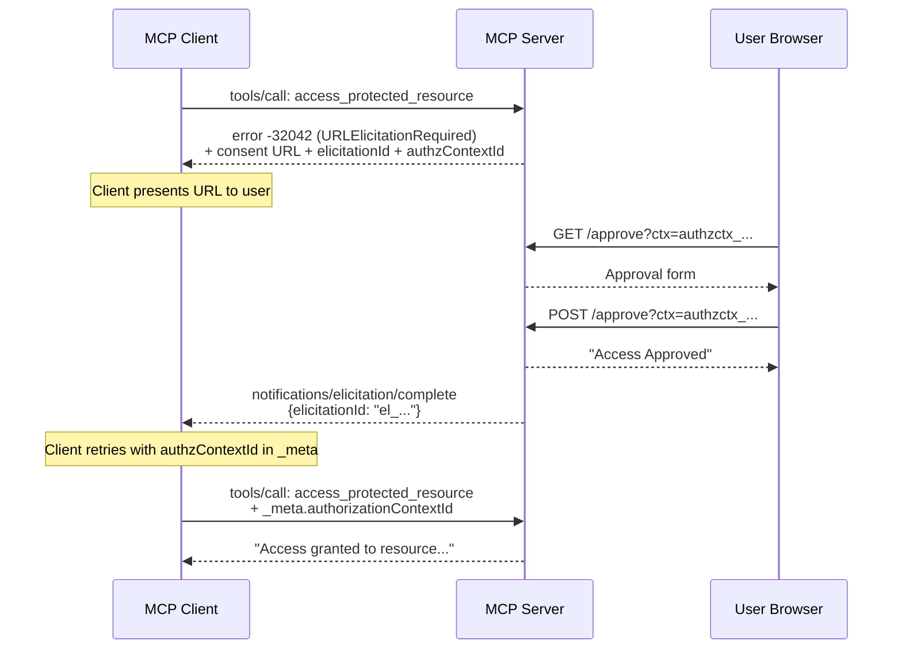

# Elicitation Example

URL-mode elicitation with consent approval — the FineGrainedAuth UC1 pattern.

## What It Shows

A tool requires user approval before granting access to a protected resource. The approval happens out-of-band: the user visits a URL in their browser, clicks "Approve", and the MCP client retries automatically.

The client's bearer token remains unchanged throughout — this is not an OAuth re-authorization flow. It's a server-side state change triggered by direct user interaction.

## Running

```bash
cd examples/elicitation
go run . -addr :8086
```

Connect your MCP host to `http://localhost:8086/mcp` (Streamable HTTP).

## Tools

| Tool | What it does |
|------|-------------|
| `access_protected_resource` | Returns resource content after user approves access via URL consent flow |

## Flow



### Steps

1. Call `access_protected_resource` with `{"resourceId": "my-doc"}`
2. Server returns `-32042` (URLElicitationRequired) with:
   - A consent URL (`http://localhost:8086/approve?ctx=...`)
   - An `elicitationId` for correlation
   - An `authorizationContextId` for retry correlation
3. Open the consent URL in your browser
4. Click **Approve**
5. Server sends `notifications/elicitation/complete` to the client
6. Client retries with `authorizationContextId` in `_meta`
7. Tool succeeds: "Access granted to resource..."

## Wire Format

### Initial denial (-32042)

```json
{
  "jsonrpc": "2.0",
  "id": 1,
  "error": {
    "code": -32042,
    "message": "You need to approve access to this resource.",
    "data": {
      "authorization": {
        "reason": "insufficient_authorization",
        "authorizationContextId": "authzctx_..."
      },
      "elicitations": [{
        "mode": "url",
        "message": "Open this page to approve access to the requested resource.",
        "url": "http://localhost:8086/approve?ctx=authzctx_...",
        "elicitationId": "el_..."
      }]
    }
  }
}
```

### Retry with context ID

```json
{
  "jsonrpc": "2.0",
  "id": 2,
  "method": "tools/call",
  "params": {
    "name": "access_protected_resource",
    "arguments": {"resourceId": "my-doc"},
    "_meta": {
      "modelcontextprotocol.io/authorizationContextId": "authzctx_..."
    }
  }
}
```

## EXPERIMENTAL

The `authorization` field in the error data is from the FineGrainedAuth proposal (draft SEP). Field names, values, and wire format are subject to breaking changes. The `-32042` error code and `elicitations` array are stable (SEP-1036, finalized).

## Related

- `core/authorization_denial_experimental.go` — Experimental denial types
- `conformance/elicitation/` — Conformance test suite (5 scenarios)
- `FineGrainedAuth.docx` — Full design document
