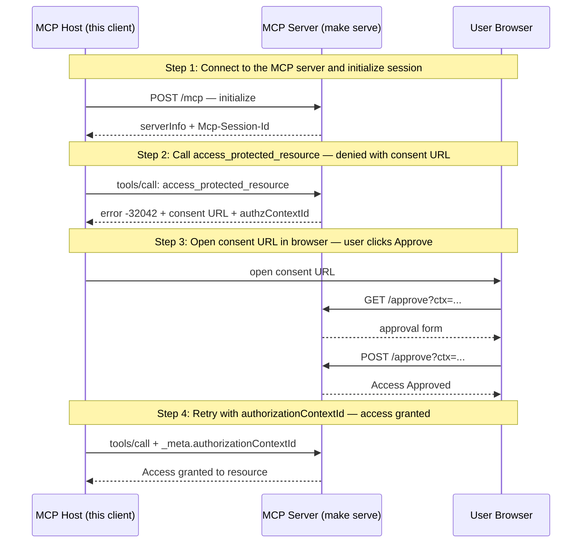

# URL Elicitation — Consent Approval Flow (UC1)

A scripted MCP host walking through the UC1 consent approval flow.

## What you'll learn

- **Connect to the MCP server and initialize session** — Connect to the server using the mcpkit client. The server has one tool (access_protected_resource) protected by consent middleware.
- **Call access_protected_resource — denied with consent URL** — The consent middleware intercepts the call and returns -32042 (URLElicitationRequired) with a URL the user must visit to approve access.
- **Open consent URL in browser — user clicks Approve** — The consent URL opens in the user's default browser. Click 'Approve' to grant access, then return here and press Enter to continue.
- **Retry with authorizationContextId — access granted** — The host retries the same tool call, this time including the authorizationContextId in _meta. The middleware recognizes the approved context and lets the call through.

## Flow



## Steps

### Setup

Before running this demo, start the MCP server in a separate terminal:

```
Terminal 1:  make serve        # start the MCP server on :8080
Terminal 2:  make run          # run this demo
```

### Step 1: Connect to the MCP server and initialize session

Connect to the server using the mcpkit client. The server has one tool (access_protected_resource) protected by consent middleware.

### Step 2: Call access_protected_resource — denied with consent URL

The consent middleware intercepts the call and returns -32042 (URLElicitationRequired) with a URL the user must visit to approve access.

### Step 3: Open consent URL in browser — user clicks Approve

The consent URL opens in the user's default browser. Click 'Approve' to grant access, then return here and press Enter to continue.

### Step 4: Retry with authorizationContextId — access granted

The host retries the same tool call, this time including the authorizationContextId in _meta. The middleware recognizes the approved context and lets the call through.

## Run it

```bash
go run ./examples/elicitation/
```

Pass `--non-interactive` to skip pauses:

```bash
go run ./examples/elicitation/ --non-interactive
```
