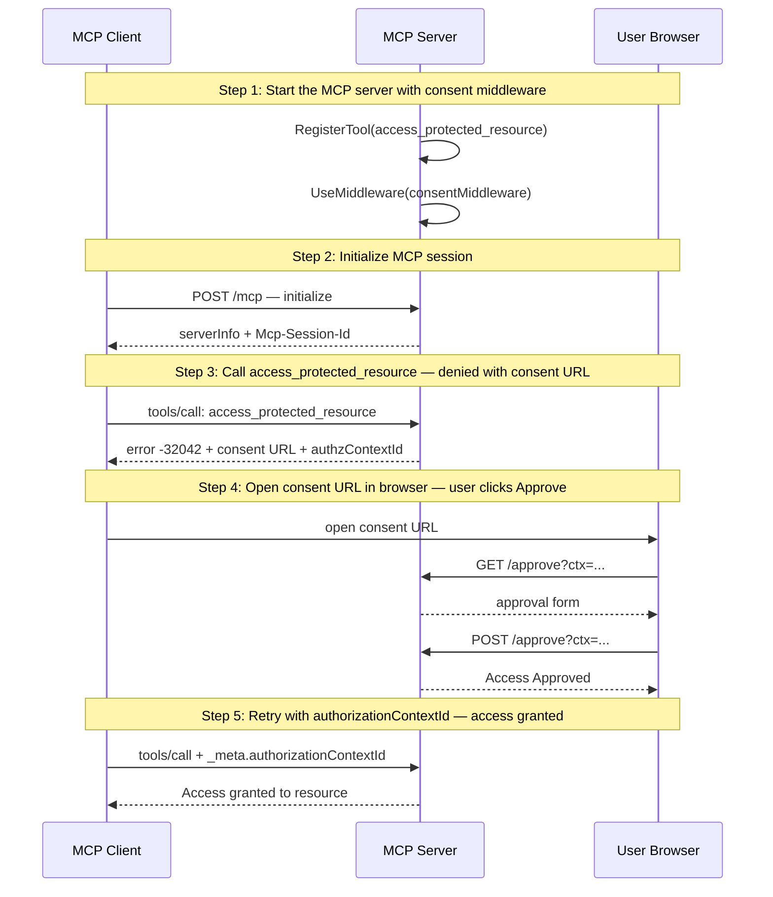

# URL Elicitation — Consent Approval Flow (UC1)

Demonstrates the FineGrainedAuth UC1 pattern: a tool requires out-of-band user approval via a URL before granting access.

## What you'll learn

- **Start the MCP server with consent middleware** — The server has one tool protected by consent middleware. First calls get rejected with -32042 until the user approves via a URL.
- **Initialize MCP session** — The client sends an initialize request and receives a session ID for subsequent calls.
- **Call access_protected_resource — denied with consent URL** — The consent middleware intercepts the call and returns -32042 (URLElicitationRequired) with a URL the user must visit to approve access.
- **Open consent URL in browser — user clicks Approve** — The consent URL opens in the user's default browser. Click 'Approve' to grant access, then return here and press Enter to continue.
- **Retry with authorizationContextId — access granted** — The client retries the same tool call, this time including the authorizationContextId in _meta. The middleware recognizes the approved context and lets the call through.

## Flow



## Steps

### Step 1: Start the MCP server with consent middleware

The server has one tool protected by consent middleware. First calls get rejected with -32042 until the user approves via a URL.

### Step 2: Initialize MCP session

The client sends an initialize request and receives a session ID for subsequent calls.

### Step 3: Call access_protected_resource — denied with consent URL

The consent middleware intercepts the call and returns -32042 (URLElicitationRequired) with a URL the user must visit to approve access.

### Step 4: Open consent URL in browser — user clicks Approve

The consent URL opens in the user's default browser. Click 'Approve' to grant access, then return here and press Enter to continue.

### Step 5: Retry with authorizationContextId — access granted

The client retries the same tool call, this time including the authorizationContextId in _meta. The middleware recognizes the approved context and lets the call through.

## Run it

```bash
go run ./examples/elicitation/
```

Pass `--non-interactive` to skip pauses:

```bash
go run ./examples/elicitation/ --non-interactive
```
