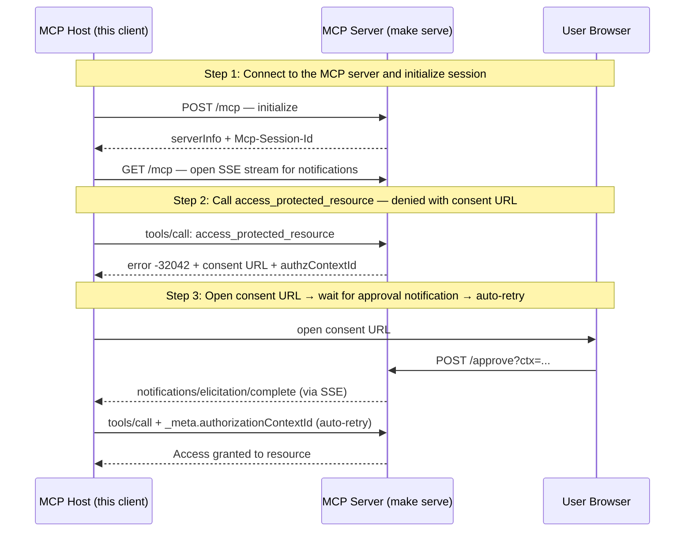

# URL Elicitation — Consent Approval Flow (UC1)

**EXPERIMENTAL** — Tracks SEP-2643 (Structured Authorization Denials), currently a draft. A scripted MCP host walking through the UC1 consent approval flow. Wire format may change as the SEP evolves.

## What you'll learn

- **Connect to the MCP server and initialize session** — Connect with a notification callback listening for notifications/elicitation/complete. The GET SSE stream receives server-pushed notifications.
- **Call access_protected_resource — denied with consent URL** — The consent middleware intercepts the call and returns -32042 (URLElicitationRequired) with a URL the user must visit to approve access.
- **Open consent URL → wait for approval notification → auto-retry** — The host opens the consent URL and waits for the server to send a notifications/elicitation/complete notification via the SSE stream. When it arrives, the host automatically retries with the authorizationContextId.

## Flow



## Steps

### Setup

Before running this demo, start the MCP server in a separate terminal:

```
Terminal 1:  make serve        # start the MCP server on :8080
Terminal 2:  make run          # run this demo
```

### Step 1: Connect to the MCP server and initialize session

Connect with a notification callback listening for notifications/elicitation/complete. The GET SSE stream receives server-pushed notifications.

### Step 2: Call access_protected_resource — denied with consent URL

The consent middleware intercepts the call and returns -32042 (URLElicitationRequired) with a URL the user must visit to approve access.

### Step 3: Open consent URL → wait for approval notification → auto-retry

The host opens the consent URL and waits for the server to send a notifications/elicitation/complete notification via the SSE stream. When it arrives, the host automatically retries with the authorizationContextId.

## Run it

```bash
go run ./examples/elicitation/
```

Pass `--non-interactive` to skip pauses:

```bash
go run ./examples/elicitation/ --non-interactive
```
