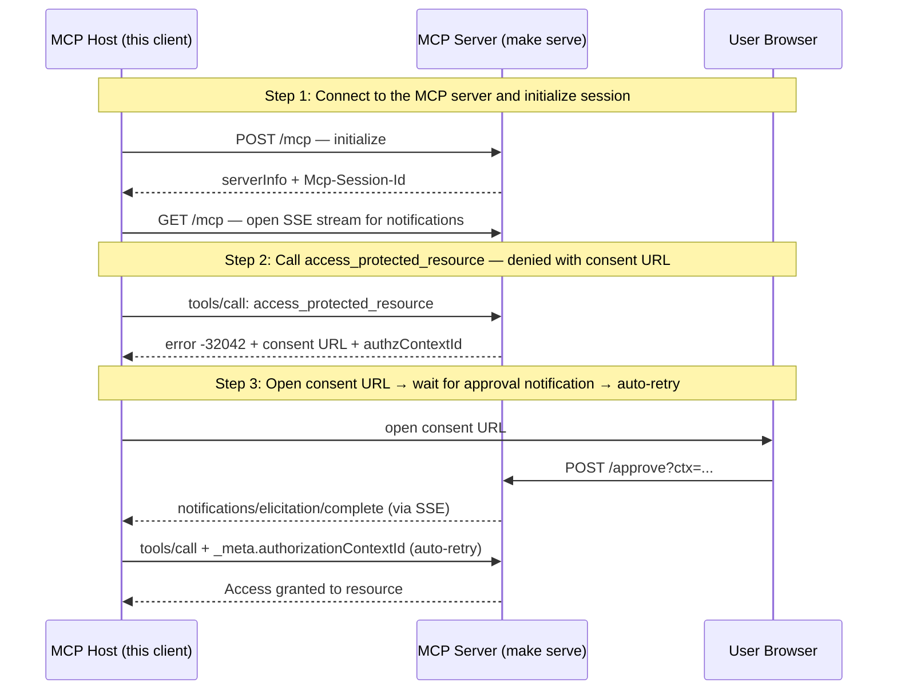

# URL Elicitation — Consent Approval Flow (UC1)

**EXPERIMENTAL** — Tracks SEP-2643 (Structured Authorization Denials), currently a draft. A scripted MCP host walking through the UC1 consent approval flow. Wire format may change as the SEP evolves.

## What you'll learn

- **Connect to the MCP server and initialize session** — Connect with a notification callback listening for notifications/elicitation/complete. The GET SSE stream receives server-pushed notifications.
- **Call access_protected_resource — denied with consent URL** — The consent middleware intercepts the call and returns -32042 (URLElicitationRequired) with a URL the user must visit to approve access.
- **Open consent URL → wait for approval notification → auto-retry** — The host opens the consent URL and waits for the server to send a notifications/elicitation/complete notification via the SSE stream. When it arrives, the host automatically retries with the authorizationContextId.

## Flow



## Steps

### Setup

Before running this demo, start the MCP server in a separate terminal:

```
Terminal 1:  make serve        # start the MCP server on :8080
Terminal 2:  make run          # run this demo
```

### Step 1: Connect to the MCP server and initialize session

Connect with a notification callback listening for notifications/elicitation/complete. The GET SSE stream receives server-pushed notifications.

#### Reproduce on the wire

```bash
# Initialize an MCP session and capture the session id returned in the headers.
SID=$(curl -s -X POST http://localhost:8080/mcp \
  -H 'Content-Type: application/json' -H 'Accept: application/json, text/event-stream' \
  -d '{"jsonrpc":"2.0","id":"i","method":"initialize","params":{"protocolVersion":"2025-11-25","clientInfo":{"name":"x","version":"1"},"capabilities":{}}}' \
  -D - -o /dev/null | grep -i 'mcp-session-id' | awk '{print $2}' | tr -d '\r\n')
curl -s -X POST http://localhost:8080/mcp \
  -H 'Content-Type: application/json' -H 'Accept: application/json' \
  -H "Mcp-Session-Id: $SID" \
  -d '{"jsonrpc":"2.0","method":"notifications/initialized"}' >/dev/null
echo "SID=$SID"

# In a SECOND terminal, open the SSE notification stream so the
# notifications/elicitation/complete event in step 3 arrives there:
#
#   curl -N http://localhost:8080/mcp \
#        -H "Mcp-Session-Id: $SID" \
#        -H 'Accept: text/event-stream'
#
# Keep that terminal open. The notification will appear there once the user
# clicks Approve in step 3.
```

### Step 2: Call access_protected_resource — denied with consent URL

The consent middleware intercepts the call and returns -32042 (URLElicitationRequired) with a URL the user must visit to approve access.

#### Reproduce on the wire

```bash
# Call the protected tool. Response is JSON-RPC error -32042 carrying the
# consent URL and the authorizationContextId you must echo on retry.
RESP=$(curl -s -X POST http://localhost:8080/mcp \
  -H 'Content-Type: application/json' -H 'Accept: application/json' \
  -H "Mcp-Session-Id: $SID" \
  -d '{"jsonrpc":"2.0","id":"c","method":"tools/call","params":{"name":"access_protected_resource","arguments":{"resourceId":"my-doc"}}}')
echo "$RESP" | jq '.error'

# Capture the context id and the consent URL into shell vars for step 3.
export CTX=$(echo "$RESP" | jq -r .error.data.authorization.authorizationContextId)
export APPROVE_URL=$(echo "$RESP" | jq -r '.error.data.elicitations[0].url')
echo "CTX=$CTX"
echo "APPROVE_URL=$APPROVE_URL"
```

### Step 3: Open consent URL → wait for approval notification → auto-retry

The host opens the consent URL and waits for the server to send a notifications/elicitation/complete notification via the SSE stream. When it arrives, the host automatically retries with the authorizationContextId.

#### Reproduce on the wire

```bash
# Approve the context. You can either click Approve in a browser at
# $APPROVE_URL, or POST to it directly:
curl -s -X POST "$APPROVE_URL" >/dev/null

# The SECOND terminal (running the SSE stream from step 1) should now print
# something like:
#   event: message
#   data: {"jsonrpc":"2.0","method":"notifications/elicitation/complete","params":{"elicitationId":"..."}}

# Retry tools/call with the context id echoed under the SEP-2643 _meta key.
# The server matches it against the approved context and lets the call through.
curl -s -X POST http://localhost:8080/mcp \
  -H 'Content-Type: application/json' -H 'Accept: application/json' \
  -H "Mcp-Session-Id: $SID" \
  -d "{\"jsonrpc\":\"2.0\",\"id\":\"r\",\"method\":\"tools/call\",\"params\":{\"name\":\"access_protected_resource\",\"arguments\":{\"resourceId\":\"my-doc\"},\"_meta\":{\"io.modelcontextprotocol/authorization-context-id\":\"$CTX\"}}}" \
  | jq .
```

## Run it

```bash
go run ./examples/elicitation/
```

Pass `--non-interactive` to skip pauses:

```bash
go run ./examples/elicitation/ --non-interactive
```
