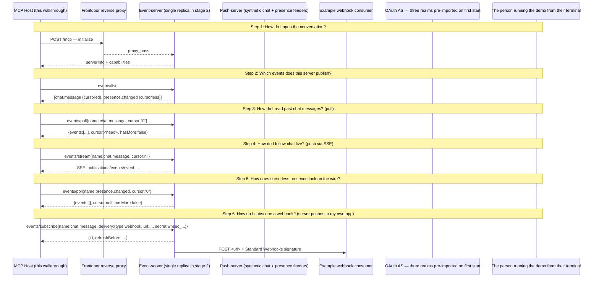

# MCP Events — whole-enchilada stage 2 walkthrough

Production-shape multi-tier reference: nginx fronts the event-server tier; a push-server tier injects synthetic chat + presence events; a Keycloak service provides three pre-configured OAuth realms (tenant-a, tenant-b, tenant-c); each tenant gets its own pollers and webhook receivers running in sibling terminals. Stage 2 ships with in-memory stores. Stage 3 plugs in Postgres + Redis multi-replica without changing this directory shape.

## What you'll learn

- **How do I open the conversation?** — Vanilla MCP initialize over Streamable HTTP, proxied transparently by nginx. The events extension declares no new capability; events/* methods are registered server-side.
- **Which events does this server publish?** — Two synthetic event types, fed by the push-server tier. chat.message is cursored (subscribers can replay); presence.changed is cursorless (live-only — cursor:null on the wire). Both are fed via the events.HTTPSource pattern: the push-server POSTs to /events/<name>/inject on the event-server.
- **How do I read past chat messages? (poll)** — Single-subscription poll; events accumulated by the push-server's chat feeder since the stack started. The cursor advances on every yield.
- **How do I follow chat live? (push via SSE)** — Long-lived stream. The push-server feeds new chat events into the event-server's HTTPSource every ~2s; the SSE stream surfaces each one as notifications/events/event. Heartbeats arrive on quiet sources to advance persisted cursors. Press enter (interactive) or wait 10s (test) to end capture.
- **How does cursorless presence look on the wire?** — Cursorless sources always return empty + cursor:null from poll. Subscribers can listen for live presence transitions via push or webhook, but there is no replay — that matches the underlying semantics of presence state.
- **How do I subscribe a webhook? (server pushes to my own app)** — The receiver in this demo is just an example downstream consumer — a 30-line Go program verifying Standard Webhooks signatures. In production each tenant deploys their own receivers in their own infra. The walkthrough's URL points at the in-compose receiver via the host network.

## Flow



## Steps

### Architecture in one diagram

```
Host  ──[MCP / SSE]──>  Nginx  ──>  Event-server  <──[HTTP /events/<name>/inject]──  Push-server
                                          │
                                          └──[webhook POST]──>  Receiver  (example consumer)
```

All four services run as separate containers in `docker-compose.yaml`. The push-server is just one example of a source manager — production deployments scale push-servers and event-servers independently, route via the same nginx, and persist into Postgres + Redis (stage 3). The receiver here is a tiny Go binary demonstrating Standard Webhooks verification; in production, **your receivers are your own apps** deployed in your own infrastructure — they are NOT part of the event-server tier.

### Setup

Run from a separate terminal in the leaf directory:

```
make up        # docker compose up -d, waits for healthchecks
make demo           # this walkthrough (interactive TUI)
# OR:
make test      # non-interactive run for CI / scripting
```

`make down` tears the stack down (`-v` removes named volumes).

This binary demonstrates the **events protocol mechanics** end-to-end (poll, push/SSE, webhook). The **stage-2 tenant-isolation story** is best experienced by hand — see the next section.

### Stage-2 4-terminal demo (run by hand)

The walkthrough binary you're reading runs as a single MCP host doing every protocol thing. The *operator-facing* stage-2 demo splits that work across separate terminals — one per tenant — so per-tenant isolation is visually obvious. From the leaf:

```
# T1: stack up
make up

# T2: tenant A poller
TA=$(make newtoken TENANT=A)         # browser opens, log in as alice@tenant-a
make poller TENANT=A TOKEN=$TA       # long-running — only sees tenant-a events

# T3: tenant B poller (in another terminal)
TB=$(make newtoken TENANT=B)
make poller TENANT=B TOKEN=$TB

# T4: tenant A webhook receiver (in another terminal)
make webhook TENANT=A TOKEN=$TA

# T5: tenant B webhook receiver (in another terminal)
make webhook TENANT=B TOKEN=$TB

# T6: operator injects events from the host
make inject TENANT=A EVENT=chat.message TEXT='hi from A'
# → T2 and T4 print the event. T3 and T5 stay quiet.
make inject TENANT=B EVENT=chat.message TEXT='hi from B'
# → T3 and T5 print. T2 and T4 stay quiet.
```

**Revocation walkthrough**: open `http://localhost:8180/admin/master/console/#/tenant-a/users` in a browser (admin / admin), click `alice` → Sessions tab → "Sign out". Within ~5 seconds (`OAUTH_CACHE_TTL`), T2 and T4 die with `-32012 Forbidden`. T3 and T5 keep flowing — tenant-B unaffected.

For tenant C (carol@tenant-c) repeat the pattern. The push-server also auto-rotates events across all three tenants at its configured cadence, so leave the terminals running and watch the rotation.

### CI regression for tenant isolation

`make test` runs THIS binary end-to-end against the docker stack — it covers the protocol mechanics. The **tenant-isolation contract** is regression-tested by the event-server's e2e suite, which runs in-process with a fake token-as-tenant validator (no Docker needed):

```
make test     # event-server/... e2e tests, includes 8 tenant-isolation cases
```

That suite verifies (1) tagged events deliver only to matching tenants, (2) untagged events still deliver to all, (3) interleaved cross-tenant events don't leak. The docker stack adds the Keycloak interop layer on top.

### Step 1: How do I open the conversation?

Vanilla MCP initialize over Streamable HTTP, proxied transparently by nginx. The events extension declares no new capability; events/* methods are registered server-side.

### Step 2: Which events does this server publish?

Two synthetic event types, fed by the push-server tier. chat.message is cursored (subscribers can replay); presence.changed is cursorless (live-only — cursor:null on the wire). Both are fed via the events.HTTPSource pattern: the push-server POSTs to /events/<name>/inject on the event-server.

### Step 3: How do I read past chat messages? (poll)

Single-subscription poll; events accumulated by the push-server's chat feeder since the stack started. The cursor advances on every yield.

### Step 4: How do I follow chat live? (push via SSE)

Long-lived stream. The push-server feeds new chat events into the event-server's HTTPSource every ~2s; the SSE stream surfaces each one as notifications/events/event. Heartbeats arrive on quiet sources to advance persisted cursors. Press enter (interactive) or wait 10s (test) to end capture.

### Step 5: How does cursorless presence look on the wire?

Cursorless sources always return empty + cursor:null from poll. Subscribers can listen for live presence transitions via push or webhook, but there is no replay — that matches the underlying semantics of presence state.

### Step 6: How do I subscribe a webhook? (server pushes to my own app)

The receiver in this demo is just an example downstream consumer — a 30-line Go program verifying Standard Webhooks signatures. In production each tenant deploys their own receivers in their own infra. The walkthrough's URL points at the in-compose receiver via the host network.

### What stage 2 adds

- Keycloak realm with multi-tenant subscriptions (events/subscribe rejected if not authenticated).
- Tenant identifier flows from token claims into source/subscription scoping.
- Anonymous principal demo escape removed.
- Per-tenant quota with the canonical -32013 ResourceExhausted wire shape pinned by kitchen-sink ({limit:"subscriptions", max:N}; see experimental/ext/events/errors.go's ResourceExhaustedData godoc). Same shape, same two emission paths (Reserve failure vs on_subscribe rejection) — a single client switch over (code, data) works for both demos.

### What stage 3 adds

- Postgres-backed cursor / webhook / quota stores. Restart-survival for the demo.
- Redis EventBus for cross-replica fanout. event-server scaled to N=3 replicas via docker compose --scale event-server=3.
- nginx routes round-robin; subscribers reconnect to any replica without losing delivery.

### What stage 4 adds

- M push-server replicas with admin-frontend-driven source bindings.
- Admin web UI for per-tenant caps + rate limits + webhook config.
- OTel collector + Jaeger + Grafana — trace spans hop from push-server through event-server through webhook delivery, visible end-to-end.
- Push survival walkthrough: kill an event-server replica during the live step; nginx routes new connections to a sibling; resumed cursor replays the missed window.

## Run it

```bash
go run ./examples/events/whole-enchilada/
```

Pass `--non-interactive` to skip pauses:

```bash
go run ./examples/events/whole-enchilada/ --non-interactive
```
