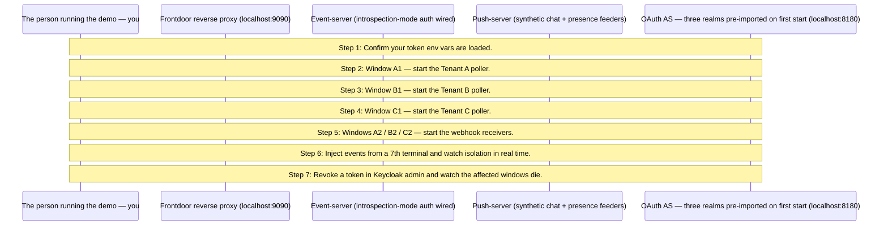

# MCP Events — whole-enchilada stage 2 walkthrough

Production-shape multi-tier reference. nginx fronts the event-server tier; a push-server tier injects synthetic chat + presence events; Keycloak provides three pre-configured OAuth realms (tenant-a, tenant-b, tenant-c). This walkthrough guides you through a 4-terminal demo where each tenant gets its own poller and webhook receiver — per-tenant isolation is the headline.

## What you'll learn

- **Confirm your token env vars are loaded.** — **Missing token env vars** — the 4-terminal demo below needs all six. Open six terminals now and acquire tokens, then re-export them into THIS shell before continuing:
- **Window A1 — start the Tenant A poller.** — In a NEW terminal at this leaf, run:
- **Window B1 — start the Tenant B poller.** — Same pattern, different realm:
- **Window C1 — start the Tenant C poller.** — ```
- **Windows A2 / B2 / C2 — start the webhook receivers.** — Webhook is the second delivery mode. It runs in parallel with poll; same tenant routing applies:
- **Inject events from a 7th terminal and watch isolation in real time.** — ```
- **Revoke a token in Keycloak admin and watch the affected windows die.** — Open `http://localhost:8180/admin/master/console/#/tenant-a/users` (admin / admin) in a browser. Click `alice` → **Sessions** tab → **Sign out**.

## Flow



## Steps

### Architecture in one diagram

```
Operator's terminals (poller, webhook, inject)
           │
           ▼
     localhost:9090
           │
        Nginx ──────────────┐
           │                │
           ▼                ▼
      Event-server     Keycloak
           ▲           (localhost:8180)
           │
      Push-server   (auto-rotates events across tenants)
```

The walkthrough binary you're reading does **not** make MCP calls. The 4-terminal flow below has you run `make poller` / `make webhook` / `make inject` in sibling windows — those are the actual MCP clients. This binary is the guide.

### Step 1: Confirm your token env vars are loaded.

**Missing token env vars** — the 4-terminal demo below needs all six. Open six terminals now and acquire tokens, then re-export them into THIS shell before continuing:

```
export TOKEN_POLLER_TENANT_A=$(make newtoken TENANT=A)
export TOKEN_POLLER_TENANT_B=$(make newtoken TENANT=B)
export TOKEN_POLLER_TENANT_C=$(make newtoken TENANT=C)
export TOKEN_WEBHOOK_TENANT_A=$(make newtoken TENANT=A)
export TOKEN_WEBHOOK_TENANT_B=$(make newtoken TENANT=B)
export TOKEN_WEBHOOK_TENANT_C=$(make newtoken TENANT=C)
```

Each `make newtoken` opens a browser for the realm's login page; log in as `alice@tenant-a` / `bob@tenant-b` / `carol@tenant-c` (passwords match the usernames in the demo realm JSONs).

If you're scripting (CI / unattended), use the ROPC variant — same envs, no browser:

```
export TOKEN_POLLER_TENANT_A=$(make newtoken-ci TENANT=A USER=alice PASSWORD=alice)
export TOKEN_POLLER_TENANT_B=$(make newtoken-ci TENANT=B USER=bob PASSWORD=bob)
export TOKEN_POLLER_TENANT_C=$(make newtoken-ci TENANT=C USER=carol PASSWORD=carol)
export TOKEN_WEBHOOK_TENANT_A=$(make newtoken-ci TENANT=A USER=alice PASSWORD=alice)
export TOKEN_WEBHOOK_TENANT_B=$(make newtoken-ci TENANT=B USER=bob PASSWORD=bob)
export TOKEN_WEBHOOK_TENANT_C=$(make newtoken-ci TENANT=C USER=carol PASSWORD=carol)
```

Press Enter once all six are exported — the walkthrough does NOT make MCP calls itself, so it will continue past this Step regardless; the subsequent Steps assume the envs exist when you copy/paste them into your terminals.

### Step 2: Window A1 — start the Tenant A poller.

In a NEW terminal at this leaf, run:

```
make poller TENANT=A TOKEN=$TOKEN_POLLER_TENANT_A
```

The poller authenticates as Tenant A, polls `events/chat.message`, and prints every event it receives with the tenant tag visible. It only sees events whose tenant tag is `tenant-a`; events tagged for B or C never reach it. Leave this terminal visible — within a few seconds the push-server's synthetic chat feeder will rotate to tenant-a and you'll see events appear.

### Step 3: Window B1 — start the Tenant B poller.

Same pattern, different realm:

```
make poller TENANT=B TOKEN=$TOKEN_POLLER_TENANT_B
```

Now A1 and B1 sit side-by-side. A1 prints only tenant-a events; B1 prints only tenant-b. Same MCP server, same wire, same nginx — the realm in the bearer token is what scopes delivery.

### Step 4: Window C1 — start the Tenant C poller.

```
make poller TENANT=C TOKEN=$TOKEN_POLLER_TENANT_C
```

Three pollers, three tenants. As the push-server cycles through tenants, each event lights up exactly one of your three terminals — clean isolation across the wire.

### Step 5: Windows A2 / B2 / C2 — start the webhook receivers.

Webhook is the second delivery mode. It runs in parallel with poll; same tenant routing applies:

```
# Window A2
make webhook TENANT=A TOKEN=$TOKEN_WEBHOOK_TENANT_A

# Window B2
make webhook TENANT=B TOKEN=$TOKEN_WEBHOOK_TENANT_B

# Window C2
make webhook TENANT=C TOKEN=$TOKEN_WEBHOOK_TENANT_C
```

Each receiver registers a webhook subscription on a random local port, the event-server signs every delivery with the per-subscription HMAC secret, and the receivers verify + print. You now have six terminals: 3 pollers × 3 webhooks. An event for `tenant-a` lights up A1 and A2 only.

### Step 6: Inject events from a 7th terminal and watch isolation in real time.

```
make inject TENANT=A EVENT=chat.message TEXT='hi from A'
```

A1 + A2 print; B1/B2/C1/C2 stay quiet.

```
make inject TENANT=B EVENT=chat.message TEXT='hi from B'
make inject TENANT=C EVENT=presence.changed USER=carol STATE=online
```

B events go only to B's windows; C events only to C's. The push-server is also cycling synthetic events through all three tenants in the background, so leave the windows running and you'll see the rotation interleave with your manual injects.

### Step 7: Revoke a token in Keycloak admin and watch the affected windows die.

Open `http://localhost:8180/admin/master/console/#/tenant-a/users` (admin / admin) in a browser. Click `alice` → **Sessions** tab → **Sign out**.

Two distinct revocation paths fire from this one click:

**(1) Poller — introspection cache eviction (~5s):**

Within `OAUTH_CACHE_TTL` (~5s), the event-server's next /introspect call for A1's bearer returns `active=false`. A1 exits with a logged `token invalidated by AS (401) — exiting` line.

**(2) Webhook — OIDC Back-Channel Logout (~immediate):**

Keycloak ALSO POSTs a signed `logout_token` JWT to the URL the realm has registered as `backchannel_logout_uri` on the `mcp-events-poller` client — `http://event-server.whole-enchilada:8080/backchannel-logout/tenant-a`. The event-server's `ext/auth.BackChannelLogoutHandler` validates the JWT (signature via JWKS, iss/aud/exp/iat, jti replay guard) and fires a registered listener that calls `webhooks.TerminateBySession(sid, ...)`. Matching webhook subscriptions receive a `{type:terminated, error:{-32012, ...}}` envelope via Standard Webhooks signature headers and are dropped from the registry. A2's receiver logs the terminated envelope.

B1/B2/C1/C2 keep flowing — revocation is per-realm; isolation holds.

To see the BCL POST land, tail the event-server logs in a sibling window: `docker compose -f docker-compose.yaml logs -f event-server-1 | grep BCL` — the `BCL fire: realm=tenant-a sub=... sid=... killed=N` line marks each revocation event.

Re-acquire a token (`TOKEN_POLLER_TENANT_A=$(make newtoken TENANT=A)`) and restart the poller to reconnect.

### What stage 2 adds

- Keycloak realm with multi-tenant subscriptions (every events/* method requires a real bearer token).
- Tenant identifier flows from token claims (`core.Claims.Tenant`) into `OnSubscribe` scoping + the canonical webhook key.
- Anonymous principal escape removed for the auth-wired path.
- Per-tenant quota with the canonical `-32013 ResourceExhausted` wire shape pinned by kitchen-sink ({limit:"subscriptions", max:N}; see experimental/ext/events/errors.go's ResourceExhaustedData godoc).

### What stage 3 adds

- Postgres-backed cursor / webhook / quota stores. Restart-survival for the demo.
- Redis EventBus for cross-replica fanout. event-server scaled to N=3 replicas via `docker compose --scale event-server=3`.
- nginx routes round-robin; subscribers reconnect to any replica without losing delivery.

### What stage 4 adds

- M push-server replicas with admin-frontend-driven source bindings.
- Admin web UI for per-tenant caps + rate limits + webhook config.
- Push survival walkthrough: kill an event-server replica during the live step; nginx routes new connections to a sibling; resumed cursor replays the missed window.

## Run it

```bash
go run ./examples/events/whole-enchilada/
```

Pass `--non-interactive` to skip pauses:

```bash
go run ./examples/events/whole-enchilada/ --non-interactive
```
