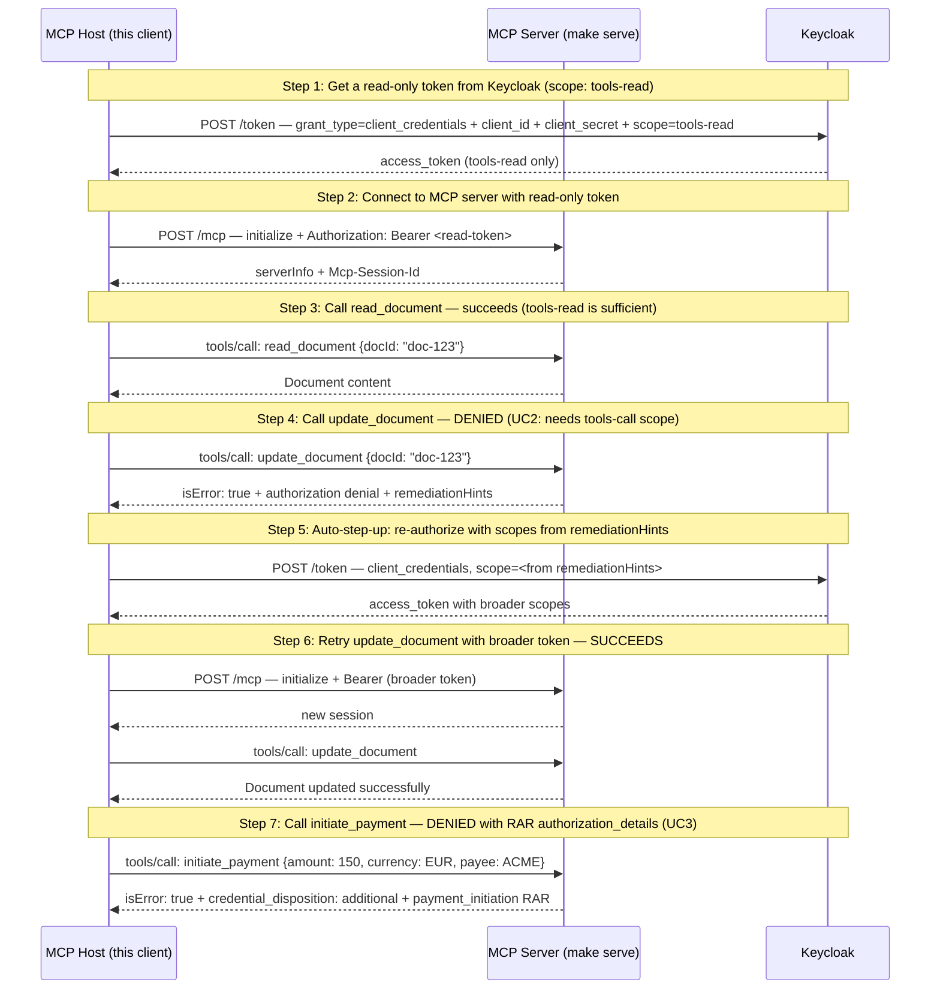

# Fine-Grained Authorization — Scope Step-Up (UC2) + Ephemeral Credentials (UC3)

**EXPERIMENTAL** — Tracks SEP-2643 (Structured Authorization Denials), currently a draft. A scripted MCP host walking through UC2/UC3 authorization denial flows. Wire format may change as the SEP evolves; spec divergences tracked in mcpkit issue #317.

## What you'll learn

- **Get a read-only token from Keycloak (scope: tools-read)** — The host authenticates to KC using client_credentials grant — a confidential client_id+secret pair. KC validates the credentials, ensures the requested scope is allowed for this client, and issues a signed JWT. In production the secret would be in a vault/secret manager (or replaced by mTLS / private_key_jwt for stronger client auth). For interactive user flows, you'd use authorization_code + PKCE instead.
- **Connect to MCP server with read-only token** — The host connects with the read-only token. JWT validation passes — the token is valid, just limited in scope.
- **Call read_document — succeeds (tools-read is sufficient)** — The read_document tool only requires tools-read scope. Our token has it, so the call succeeds.
- **Call update_document — DENIED (UC2: needs tools-call scope)** — The update_document tool requires tools-call scope. Our read-only token lacks it. The server returns a structured authorization denial telling the host exactly which scopes to request via remediationHints.
- **Auto-step-up: re-authorize with scopes from remediationHints** — The host uses the requiredScopes captured from the previous step's denial — not hardcoded values. This is the spec-driven smart-host behavior: the server tells the host what to ask for, and the host complies.
- **Retry update_document with broader token — SUCCEEDS** — The host starts a new session with the broader token. Now update_document succeeds because the token includes tools-call.
- **Call initiate_payment — DENIED with RAR authorization_details (UC3)** — Same denial-driven pattern as UC2, but the remediationHint carries RFC 9396 authorization_details bound to this specific transaction. The host should request an *additional* token (credential_disposition: additional) and use it just for the payment — the original token continues to be used for other operations.

## Flow



## Steps

### Setup

Keycloak (KC) is an open-source OAuth 2.0 / OIDC authorization server.
In this demo it plays the role of the Authorization Server (AS) that issues
access tokens with specific scopes. The MCP server validates incoming tokens
against KC's JWKS endpoint and enforces per-tool scope requirements.

Before running this demo, start KC and the MCP server in separate terminals:

```
Terminal 1:  make kcl          # start Keycloak on :8180 (if not running)
Terminal 2:  make serve        # start the MCP server on :8080
Terminal 3:  make run          # run this demo
```

### UC1 vs UC2/UC3 — When does the host react?

UC1 (elicitation): The denial points to an out-of-band action (user clicks Approve in browser).
The host can't proceed until it receives notifications/elicitation/complete from the server.

UC2/UC3 (this demo): The denial is delivered *synchronously* as a tool error result.
The host parses remediationHints from the denial and reacts immediately — no notification,
no waiting. A smart host extracts the required scopes (UC2) or authorization_details (UC3)
from the hint and re-authorizes on its own.

### Step 1: Get a read-only token from Keycloak (scope: tools-read)

The host authenticates to KC using client_credentials grant — a confidential client_id+secret pair. KC validates the credentials, ensures the requested scope is allowed for this client, and issues a signed JWT. In production the secret would be in a vault/secret manager (or replaced by mTLS / private_key_jwt for stronger client auth). For interactive user flows, you'd use authorization_code + PKCE instead.

### Step 2: Connect to MCP server with read-only token

The host connects with the read-only token. JWT validation passes — the token is valid, just limited in scope.

### Step 3: Call read_document — succeeds (tools-read is sufficient)

The read_document tool only requires tools-read scope. Our token has it, so the call succeeds.

### Step 4: Call update_document — DENIED (UC2: needs tools-call scope)

The update_document tool requires tools-call scope. Our read-only token lacks it. The server returns a structured authorization denial telling the host exactly which scopes to request via remediationHints.

### Step 5: Auto-step-up: re-authorize with scopes from remediationHints

The host uses the requiredScopes captured from the previous step's denial — not hardcoded values. This is the spec-driven smart-host behavior: the server tells the host what to ask for, and the host complies.

### Step 6: Retry update_document with broader token — SUCCEEDS

The host starts a new session with the broader token. Now update_document succeeds because the token includes tools-call.

### UC3: Per-Operation Ephemeral Credential

UC3 is a different pattern: the host needs an *additional* token for a
specific operation (payment), while keeping the original token for other
operations. The server returns credential_disposition: "additional" and
RFC 9396 authorization_details in the remediation hint.

### Step 7: Call initiate_payment — DENIED with RAR authorization_details (UC3)

Same denial-driven pattern as UC2, but the remediationHint carries RFC 9396 authorization_details bound to this specific transaction. The host should request an *additional* token (credential_disposition: additional) and use it just for the payment — the original token continues to be used for other operations.

## Run it

```bash
go run ./examples/fine-grained-auth/
```

Pass `--non-interactive` to skip pauses:

```bash
go run ./examples/fine-grained-auth/ --non-interactive
```
