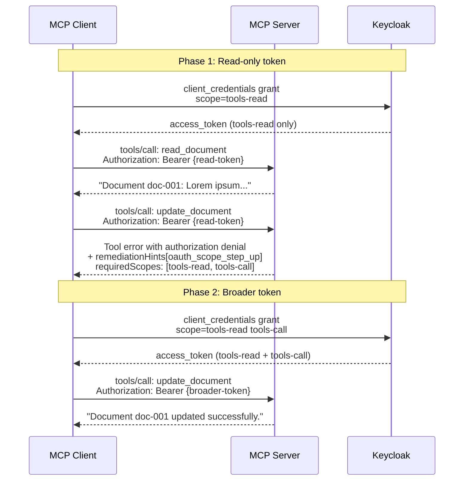
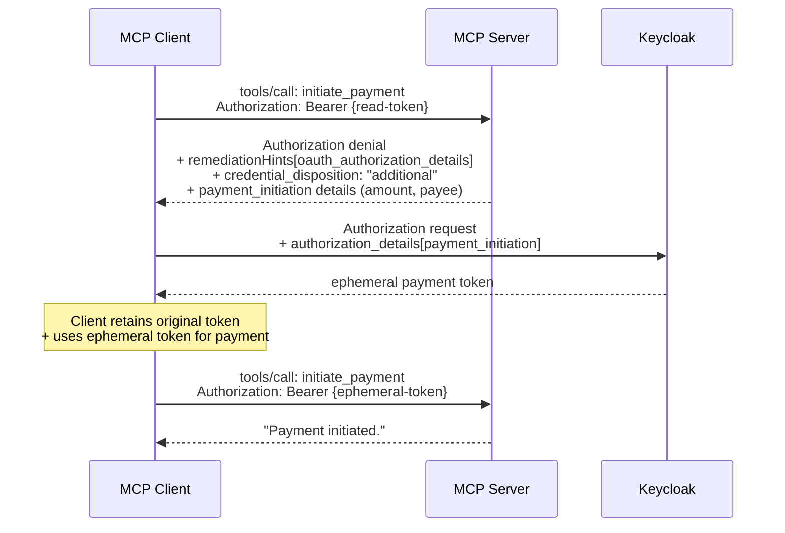

# Fine-Grained Authorization Example

Authorization denial with scope step-up — the FineGrainedAuth UC2 pattern.

## What It Shows

A document management server where reading requires `tools-read` scope and writing requires `tools-call` scope. When a client with a read-only token attempts to write, the server returns a structured authorization denial with remediation hints telling the client exactly which scopes to request.

This demonstrates the layered approach: the transport's `WWW-Authenticate` challenge remains authoritative, and the JSON-RPC denial envelope provides complementary classification and remediation hints.

## Prerequisites

- **Keycloak** — run `make upkcl` from the repo root (uses Docker)
- The example uses the `mcpkit-test` realm with pre-configured `tools-read` and `tools-call` scopes

## Running

```bash
# Start Keycloak (from repo root)
make upkcl

# Start the example server
cd examples/fine-grained-auth
make run    # or: go run . -addr :8087
```

The server prints two tokens (read-only and read+call) for the walkthrough.

## Tools

| Tool | Required Scope | What it does |
|------|---------------|-------------|
| `read_document` | `tools-read` | Returns document content |
| `update_document` | `tools-call` | Updates document content (returns authorization denial if scope missing) |
| `initiate_payment` | — | UC3: returns authorization denial with RFC 9396 `payment_initiation` authorization_details + `credential_disposition: "additional"` |

## Flow: Scope Step-Up (UC2)



## Flow: Per-Operation Ephemeral Credential (UC3)



> **Note**: The denial response shape is fully implemented. End-to-end token exchange
> requires Keycloak with `--features=rar` enabled. The RFC 9396 `AuthorizationDetail`
> types come from oneauth v0.0.76.

## Wire Format

### Authorization denial (update_document with read-only token)

The tool returns an error result with structured authorization denial:

```json
{
  "content": [{
    "type": "text",
    "text": "{\"error\":\"insufficient_scope\",\"authorization\":{\"reason\":\"insufficient_authorization\",\"remediationHints\":[{\"type\":\"oauth_scope_step_up\",\"data\":{\"requiredScopes\":[\"tools-read\",\"tools-call\"]}}]},\"message\":\"Token lacks required scope...\"}"
  }],
  "isError": true
}
```

## Exercises

1. Connect with the **read-only** token, call `read_document` -> succeeds
2. Call `update_document` -> fails with authorization denial + `remediationHints`
3. Reconnect with the **read+call** token, call `update_document` -> succeeds
4. Call `initiate_payment` -> authorization denial with `payment_initiation` RAR details + `credential_disposition: "additional"` (UC3)

## EXPERIMENTAL

The `authorization` denial envelope and `remediationHints` are from the FineGrainedAuth proposal (draft SEP). Type names (`oauth_scope_step_up`), field names (`reason`, `credential_disposition`), and wire format are subject to breaking changes.

Specifically:
- `reason` values will be standardized when the SEP assigns them
- `remediationHints[].type` names (`oauth_scope_step_up`, `oauth_authorization_details`) are provisional
- `credential_disposition: "additional"` semantics are demonstrated but not enforced end-to-end
- The JSON-RPC error code for UC2/UC3 denials is TBD (currently uses tool error result, not a dedicated error code)
- RFC 9396 `AuthorizationDetail` types from oneauth v0.0.76 are stable but the MCP remediation hint mapping is experimental

## Related

- `core/authorization_denial_experimental.go` — Experimental denial types
- `examples/elicitation/` — UC1 example (URL consent approval)
- `examples/auth/scopes/` — Basic scope enforcement (no denial envelope)
- `tests/keycloak/` — Keycloak interop tests
- `FineGrainedAuth.docx` — Full design document
