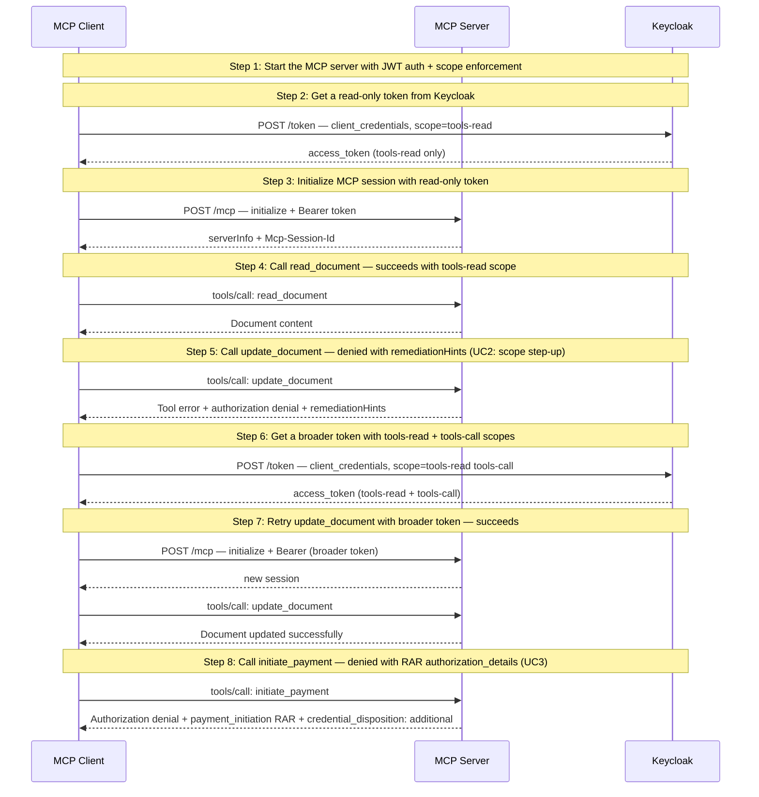

# Fine-Grained Authorization — Scope Step-Up (UC2) + Ephemeral Credentials (UC3)

Demonstrates structured authorization denial with remediation hints. Requires Keycloak.

## What you'll learn

- **Start the MCP server with JWT auth + scope enforcement** — The server validates JWTs from Keycloak and enforces per-tool scope requirements. read_document needs tools-read; update_document needs tools-call.
- **Get a read-only token from Keycloak** — The client obtains a token with only the tools-read scope. This is sufficient for reading but not for writing.
- **Initialize MCP session with read-only token** — The client connects with the read-only token. JWT validation passes — the token is valid, just limited in scope.
- **Call read_document — succeeds with tools-read scope** — The read_document tool only requires tools-read, which our token has. The call succeeds.
- **Call update_document — denied with remediationHints (UC2: scope step-up)** — The update_document tool requires tools-call scope, which our read-only token lacks. The server returns a structured authorization denial with remediation hints telling the client which scopes to request.
- **Get a broader token with tools-read + tools-call scopes** — Following the remediation hint, the client re-authorizes with the required scopes.
- **Retry update_document with broader token — succeeds** — The client starts a new session with the broader token. Now update_document succeeds because the token includes tools-call.
- **Call initiate_payment — denied with RAR authorization_details (UC3)** — The payment tool requires a transaction-specific ephemeral credential with RFC 9396 authorization_details. The denial tells the client exactly what to request from the authorization server.

## Flow



## Steps

### Step 1: Start the MCP server with JWT auth + scope enforcement

The server validates JWTs from Keycloak and enforces per-tool scope requirements. read_document needs tools-read; update_document needs tools-call.

### Step 2: Get a read-only token from Keycloak

The client obtains a token with only the tools-read scope. This is sufficient for reading but not for writing.

### Step 3: Initialize MCP session with read-only token

The client connects with the read-only token. JWT validation passes — the token is valid, just limited in scope.

### Step 4: Call read_document — succeeds with tools-read scope

The read_document tool only requires tools-read, which our token has. The call succeeds.

### Step 5: Call update_document — denied with remediationHints (UC2: scope step-up)

The update_document tool requires tools-call scope, which our read-only token lacks. The server returns a structured authorization denial with remediation hints telling the client which scopes to request.

### Step 6: Get a broader token with tools-read + tools-call scopes

Following the remediation hint, the client re-authorizes with the required scopes.

### Step 7: Retry update_document with broader token — succeeds

The client starts a new session with the broader token. Now update_document succeeds because the token includes tools-call.

### UC3: Per-Operation Ephemeral Credential

UC3 demonstrates a different pattern: the client needs an *additional* token
for a specific operation (payment), while retaining the original token for
other operations. The server returns `credential_disposition: "additional"`
and RFC 9396 `authorization_details` in the remediation hint.

### Step 8: Call initiate_payment — denied with RAR authorization_details (UC3)

The payment tool requires a transaction-specific ephemeral credential with RFC 9396 authorization_details. The denial tells the client exactly what to request from the authorization server.

## Run it

```bash
go run ./examples/fine-grained-auth/
```

Pass `--non-interactive` to skip pauses:

```bash
go run ./examples/fine-grained-auth/ --non-interactive
```
