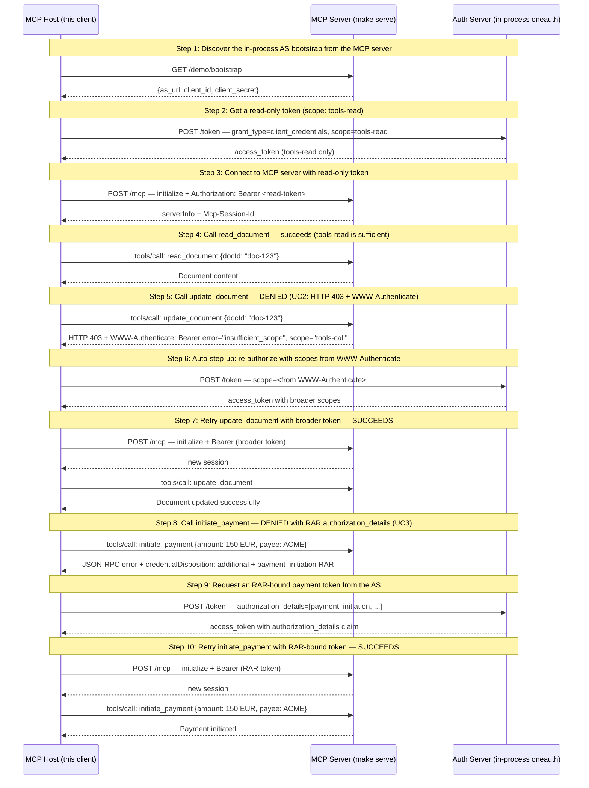

# Fine-Grained Authorization — Scope Step-Up (UC2) + Ephemeral Credentials (UC3)

**EXPERIMENTAL** — Tracks SEP-2643 (Structured Authorization Denials), currently a draft. UC2 + UC3 demonstrated end-to-end against an in-process oneauth AS.

## What you'll learn

- **Discover the in-process AS bootstrap from the MCP server** — The MCP server exposes a non-standard bootstrap endpoint that hands the host the in-process AS URL and a pre-registered client credential. In production, the host would do OAuth Dynamic Client Registration; this shortcut keeps the demo focused on SEP-2643.
- **Get a read-only token (scope: tools-read)** — Standard OAuth 2.0 client_credentials grant. The token is RS256-signed by the AS and can be validated against the AS's JWKS endpoint.
- **Connect to MCP server with read-only token** — JWT validation against the AS's JWKS endpoint succeeds — token is valid, just limited in scope.
- **Call read_document — succeeds (tools-read is sufficient)** — The read_document tool only requires tools-read scope. Our token has it, so the call succeeds.
- **Call update_document — DENIED (UC2: HTTP 403 + WWW-Authenticate)** — Per SEP-2643 (FineGrainedAuth UC2): the server's auth.NewToolScopeMiddleware returns HTTP 403 with WWW-Authenticate before the handler runs. The mcpkit client surfaces this as *client.ClientAuthError with the required scopes already parsed from the header (RFC 6750).
- **Auto-step-up: re-authorize with scopes from WWW-Authenticate** — Spec-driven smart-host behavior: the WWW-Authenticate header named the required scopes; the host complies. We also re-include tools-read so the broader token works for both reads and writes (typical OAuth step-up: ask for the union, not a replacement).
- **Retry update_document with broader token — SUCCEEDS** — New session with the broader token. update_document succeeds because the token includes tools-call.
- **Call initiate_payment — DENIED with RAR authorization_details (UC3)** — The payment tool requires a transaction-specific ephemeral credential. Our broader token has tools-call but no authorization_details bound to this payment, so the server returns the SEP-2643 envelope with an oauth_authorization_details remediationHint describing the exact authorization the host must request.
- **Request an RAR-bound payment token from the AS** — The host uses the authorization_details from the remediationHint *verbatim* in the OAuth token request (RFC 9396). The AS validates and embeds the authorization_details into the JWT as a claim. The host now holds two tokens: the original tools-read+tools-call token (for everything else) and this short-lived payment-bound token.
- **Retry initiate_payment with RAR-bound token — SUCCEEDS** — The server's initiate_payment handler reads authorization_details from the JWT claims and validates that a payment_initiation entry matches the request (amount, currency, payee). It does — the host minted exactly the token the server asked for in the previous denial.

## Flow



## Steps

### Setup

This example uses an in-process oneauth Authorization Server because
Keycloak does not support RFC 9396 Rich Authorization Requests (RAR).
The MCP server starts the AS in a goroutine, registers a confidential
client for the demo, and exposes the client_id+secret + AS URL for the
host to discover.

Start the MCP server in a separate terminal first:

```
Terminal 1:  make serve        # MCP server + in-process AS on :8080
Terminal 2:  make run          # this demo
```

### UC1 vs UC2/UC3 — When does the host react?

UC1 (elicitation): the denial points to an out-of-band action (user clicks Approve).
The host can't proceed until it receives `notifications/elicitation/complete`.

UC2/UC3: the denial is a transport-level signal — UC2 is HTTP 403 + WWW-Authenticate,
UC3 is a JSON-RPC error with an RFC 9396 remediationHint. The host parses it and reacts
immediately by re-authorizing — no user interaction in this demo (a real banking host
would prompt the user to confirm the payment first).

### Step 1: Discover the in-process AS bootstrap from the MCP server

The MCP server exposes a non-standard bootstrap endpoint that hands the host the in-process AS URL and a pre-registered client credential. In production, the host would do OAuth Dynamic Client Registration; this shortcut keeps the demo focused on SEP-2643.

#### Reproduce on the wire

```bash
# Fetch the in-process AS bootstrap into shell vars used by every step below.
BS=$(curl -s http://localhost:8080/demo/bootstrap)
export AS_URL=$(echo "$BS" | jq -r .as_url)
export TOKEN_ENDPT=$(echo "$BS" | jq -r .token_endpoint)
export JWKS_URL=$(echo "$BS" | jq -r .jwks_url)
export CLIENT_ID=$(echo "$BS" | jq -r .client_id)
export CLIENT_SECRET=$(echo "$BS" | jq -r .client_secret)
echo "AS=$AS_URL  client_id=$CLIENT_ID"
```

### Step 2: Get a read-only token (scope: tools-read)

Standard OAuth 2.0 client_credentials grant. The token is RS256-signed by the AS and can be validated against the AS's JWKS endpoint.

#### Reproduce on the wire

```bash
# Mint a token with scope=tools-read. (oneauth's token endpoint accepts a JSON body
# in this demo, hence the application/json content type.)
export TOK_READ=$(curl -s -X POST "$TOKEN_ENDPT" \
  -H 'Content-Type: application/json' \
  -d "{\"grant_type\":\"client_credentials\",\"client_id\":\"$CLIENT_ID\",\"client_secret\":\"$CLIENT_SECRET\",\"scope\":\"tools-read\"}" \
  | jq -r .access_token)
echo "TOK_READ=${TOK_READ:0:30}..."
```

### Step 3: Connect to MCP server with read-only token

JWT validation against the AS's JWKS endpoint succeeds — token is valid, just limited in scope.

#### Reproduce on the wire

```bash
# Initialize an MCP session with the read-only token. The Mcp-Session-Id
# returned in the response headers is what every subsequent call must echo.
SID=$(curl -s -X POST http://localhost:8080/mcp \
  -H "Authorization: Bearer $TOK_READ" \
  -H 'Content-Type: application/json' -H 'Accept: application/json, text/event-stream' \
  -d '{"jsonrpc":"2.0","id":"i","method":"initialize","params":{"protocolVersion":"2025-11-25","clientInfo":{"name":"x","version":"1"},"capabilities":{}}}' \
  -D - -o /dev/null | grep -i 'mcp-session-id' | awk '{print $2}' | tr -d '\r\n')
curl -s -X POST http://localhost:8080/mcp \
  -H "Authorization: Bearer $TOK_READ" \
  -H 'Content-Type: application/json' -H 'Accept: application/json' \
  -H "Mcp-Session-Id: $SID" \
  -d '{"jsonrpc":"2.0","method":"notifications/initialized"}' >/dev/null
echo "SID=$SID"
```

### Step 4: Call read_document — succeeds (tools-read is sufficient)

The read_document tool only requires tools-read scope. Our token has it, so the call succeeds.

#### Reproduce on the wire

```bash
# Read a document. Succeeds because tools-read is enough.
curl -s -X POST http://localhost:8080/mcp \
  -H "Authorization: Bearer $TOK_READ" \
  -H 'Content-Type: application/json' -H 'Accept: application/json' \
  -H "Mcp-Session-Id: $SID" \
  -d '{"jsonrpc":"2.0","id":"r","method":"tools/call","params":{"name":"read_document","arguments":{"docId":"doc-123"}}}' \
  | jq .
```

### Step 5: Call update_document — DENIED (UC2: HTTP 403 + WWW-Authenticate)

Per SEP-2643 (FineGrainedAuth UC2): the server's auth.NewToolScopeMiddleware returns HTTP 403 with WWW-Authenticate before the handler runs. The mcpkit client surfaces this as *client.ClientAuthError with the required scopes already parsed from the header (RFC 6750).

#### Reproduce on the wire

```bash
# Try update_document with the read-only token. -i shows response headers
# so the WWW-Authenticate scope-step-up signal is visible.
curl -i -s -X POST http://localhost:8080/mcp \
  -H "Authorization: Bearer $TOK_READ" \
  -H 'Content-Type: application/json' -H 'Accept: application/json' \
  -H "Mcp-Session-Id: $SID" \
  -d '{"jsonrpc":"2.0","id":"u","method":"tools/call","params":{"name":"update_document","arguments":{"docId":"doc-123","content":"new content"}}}'
# Look for:
#   HTTP/1.1 403 Forbidden
#   WWW-Authenticate: Bearer error="insufficient_scope", scope="tools-call"
```

### Step 6: Auto-step-up: re-authorize with scopes from WWW-Authenticate

Spec-driven smart-host behavior: the WWW-Authenticate header named the required scopes; the host complies. We also re-include tools-read so the broader token works for both reads and writes (typical OAuth step-up: ask for the union, not a replacement).

#### Reproduce on the wire

```bash
# Mint a broader token with both scopes (the union, not a replacement).
export TOK_CALL=$(curl -s -X POST "$TOKEN_ENDPT" \
  -H 'Content-Type: application/json' \
  -d "{\"grant_type\":\"client_credentials\",\"client_id\":\"$CLIENT_ID\",\"client_secret\":\"$CLIENT_SECRET\",\"scope\":\"tools-read tools-call\"}" \
  | jq -r .access_token)
echo "TOK_CALL=${TOK_CALL:0:30}..."
```

### Step 7: Retry update_document with broader token — SUCCEEDS

New session with the broader token. update_document succeeds because the token includes tools-call.

#### Reproduce on the wire

```bash
# New session with the broader token, then repeat update_document.
SID2=$(curl -s -X POST http://localhost:8080/mcp \
  -H "Authorization: Bearer $TOK_CALL" \
  -H 'Content-Type: application/json' -H 'Accept: application/json, text/event-stream' \
  -d '{"jsonrpc":"2.0","id":"i","method":"initialize","params":{"protocolVersion":"2025-11-25","clientInfo":{"name":"x","version":"1"},"capabilities":{}}}' \
  -D - -o /dev/null | grep -i 'mcp-session-id' | awk '{print $2}' | tr -d '\r\n')
curl -s -X POST http://localhost:8080/mcp \
  -H "Authorization: Bearer $TOK_CALL" \
  -H 'Content-Type: application/json' -H 'Accept: application/json' \
  -H "Mcp-Session-Id: $SID2" \
  -d '{"jsonrpc":"2.0","method":"notifications/initialized"}' >/dev/null
curl -s -X POST http://localhost:8080/mcp \
  -H "Authorization: Bearer $TOK_CALL" \
  -H 'Content-Type: application/json' -H 'Accept: application/json' \
  -H "Mcp-Session-Id: $SID2" \
  -d '{"jsonrpc":"2.0","id":"u","method":"tools/call","params":{"name":"update_document","arguments":{"docId":"doc-123","content":"new content"}}}' \
  | jq .
```

### UC3: Per-Operation Ephemeral Credential

UC3 is a different pattern: the host needs an *additional* token for a
specific operation (payment), while keeping the original token for other
operations. The denial carries credentialDisposition: "additional" and
RFC 9396 authorization_details bound to the specific transaction.

### Step 8: Call initiate_payment — DENIED with RAR authorization_details (UC3)

The payment tool requires a transaction-specific ephemeral credential. Our broader token has tools-call but no authorization_details bound to this payment, so the server returns the SEP-2643 envelope with an oauth_authorization_details remediationHint describing the exact authorization the host must request.

#### Reproduce on the wire

```bash
# Try initiate_payment with the broader token. The token has tools-call scope
# but no payment-bound RAR claim, so the server returns the SEP-2643 envelope.
# jq surfaces just the authorization block so you can see the remediation hint.
curl -s -X POST http://localhost:8080/mcp \
  -H "Authorization: Bearer $TOK_CALL" \
  -H 'Content-Type: application/json' -H 'Accept: application/json' \
  -H "Mcp-Session-Id: $SID2" \
  -d '{"jsonrpc":"2.0","id":"p","method":"tools/call","params":{"name":"initiate_payment","arguments":{"amount":"150.00","currency":"EUR","payee":"ACME Corp"}}}' \
  | jq '.error.data.authorization'
# Inspect:
#   credentialDisposition: "additional"  (keep the original token)
#   remediationHints[].type: "oauth_authorization_details"
#   remediationHints[].authorization_details: [{type:"payment_initiation", ...}]
```

### Step 9: Request an RAR-bound payment token from the AS

The host uses the authorization_details from the remediationHint *verbatim* in the OAuth token request (RFC 9396). The AS validates and embeds the authorization_details into the JWT as a claim. The host now holds two tokens: the original tools-read+tools-call token (for everything else) and this short-lived payment-bound token.

#### Reproduce on the wire

```bash
# Echo the authorization_details from step 8 verbatim into a token request.
export TOK_PAY=$(curl -s -X POST "$TOKEN_ENDPT" \
  -H 'Content-Type: application/json' \
  -d "{\"grant_type\":\"client_credentials\",\"client_id\":\"$CLIENT_ID\",\"client_secret\":\"$CLIENT_SECRET\",\"authorization_details\":[{\"type\":\"payment_initiation\",\"actions\":[\"initiate\"],\"instructedAmount\":{\"currency\":\"EUR\",\"amount\":\"150.00\"},\"creditorName\":\"ACME Corp\"}]}" \
  | jq -r .access_token)
echo "TOK_PAY=${TOK_PAY:0:30}..."

# Decode the JWT payload. The authorization_details claim is embedded directly,
# which is what makes the token "self-describing" for the RS to validate.
echo "$TOK_PAY" | cut -d. -f2 | base64 -d 2>/dev/null | jq
```

### Step 10: Retry initiate_payment with RAR-bound token — SUCCEEDS

The server's initiate_payment handler reads authorization_details from the JWT claims and validates that a payment_initiation entry matches the request (amount, currency, payee). It does — the host minted exactly the token the server asked for in the previous denial.

#### Reproduce on the wire

```bash
# New session with the RAR-bound token, then retry initiate_payment.
SID3=$(curl -s -X POST http://localhost:8080/mcp \
  -H "Authorization: Bearer $TOK_PAY" \
  -H 'Content-Type: application/json' -H 'Accept: application/json, text/event-stream' \
  -d '{"jsonrpc":"2.0","id":"i","method":"initialize","params":{"protocolVersion":"2025-11-25","clientInfo":{"name":"x","version":"1"},"capabilities":{}}}' \
  -D - -o /dev/null | grep -i 'mcp-session-id' | awk '{print $2}' | tr -d '\r\n')
curl -s -X POST http://localhost:8080/mcp \
  -H "Authorization: Bearer $TOK_PAY" \
  -H 'Content-Type: application/json' -H 'Accept: application/json' \
  -H "Mcp-Session-Id: $SID3" \
  -d '{"jsonrpc":"2.0","method":"notifications/initialized"}' >/dev/null
curl -s -X POST http://localhost:8080/mcp \
  -H "Authorization: Bearer $TOK_PAY" \
  -H 'Content-Type: application/json' -H 'Accept: application/json' \
  -H "Mcp-Session-Id: $SID3" \
  -d '{"jsonrpc":"2.0","id":"p","method":"tools/call","params":{"name":"initiate_payment","arguments":{"amount":"150.00","currency":"EUR","payee":"ACME Corp"}}}' \
  | jq .
```

## Run it

```bash
go run ./examples/fine-grained-auth/
```

Pass `--non-interactive` to skip pauses:

```bash
go run ./examples/fine-grained-auth/ --non-interactive
```
