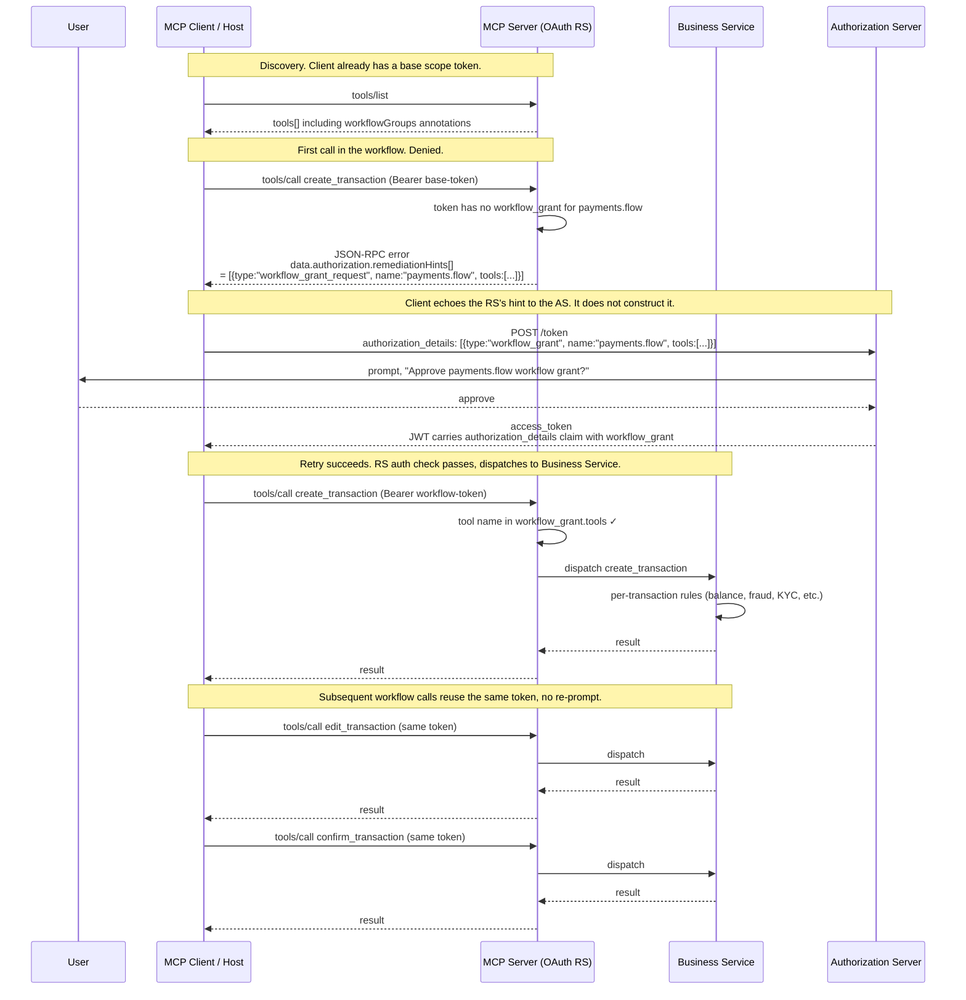
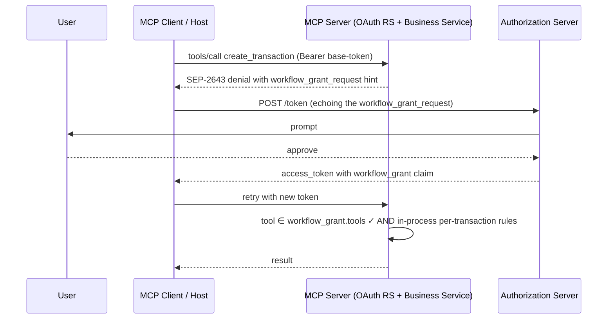

# Workflow Grant - UC2.5 design sketch

> This is a design sketch only. No code in this directory implements it yet. The document captures the shape of a "UC2.5" pattern that sits between SEP-2643's UC2 (scope step-up) and UC3 (per-transaction RAR), and was floated in today's WG meeting (2026-05-06) as a possible middle ground worth exploring.

## Why this exists

UC2 (scope step-up) is too coarse for multi-tool transactions: a `payments:write` scope authorizes any payment to any payee, but says nothing about "these specific tools form one logical transaction."

UC3 (full RFC 9396 RAR) is too rich/fine-grained for the common case.  It brings structured authorization claims, per-transaction parameter binding, and (for production hosts holding multiple RAR-bound tokens) the multi-token bookkeeping problem currently being discussed in the WG.

This proposed "workflow grant" sits in the middle. The goal is to group a set of tools under a single named grant, the user consents once for the whole group, and the token carries the explicit tool list. Per-transaction authorization is **not** an OAuth concern in this model. It lives downstream in the actual business service.

## Shape

The grant is a custom RFC 9396 authorization details type. The **RS originates** it as part of the SEP-2643 denial envelope when an unauthorized request arrives. The **client echoes it verbatim** to the AS in the OAuth token request. The **AS signs it** into the issued access token as a claim. Clients do not invent or construct grants. They pass through what the RS asks for.

Same shape in all three places:

```json
{
  "type": "workflow_grant",
  "name": "payments.flow",
  "tools": ["create_transaction", "edit_transaction", "confirm_transaction"]
}
```

It appears as:

| Where                                     | Field path                                                                                       | Origin                                                                |
|-------------------------------------------|--------------------------------------------------------------------------------------------------|-----------------------------------------------------------------------|
| MCP `tools/call` denial response          | `error.data.authorization.remediationHints[].{type:"workflow_grant_request", name, tools}`       | RS (originates as part of the denial)                                 |
| OAuth `POST /token` request body          | `authorization_details[]`                                                                        | Client (echoes the RS's hint verbatim)                                |
| OAuth issued access token (JWT claim)     | `authorization_details[]`                                                                        | AS (signs the requested grant into the token)                         |
| MCP `tools/call` retry, on the server     | Read by the RS from the JWT to validate the call                                                 | RS (consumes the AS's signed copy)                                    |

This wireshape is pretty much it.  Workflow name plus the explicit tool list. Proposal is to actively avoid constraints, operators, payload matching, resource references, AS-side state etc.  This deliberately kept minimal to avoid risking a new DSL.

Two consequences worth calling out:

- **The RS is the source of truth for workflow definitions.** It declares them on tools (via `workflowGroups`) and surfaces them in denials. The AS never needs to know what `payments.flow` means, it just signs the bytes the client presents.
- **The client is mechanical.** It parses denials, copies workflow_grant_request entries into its next token request, retries. No business logic, no per-server knowledge, no construction of grants from scratch.

## RS validation rule

The validation rule is hopefully simple:

> For each `tools/call`, the tool name in the request must appear in `workflow_grant.tools`.

That should ensure no business logic in the auth layer. Per-transaction approval (is this $500 to alice valid? does the account have balance? does fraud screening pass?) lives in the downstream service via whatever mechanism it already uses (3DS, signed payloads, its own consent UI, internal authorization rules).

## Tool-side declaration

Tools advertise their workflow membership inline on the existing `tools/list` response. Each tool definition gains an additional `workflowGroups` field alongside the existing `name`, `description`, `inputSchema`:

```json
// in the tools/list response
{
  "name": "create_transaction",
  "description": "Create a new payment transaction",
  "inputSchema": { ... },
  "workflowGroups": ["payments.flow"]
}
```

A tool can belong to multiple workflows. The client reads `tools/list` once and knows which grants cover which calls. No separate metadata endpoint, no PRM extension, no side registry.

## A note on actors

In OAuth language the "RS" is the MCP server, but in most real deployments the MCP server is a thin protocol gateway sitting in front of the **actual business service** that owns the domain logic (account balances, fraud screening, transaction validation, KYC, etc.). The two roles can collapse into a single process when the MCP server is itself the business application, but most production topologies separate them.

This separation matters for the workflow grant design because the two layers have different jobs:

- The **MCP server (OAuth RS)** validates tokens, checks scope, checks workflow membership, dispatches the call. This is auth and routing, not domain logic.
- The **business service** receives the dispatched call and applies its own per-transaction rules (does this user have balance, is this payment compliant, has fraud screening passed). This is where "is $500 to alice valid right now" actually lives.

The workflow grant carves up the auth concern cleanly so the MCP server stays domain-agnostic. The two diagrams below show both topologies for completeness, with the collapsed case being a special case of the separated one.

## End-to-end flow (separated topology)



One consent prompt for the whole transaction. The token is self-describing, so decoding the JWT shows exactly which tools are authorized. No state is held between calls on either the RS or the AS side. The workflow grant lives entirely in the signed token. Per-transaction decisions stay inside the Business Service where they belong.

## End-to-end flow (collapsed topology)

When the MCP server **is** the business service (smaller deployments, or applications written natively as MCP servers), the same flow holds with the dispatch hop inside one process:



The collapsed topology is a strict special case of the separated one. The wire shape is identical. Only the boundary between auth and domain logic moves from a network hop to an in-process function call.

## Where this fits relative to UC2 / UC3

The cleanest axis is **who owns the per-transaction authorization decision**:

| Use case                   | Granularity              | Per-transaction decision lives at                               | Right tool when                                                                                                 |
|----------------------------|--------------------------|-----------------------------------------------------------------|-----------------------------------------------------------------------------------------------------------------|
| **UC2** (scope)            | one tool / one scope     | scope-grant time, very coarse                                   | "you can read this resource type"                                                                               |
| **UC2.5** (workflow grant) | one workflow / one grant | workflow-grant time, with the downstream service handling per-transaction | MCP server fronts a separate downstream service that already does its own per-transaction auth                  |
| **UC3** (full RAR)         | one specific transaction | RAR-grant time, bound into the token                            | AS itself owns the business decision (PSD2-style: AS = the bank, user consent at the AS = transaction approval) |

UC3 with structured RAR claims really fits the integrated case where the AS is also the business-decision-maker. For the more common MCP topology, where the MCP server fronts a separate downstream business service, UC2.5 covers the multi-tool flow with one consent prompt and the downstream service handles per-transaction auth its own way.

## Coexistence with other proposals on the table

This sketch is deliberately additive to the live WG discussion. It does not require either of the two competing directions for the multi-token problem to be rejected, and in fact composes cleanly with both.

**The reference_id and token bag direction.** This direction adds a stable opaque resource handle so that clients can compare RAR-bound tokens as opaque strings, along with an RS-AS resource-registration mechanism that produces those handles. Workflow grant operates on a different axis. Where reference_id binds to a specific resource instance, workflow grant binds to a tool set. A single token could carry both an `authorization_details` entry of type `workflow_grant` (covering the tool list) and an entry of type `reference` (covering the specific resource instance). The RS would validate both layers independently. Workflow grant on its own covers the common case where per-resource binding is downstream business logic. The reference_id mechanism still applies cleanly when the AS itself is the business-decision-maker and a stable handle is genuinely needed.

**The PRM metadata draft direction.** This direction adds a discovery layer so that clients can learn what RAR types an RS accepts and what their schemas look like, without out-of-band documentation. Workflow grant is just another RAR type, so an RS adopting both could advertise `workflow_grant` in its `authorization_details_types_supported` and publish a schema for it via the AS metadata endpoint. A client that fetches PRM and AS metadata up front would discover the workflow grant capability without needing the doomed first request that today is what surfaces it. The two proposals sit at different layers, with PRM-metadata as discovery and workflow grant as the type, and they stack naturally.

The intent of this writeup is to add a third design point to the conversation rather than to displace either of the two already on the table. The full SEP-2643 baseline UC3, the UC2.5 workflow grant proposed here, the reference_id mechanism, and the PRM discovery layer are each addressing different sub-problems. They can be considered on their merits independently and (if the WG is convinced of more than one) layered on the same wire.

## Where this would land in the flow

The change is small in scope. There is no new wire format, no new endpoints, and no new RFCs. The change shows up at four points in the existing flow:

| Stage                                | What gets added                                                                                                                                                                                         | Where this lives                                                                                                                |
|--------------------------------------|---------------------------------------------------------------------------------------------------------------------------------------------------------------------------------------------------------|---------------------------------------------------------------------------------------------------------------------------------|
| **`tools/list` response**            | Each tool definition can carry an optional `workflowGroups` array declaring which workflows it belongs to                                                                                               | MCP server side. Backwards compatible, since clients that ignore the field still work and tools without the field declare no workflow. |
| **MCP server auth check**            | A new check stage that reads the `workflow_grant` claim from the access token and validates the incoming tool name is in the grant's tool list                                                          | MCP server side, layered alongside the existing scope check (scope first, workflow second). Naturally fits a middleware stage in any server framework that has one. |
| **SEP-2643 denial envelope**         | A new remediation hint type `workflow_grant_request` carrying the workflow name and tool list the RS wants the client to ask the AS for                                                                 | MCP server side. Additive to the existing `url` and `oauth_authorization_details` remediation hint types.                       |
| **AS token mint**                    | Nothing new. Any AS implementation that supports RFC 9396 RAR can mint tokens carrying a `workflow_grant` authorization_details entry without code changes, since it is just a custom type the AS signs through | AS implementation side. No spec extension, no new endpoints. The AS doesn't need to understand workflow semantics.              |

The asymmetry is intentional. The **MCP server is the source of truth** for what workflows exist and which tools belong to each. The AS just signs what the client asks for. If we later wanted the AS to validate workflow_grant requests against an RS-published catalog (rejecting grants for unknown workflows, for example), that becomes a bigger change, but the design here intentionally doesn't require it. The RS surfaces the workflow_grant_request in the denial envelope, the client echoes it to the AS, and the AS signs.

## Open questions

1. **Multiple grants per token.** Should a token be able to carry multiple workflow grants (e.g., `payments.flow` + `documents.review`)? Probably yes, since RFC 9396 `authorization_details` is already an array. RS validation becomes "tool must be in at least one grant's tool list."
2. **Workflow grant + scope interaction.** If a token has both a workflow grant AND broader scopes, what wins? The likely answer is that the workflow grant is restrictive within its tool set, while scopes apply to other tools. A `payments.flow` grant doesn't reduce what the token's other scopes can do, it just adds permission for the workflow's tools.
3. **TTL.** Workflow grants for short transactions probably want shorter TTLs than baseline scope tokens (5-15 min vs hours). Per-grant TTL or follow the token's `exp`?
4. **Workflow versioning.** If the RS adds a tool to `payments.flow`, existing tokens won't cover it. Acceptable trade-off - workflows should be stable. Could add a version field to the grant if it becomes a real problem.
5. **Discovery vs declaration.** Tools self-declare `workflowGroups` on `tools/list`. Should there also be a separate "list workflows" endpoint that names each workflow with a description? Probably yes for human-facing UI. The inline declaration alone is sufficient for client logic.

## What this deliberately doesn't do

- **No per-argument constraints in the grant.** Once you start matching args (`amount`, `payee`) you eventually need operators (`lte`, `in`, ranges) and you've invented a DSL. Per-transaction parameter binding is downstream business logic, not auth.
- **No reference IDs / resource registration.** No AS-side state, no new RFC needed. The tradeoff: clients can't compare tokens by reference ID (no token bag mechanic). They also don't need to.
- **No metadata walks.** Everything the client needs is in the denial envelope or the `tools/list` response. No `authorization_details_types_metadata_endpoint` to fetch.

## References

[SEP-2643](https://github.com/modelcontextprotocol/modelcontextprotocol/pull/2643)
[RFC 9396](https://www.rfc-editor.org/rfc/rfc9396  (Rich Authorization Requests)
