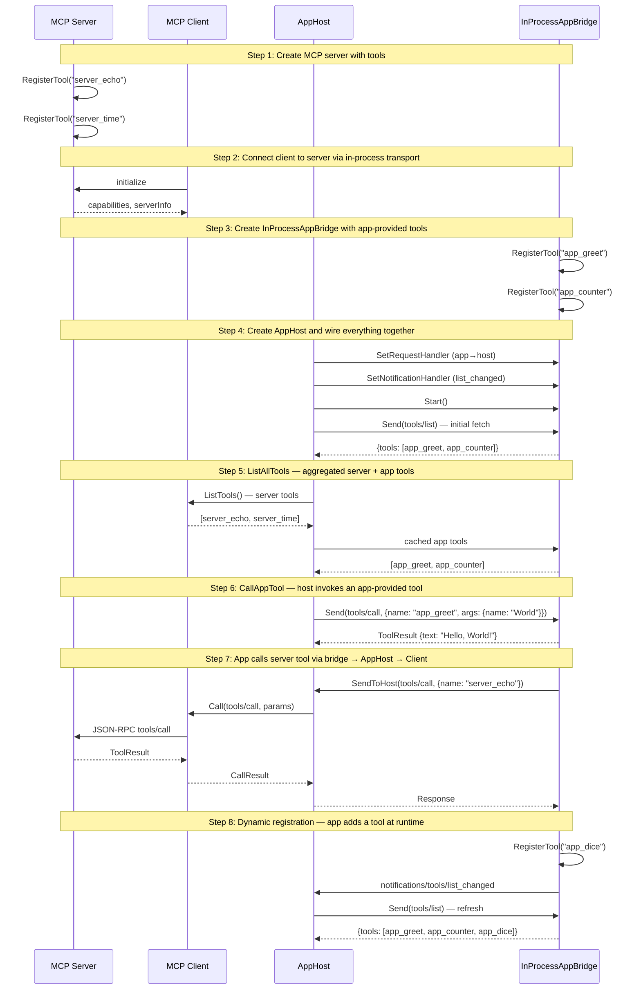

# AppHost — Host-Side App Management

Demonstrates AppHost mediating between an MCP server and an app bridge with bidirectional tool calls.

## What you'll learn

- **Create MCP server with tools** — The server provides two tools: echo (returns input) and time (returns current time).
- **Connect client to server via in-process transport** — The client connects without HTTP — using InProcessTransport for direct dispatch.
- **Create InProcessAppBridge with app-provided tools** — The bridge simulates an MCP App (iframe). It registers two tools that the host/model can call directly.
- **Create AppHost and wire everything together** — AppHost wires up bidirectional routing and fetches the initial app tool list.
- **ListAllTools — aggregated server + app tools** — ListAllTools merges tools from the MCP server and the app bridge into a single list.
- **CallAppTool — host invokes an app-provided tool** — The host calls a tool registered by the app. The bridge dispatches to the Go handler.
- **App calls server tool via bridge → AppHost → Client** — The app calls a server-side tool through the bridge. AppHost forwards to the MCP server via the Client.
- **Dynamic registration — app adds a tool at runtime** — The app registers a new tool after startup. AppHost detects the change and refreshes its cache.

## Flow



## Steps

### Step 1: Create MCP server with tools

> **References:** [MCP Specification](https://spec.modelcontextprotocol.io)

The server provides two tools: echo (returns input) and time (returns current time).

### Step 2: Connect client to server via in-process transport

The client connects without HTTP — using InProcessTransport for direct dispatch.

### Step 3: Create InProcessAppBridge with app-provided tools

> **References:** [MCP Apps Extension](https://modelcontextprotocol.io/extensions/apps/overview)

The bridge simulates an MCP App (iframe). It registers two tools that the host/model can call directly.

### Step 4: Create AppHost and wire everything together

AppHost wires up bidirectional routing and fetches the initial app tool list.

### Step 5: ListAllTools — aggregated server + app tools

ListAllTools merges tools from the MCP server and the app bridge into a single list.

### Step 6: CallAppTool — host invokes an app-provided tool

The host calls a tool registered by the app. The bridge dispatches to the Go handler.

### Step 7: App calls server tool via bridge → AppHost → Client

The app calls a server-side tool through the bridge. AppHost forwards to the MCP server via the Client.

### Step 8: Dynamic registration — app adds a tool at runtime

The app registers a new tool after startup. AppHost detects the change and refreshes its cache.

### Cleanup

AppHost.Close() closes the bridge. The caller closes the Client separately.
In a real application, you'd defer these in the appropriate scope.

## References

- [MCP Specification](https://spec.modelcontextprotocol.io)
- [MCP Apps Extension](https://modelcontextprotocol.io/extensions/apps/overview)

## Run it

```bash
go run ./examples/host/01-apphost/
```

Pass `--non-interactive` to skip pauses:

```bash
go run ./examples/host/01-apphost/ --non-interactive
```

## What to verify

- **Step 5**: ListAllTools shows 4 tools (2 server + 2 app)
- **Step 6**: CallAppTool returns "Hello, World!" and counter increments to 2
- **Step 7**: App calls server_echo, result includes "echo: from the app"
- **Step 8**: After dynamic registration, 3 app tools listed (app_greet, app_counter, app_dice)
