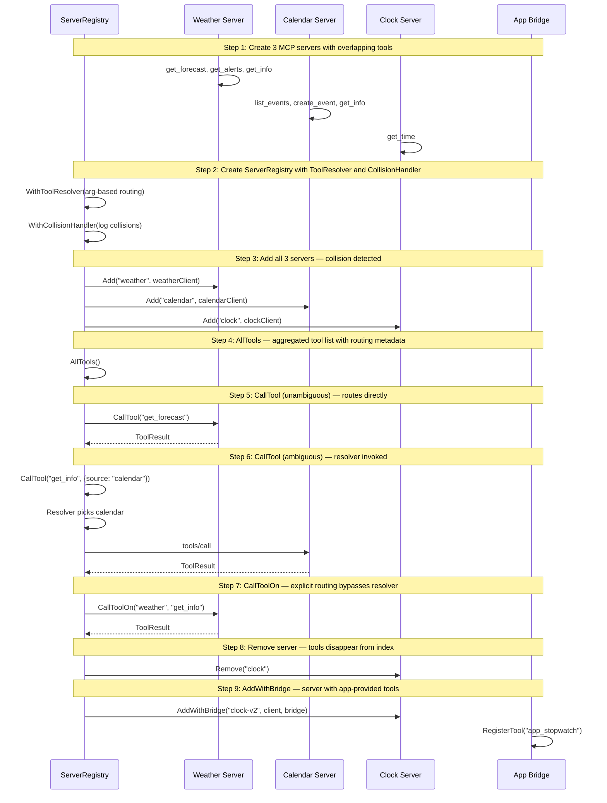

# Multi-Server Registry

Demonstrates ServerRegistry managing 3 MCP servers with tool aggregation, collision resolution, and app bridge integration.

## What you'll learn

- **Create 3 MCP servers with overlapping tools** — Weather and Calendar both have a 'get_info' tool — this will cause a collision in the registry.
- **Create ServerRegistry with ToolResolver and CollisionHandler** — The resolver picks a server based on args. The collision handler logs when ambiguity is detected.
- **Add all 3 servers — collision detected** — When calendar is added, the registry detects that 'get_info' now exists in both weather and calendar.
- **AllTools — aggregated tool list with routing metadata** — Returns all tools from all servers. Each tool has clean name + ServerID metadata.
- **CallTool (unambiguous) — routes directly** — get_forecast exists only in weather — no resolver needed, routes directly.
- **CallTool (ambiguous) — resolver invoked** — get_info is ambiguous (weather + calendar). The resolver sees {source: "calendar"} and picks calendar.
- **CallToolOn — explicit routing bypasses resolver** — CallToolOn routes directly to the specified server. No resolver involved.
- **Remove server — tools disappear from index** — After removing clock, get_time is no longer available.
- **AddWithBridge — server with app-provided tools** — Re-adds clock with an app bridge that provides an extra tool. Both server and app tools appear in AllTools.

## Flow



## Steps

### Step 1: Create 3 MCP servers with overlapping tools

> **References:** [MCP Specification](https://spec.modelcontextprotocol.io)

Weather and Calendar both have a 'get_info' tool — this will cause a collision in the registry.

### Step 2: Create ServerRegistry with ToolResolver and CollisionHandler

> **References:** [mcpkit APPS_HOST.md](https://github.com/panyam/mcpkit/blob/main/docs/APPS_HOST.md)

The resolver picks a server based on args. The collision handler logs when ambiguity is detected.

### Step 3: Add all 3 servers — collision detected

When calendar is added, the registry detects that 'get_info' now exists in both weather and calendar.

### Step 4: AllTools — aggregated tool list with routing metadata

Returns all tools from all servers. Each tool has clean name + ServerID metadata.

### Step 5: CallTool (unambiguous) — routes directly

get_forecast exists only in weather — no resolver needed, routes directly.

### Step 6: CallTool (ambiguous) — resolver invoked

get_info is ambiguous (weather + calendar). The resolver sees {source: "calendar"} and picks calendar.

### Step 7: CallToolOn — explicit routing bypasses resolver

CallToolOn routes directly to the specified server. No resolver involved.

### Step 8: Remove server — tools disappear from index

After removing clock, get_time is no longer available.

### Step 9: AddWithBridge — server with app-provided tools

> **References:** [MCP Apps Extension](https://modelcontextprotocol.io/extensions/apps/overview)

Re-adds clock with an app bridge that provides an extra tool. Both server and app tools appear in AllTools.

## References

- [MCP Specification](https://spec.modelcontextprotocol.io)
- [mcpkit APPS_HOST.md](https://github.com/panyam/mcpkit/blob/main/docs/APPS_HOST.md)
- [MCP Apps Extension](https://modelcontextprotocol.io/extensions/apps/overview)

## Run it

```bash
go run ./examples/host/02-multi-server/
```

Pass `--non-interactive` to skip pauses:

```bash
go run ./examples/host/02-multi-server/ --non-interactive
```

## What to verify

- **Step 3**: Collision handler prints `⚠ Collision detected: 'get_info' in servers [weather, calendar]`
- **Step 4**: AllTools lists 7 tools with ServerID metadata (get_info appears twice)
- **Step 5**: Unambiguous call result includes `[weather]` prefix
- **Step 6**: Ambiguous call with `{source: "calendar"}` routes to calendar (resolver works)
- **Step 7**: CallToolOn routes to weather regardless of resolver
- **Step 8**: After removing clock, `get_time` returns "unknown tool" error
- **Step 9**: After AddWithBridge, 8 tools listed including `app_stopwatch` (source=app)
