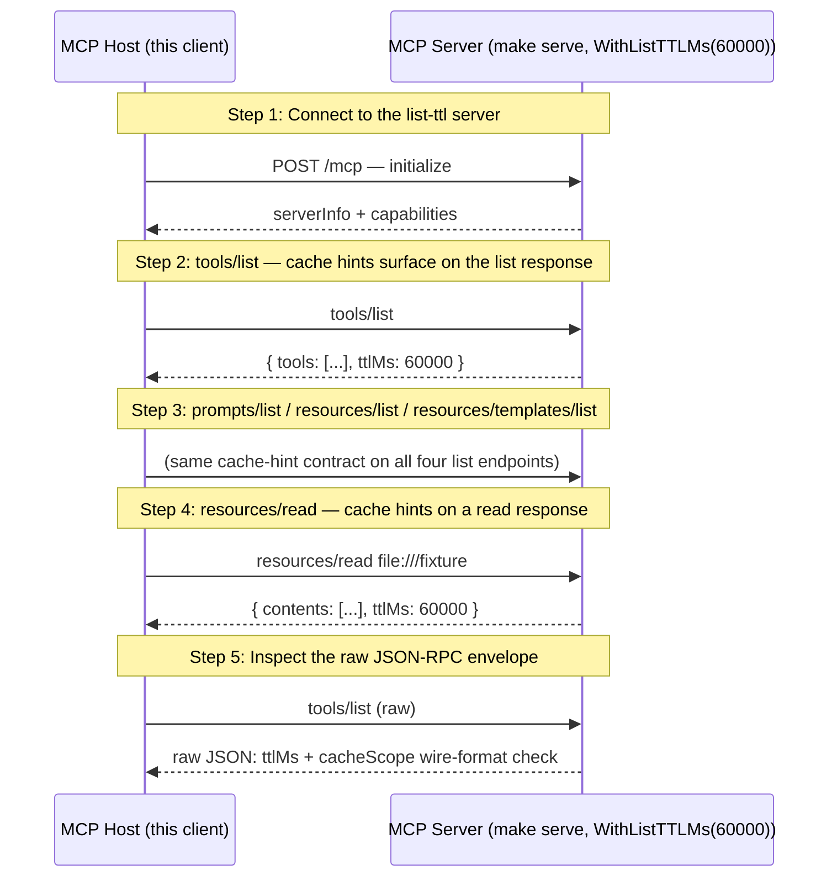

# MCP List TTL (SEP-2549) — Cache Hints on List and Read Results

Walks through SEP-2549, which adds two cache hints — `ttlMs` (integer milliseconds) and `cacheScope` (`public`/`private`) — to every paginated list response (tools/list, prompts/list, resources/list, resources/templates/list) and to resources/read. Clients use them to cache the registered surface between `notifications/list_changed` instead of re-fetching on every poll.

## What you'll learn

- **Connect to the list-ttl server** — `client.NewClient(...)` + `Connect()`. SEP-2549 is purely a server-side concern; the client doesn't negotiate anything special.
- **tools/list — cache hints surface on the list response** — `client.ListToolsPage("")` returns the full envelope including `TTLMs *int` and `CacheScope string`.
- **prompts/list / resources/list / resources/templates/list** — SEP-2549 applies to every paginated list response. `WithListTTLMs` / `WithListCacheControl` configure the values uniformly — there's no per-endpoint override. Hit each endpoint and confirm they all return the configured hints.
- **resources/read — cache hints on a read response** — SEP-2549 added resources/read to the cacheable coverage mid-cycle. `client.ReadResourceFull` returns `core.ResourceResult`, which carries the same `TTLMs` / `CacheScope` fields. A read handler MAY override either per-read; otherwise the `WithReadResourceCacheControl` server default applies.
- **Inspect the raw JSON-RPC envelope** — Bypass the typed helper and decode the raw response body to verify the wire shape — `"ttlMs": 60000` as a JSON number and `"cacheScope"` as a string, sitting alongside `"tools"` and (when paginated) `"nextCursor"`.

## Flow



## Steps

### Setup

Start the MCP server in a separate terminal first:

```
Terminal 1:  make serve         # list-ttl server on :8080 with WithListTTLMs(60000)
Terminal 2:  make demo          # this walkthrough (--tui for the interactive TUI)
```

### The ttlMs cache hint

The `ttlMs` field is an integer-milliseconds freshness hint. Per the merged SEP-2549 spec it has two client-visible behaviors:

- **absent or `"ttlMs": 0`** — the response is immediately stale; the client MAY re-fetch every time the list is needed. An absent field is the "older server / not configured" case; clients treat it the same as 0.
- **`"ttlMs": <positive int>`** — fresh for N milliseconds from receipt; the client SHOULD NOT re-fetch before it expires unless it receives `list_changed`.

Server-side, `mcpkit.WithListTTLMs(ms)` configures the value uniformly for all four list endpoints. Negative values are treated as "unset" so the wire field is omitted. mcpkit keeps `TTLMs` a `*int`: that lets a server emit an explicit `"ttlMs": 0` distinct from omitting the field, even though clients treat the two the same.

Client-side, `mcpkit/client.ListToolsPage(cursor)` and its three siblings (`ListPromptsPage`, `ListResourcesPage`, `ListResourceTemplatesPage`) return the typed result envelope so callers can read `TTLMs` and `CacheScope` alongside `NextCursor`. The pre-existing zero-arg `ListTools()` and the auto-paginating `Tools(ctx)` iterator drop the envelope — use the `*Page` helpers when the cache hints matter.

### The cacheScope hint

The `cacheScope` field controls who may serve a cached copy of a response, mirroring HTTP `Cache-Control: public` vs `private`:

- **`"public"`** — no caller-specific data; any client, shared gateway, or caching proxy MAY store the response and serve it to any user.
- **`"private"`** — caller-specific data; a cache MAY be reused only within the same authorization context and MUST NOT be shared across access tokens.

When `cacheScope` is absent clients default to `"public"`, so a server whose response varies per caller MUST set `private` explicitly. Set both hints in one call with `server.WithListCacheControl(ttlMs, scope)`.

### Step 1: Connect to the list-ttl server

`client.NewClient(...)` + `Connect()`. SEP-2549 is purely a server-side concern; the client doesn't negotiate anything special.

### Step 2: tools/list — cache hints surface on the list response

`client.ListToolsPage("")` returns the full envelope including `TTLMs *int` and `CacheScope string`.

### Step 3: prompts/list / resources/list / resources/templates/list

SEP-2549 applies to every paginated list response. `WithListTTLMs` / `WithListCacheControl` configure the values uniformly — there's no per-endpoint override. Hit each endpoint and confirm they all return the configured hints.

### Step 4: resources/read — cache hints on a read response

SEP-2549 added resources/read to the cacheable coverage mid-cycle. `client.ReadResourceFull` returns `core.ResourceResult`, which carries the same `TTLMs` / `CacheScope` fields. A read handler MAY override either per-read; otherwise the `WithReadResourceCacheControl` server default applies.

### Step 5: Inspect the raw JSON-RPC envelope

Bypass the typed helper and decode the raw response body to verify the wire shape — `"ttlMs": 60000` as a JSON number and `"cacheScope"` as a string, sitting alongside `"tools"` and (when paginated) `"nextCursor"`.

### Caching pattern

A typical client integrates the hints like this:

```go
page, err := c.ListToolsPage("")
if err != nil { /* ... */ }
cache.Tools = page.Tools
if page.TTLMs != nil && *page.TTLMs > 0 {
    cache.ToolsExpiresAt = time.Now().Add(time.Duration(*page.TTLMs) * time.Millisecond)
}
// Subsequent reads check cache.ToolsExpiresAt; on miss, re-fetch.
// On notifications/list_changed, invalidate immediately regardless of TTL.
```

An absent `TTLMs` and `*page.TTLMs == 0` both mean "immediately stale — do not rely on this response being fresh". A `private` cacheScope means the entry MUST NOT be reused across authorization contexts; key any shared cache by access token.

### Where to look in the code

- Server options: `server.WithListTTLMs` / `WithListCacheControl` / `WithReadResourceCacheControl` — server/server.go
- Wire types: `core.ToolsListResult` / PromptsListResult / ResourcesListResult / ResourceTemplatesListResult / ResourceResult — core/{tool,prompt,resource}.go; `core.CacheScopePublic` / `CacheScopePrivate` — core/cache.go
- Client typed helpers: `client.ListToolsPage` / ListPromptsPage / ListResourcesPage / ListResourceTemplatesPage / ReadResource — client/iterators.go
- Migration guide: docs/LIST_TTL_MIGRATION.md
- Conformance: SEP-2549 scenarios on panyam/mcpconformance `pending` (`src/scenarios/server/list-ttl/`) — drive via `make testconf-list-ttl`
- SEP-2549 spec: https://github.com/modelcontextprotocol/specification/pull/2549

## Run it

```bash
go run ./examples/list-ttl/
```

Pass `--non-interactive` to skip pauses:

```bash
go run ./examples/list-ttl/ --non-interactive
```
