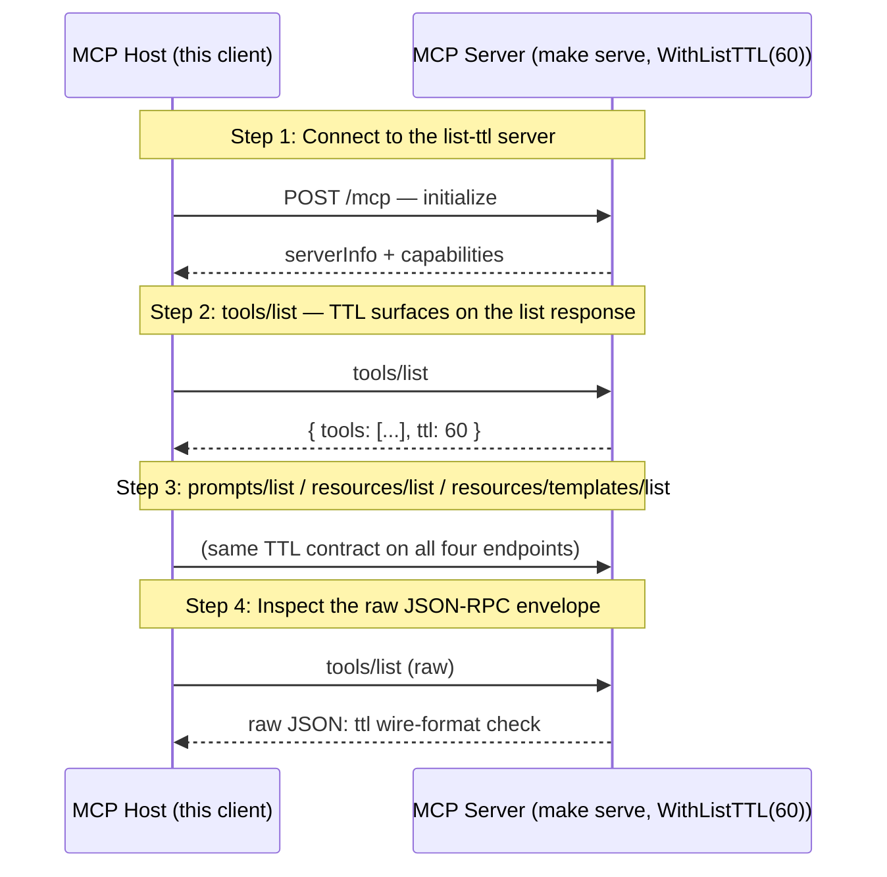

# MCP List TTL (SEP-2549) — Cache-Freshness Hint on List Results

Walks through SEP-2549, which adds an optional `ttl` (seconds) cache-freshness hint to every paginated list response (tools/list, prompts/list, resources/list, resources/templates/list). Clients use it to cache the registered surface between `notifications/list_changed` instead of re-fetching on every poll.

## What you'll learn

- **Connect to the list-ttl server** — `client.NewClient(...)` + `Connect()`. SEP-2549 is purely a server-side concern; the client doesn't negotiate anything special.
- **tools/list — TTL surfaces on the list response** — `client.ListToolsPage("")` returns the full envelope including `TTL *int`. The pointer distinguishes nil (no guidance) from `&0` (explicit "do not cache") — plain `int` would conflate them.
- **prompts/list / resources/list / resources/templates/list** — SEP-2549 applies to every paginated list response. `WithListTTL(seconds)` configures the value uniformly — there's no per-endpoint override. Hit each endpoint and confirm they all return the configured TTL.
- **Inspect the raw JSON-RPC envelope** — Bypass the typed helper and decode the raw response body to verify the wire shape — `"ttl": 60` as a JSON number, sitting alongside `"tools"` and (when paginated) `"nextCursor"`. Confirms the field is a JSON number, not stringified.

## Flow



## Steps

### Setup

Start the MCP server in a separate terminal first:

```
Terminal 1:  make serve         # list-ttl server on :8080 with WithListTTL(60)
Terminal 2:  make demo          # this walkthrough (--tui for the interactive TUI)
```

### Three-state TTL contract

The `ttl` field is optional and has three distinct wire shapes:

- **absent** (`ttl` field omitted) — no server guidance; client falls back to `notifications/list_changed` or its own heuristics.
- **`"ttl": 0`** — explicit "do not cache"; client SHOULD re-fetch every time the list is needed.
- **`"ttl": <positive int>`** — fresh for N seconds; client SHOULD NOT re-fetch before TTL expires unless it receives `list_changed`.

Server-side, `mcpkit.WithListTTL(seconds)` configures the value uniformly for all four endpoints. Negative values are treated as "unset" so the wire field is omitted.

Client-side, `mcpkit/client.ListToolsPage(cursor)` and its three siblings (`ListPromptsPage`, `ListResourcesPage`, `ListResourceTemplatesPage`) return the typed result envelope so callers can read `TTL` alongside `NextCursor`. The pre-existing zero-arg `ListTools()` and the auto-paginating `Tools(ctx)` iterator drop the envelope — use the `*Page` helpers when the TTL hint matters.

This demo connects to a server configured with `WithListTTL(60)` and inspects each endpoint. To see the other two states, restart the server with `--ttl 0` (do not cache) or omit `--ttl` entirely (unset).

### Step 1: Connect to the list-ttl server

`client.NewClient(...)` + `Connect()`. SEP-2549 is purely a server-side concern; the client doesn't negotiate anything special.

### Step 2: tools/list — TTL surfaces on the list response

`client.ListToolsPage("")` returns the full envelope including `TTL *int`. The pointer distinguishes nil (no guidance) from `&0` (explicit "do not cache") — plain `int` would conflate them.

### Step 3: prompts/list / resources/list / resources/templates/list

SEP-2549 applies to every paginated list response. `WithListTTL(seconds)` configures the value uniformly — there's no per-endpoint override. Hit each endpoint and confirm they all return the configured TTL.

### Step 4: Inspect the raw JSON-RPC envelope

Bypass the typed helper and decode the raw response body to verify the wire shape — `"ttl": 60` as a JSON number, sitting alongside `"tools"` and (when paginated) `"nextCursor"`. Confirms the field is a JSON number, not stringified.

### Caching pattern

A typical client integrates the TTL like this:

```go
page, err := c.ListToolsPage("")
if err != nil { /* ... */ }
cache.Tools = page.Tools
if page.TTL != nil && *page.TTL > 0 {
    cache.ToolsExpiresAt = time.Now().Add(time.Duration(*page.TTL) * time.Second)
}
// Subsequent reads check cache.ToolsExpiresAt; on miss, re-fetch.
// On notifications/list_changed, invalidate immediately regardless of TTL.
```

`page.TTL == nil` (absent) and `*page.TTL == 0` (do not cache) both mean "don't cache from this response"; the difference is whether the server gave guidance at all (clients may still cache nil-TTL responses with their own heuristics, but should re-fetch every time on `&0`).

### Where to look in the code

- Server option: `server.WithListTTL(seconds int)` — server/server.go
- Wire types: `core.ToolsListResult.TTL` / PromptsListResult / ResourcesListResult / ResourceTemplatesListResult — core/{tool,prompt,resource}.go
- Client typed helpers: `client.ListToolsPage` / ListPromptsPage / ListResourcesPage / ListResourceTemplatesPage — client/iterators.go
- Conformance: `conformance/list-ttl/scenarios.test.ts` (5 scenarios across 3 server processes; `make testconf-list-ttl` spawns + tears down)
- SEP-2549 spec: https://github.com/modelcontextprotocol/specification/pull/2549

## Run it

```bash
go run ./examples/list-ttl/
```

Pass `--non-interactive` to skip pauses:

```bash
go run ./examples/list-ttl/ --non-interactive
```
