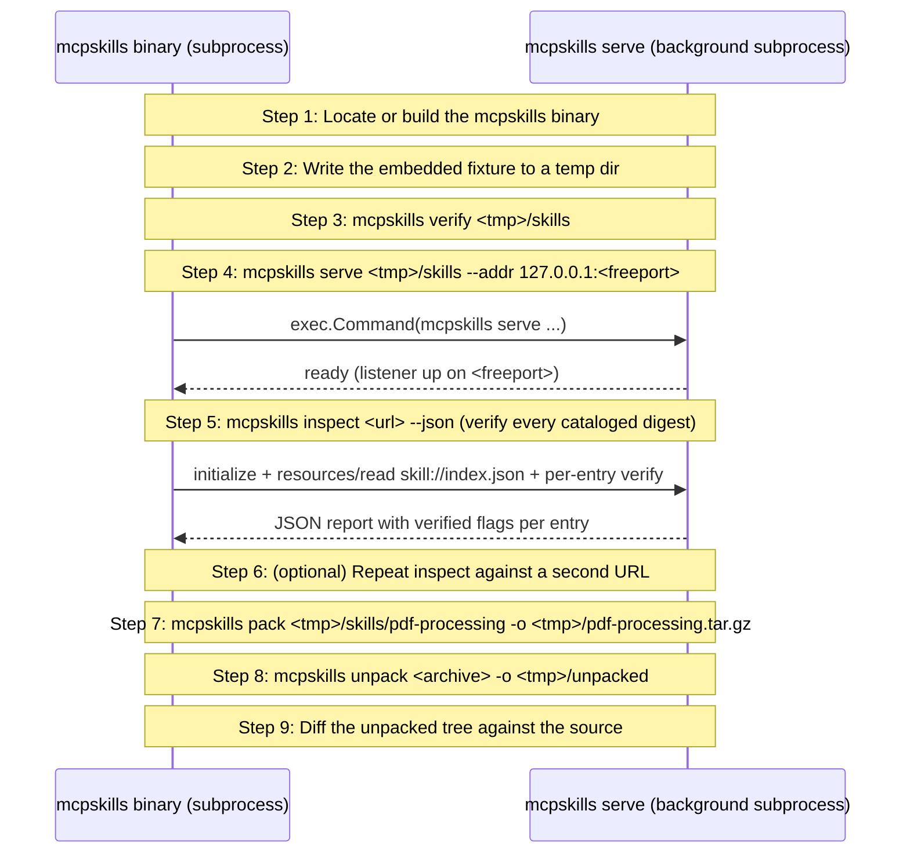

# mcpskills CLI walkthrough

Drives the mcpskills binary end-to-end against a tiny fixture: verify, serve, inspect, pack, unpack, byte-equality diff. Each step shells out to the real CLI so the walkthrough doubles as a CI smoke test for the published binary surface. Run with --non-interactive in CI; run with --tui or --note for a demo.

## What you'll learn

- **Locate or build the mcpskills binary** — Discovery order: $MCPSKILLS_BIN, <repo-root>/bin/mcpskills, else `go build` into a temp file. The temp binary is cleaned up at the end.
- **Write the embedded fixture to a temp dir** — Two skills: git-workflow (single SKILL.md) and pdf-processing (SKILL.md + a supporting file). Self-contained — no sibling-example dependency.
- **mcpskills verify <tmp>/skills** — Lints the fixture for SEP-2640 compliance: required SKILL.md, frontmatter name matches directory, no nested SKILL.md.
- **mcpskills serve <tmp>/skills --addr 127.0.0.1:<freeport>** — A free port is picked via net.Listen on :0 then closed, so the child mcpskills server gets an unused port rather than colliding with :8080.
- **mcpskills inspect <url> --json (verify every cataloged digest)** — The --json flag is what makes this useful inside a script. Each entry's `verified` boolean is a SHA-256 check against the index's promised digest.
- **(optional) Repeat inspect against a second URL** — Run with MCPSKILLS_INSPECT_UPSTREAM_URL pointed at any spec-compliant server (mcpkit, TS SDK reference, PHP SDK, etc.) and the same command works. Skipped when the env var is unset.
- **mcpskills pack <tmp>/skills/pdf-processing -o <tmp>/pdf-processing.tar.gz** — Packs a single skill directory into a SEP-2640 archive. Output mime is application/gzip.
- **mcpskills unpack <archive> -o <tmp>/unpacked** — Unpack enforces the four SEP-2640 safety MUSTs (../ rejection, absolute-path rejection, escaping link rejection, size cap). On clean input that's invisible — but it's the same code path that would refuse a malicious archive.
- **Diff the unpacked tree against the source** — Walks both trees and asserts byte equality file-for-file. A mismatch here would mean pack or unpack lost or corrupted content.

## Flow



## Steps

### What this walks

SEP-2640's five host-side tasks each map to one mcpskills subcommand. The walkthrough exercises every one against a fixture written to a temp dir at startup.

| Task                         | Subcommand                  |
| ---------------------------- | --------------------------- |
| Lint a skills directory      | `mcpskills verify <dir>`    |
| Host the directory over MCP  | `mcpskills serve <dir>`     |
| Talk to any spec server      | `mcpskills inspect <url>`   |
| Pack a skill for transport   | `mcpskills pack <skill-dir>`|
| Extract a packed skill       | `mcpskills unpack <archive>`|

The walkthrough resolves the binary in this order: $MCPSKILLS_BIN, ./bin/mcpskills under the repo root, then a `go build` of cmd/mcpskills into a temp path. The first two paths exist so repeat runs skip the rebuild.

### Step 1: Locate or build the mcpskills binary

Discovery order: $MCPSKILLS_BIN, <repo-root>/bin/mcpskills, else `go build` into a temp file. The temp binary is cleaned up at the end.

### Step 2: Write the embedded fixture to a temp dir

Two skills: git-workflow (single SKILL.md) and pdf-processing (SKILL.md + a supporting file). Self-contained — no sibling-example dependency.

### Step 3: mcpskills verify <tmp>/skills

Lints the fixture for SEP-2640 compliance: required SKILL.md, frontmatter name matches directory, no nested SKILL.md.

### Step 4: mcpskills serve <tmp>/skills --addr 127.0.0.1:<freeport>

A free port is picked via net.Listen on :0 then closed, so the child mcpskills server gets an unused port rather than colliding with :8080.

### Step 5: mcpskills inspect <url> --json (verify every cataloged digest)

The --json flag is what makes this useful inside a script. Each entry's `verified` boolean is a SHA-256 check against the index's promised digest.

### Step 6: (optional) Repeat inspect against a second URL

Run with MCPSKILLS_INSPECT_UPSTREAM_URL pointed at any spec-compliant server (mcpkit, TS SDK reference, PHP SDK, etc.) and the same command works. Skipped when the env var is unset.

### Step 7: mcpskills pack <tmp>/skills/pdf-processing -o <tmp>/pdf-processing.tar.gz

Packs a single skill directory into a SEP-2640 archive. Output mime is application/gzip.

### Step 8: mcpskills unpack <archive> -o <tmp>/unpacked

Unpack enforces the four SEP-2640 safety MUSTs (../ rejection, absolute-path rejection, escaping link rejection, size cap). On clean input that's invisible — but it's the same code path that would refuse a malicious archive.

### Step 9: Diff the unpacked tree against the source

Walks both trees and asserts byte equality file-for-file. A mismatch here would mean pack or unpack lost or corrupted content.

### Wrap-up

The walkthrough has exercised every mcpskills subcommand against a fresh fixture. The same shell-out approach a CI smoke test would use is identical to what runs in front of an audience under --tui — the binary doesn't know it's being demoed.

`just test-mcpskills-walkthrough` at the repo root runs this same flow with --non-interactive and asserts exit 0. Use it as the per-commit gate for the CLI surface.

## Run it

```bash
go run ./examples/mcpskills-walkthrough/
```

Pass `--non-interactive` to skip pauses:

```bash
go run ./examples/mcpskills-walkthrough/ --non-interactive
```
