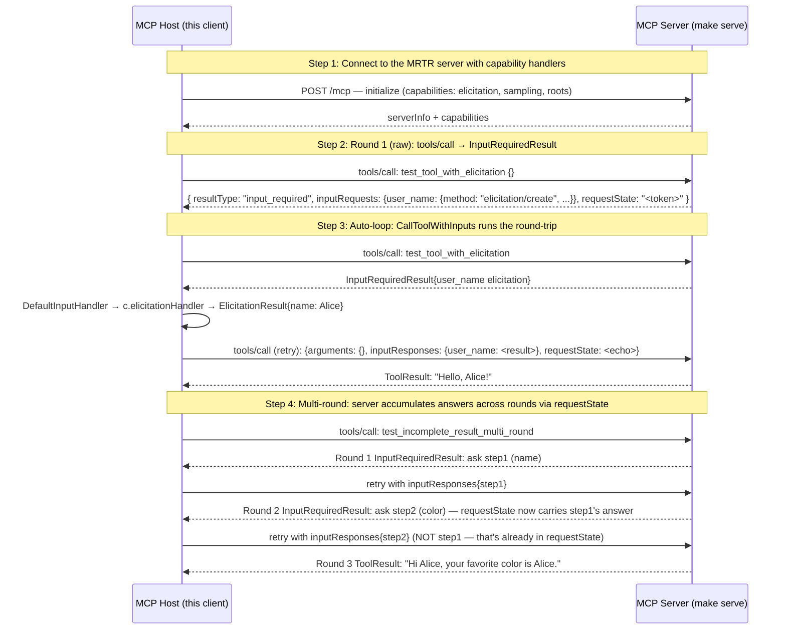

# MCP MRTR (SEP-2322) — Ephemeral InputRequiredResult Round-Trips

Walks through the SEP-2322 ephemeral Multi Round-Trip Requests flow. The server returns `InputRequiredResult{inputRequests, requestState}` when it needs more input from the client; the client resolves each `inputRequest` (elicitation, sampling, roots) locally and retries the SAME `tools/call` with `inputResponses` + the echoed `requestState`. Stateless on the server side — accumulated answers live inside `requestState` across rounds. Renamed from `IncompleteResult` in SEP-2322 commit de6d76fb (merged 2026-05-06).

## What you'll learn

- **Connect to the MRTR server with capability handlers** — `client.WithElicitationHandler` / `WithSamplingHandler` / `WithRootsHandler` register the client-side callbacks. The walkthrough returns canned answers so the loop runs end-to-end without user interaction; in production these would prompt the user, hit an LLM, or read filesystem roots.
- **Round 1 (raw): tools/call → InputRequiredResult** — Bypass the auto-loop helper to see the raw InputRequiredResult shape. The discriminator is `resultType` — camelCase like every other MCP wire field. `inputRequests` is keyed by server-chosen opaque ids the client must echo verbatim. SEP-2322 commit de6d76fb (merged 2026-05-06) renamed this variant from IncompleteResult / `"incomplete"`.
- **Auto-loop: CallToolWithInputs runs the round-trip** — `client.CallToolWithInputs(ctx, c, name, args, handler)` collapses the whole loop. `DefaultInputHandler` synthesizes a server-to-client request for each `inputRequest` and routes it through `client.HandleServerRequestWithContext` — single source of truth for how the client responds to MCP method requests, whether they arrived over the back-channel or inlined inside an InputRequiredResult.
- **Multi-round: server accumulates answers across rounds via requestState** — The wire only ships the LATEST round's `inputResponses`. Dispatch decodes prior answers from `requestState` (a signed `MRTRRoundState` containing the accumulated answers map), merges with the current round, and surfaces a unified map to the handler. Handlers stay stateless across rounds. The canned elicitation handler returns the same `name: Alice` for both prompts in this demo, hence the funny output — a real handler would branch on the elicitation message.

## Flow



## Steps

### Setup

Start the MCP server in a separate terminal first:

```
Terminal 1:  make serve         # MRTR demo server on :8080
Terminal 2:  make demo          # this walkthrough (--tui for the interactive TUI)
```

### What MRTR adds to tools/call

v1 `tools/call` had two terminal shapes — a sync `ToolResult` or (with SEP-2663 Tasks) a `CreateTaskResult`. SEP-2322 adds a third **transient** shape:

- **`resultType: "complete"`** (or absent) — sync ToolResult, the call is done.
- **`resultType: "task"`** — server elected to spin off a task; client polls via `tasks/get` (SEP-2663).
- **`resultType: "input_required"`** — server needs more input. The response carries `inputRequests` (a map of opaque keys → `{method, params}`) and an opaque `requestState`. The client resolves each input request locally, then RETRIES the same `tools/call` with the original arguments PLUS `inputResponses` (keyed by the same opaque ids) AND the echoed `requestState`. Renamed from `"incomplete"` in SEP-2322 commit de6d76fb (merged 2026-05-06).

The `inputRequests` methods are real MCP method names (`elicitation/create`, `sampling/createMessage`, `roots/list`). The client routes each through the same dispatcher it uses for real server-initiated requests — `client.HandleServerRequestWithContext` — so your existing `WithElicitationHandler` / `WithSamplingHandler` / `WithRootsHandler` callbacks just work.

`client.CallToolWithInputs(ctx, c, name, args, handler)` runs the loop automatically; `client.DefaultInputHandler(c)` is the standard handler that delegates to the client's capability callbacks.

### Step 1: Connect to the MRTR server with capability handlers

`client.WithElicitationHandler` / `WithSamplingHandler` / `WithRootsHandler` register the client-side callbacks. The walkthrough returns canned answers so the loop runs end-to-end without user interaction; in production these would prompt the user, hit an LLM, or read filesystem roots.

### Step 2: Round 1 (raw): tools/call → InputRequiredResult

Bypass the auto-loop helper to see the raw InputRequiredResult shape. The discriminator is `resultType` — camelCase like every other MCP wire field. `inputRequests` is keyed by server-chosen opaque ids the client must echo verbatim. SEP-2322 commit de6d76fb (merged 2026-05-06) renamed this variant from IncompleteResult / `"incomplete"`.

### Step 3: Auto-loop: CallToolWithInputs runs the round-trip

`client.CallToolWithInputs(ctx, c, name, args, handler)` collapses the whole loop. `DefaultInputHandler` synthesizes a server-to-client request for each `inputRequest` and routes it through `client.HandleServerRequestWithContext` — single source of truth for how the client responds to MCP method requests, whether they arrived over the back-channel or inlined inside an InputRequiredResult.

### Step 4: Multi-round: server accumulates answers across rounds via requestState

The wire only ships the LATEST round's `inputResponses`. Dispatch decodes prior answers from `requestState` (a signed `MRTRRoundState` containing the accumulated answers map), merges with the current round, and surfaces a unified map to the handler. Handlers stay stateless across rounds. The canned elicitation handler returns the same `name: Alice` for both prompts in this demo, hence the funny output — a real handler would branch on the elicitation message.

### Where to look in the code

- Server dispatch: `server/dispatch.go` (handleToolsCall reshapes InputRequired into the wire envelope; merges accumulated answers from `requestState`)
- Server runtime: `server/mrtr.go` (`mrtrRuntime` — sign / verify / mint requestState tokens; `WithRequestStateSigning(key, ttl)` shared with SEP-2663 Tasks)
- Wire types: `core.InputRequiredResult` / `MRTRRoundState` / `Sign|VerifyMRTRState` — core/task_v2.go
- Tool handler API: `ctx.RequestInput(reqs)` sentinel + `ctx.InputResponse(key)` / `HasInputResponses()` / `RequestState()` accessors — core/handler_context.go
- Client auto-loop: `client.CallToolWithInputs` + `DefaultInputHandler` — client/mrtr.go
- Client dispatch unification: `client.HandleServerRequestWithContext` — single switch for both real server-initiated requests AND MRTR-synthesized ones — client/client.go
- Conformance: panyam/mcpconformance fork (`src/scenarios/server/mrtr/`, 7 checks + 1 SKIPPED composition; upstream Draft PR modelcontextprotocol/conformance#262; `make testconf-mrtr` runs it)
- SEP-2322 spec: https://github.com/modelcontextprotocol/specification/pull/2322

## Run it

```bash
go run ./examples/mrtr/
```

Pass `--non-interactive` to skip pauses:

```bash
go run ./examples/mrtr/ --non-interactive
```
