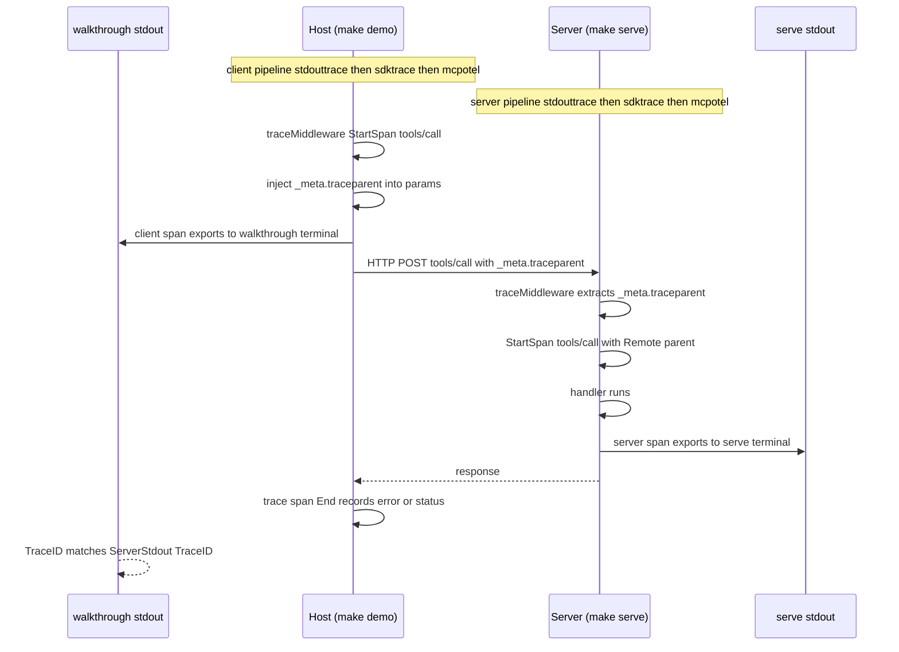

# examples/otel/stdout — SEP-414 Trace Context Propagation

Minimal demokit walkthrough showing how to wire OpenTelemetry tracing
into BOTH sides of an MCP exchange using the
[`ext/otel`](../../../ext/otel/) adapter — `server.WithTracerProvider`
on the server and `client.WithTracerProvider` on the walkthrough. Two
exporter modes:

- **`--exporter=stdout` (default).** Both processes use the
  `stdouttrace` exporter; each terminal prints its own side's spans
  as pretty-printed JSON. CI-friendly: no external stack required.
  Match TraceID across the two terminals to see SEP-414 stitching.

- **`--exporter=otlp`.** Both processes ship spans via OTLP gRPC to
  the `docker/observability/` stack (default endpoint
  `localhost:4317`). Spans land in Grafana, indexed by `service.name`
  (`otel-stdout-demo` for the server, `otel-stdout-host` for the
  walkthrough). Search by either name in Grafana → Explore → Tempo to
  see the stitched client→server trace in the UI.

The walkthrough makes a `tools/call`; the client trace middleware
stamps its own auto-generated `_meta.traceparent` on the outbound
params; the server picks it up as Parent. End result: matching
TraceID on both sides regardless of exporter mode.

## Quick Start

### Stdout mode — default (no infrastructure)

```
Terminal 1:  make serve         # server-side spans dump here
Terminal 2:  make demo          # client-side spans dump here
```

Keep both terminals visible. Match TraceID across them to see the
client→server stitch.

### OTLP mode (Grafana UI) — pass `EXPORTER=otlp`

```
Terminal 1:  make -C ../../../docker up           # bring observability stack up
Terminal 2:  make serve EXPORTER=otlp             # server → OTLP collector
Terminal 3:  make demo EXPORTER=otlp              # walkthrough → OTLP collector
Browser:     open http://localhost:3000           # Grafana → Explore → Tempo

# When done:
make -C ../../../docker down
```

In Grafana, search service `otel-stdout-host` or `otel-stdout-demo`
in the Tempo data source — both spans for one `tools/call` appear in
the same trace view, linked by parent-of.

## What it demonstrates

- **Symmetric wiring.** `server.WithTracerProvider(...)` in `main.go::serve()` and `client.WithTracerProvider(...)` in `walkthrough.go::runDemo()`. Each line is one call against the same `ext/otel.NewProvider` adapter — the in-tree implementation of `core.TracerProvider`.
- **Two processes, two pipelines, one trace.** Each side runs its own `stdouttrace`+`sdktrace` pipeline because they're separate OS processes. The SEP-414 `_meta.traceparent` plumbing carries trace identity across the wire so the two exporters record the *same* `TraceID`.
- **Every dispatch emits a span on BOTH sides.** `initialize`, `notifications/initialized`, `tools/list`, `tools/call` each produce a client-side span (on the walkthrough terminal) AND a server-side span (on the serve terminal). The walkthrough surfaces matching `TraceID`s on the `tools/call` step explicitly.
- **Client-side `_meta.traceparent` auto-injection (P3).** The walkthrough's tools/call carries no caller-supplied `_meta`. The client trace middleware starts a span, then stamps the new span's traceparent into outbound `params._meta.traceparent` via `core.InjectTraceContextIntoParams`. On the server side, the trace middleware extracts that `_meta.traceparent`; the adapter installs the OTel SpanContext as the new server-side span's parent (`Remote=true`). End result: matching TraceID across both spans, server's `Parent.SpanID` equals the client's `SpanID`.
- **Outbound context sync.** After `StartSpan`, the adapter re-attaches the *child* span's traceparent to ctx via `core.WithTraceContext`. SEP-414 P2's outbound `_meta` injection wraps read that ctx, so every server-to-client notification or sampling request carries the new child traceparent — a downstream MCP server stitches into the same trace.
- **Distinct instrumentation names.** The walkthrough's pipeline tags spans with `"github.com/panyam/mcpkit/client"`; the server's defaults to `"github.com/panyam/mcpkit/server"`. Observability backends group by emitting side.

## Architecture



## Where to look in the code

- `main.go::serve` — server-side wiring. Builds the OTel pipeline (stdouttrace → SDK TP), wraps with `mcpotel.NewProvider`, hands to `common.RunServer` via `server.WithTracerProvider`.
- `main.go::newOTelPipeline` — the one-shot helper that constructs the SDK TracerProvider with the stdout exporter and returns its shutdown closure. Reused by `walkthrough.go` for the client pipeline so both sides build their pipeline identically.
- `walkthrough.go::runDemo` — client-side wiring + the demokit script. Builds its own pipeline via the same `newOTelPipeline` helper and passes the adapter to `client.WithTracerProvider` with `WithInstrumentationName("github.com/panyam/mcpkit/client")` so observability backends group client vs server spans.
- `client/trace_middleware.go` (in main mcpkit) — the SEP-414 P3 middleware. Outbound `Client.Call` is wrapped in a span; outbound params gain `_meta.traceparent`; inbound server-to-client requests (sampling/elicitation/roots) get wrap spans whose parent is the inbound traceparent.
- `server/trace_middleware.go` (in main mcpkit) — the SEP-414 P2 middleware that consumes the adapter on the server side. Sits outermost so user middleware runs INSIDE the recorded span.
- `ext/otel/provider.go` (in the adapter module) — `Provider.StartSpan` is the hot-path: parses inbound `core.TraceContext` into an OTel SpanContext, calls `tracer.Start`, and re-attaches the child traceparent via `core.WithTraceContext` so the outbound `_meta` injection stamps the right ID downstream.

## Make targets

```
make demo      # run the walkthrough (TUI mode)
make note      # run the walkthrough in notebook mode
make serve     # start the server on :8080
make readme    # regenerate WALKTHROUGH.md
make build     # compile to ./otel-stdout-demo
make test      # run the e2e smoke test (uses an in-memory exporter)
```

## Beyond stdout

`mcpotel.NewProvider` accepts any `otel/trace.TracerProvider`. Swap the
`stdouttrace` exporter for OTLP, Jaeger, or anything else — the mcpkit
surface is unchanged. Polished walkthroughs for Jaeger and OTLP live in
SEP-414 P5 on [issue 312][issue].

[issue]: https://github.com/panyam/mcpkit/issues/312
