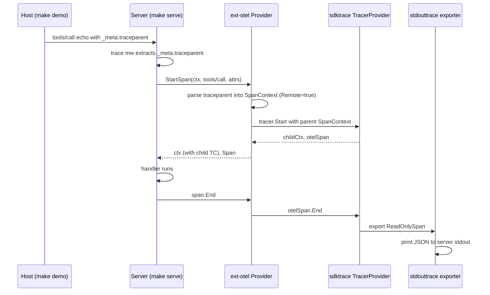

# examples/otel/stdout — SEP-414 Trace Context Propagation, exported to stdout

Minimal demokit walkthrough showing how to wire OpenTelemetry tracing
into a mcpkit server using the [`ext/otel`](../../../ext/otel/) adapter,
with the SDK's `stdouttrace` exporter so spans land as pretty-printed
JSON on the server's stdout — no collector infrastructure required.

The walkthrough sends a known W3C `_meta.traceparent` on a `tools/call`
so a reader can scroll back to the server terminal and see the same
trace ID appear as the exported span's `Parent`. That's the "yes, the
SEP-414 wire is actually propagating" check, end-to-end, in one
command.

## Quick Start

```
Terminal 1:  make serve         # OTel-instrumented server on :8080
Terminal 2:  make demo          # demokit walkthrough (--tui for TUI)
```

Keep both terminals visible. The walkthrough drives the host side; the
spans show up on the server side.

## What it demonstrates

- **Wiring.** `server.WithTracerProvider(mcpotel.NewProvider(otelTP))` — single line in `main.go::serve()`. Everything else is canonical `common.RunServer` boilerplate.
- **Every dispatch emits a span.** The walkthrough's `tools/list` step shows a parent-less span; the `tools/call` step shows a span with an explicit inbound parent.
- **In-band `_meta.traceparent` resolution.** The walkthrough sets `params._meta.traceparent` on the tools/call. The trace middleware extracts it; the adapter installs the OTel SpanContext as the new span's parent (`Remote=true`).
- **Outbound context sync.** After `StartSpan`, the adapter re-attaches the *child* span's traceparent to ctx via `core.WithTraceContext`. SEP-414 P2's outbound `_meta` injection wraps read that ctx, so every server-to-client notification or sampling request carries the new child traceparent — a downstream MCP server stitches into the same trace.

## Architecture



## Where to look in the code

- `main.go::serve` — the wiring. Builds the OTel pipeline (stdouttrace → SDK TP), wraps with `mcpotel.NewProvider`, hands to `common.RunServer` via `server.WithTracerProvider`.
- `main.go::newOTelPipeline` — the one-shot helper that constructs the SDK TracerProvider with the stdout exporter and returns its shutdown closure.
- `walkthrough.go::runDemo` — the demokit script. The interesting step is "tools/call echo — with explicit inbound `_meta.traceparent`": it sets the in-band traceparent and points the reader at the server terminal's exported span.
- `ext/otel/provider.go` (in the adapter module) — `Provider.StartSpan` is the hot-path: parses inbound `core.TraceContext` into an OTel SpanContext, calls `tracer.Start`, and re-attaches the child traceparent via `core.WithTraceContext` so SEP-414 P2's outbound `_meta` injection stamps the right ID downstream.
- `server/trace_middleware.go` (in main mcpkit) — the SEP-414 P2 middleware that consumes the adapter. Sits outermost so user middleware runs INSIDE the recorded span.

## Make targets

```
make demo      # run the walkthrough (TUI mode)
make note      # run the walkthrough in notebook mode
make serve     # start the server on :8080
make readme    # regenerate WALKTHROUGH.md
make build     # compile to ./otel-stdout-demo
make test      # run the e2e smoke test (uses an in-memory exporter)
```

## Beyond stdout

`mcpotel.NewProvider` accepts any `otel/trace.TracerProvider`. Swap the
`stdouttrace` exporter for OTLP, Jaeger, or anything else — the mcpkit
surface is unchanged. Polished walkthroughs for Jaeger and OTLP live in
SEP-414 P5 on [issue 312][issue].

[issue]: https://github.com/panyam/mcpkit/issues/312
