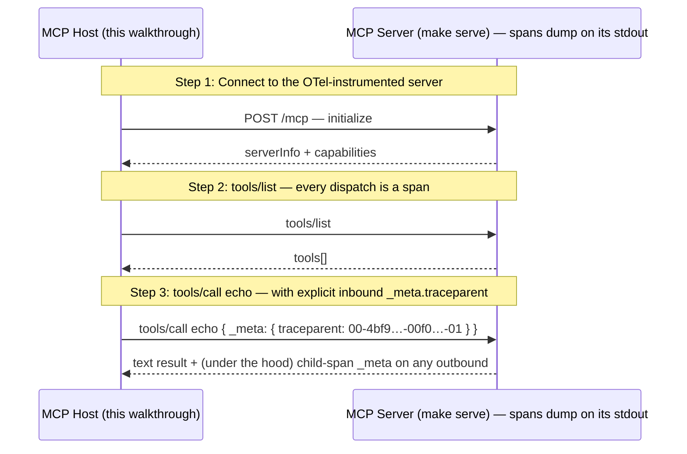

# MCP SEP-414 — OpenTelemetry Trace Context Propagation

Walks through SEP-414, which propagates W3C Trace Context through MCP using the `_meta.traceparent` / `_meta.tracestate` envelope (and, on streamable HTTP, the matching HTTP headers per SEP-2028). The server wires the new `ext/otel` adapter into `server.WithTracerProvider` so every JSON-RPC dispatch emits an OpenTelemetry span — exported as pretty-printed JSON on the server's stdout via the `stdouttrace` exporter. The walkthrough drives a real `tools/call` with a known inbound traceparent so a reader can see the inbound trace ID become the span's Parent on the server side.

## What you'll learn

- **Connect to the OTel-instrumented server** — `client.NewClient(...)` + `Connect()`. The handshake itself dispatches through the trace middleware on the server, so the *Server* terminal will print three spans during this walkthrough: `initialize`, `notifications/initialized`, and the `tools/call` from the next step. No client-side instrumentation is wired here — P3 (client-side spans) lives on a separate branch.
- **tools/list — every dispatch is a span** — The trace middleware sits OUTERMOST in the dispatch chain, so *every* JSON-RPC request emits a span — not just tools/call. This step doesn't pass an inbound traceparent, so the resulting span starts a fresh trace (no Parent). Compare the Server terminal's span for this list call with the next step's span: this one has no Parent; the next one does.
- **tools/call echo — with explicit inbound _meta.traceparent** — The Host sends `params._meta.traceparent=00-4bf92f3577b34da6a3ce929d0e0e4736-00f067aa0ba902b7-01` — the W3C-spec example trace ID, used here so the trace ID is visually recognizable. On the Server terminal, scroll to the `tools/call` span and look for two things:

## Flow



## Steps

### Setup

Start the MCP server in a separate terminal first:

```
Terminal 1:  make serve         # OTel-instrumented server on :8080
Terminal 2:  make demo          # this walkthrough (--tui for the interactive TUI)
```

Keep both terminals visible — the walkthrough surfaces what the *Host* sees on the wire (JSON-RPC results), while the OpenTelemetry spans land on the *Server* terminal's stdout via the `stdouttrace` exporter.

### Wire format

SEP-414 carries W3C Trace Context two ways:

- **In-band — `params._meta.traceparent` / `params._meta.tracestate`.** Authoritative; survives any transport.
- **Out-of-band — HTTP `traceparent` / `tracestate` headers.** Streamable HTTP transports bridge the headers into ctx per SEP-2028 so the server's trace middleware can fall back to them when `_meta` is absent. In-band always wins.

On the server side, `server.WithTracerProvider(tp)` installs an outermost trace middleware that extracts the inbound trace context, stamps `mcp.method` / `mcp.tool.name` / `mcp.session.id` attributes on a fresh span, and (P4) hands the child span back to the OpenTelemetry SDK so the exporter publishes it. Outbound notifications and server-to-client requests carry `_meta.traceparent` derived from the active span — a downstream MCP server receiving them stitches into the same trace.

### Step 1: Connect to the OTel-instrumented server

`client.NewClient(...)` + `Connect()`. The handshake itself dispatches through the trace middleware on the server, so the *Server* terminal will print three spans during this walkthrough: `initialize`, `notifications/initialized`, and the `tools/call` from the next step. No client-side instrumentation is wired here — P3 (client-side spans) lives on a separate branch.

### Step 2: tools/list — every dispatch is a span

The trace middleware sits OUTERMOST in the dispatch chain, so *every* JSON-RPC request emits a span — not just tools/call. This step doesn't pass an inbound traceparent, so the resulting span starts a fresh trace (no Parent). Compare the Server terminal's span for this list call with the next step's span: this one has no Parent; the next one does.

### Step 3: tools/call echo — with explicit inbound _meta.traceparent

The Host sends `params._meta.traceparent=00-4bf92f3577b34da6a3ce929d0e0e4736-00f067aa0ba902b7-01` — the W3C-spec example trace ID, used here so the trace ID is visually recognizable. On the Server terminal, scroll to the `tools/call` span and look for two things:

1. `SpanContext.TraceID` equals `4bf92f3577b34da6a3ce929d0e0e4736` — proves the inbound trace ID carried through.
2. `Parent.SpanID` equals `00f067aa0ba902b7` and `Parent.Remote == true` — proves the middleware recognized the in-band traceparent as a remote parent.

If you instead remove the `_meta` field from the call below, the span starts a fresh trace (no Parent), matching the previous step's tools/list behavior.

#### Reproduce on the wire

```bash
curl -s -X POST http://localhost:8080/mcp \
  -H 'Content-Type: application/json' \
  -H 'Accept: text/event-stream, application/json' \
  -H "Mcp-Session-Id: $SID" \
  -d '{"jsonrpc":"2.0","id":1,"method":"tools/call","params":{"name":"echo","arguments":{"message":"hello"},"_meta":{"traceparent":"00-4bf92f3577b34da6a3ce929d0e0e4736-00f067aa0ba902b7-01"}}}' | jq '.result'
```

### Where to look in the code

- `ext/otel/provider.go` — `Provider.StartSpan` is the adapter's single hot-path: parses inbound `core.TraceContext` into an OTel `SpanContext`, installs as the new span's parent, and after `tracer.Start` re-attaches the *child* span's traceparent via `core.WithTraceContext` so P2's outbound `_meta` injection stamps the right trace ID on downstream messages.
- `ext/otel/span.go` — narrows OTel's broader Span surface to mcpkit's three-method `core.Span` contract. CAS-guarded `End` prevents the SDK's noisy double-End warning.
- `ext/otel/propagation.go` — pure W3C ↔ OTel SpanContext conversions. `traceContextToSpanContext` validates structurally before installing; `spanContextToTraceContext` formats the new span back into the W3C version-00 string the wire expects.
- `server/trace_middleware.go` (in main mcpkit) — the SEP-414 P2 middleware that consumes the adapter. Sits outermost in the dispatch chain so user middleware runs INSIDE the span.
- `examples/otel/stdout/main.go` — the wiring: `server.WithTracerProvider(mcpotel.NewProvider(otelTP))` is the one new line in `serve()`. Everything else is canonical `common.RunServer` boilerplate.

## Run it

```bash
go run ./examples/otel/stdout/
```

Pass `--non-interactive` to skip pauses:

```bash
go run ./examples/otel/stdout/ --non-interactive
```
