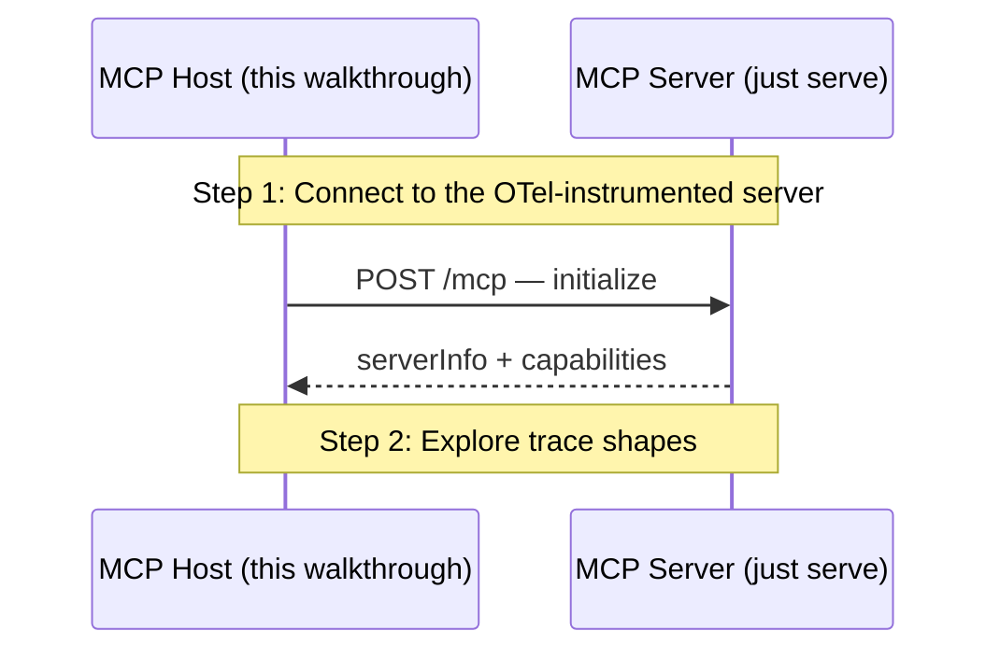

# MCP SEP-414 — OpenTelemetry Trace Context Propagation

Walks through SEP-414 in stdout-exporter mode (no external stack required). Both sides — server (`just serve`) and walkthrough (`just demo`) — print spans as pretty JSON on their respective terminals. The looping "Explore trace shapes" step lets you A/B four distinct tool calls; matching TraceIDs across the two terminals is the SEP-414 wire stitching client and server into a single distributed trace. Run with `EXPORTER=otlp` after `just -f docker/observability/justfile up` (from the repo root) to ship spans to Grafana instead.

## What you'll learn

- **Connect to the OTel-instrumented server** — `client.NewClient(...)` + `client.WithTracerProvider(...)` + `Connect()`. Each JSON-RPC dispatch emits a pair of spans — one on each side, stitched via `_meta.traceparent`. The initialize handshake produces the first pair before any tool call runs.
- **Explore trace shapes** — Pick a tool from the menu. Each one produces a distinct trace shape on the stdout exporters:

## Flow



## Steps

### Setup

Start the MCP server in a separate terminal first:

```
Terminal 1:  just serve         # OTel-instrumented server on :8080
Terminal 2:  just demo          # this walkthrough (--tui for the interactive TUI)
```

Keep both terminals visible — the walkthrough surfaces what the *Host* sees on the wire (JSON-RPC results); the OpenTelemetry spans land on the *Server* terminal's stdout via the `stdouttrace` exporter. Match the TraceID across the two terminals to see the SEP-414 stitch.

To send spans to a real backend instead, run with `EXPORTER=otlp` after `cd ../../../docker/observability && just up`.

### Wire format

SEP-414 carries W3C Trace Context two ways:

- **In-band — `params._meta.traceparent` / `params._meta.tracestate`.** Authoritative; survives any transport.
- **Out-of-band — HTTP `traceparent` / `tracestate` headers.** Streamable HTTP transports bridge the headers into ctx per SEP-2028 so the server's trace middleware can fall back to them when `_meta` is absent. In-band always wins.

On the server side, `server.WithTracerProvider(tp)` installs an outermost trace middleware that extracts the inbound trace context, stamps `mcp.method` / `mcp.tool.name` / `mcp.session.id` attributes on a fresh span, and (P4) hands the child span back to the OpenTelemetry SDK so the exporter publishes it. Outbound notifications and server-to-client requests carry `_meta.traceparent` derived from the active span — a downstream MCP server receiving them stitches into the same trace.

### Step 1: Connect to the OTel-instrumented server

`client.NewClient(...)` + `client.WithTracerProvider(...)` + `Connect()`. Each JSON-RPC dispatch emits a pair of spans — one on each side, stitched via `_meta.traceparent`. The initialize handshake produces the first pair before any tool call runs.

### Step 2: Explore trace shapes

Pick a tool from the menu. Each one produces a distinct trace shape on the stdout exporters:

- `echo` — baseline single span on each terminal.
- `slow_echo` — 750ms handler sleep; the span's StartTime → EndTime is visibly long.
- `failing_tool` — server span carries `mcp.tool.is_error="true"`.
- `count_tool` — server emits 3 `notifications/progress`, each as its own outbound span with `_meta.traceparent` set.
- `quit` — exit the loop.

After each call, match the TraceID printed on this terminal against the SERVER terminal — that match IS the SEP-414 client↔server stitching.

### Where to look in the code

- `examples/otel/stdout/main.go::registerDemoTools` — the four tools that drive distinct trace shapes (echo / slow_echo / failing_tool / count_tool).
- `examples/otel/stdout/walkthrough.go::runDemo` — the client-side wiring. `mcpotel.NewProvider(clientOTelTP, WithInstrumentationName(".../client"))` plugged into `client.WithTracerProvider`.
- `client/trace_middleware.go` (in main mcpkit) — the SEP-414 P3 middleware. Outbound `Client.Call` is wrapped in a span; outbound params gain `_meta.traceparent`; inbound server-to-client requests (sampling/elicitation/roots) extract the inbound traceparent and emit a wrap span.
- `ext/otel/provider.go` — `Provider.StartSpan` is the adapter's hot-path: parses inbound `core.TraceContext` into an OTel `SpanContext`, installs as the new span's parent, and re-attaches the child traceparent via `core.WithTraceContext` for outbound `_meta` injection.
- `ext/otel/tracerprovider.go` — `mcpotel.NewTracerProvider` (issue 674): one-line helper that bakes `service.name` into the SDK Resource via `WithServiceName` without examples having to import `sdk/resource` + `semconv` themselves.
- `server/trace_middleware.go` (in main mcpkit) — the SEP-414 P2 middleware. Sits outermost in the dispatch chain so user middleware runs INSIDE the span.

## Run it

```bash
go run ./examples/otel/stdout/
```

Pass `--non-interactive` to skip pauses:

```bash
go run ./examples/otel/stdout/ --non-interactive
```
