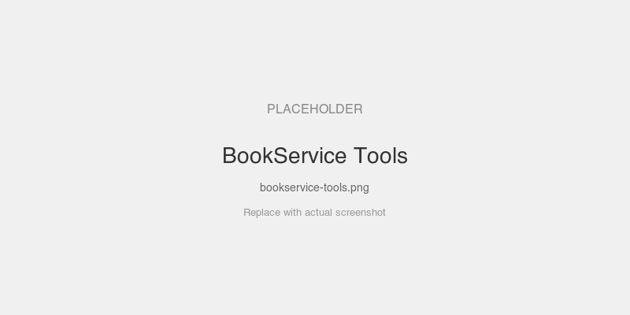

# BookService — protoc-gen-go-mcp Example

End-to-end example demonstrating all three MCP primitives generated from proto annotations.

## MCPKit Features Used

| Category | Feature |
|----------|---------|
| Core | `core.ToolContext`, `core.ResourceContext`, `core.PromptContext`, `core.CompletionRef` |
| Experimental | `experimental/ext/protogen` — `protoc-gen-go-mcp` code generator |
| MCP primitives | Tools, Resources (templates), Prompts, Completions, Sampling, Elicitation |
| Proto annotations | `mcp_tool`, `mcp_resource`, `mcp_prompt`, `mcp_service`, `mcp_sample`, `mcp_elicit` |

## What it shows

| Proto annotation | MCP primitive | Generated names |
|-----------------|---------------|-----------------|
| `mcp_tool` | Tool | `books_search` (with result summary + structured output) |
| `mcp_resource` | Resource template | `book://{book_id}`, `author://{author_id}/books` |
| `mcp_prompt` | Prompt | `books_summarize`, `books_recommend_books` |
| `mcp_service` | Namespace | All names prefixed with `books_` |

## Quick start

```bash
make generate   # Generate Go code from protos
make run        # Start MCP server on :8080
```

## Testing

```bash
go test -v .    # Run e2e tests (tool calls, resource reads, prompt listing)
```

## Prompts to try

- "Search for books about Go programming" — calls `books_search` tool
- "Tell me about book 1" — reads `book://{book_id}` resource
- "What books has author 1 written?" — reads `author://{author_id}/books` resource
- "Summarize the book collection" — uses `books_summarize` prompt
- "Recommend books for someone learning distributed systems" — uses `books_recommend_books` prompt

## Add to Claude Desktop

Add this to your `claude_desktop_config.json` (or VS Code MCP settings):

```json
{
  "mcpServers": {
    "bookservice": {
      "command": "go",
      "args": ["run", "."],
      "cwd": "/path/to/mcpkit/examples/protogen/bookservice",
      "transport": "streamable-http",
      "url": "http://localhost:8080/mcp"
    }
  }
}
```

Or if you've built the binary:

```json
{
  "mcpServers": {
    "bookservice": {
      "command": "/path/to/mcpkit/examples/protogen/bookservice/bin/bookservice",
      "transport": "streamable-http",
      "url": "http://localhost:8080/mcp"
    }
  }
}
```

## Screenshots

### Tools, resources, and prompts generated from proto annotations



### Search results for "Go programming"


## Add to Claude Code

```bash
claude mcp add bookservice --transport streamable-http http://localhost:8080/mcp
```

Or in `.claude/settings.json`:

```json
{
  "mcpServers": {
    "bookservice": {
      "type": "streamable-http",
      "url": "http://localhost:8080/mcp"
    }
  }
}
```
