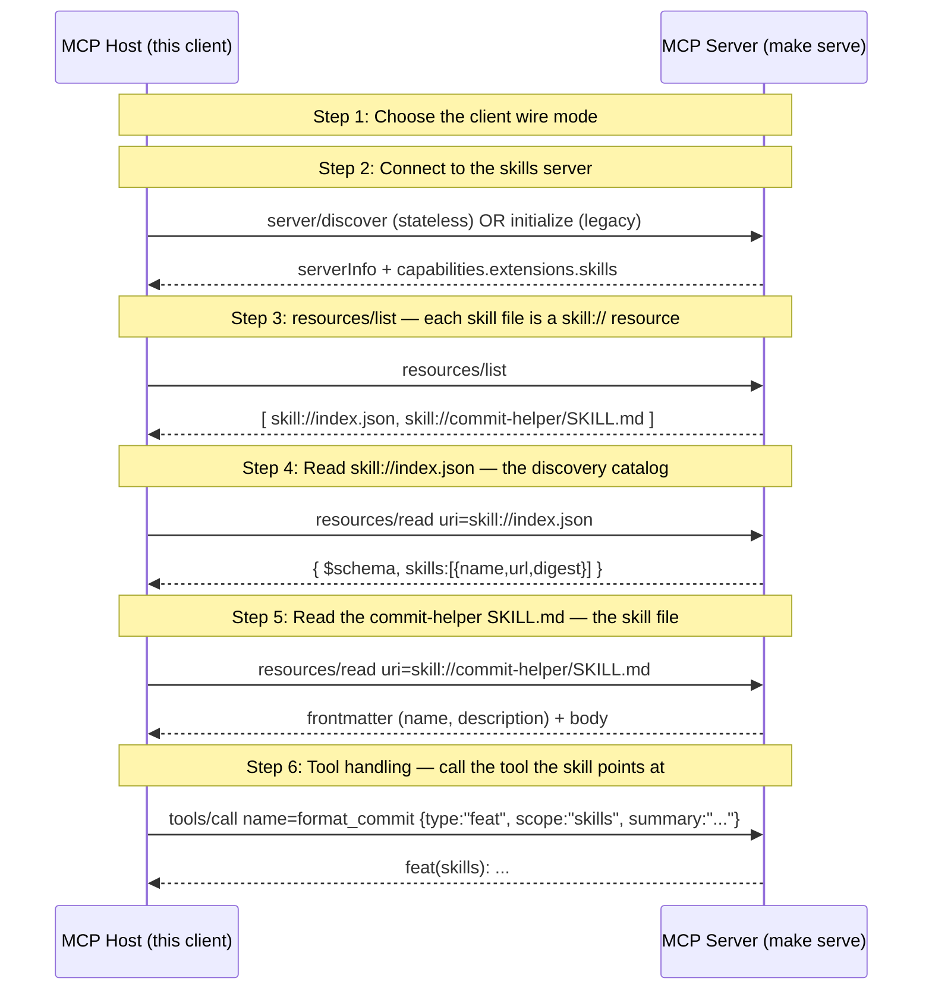

# MCP Skills — Minimal Shape (SEP-2640, scoped down)

The minimal SEP-2640 shape the WG blessed on 2026-06-30: a skills file served over MCP's Resources primitive plus tool handling, consumed load-on-demand. No archives, no remote sources, no fsnotify — those are the deferred / extended surface (see examples/skills for the full walkthrough).

## What you'll learn

- **Choose the client wire mode** — mcpkit's server defaults to dual-wire (SEP-2575): one URL answers both the legacy initialize handshake and the server/discover probe. The rest of the walkthrough is identical either way.
- **Read skill://index.json — the discovery catalog** — mcpkit generates index.json from the live provider catalog on each cache miss — it is not a file on disk. Each entry carries a SHA-256 digest over the skill's SKILL.md.
- **Read the commit-helper SKILL.md — the skill file** — A skill is data: markdown with YAML frontmatter. Its body tells the host which tool to call and how. mcpkit delivers it over resources/read — never staged to disk, never executed.
- **Tool handling — call the tool the skill points at** — This is the 'tool handling' half of the minimal shape. The skill guided the host to format_commit; the host calls it and returns the result. Skills make ordinary tools easier to use well — the pattern Paul Withers raised in-channel on 2026-07-01.

## Flow



## Steps

### Setup

```
Terminal 1:  make serve   # skills-core server, file mode, :8080
Terminal 2:  make demo    # this walkthrough (--tui interactive)
```

### What 'minimal' means

Serve each file under a skill directory as a `skill://` URI, enumerate them at `skill://index.json` with a SHA-256 digest, and let a skill's instructions point the host at a real tool. That is the whole blessed core: **skills file + tool handling**, consumed load-on-demand. Archives, remote sources, and fsnotify invalidation are deferred/extended and live in `examples/skills`.

### Step 1: Choose the client wire mode

mcpkit's server defaults to dual-wire (SEP-2575): one URL answers both the legacy initialize handshake and the server/discover probe. The rest of the walkthrough is identical either way.

### Step 2: Connect to the skills server

#### Reproduce

```go
c := client.NewClient(serverURL+"/mcp",
    core.ClientInfo{Name: "skills-core-host", Version: "1.0"},
    client.WithClientMode(wireMode),
)
if err := c.Connect(); err != nil { /* run: make serve */ }
```

### Step 3: resources/list — each skill file is a skill:// resource

### Step 4: Read skill://index.json — the discovery catalog

mcpkit generates index.json from the live provider catalog on each cache miss — it is not a file on disk. Each entry carries a SHA-256 digest over the skill's SKILL.md.

#### Reproduce

```go
body, _ := c.ReadResource(skills.IndexURI)
var idx skills.Index
json.Unmarshal([]byte(body), &idx)
for _, e := range idx.Skills {
    fmt.Printf("%s digest=%s\n", e.Name, e.Digest)
}
```

### Step 5: Read the commit-helper SKILL.md — the skill file

A skill is data: markdown with YAML frontmatter. Its body tells the host which tool to call and how. mcpkit delivers it over resources/read — never staged to disk, never executed.

### Step 6: Tool handling — call the tool the skill points at

This is the 'tool handling' half of the minimal shape. The skill guided the host to format_commit; the host calls it and returns the result. Skills make ordinary tools easier to use well — the pattern Paul Withers raised in-channel on 2026-07-01.

#### Reproduce

```go
out, _ := c.ToolCall("format_commit", map[string]any{
    "type": "feat", "scope": "skills", "summary": "add commit-helper skill",
})
```

## Run it

```bash
go run ./examples/skills/
```

Pass `--non-interactive` to skip pauses:

```bash
go run ./examples/skills/ --non-interactive
```
