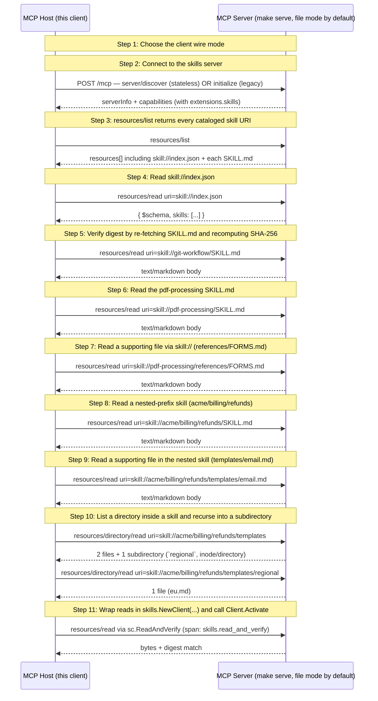

# MCP Skills Extension (SEP-2640) — Reference Walkthrough

SEP-2640 serves Agent Skills over MCP's Resources primitive: each file under a skill directory is a `skill://` URI; `skill://index.json` enumerates them with SHA-256 digests.

## What you'll learn

- **Choose the client wire mode** — Adaptive (default) probes server/discover and falls back to the initialize handshake on -32601. Stateless forces server/discover and errors if the server cannot answer. Legacy skips the probe and goes straight to initialize.
- **Connect to the skills server** — Construct the client with the chosen wire mode, then connect. After the call returns, inspect the new accessor to see which wire engaged. The curl chain below uses the legacy wire and mints a session id reused by every subsequent step; the stateless wire skips that — each call posts directly to /mcp with no Mcp-Session-Id header.
- **resources/list returns every cataloged skill URI** — In file mode the list has N entries per skill (one for SKILL.md, one per supporting file) plus the index. In archive mode it's one entry per skill plus the index.
- **Read skill://index.json** — The Indexer caches the result with a TTL and per-skill mtime invalidation. Repeated reads return the same bytes until something in a SKILL.md actually changes. The file is not on disk — mcpkit generates it from the live provider catalog on each cache miss.
- **Verify digest by re-fetching SKILL.md and recomputing SHA-256** — Treat the response bytes as the artifact, hash them, compare against the digest field from the index. A mismatch indicates corruption or tampering, and per the SEP the host MUST NOT use the content.
- **Read the pdf-processing SKILL.md** — This skill's frontmatter carries version and tags Extra fields. mcpkit surfaces those under ResourceDef.Annotations keyed by the io.modelcontextprotocol.skills/ reverse-domain prefix.
- **Read a supporting file via skill:// (references/FORMS.md)** — Relative reference resolution: references/FORMS.md from inside pdf-processing/SKILL.md resolves to this full URI via the SDK helper that walks the skill root.
- **Read a nested-prefix skill (acme/billing/refunds)** — Demonstrates that the prefix-segment routing works end-to-end. The skill name is refunds; the acme/billing/ prefix is server-chosen and is opaque to the skill's own frontmatter.
- **Read a supporting file in the nested skill (templates/email.md)** — Same relative-reference resolution as the pdf-processing example, this time across a multi-segment prefix.
- **List a directory inside a skill and recurse into a subdirectory** — Subdirectories surface with mimeType inode/directory; the client descends by issuing a second call. The SDK wraps this into a single call; the curl below shows both round trips explicitly.
- **Wrap reads in skills.NewClient(...) and call Client.Activate** — Activate is intra-process — no wire traffic. Run with `make serve EXPORTER=stdout` + `make demo EXPORTER=stdout` to see spans.

## Flow



## Steps

### Setup

```
Terminal 1:  make serve         # default (file mode, :8080)
             make serve-archive # one .tar.gz per skill
Terminal 2:  make demo          # this walkthrough (--tui interactive)
```

### URI shape

`skill://<path>/<file>`. Final path segment = the skill's frontmatter `name`. Prefix segments (e.g. `acme/billing/`) are an optional server-chosen namespace. Walkthrough exercises `git-workflow`, `pdf-processing`, and `acme/billing/refunds`.

### Capability declaration

Server advertises `io.modelcontextprotocol/skills` under `capabilities.extensions` (always `{}`, never an array). `Provider.RegisterWith(srv)` wires it automatically.

### Wire mode (SEP-2575 dual-wire)

mcpkit's server defaults to `ModeDual` — every URL serves both the legacy `initialize` handshake and the SEP-2575 `server/discover` probe. Pick which wire the client should use; the rest of the walkthrough works identically either way.

### Step 1: Choose the client wire mode

Adaptive (default) probes server/discover and falls back to the initialize handshake on -32601. Stateless forces server/discover and errors if the server cannot answer. Legacy skips the probe and goes straight to initialize.

### Step 2: Connect to the skills server

Construct the client with the chosen wire mode, then connect. After the call returns, inspect the new accessor to see which wire engaged. The curl chain below uses the legacy wire and mints a session id reused by every subsequent step; the stateless wire skips that — each call posts directly to /mcp with no Mcp-Session-Id header.

#### Reproduce on the wire

```bash
# Legacy wire: initialize handshake mints the session id for downstream steps.
SID=$(curl -s -X POST http://localhost:8080/mcp \
  -H 'Content-Type: application/json' -H 'Accept: application/json, text/event-stream' \
  -d '{"jsonrpc":"2.0","id":"i","method":"initialize","params":{"protocolVersion":"2025-11-25","clientInfo":{"name":"skills-host","version":"1.0"},"capabilities":{}}}' \
  -D - -o /dev/null | grep -i 'mcp-session-id' | awk '{print $2}' | tr -d '\r\n')
curl -s -X POST http://localhost:8080/mcp \
  -H 'Content-Type: application/json' -H 'Accept: application/json' \
  -H "Mcp-Session-Id: $SID" \
  -d '{"jsonrpc":"2.0","method":"notifications/initialized"}' >/dev/null
echo "SID=$SID"

# Stateless wire alternative — no session id, just probe server/discover:
#   curl -s -X POST http://localhost:8080/mcp \
#     -H 'Content-Type: application/json' -H 'Accept: application/json, text/event-stream' \
#     -d '{"jsonrpc":"2.0","id":"d","method":"server/discover","params":{}}' | jq '.result'
```

### Step 3: resources/list returns every cataloged skill URI

In file mode the list has N entries per skill (one for SKILL.md, one per supporting file) plus the index. In archive mode it's one entry per skill plus the index.

#### Reproduce on the wire

```bash
curl -s -X POST http://localhost:8080/mcp \
  -H 'Content-Type: application/json' -H 'Accept: application/json' \
  -H "Mcp-Session-Id: $SID" \
  -d '{"jsonrpc":"2.0","id":1,"method":"resources/list"}' | jq '.result.resources[] | "\(.uri)  [\(.mimeType)]"'
```

### Discovery index

`skill://index.json` enumerates skills with `{$schema, skills:[{type, name, description, url, digest}]}`. Optional in the SEP; mcpkit auto-registers unless `WithoutIndex()`.

### Step 4: Read skill://index.json

The Indexer caches the result with a TTL and per-skill mtime invalidation. Repeated reads return the same bytes until something in a SKILL.md actually changes. The file is not on disk — mcpkit generates it from the live provider catalog on each cache miss.

#### Reproduce on the wire

```bash
curl -s -X POST http://localhost:8080/mcp \
  -H 'Content-Type: application/json' -H 'Accept: application/json' \
  -H "Mcp-Session-Id: $SID" \
  -d '{"jsonrpc":"2.0","id":2,"method":"resources/read","params":{"uri":"skill://index.json"}}' \
  | jq -r '.result.contents[0].text' | jq '.'
```

### Digest contract

Each entry carries `sha256:{64hex}` over the raw artifact bytes (SKILL.md for skill-md, packed archive for archive). Hosts MUST verify before use.

### Step 5: Verify digest by re-fetching SKILL.md and recomputing SHA-256

Treat the response bytes as the artifact, hash them, compare against the digest field from the index. A mismatch indicates corruption or tampering, and per the SEP the host MUST NOT use the content.

#### Reproduce on the wire

```bash
# Re-read the SKILL.md, recompute sha256, compare against the index entry's digest.
WANT=$(curl -s -X POST http://localhost:8080/mcp \
  -H 'Content-Type: application/json' -H 'Accept: application/json' -H "Mcp-Session-Id: $SID" \
  -d '{"jsonrpc":"2.0","id":3,"method":"resources/read","params":{"uri":"skill://index.json"}}' \
  | jq -r '.result.contents[0].text' \
  | jq -r '.skills[] | select(.url=="skill://git-workflow/SKILL.md") | .digest')
GOT="sha256:$(curl -s -X POST http://localhost:8080/mcp \
  -H 'Content-Type: application/json' -H 'Accept: application/json' -H "Mcp-Session-Id: $SID" \
  -d '{"jsonrpc":"2.0","id":4,"method":"resources/read","params":{"uri":"skill://git-workflow/SKILL.md"}}' \
  | jq -r '.result.contents[0].text' | shasum -a 256 | awk '{print $1}')"
[ "$WANT" = "$GOT" ] && echo "verified" || echo "MISMATCH"
```

### Reading skill files

Manifest body may reference supporting files via relative paths. `skills.ResolveRelative(skillRoot, ref)` resolves them filesystem-style; `..` escapes are rejected.

### Step 6: Read the pdf-processing SKILL.md

This skill's frontmatter carries version and tags Extra fields. mcpkit surfaces those under ResourceDef.Annotations keyed by the io.modelcontextprotocol.skills/ reverse-domain prefix.

#### Reproduce on the wire

```bash
curl -s -X POST http://localhost:8080/mcp \
  -H 'Content-Type: application/json' -H 'Accept: application/json' \
  -H "Mcp-Session-Id: $SID" \
  -d '{"jsonrpc":"2.0","id":5,"method":"resources/read","params":{"uri":"skill://pdf-processing/SKILL.md"}}' \
  | jq -r '.result.contents[0].text'
```

### Step 7: Read a supporting file via skill:// (references/FORMS.md)

Relative reference resolution: references/FORMS.md from inside pdf-processing/SKILL.md resolves to this full URI via the SDK helper that walks the skill root.

#### Reproduce on the wire

```bash
curl -s -X POST http://localhost:8080/mcp \
  -H 'Content-Type: application/json' -H 'Accept: application/json' \
  -H "Mcp-Session-Id: $SID" \
  -d '{"jsonrpc":"2.0","id":6,"method":"resources/read","params":{"uri":"skill://pdf-processing/references/FORMS.md"}}' \
  | jq -r '.result.contents[0].text'
```

### Step 8: Read a nested-prefix skill (acme/billing/refunds)

Demonstrates that the prefix-segment routing works end-to-end. The skill name is refunds; the acme/billing/ prefix is server-chosen and is opaque to the skill's own frontmatter.

#### Reproduce on the wire

```bash
curl -s -X POST http://localhost:8080/mcp \
  -H 'Content-Type: application/json' -H 'Accept: application/json' \
  -H "Mcp-Session-Id: $SID" \
  -d '{"jsonrpc":"2.0","id":7,"method":"resources/read","params":{"uri":"skill://acme/billing/refunds/SKILL.md"}}' \
  | jq -r '.result.contents[0].text'
```

### Step 9: Read a supporting file in the nested skill (templates/email.md)

Same relative-reference resolution as the pdf-processing example, this time across a multi-segment prefix.

#### Reproduce on the wire

```bash
curl -s -X POST http://localhost:8080/mcp \
  -H 'Content-Type: application/json' -H 'Accept: application/json' \
  -H "Mcp-Session-Id: $SID" \
  -d '{"jsonrpc":"2.0","id":8,"method":"resources/read","params":{"uri":"skill://acme/billing/refunds/templates/email.md"}}' \
  | jq -r '.result.contents[0].text'
```

### SEP-2640 directoryRead — scoped subtree navigation

SEP commit `2e04c48d` (2026-06-09) added `resources/directory/read` for listing a directory's direct children without enumerating the server's entire resource space. Capability-gated via `io.modelcontextprotocol/skills.directoryRead`. mcpkit's Provider auto-supports it (#781).

### Step 10: List a directory inside a skill and recurse into a subdirectory

Subdirectories surface with mimeType inode/directory; the client descends by issuing a second call. The SDK wraps this into a single call; the curl below shows both round trips explicitly.

#### Reproduce on the wire

```bash
# Level 1: list the templates/ subtree of the refunds skill.
curl -s -X POST http://localhost:8080/mcp \
  -H 'Content-Type: application/json' -H 'Accept: application/json' \
  -H "Mcp-Session-Id: $SID" \
  -d '{"jsonrpc":"2.0","id":9,"method":"resources/directory/read","params":{"uri":"skill://acme/billing/refunds/templates"}}' \
  | jq '.result.resources[] | {uri, mimeType}'

# Level 2: descend into the regional/ subdirectory the first call returned.
curl -s -X POST http://localhost:8080/mcp \
  -H 'Content-Type: application/json' -H 'Accept: application/json' \
  -H "Mcp-Session-Id: $SID" \
  -d '{"jsonrpc":"2.0","id":10,"method":"resources/directory/read","params":{"uri":"skill://acme/billing/refunds/templates/regional"}}' \
  | jq '.result.resources[] | {uri, mimeType}'
```

### SEP-414 P7 — Skills observability

Fetch ≠ activation. Server `resources/read` spans now carry `mcp.skill.*` attrs (#748). Client `ext/skills.Client` emits `skills.read*` spans + `Activate(ctx, uri)` for post-cache use the wire can't see (SDK-only — no spec change).

### Step 11: Wrap reads in skills.NewClient(...) and call Client.Activate

Activate is intra-process — no wire traffic. Run with `make serve EXPORTER=stdout` + `make demo EXPORTER=stdout` to see spans.

### Wrap-up

Negotiated extension, enumerated index, verified one digest, read manifest + supporting files across single-segment and nested-prefix paths, emitted skill-shape spans + an activation event. `make serve-archive` flips the wire to one `.tar.gz` per skill — host code unchanged.

## Run it

```bash
go run ./examples/skills/
```

Pass `--non-interactive` to skip pauses:

```bash
go run ./examples/skills/ --non-interactive
```
