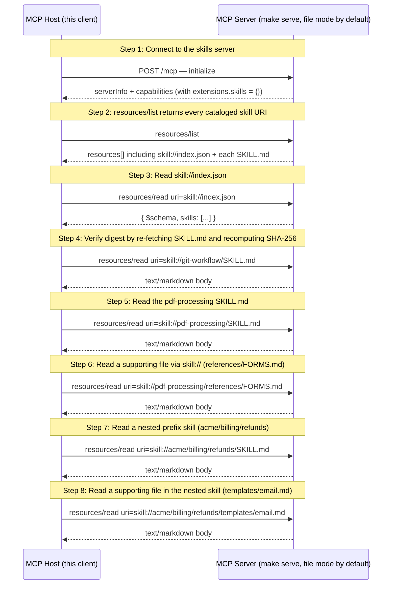

# MCP Skills Extension (SEP-2640) — Reference Walkthrough

Walks through SEP-2640, which serves Agent Skills over MCP using the existing Resources primitive. Each file in a skill directory is exposed as a `skill://` resource, the server declares the `io.modelcontextprotocol/skills` capability in `initialize`, and the well-known `skill://index.json` resource enumerates concrete skills with SHA-256 digests. mcpkit's `ext/skills.SkillProvider` walks an `io/fs.FS` once at construction and registers each file with the configured Provider.

## What you'll learn

- **Connect to the skills server** — `client.NewClient(...)` + `Connect()`. The server side wired the extension automatically via `Provider.RegisterWith`.
- **resources/list returns every cataloged skill URI** — In file mode the list has N entries per skill (one for SKILL.md, one for each supporting file) plus the index. In archive mode it's one entry per skill plus the index.
- **Read skill://index.json** — The Indexer caches the result with TTL + per-skill mtime invalidation. Repeated reads return the same bytes until something in a SKILL.md actually changes.
- **Verify digest by re-fetching SKILL.md and recomputing SHA-256** — Treat the response bytes as the artifact, hash them, and compare against the digest field from the index. A mismatch indicates corruption or tampering and per the SEP the host MUST NOT use the content.
- **Read the pdf-processing SKILL.md** — This skill's frontmatter has `version` and `tags` Extra fields. mcpkit surfaces those under `ResourceDef.Annotations` keyed by `io.modelcontextprotocol.skills/`.
- **Read a supporting file via skill:// (references/FORMS.md)** — Relative reference `references/FORMS.md` from within pdf-processing/SKILL.md resolves to this full URI via `skills.ResolveRelative(skillRoot, "references/FORMS.md")`.
- **Read a nested-prefix skill (acme/billing/refunds)** — Demonstrates that the prefix-segment routing works end-to-end. The skill's `name` is `refunds`; the prefix `acme/billing/` is server-chosen.
- **Read a supporting file in the nested skill (templates/email.md)** — Same relative-reference resolution: `templates/email.md` from refunds/SKILL.md.

## Flow



## Steps

### Setup

Start the MCP server in a separate terminal first:

```
Terminal 1:  make serve         # skills server on :8080 in file mode
Terminal 2:  make demo          # this walkthrough (--tui for the interactive TUI)
```

The default fixture under `skills/` walks three SEP-2640 examples: a single-segment skill (`git-workflow`), a single-segment skill with supporting files (`pdf-processing`), and a nested-prefix skill (`acme/billing/refunds`).

Two alternative server modes flip the wire shape:

```
make serve-archive   # publishes each skill as one .tar.gz resource
make serve-zip       # publishes each skill as one .zip resource
```

In archive mode `resources/list` returns one URI per skill (e.g. `skill://pdf-processing.tar.gz`) instead of N URIs per file. The post-unpack virtual namespace hosts observe is identical either way — that's the SEP's whole-skill atomic-delivery story.

Optional: `make fetch-docx` clones the [`anthropics/skills`](https://github.com/anthropics/skills) repo and stages the `docx` skill into the `skills/` fixture directory before you start the server. It's a multi-file real-world skill that exercises the supporting-file paths beyond the toy fixtures.

### The skill:// URI scheme

SEP-2640 defines `skill://<skill-path>/<file-path>` where `<skill-path>` is a `/`-separated path locating the skill directory and `<file-path>` is the file within it. The final segment of `<skill-path>` MUST equal the skill's `name` frontmatter field. Prefix segments (anything before that final segment) are an optional server-chosen organizational namespace.

Examples from the SEP table that this walkthrough exercises:

| Skill path             | File                  | URI                                              |
| ---------------------- | --------------------- | ------------------------------------------------ |
| `git-workflow`         | `SKILL.md`            | `skill://git-workflow/SKILL.md`                  |
| `pdf-processing`       | `references/FORMS.md` | `skill://pdf-processing/references/FORMS.md`     |
| `acme/billing/refunds` | `SKILL.md`            | `skill://acme/billing/refunds/SKILL.md`          |

The `acme/billing/refunds` shape demonstrates the prefix-segment behavior: `acme/billing` is the prefix and `refunds` is the skill name. The walkthrough reads files from each shape to confirm the routing is uniform.

### Capability declaration

Per SEP-2640's Capability Declaration section, a server advertises `io.modelcontextprotocol/skills` under `capabilities.extensions` in its `initialize` response. The value is the empty object `{}` — never an array. mcpkit's `ext/skills.SkillsExtension{}` plus `Provider.RegisterWith(srv)` handles this automatically; nothing else to wire on the server side.

### Step 1: Connect to the skills server

`client.NewClient(...)` + `Connect()`. The server side wired the extension automatically via `Provider.RegisterWith`.

### Step 2: resources/list returns every cataloged skill URI

In file mode the list has N entries per skill (one for SKILL.md, one for each supporting file) plus the index. In archive mode it's one entry per skill plus the index.

### The discovery index

`skill://index.json` is the well-known enumeration resource. It's optional in the SEP (servers MAY decline to expose it) but mcpkit auto-registers it unless `WithoutIndex()` is supplied. The index has a fixed JSON shape: a `$schema` URI pinning the index version and a `skills[]` array where each entry has `type` (`skill-md`, `archive`, or `mcp-resource-template`), `description`, `url`, plus (for `skill-md` and `archive` entries) `name` and `digest`.

### Step 3: Read skill://index.json

The Indexer caches the result with TTL + per-skill mtime invalidation. Repeated reads return the same bytes until something in a SKILL.md actually changes.

### The digest contract

Per SEP-2640's Integrity and Verification section, each `skill-md` and `archive` entry carries a `sha256:{64-lowercase-hex}` digest computed over the artifact's raw bytes. For `skill-md` entries the artifact is the SKILL.md file itself; for `archive` entries it's the packed archive bytes. Hosts MUST verify retrieved content against this digest before using it. The walkthrough does exactly that for the `git-workflow` skill.

### Step 4: Verify digest by re-fetching SKILL.md and recomputing SHA-256

Treat the response bytes as the artifact, hash them, and compare against the digest field from the index. A mismatch indicates corruption or tampering and per the SEP the host MUST NOT use the content.

### Reading skill files

Once a host has loaded a SKILL.md, the skill's body may reference supporting files via relative paths. mcpkit's `ext/skills.ResolveRelative(skillRoot, ref)` resolves these against the skill's root URI per SEP-2640's Reading section (filesystem-style resolution, escapes via `..` rejected). The walkthrough exercises both forms: the manifest, and a supporting file deep in the skill tree.

### Step 5: Read the pdf-processing SKILL.md

This skill's frontmatter has `version` and `tags` Extra fields. mcpkit surfaces those under `ResourceDef.Annotations` keyed by `io.modelcontextprotocol.skills/`.

### Step 6: Read a supporting file via skill:// (references/FORMS.md)

Relative reference `references/FORMS.md` from within pdf-processing/SKILL.md resolves to this full URI via `skills.ResolveRelative(skillRoot, "references/FORMS.md")`.

### Step 7: Read a nested-prefix skill (acme/billing/refunds)

Demonstrates that the prefix-segment routing works end-to-end. The skill's `name` is `refunds`; the prefix `acme/billing/` is server-chosen.

### Step 8: Read a supporting file in the nested skill (templates/email.md)

Same relative-reference resolution: `templates/email.md` from refunds/SKILL.md.

### Wrap-up

The host has now:

- Negotiated the skills extension via the standard `initialize` handshake.
- Enumerated every skill the server publishes by reading `skill://index.json` once.
- Verified one artifact's bytes against its SHA-256 digest, satisfying the SEP MUST.
- Read SKILL.md plus supporting files across single-segment and nested-prefix skill paths.

To switch the same walkthrough into archive mode, restart the server with `make serve-archive`. The host code stays exactly the same; the wire-level shape switches to one `.tar.gz` resource per skill, and the digest in the index covers the packed archive bytes instead of the SKILL.md alone.

## Run it

```bash
go run ./examples/skills/
```

Pass `--non-interactive` to skip pauses:

```bash
go run ./examples/skills/ --non-interactive
```
