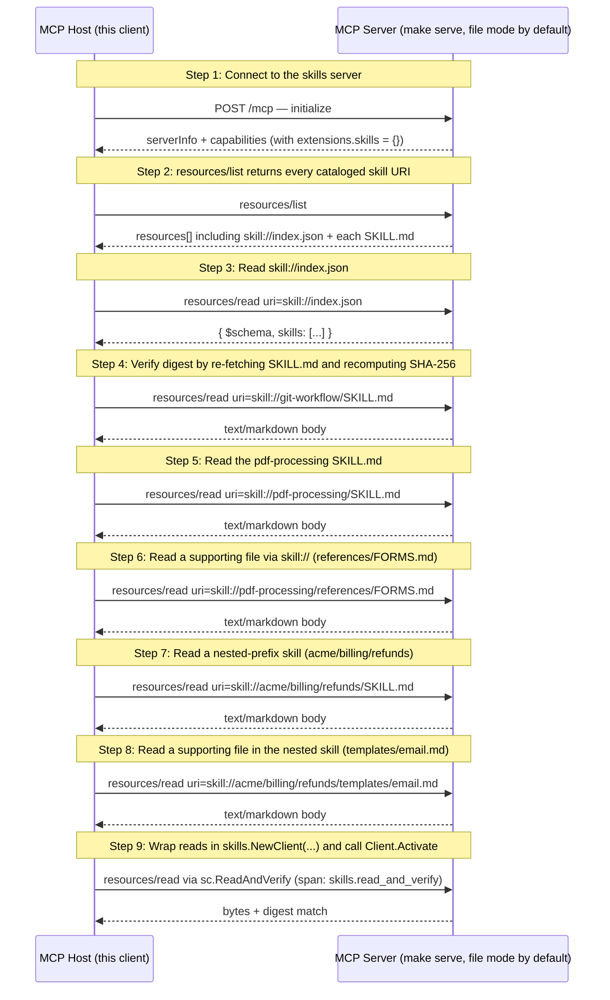

# MCP Skills Extension (SEP-2640) — Reference Walkthrough

SEP-2640 serves Agent Skills over MCP's Resources primitive: each file under a skill directory is a `skill://` URI; `skill://index.json` enumerates them with SHA-256 digests.

## What you'll learn

- **Connect to the skills server** — `client.NewClient(...)` + `Connect()`. The server side wired the extension automatically via `Provider.RegisterWith`.
- **resources/list returns every cataloged skill URI** — In file mode the list has N entries per skill (one for SKILL.md, one for each supporting file) plus the index. In archive mode it's one entry per skill plus the index.
- **Read skill://index.json** — The Indexer caches the result with TTL + per-skill mtime invalidation. Repeated reads return the same bytes until something in a SKILL.md actually changes.
- **Verify digest by re-fetching SKILL.md and recomputing SHA-256** — Treat the response bytes as the artifact, hash them, and compare against the digest field from the index. A mismatch indicates corruption or tampering and per the SEP the host MUST NOT use the content.
- **Read the pdf-processing SKILL.md** — This skill's frontmatter has `version` and `tags` Extra fields. mcpkit surfaces those under `ResourceDef.Annotations` keyed by `io.modelcontextprotocol.skills/`.
- **Read a supporting file via skill:// (references/FORMS.md)** — Relative reference `references/FORMS.md` from within pdf-processing/SKILL.md resolves to this full URI via `skills.ResolveRelative(skillRoot, "references/FORMS.md")`.
- **Read a nested-prefix skill (acme/billing/refunds)** — Demonstrates that the prefix-segment routing works end-to-end. The skill's `name` is `refunds`; the prefix `acme/billing/` is server-chosen.
- **Read a supporting file in the nested skill (templates/email.md)** — Same relative-reference resolution: `templates/email.md` from refunds/SKILL.md.
- **Wrap reads in skills.NewClient(...) and call Client.Activate** — Activate is intra-process — no wire traffic. Run with `make serve EXPORTER=stdout` + `make demo EXPORTER=stdout` to see spans.

## Flow



## Steps

### Setup

```
Terminal 1:  make serve         # default (file mode, :8080)
             make serve-archive # one .tar.gz per skill
Terminal 2:  make demo          # this walkthrough (--tui interactive)
```

### URI shape

`skill://<path>/<file>`. Final path segment = the skill's frontmatter `name`. Prefix segments (e.g. `acme/billing/`) are an optional server-chosen namespace. Walkthrough exercises `git-workflow`, `pdf-processing`, and `acme/billing/refunds`.

### Capability declaration

Server advertises `io.modelcontextprotocol/skills` under `capabilities.extensions` (always `{}`, never an array). `Provider.RegisterWith(srv)` wires it automatically.

### Step 1: Connect to the skills server

`client.NewClient(...)` + `Connect()`. The server side wired the extension automatically via `Provider.RegisterWith`.

### Step 2: resources/list returns every cataloged skill URI

In file mode the list has N entries per skill (one for SKILL.md, one for each supporting file) plus the index. In archive mode it's one entry per skill plus the index.

### Discovery index

`skill://index.json` enumerates skills with `{$schema, skills:[{type, name, description, url, digest}]}`. Optional in the SEP; mcpkit auto-registers unless `WithoutIndex()`.

### Step 3: Read skill://index.json

The Indexer caches the result with TTL + per-skill mtime invalidation. Repeated reads return the same bytes until something in a SKILL.md actually changes.

### Digest contract

Each entry carries `sha256:{64hex}` over the raw artifact bytes (SKILL.md for skill-md, packed archive for archive). Hosts MUST verify before use.

### Step 4: Verify digest by re-fetching SKILL.md and recomputing SHA-256

Treat the response bytes as the artifact, hash them, and compare against the digest field from the index. A mismatch indicates corruption or tampering and per the SEP the host MUST NOT use the content.

### Reading skill files

Manifest body may reference supporting files via relative paths. `skills.ResolveRelative(skillRoot, ref)` resolves them filesystem-style; `..` escapes are rejected.

### Step 5: Read the pdf-processing SKILL.md

This skill's frontmatter has `version` and `tags` Extra fields. mcpkit surfaces those under `ResourceDef.Annotations` keyed by `io.modelcontextprotocol.skills/`.

### Step 6: Read a supporting file via skill:// (references/FORMS.md)

Relative reference `references/FORMS.md` from within pdf-processing/SKILL.md resolves to this full URI via `skills.ResolveRelative(skillRoot, "references/FORMS.md")`.

### Step 7: Read a nested-prefix skill (acme/billing/refunds)

Demonstrates that the prefix-segment routing works end-to-end. The skill's `name` is `refunds`; the prefix `acme/billing/` is server-chosen.

### Step 8: Read a supporting file in the nested skill (templates/email.md)

Same relative-reference resolution: `templates/email.md` from refunds/SKILL.md.

### SEP-414 P7 — Skills observability

Fetch ≠ activation. Server `resources/read` spans now carry `mcp.skill.*` attrs (#748). Client `ext/skills.Client` emits `skills.read*` spans + `Activate(ctx, uri)` for post-cache use the wire can't see (SDK-only — no spec change).

### Step 9: Wrap reads in skills.NewClient(...) and call Client.Activate

Activate is intra-process — no wire traffic. Run with `make serve EXPORTER=stdout` + `make demo EXPORTER=stdout` to see spans.

### Wrap-up

Negotiated extension, enumerated index, verified one digest, read manifest + supporting files across single-segment and nested-prefix paths, emitted skill-shape spans + an activation event. `make serve-archive` flips the wire to one `.tar.gz` per skill — host code unchanged.

## Run it

```bash
go run ./examples/skills/
```

Pass `--non-interactive` to skip pauses:

```bash
go run ./examples/skills/ --non-interactive
```
