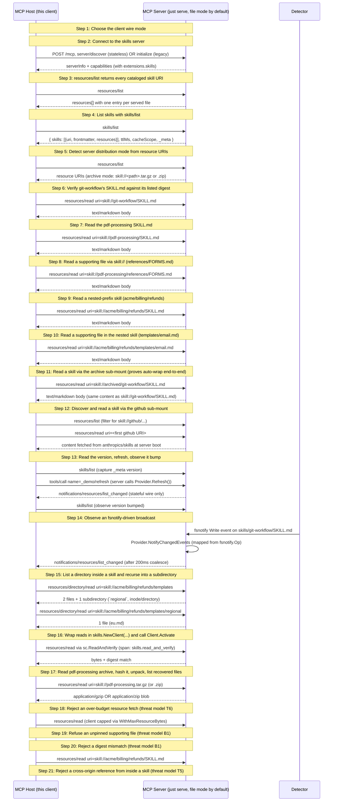

# MCP Skills extension (SEP-2640), the reference walkthrough

SEP-2640 serves Agent Skills over MCP's Resources primitive: each file under a skill directory is a `skill://` URI. The `skills/list` and `skills/get` methods enumerate skills, and each entry pins every file of its skill with a SHA-256 digest and a byte size.

## What you'll learn

- **Choose the client wire mode** - Adaptive (default) probes server/discover and falls back to the initialize handshake on -32601. Stateless forces server/discover and errors if the server cannot answer. Legacy skips the probe and goes straight to initialize.
- **Connect to the skills server** - Construct the client with the chosen wire mode, then connect. After the call returns, inspect the new accessor to see which wire engaged. The curl chain below uses the legacy wire and mints a session id reused by every subsequent step; the stateless wire skips that, and each call posts directly to /mcp with no Mcp-Session-Id header.
- **resources/list returns every cataloged skill URI** - In file mode the list has one entry per file: each SKILL.md plus each supporting file. In archive mode it has one entry per skill, the packed archive. This list is plain MCP resources. SEP-2640 discovery happens through skills/list in the next section.
- **List skills with skills/list** - ListSkillEntries follows nextCursor until the listing ends. mcpkit returns everything in one page by default, and WithSkillsListPageSize turns paging on. The Indexer builds entries from the live provider catalog and caches them with a TTL and per-skill mtime invalidation. The listing carries a ttlMs cache hint, one minute unless the server sets another. An empty or partial listing does not prove the server lacks a skill. A host holding a skill URI from elsewhere calls skills/get for it.
- **Detect server distribution mode from resource URIs** - In file mode every served resource is one file, and the host reads SKILL.md and each supporting file individually. In archive mode each skill is one resource whose URI ends in .tar.gz or .zip, and the host fetches it and unpacks it in-process. A Provider serves one mode at a time, so the first archive URI decides.
- **Verify git-workflow's SKILL.md against its listed digest** - Take the SKILL.md digest from the entry's resources array, read the file, hash the bytes, and compare. A mismatch indicates corruption or tampering, and per the SEP the host MUST NOT use the content. This step does the arithmetic by hand. ReadFromEntry runs the same check plus the size and frontmatter checks in one call. Archive mode serves no per-file SKILL.md, so the step skips there.
- **Read the pdf-processing SKILL.md** - This skill's frontmatter carries version and tags Extra fields. mcpkit surfaces those under ResourceDef.Annotations keyed by the io.modelcontextprotocol.skills/ reverse-domain prefix.
- **Read a supporting file via skill:// (references/FORMS.md)** - Relative reference resolution: references/FORMS.md from inside pdf-processing/SKILL.md resolves to this full URI via the SDK helper that walks the skill root.
- **Read a nested-prefix skill (acme/billing/refunds)** - Demonstrates that the prefix-segment routing works end-to-end. The skill name is refunds; the acme/billing/ prefix is server-chosen and is opaque to the skill's own frontmatter.
- **Read a supporting file in the nested skill (templates/email.md)** - Same relative-reference resolution as the pdf-processing example, this time across a multi-segment prefix.
- **Read a skill via the archive sub-mount (proves auto-wrap end-to-end)** - `just serve` packs the bundled `git-workflow` skill into a tempfile tar.gz and mounts it under the `archived/` sub-mount. `OpenArchive` auto-wraps the archive's root-level SKILL.md under `git-workflow/` (matching the frontmatter name), so the served URI is `skill://archived/git-workflow/SKILL.md`. Bytes match the local copy: same skill, different transport. Recompute the digest if you want to verify.
- **Discover and read a skill via the github sub-mount** - Robust against changes in the upstream repo: instead of hardcoding a github URI, we enumerate `resources/list`, pick the first entry under the `github/` prefix, and read it. Proves the entire FetchGitHubArchive → MountFS sub-mount → resources/read chain. The server reaches out to GitHub at boot, the bytes flow through the same MCP wire as everything else.
- **Read the version, refresh, observe it bump** - The version lives in the skills/list result's `_meta` under the reverse-domain key `io.modelcontextprotocol.skills/version` (skills.MetaKeyVersion), matching mcpkit's convention for extension metadata. Subscribed stateful clients get the push notification. Stateless clients see the same change by listing again and comparing the version.
- **Observe an fsnotify-driven broadcast** - In `--non-interactive` mode this step synthesizes the edit (writes the same SKILL.md back to itself) and restores the original content; the actual broadcast still fires. In interactive mode it prompts you to edit a SKILL.md in a side terminal, and the notification arrives as soon as your editor flushes the save.
- **List a directory inside a skill and recurse into a subdirectory** - Subdirectories surface with mimeType inode/directory; the client descends by issuing a second call. The SDK wraps this into a single call; the curl below shows both round trips explicitly.
- **Wrap reads in skills.NewClient(...) and call Client.Activate** - Activate is intra-process, with no wire traffic. Run with `just serve EXPORTER=stdout` + `just demo EXPORTER=stdout` to see spans.
- **Read pdf-processing archive, hash it, unpack, list recovered files** - Only meaningful in archive mode. In file mode the step prints the detected mode and exits. See the per-file read steps above for the equivalent file-mode story.
- **Reject an over-budget resource fetch (threat model T6)** - A host bounds how many bytes a skill read may pull before decoding, so a hostile or runaway server can't exhaust it. mcpkit puts the bound at the fetch layer; an over-cap read fails with ErrResourceTooLarge before the body is decoded. Anchor: threat model T6 · experimental-ext-skills#831 · issue 867.
- **Refuse an unpinned supporting file (threat model B1)** - ReadFromEntry only reads files the entry's resources manifest lists. The manifest is complete, so a URI absent from it is a file the skill does not contain, whether an attacker's extra file or a typo, and is refused with ErrURINotInResources rather than read unverified. Anchor: threat model B1 · issue 866.
- **Reject a digest mismatch (threat model B1)** - If a server returns bytes that don't match the pinned digest, through corruption or tampering, ReadAndVerify returns ErrDigestMismatch and the host MUST NOT use the content. Here the mismatch is forced by verifying against a deliberately wrong pin; `just security` proves the same rejection with a real post-listing on-disk swap. Anchor: threat model B1.
- **Reject a cross-origin reference from inside a skill (threat model T5)** - SEP-2640 privileges no scheme, so ParseURI accepts a skill served as github:// or anything else. The threat model's adv-file-url, a skill steering the host into reading a local file, is stopped at resolution instead: ResolveRelative refuses any reference that carries its own scheme or authority, so file:///etc/passwd written inside a skill fails with ErrRelativeEscapesSkill before anything is fetched. Anchor: threat model T5 (adv-file-url).

## Flow


```mermaid
sequenceDiagram
    participant Host as MCP Host (this client)
    participant Server as MCP Server (just serve, file mode by default)

    Note over Host,Server: Step 1: Choose the client wire mode

    Note over Host,Server: Step 2: Connect to the skills server
    Host->>Server: POST /mcp, server/discover (stateless) OR initialize (legacy)
    Server-->>Host: serverInfo + capabilities (with extensions.skills)

    Note over Host,Server: Step 3: resources/list returns every cataloged skill URI
    Host->>Server: resources/list
    Server-->>Host: resources[] with one entry per served file

    Note over Host,Server: Step 4: List skills with skills/list
    Host->>Server: skills/list
    Server-->>Host: { skills: [{uri, frontmatter, resources}], ttlMs, cacheScope, _meta }

    Note over Host,Server: Step 5: Detect server distribution mode from resource URIs
    Host->>Server: resources/list
    Server-->>Host: resource URIs (archive mode: skill://<path>.tar.gz or .zip)

    Note over Host,Server: Step 6: Verify git-workflow's SKILL.md against its listed digest
    Host->>Server: resources/read uri=skill://git-workflow/SKILL.md
    Server-->>Host: text/markdown body

    Note over Host,Server: Step 7: Read the pdf-processing SKILL.md
    Host->>Server: resources/read uri=skill://pdf-processing/SKILL.md
    Server-->>Host: text/markdown body

    Note over Host,Server: Step 8: Read a supporting file via skill:// (references/FORMS.md)
    Host->>Server: resources/read uri=skill://pdf-processing/references/FORMS.md
    Server-->>Host: text/markdown body

    Note over Host,Server: Step 9: Read a nested-prefix skill (acme/billing/refunds)
    Host->>Server: resources/read uri=skill://acme/billing/refunds/SKILL.md
    Server-->>Host: text/markdown body

    Note over Host,Server: Step 10: Read a supporting file in the nested skill (templates/email.md)
    Host->>Server: resources/read uri=skill://acme/billing/refunds/templates/email.md
    Server-->>Host: text/markdown body

    Note over Host,Server: Step 11: Read a skill via the archive sub-mount (proves auto-wrap end-to-end)
    Host->>Server: resources/read uri=skill://archived/git-workflow/SKILL.md
    Server-->>Host: text/markdown body (same content as skill://git-workflow/SKILL.md)

    Note over Host,Server: Step 12: Discover and read a skill via the github sub-mount
    Host->>Server: resources/list (filter for skill://github/...)
    Host->>Server: resources/read uri=<first github URI>
    Server-->>Host: content fetched from anthropics/skills at server boot

    Note over Host,Server: Step 13: Read the version, refresh, observe it bump
    Host->>Server: skills/list (capture _meta version)
    Host->>Server: tools/call name=_demo/refresh (server calls Provider.Refresh())
    Server-->>Host: notifications/resources/list_changed (stateful wire only)
    Host->>Server: skills/list (observe version bumped)

    Note over Host,Server: Step 14: Observe an fsnotify-driven broadcast
    Detector->>Server: fsnotify Write event on skills/git-workflow/SKILL.md
    Server->>Server: Provider.NotifyChangedEvents (mapped from fsnotify.Op)
    Server-->>Host: notifications/resources/list_changed (after 200ms coalesce)

    Note over Host,Server: Step 15: List a directory inside a skill and recurse into a subdirectory
    Host->>Server: resources/directory/read uri=skill://acme/billing/refunds/templates
    Server-->>Host: 2 files + 1 subdirectory (`regional`, inode/directory)
    Host->>Server: resources/directory/read uri=skill://acme/billing/refunds/templates/regional
    Server-->>Host: 1 file (eu.md)

    Note over Host,Server: Step 16: Wrap reads in skills.NewClient(...) and call Client.Activate
    Host->>Server: resources/read via sc.ReadAndVerify (span: skills.read_and_verify)
    Server-->>Host: bytes + digest match

    Note over Host,Server: Step 17: Read pdf-processing archive, hash it, unpack, list recovered files
    Host->>Server: resources/read uri=skill://pdf-processing.tar.gz (or .zip)
    Server-->>Host: application/gzip OR application/zip blob

    Note over Host,Server: Step 18: Reject an over-budget resource fetch (threat model T6)
    Host->>Server: resources/read (client capped via WithMaxResourceBytes)

    Note over Host,Server: Step 19: Refuse an unpinned supporting file (threat model B1)

    Note over Host,Server: Step 20: Reject a digest mismatch (threat model B1)
    Host->>Server: resources/read uri=skill://acme/billing/refunds/SKILL.md

    Note over Host,Server: Step 21: Reject a cross-origin reference from inside a skill (threat model T5)
```

## Steps

### Setup

```
Terminal 1:  just serve         # default (file mode, :8080)
             just serve-archive # one .tar.gz per skill
             just serve-zip     # one .zip per skill
Terminal 2:  just demo          # this walkthrough (--tui interactive)
```
This walkthrough auto-detects which of the three distribution modes the server is serving. The mode-aware section near the bottom shows the archive read-and-unpack flow; the file-mode read steps in the middle SKIP cleanly when archive mode is in effect (and vice versa).

### URI shape

`skill://<path>/<file>`. Final path segment = the skill's frontmatter `name`. Prefix segments (e.g. `acme/billing/`) are an optional server-chosen namespace. Walkthrough exercises `git-workflow`, `pdf-processing`, and `acme/billing/refunds`.

### Capability declaration

Server advertises `io.modelcontextprotocol/skills` under `capabilities.extensions` (always `{}`, never an array). `Provider.RegisterWith(srv)` wires it automatically.

### Wire mode (SEP-2575 dual-wire)

mcpkit's server defaults to `ModeDual`, so every URL serves both the legacy `initialize` handshake and the SEP-2575 `server/discover` probe. Pick which wire the client should use; the rest of the walkthrough works identically either way.

### Step 1: Choose the client wire mode

Adaptive (default) probes server/discover and falls back to the initialize handshake on -32601. Stateless forces server/discover and errors if the server cannot answer. Legacy skips the probe and goes straight to initialize.

### Step 2: Connect to the skills server

Construct the client with the chosen wire mode, then connect. After the call returns, inspect the new accessor to see which wire engaged. The curl chain below uses the legacy wire and mints a session id reused by every subsequent step; the stateless wire skips that, and each call posts directly to /mcp with no Mcp-Session-Id header.

#### Reproduce on the wire

```bash
# Legacy wire: initialize handshake mints the session id for downstream steps.
SID=$(curl -s -X POST http://localhost:8080/mcp \
  -H 'Content-Type: application/json' -H 'Accept: application/json, text/event-stream' \
  -d '{"jsonrpc":"2.0","id":"i","method":"initialize","params":{"protocolVersion":"2025-11-25","clientInfo":{"name":"skills-host","version":"1.0"},"capabilities":{}}}' \
  -D - -o /dev/null | grep -i 'mcp-session-id' | awk '{print $2}' | tr -d '\r\n')
curl -s -X POST http://localhost:8080/mcp \
  -H 'Content-Type: application/json' -H 'Accept: application/json' \
  -H "Mcp-Session-Id: $SID" \
  -d '{"jsonrpc":"2.0","method":"notifications/initialized"}' >/dev/null
echo "SID=$SID"

# Stateless wire alternative: no session id, just probe server/discover:
#   curl -s -X POST http://localhost:8080/mcp \
#     -H 'Content-Type: application/json' -H 'Accept: application/json, text/event-stream' \
#     -d '{"jsonrpc":"2.0","id":"d","method":"server/discover","params":{}}' | jq '.result'
```

### Step 3: resources/list returns every cataloged skill URI

In file mode the list has one entry per file: each SKILL.md plus each supporting file. In archive mode it has one entry per skill, the packed archive. This list is plain MCP resources. SEP-2640 discovery happens through skills/list in the next section.

#### Reproduce on the wire

```bash
curl -s -X POST http://localhost:8080/mcp \
  -H 'Content-Type: application/json' -H 'Accept: application/json' \
  -H "Mcp-Session-Id: $SID" \
  -d '{"jsonrpc":"2.0","id":1,"method":"resources/list"}' | jq '.result.resources[] | "\(.uri)  [\(.mimeType)]"'
```

### Skill discovery

`skills/list` enumerates skills as `{skills:[{uri, frontmatter, resources:[{uri, digest, size}]}], nextCursor, ttlMs, cacheScope, _meta}`. `uri` names the skill's SKILL.md. `frontmatter` is the SKILL.md frontmatter carried verbatim. `resources` lists every file of the skill, SKILL.md included, or is the string `"dynamic"` when the server generates content at read time. `skills/get` takes `{uri}` and returns one entry as `{skill:{...}}`. Declaring the extension commits a server to both methods, and `Provider.RegisterWith(srv)` wires them.

### Step 4: List skills with skills/list

ListSkillEntries follows nextCursor until the listing ends. mcpkit returns everything in one page by default, and WithSkillsListPageSize turns paging on. The Indexer builds entries from the live provider catalog and caches them with a TTL and per-skill mtime invalidation. The listing carries a ttlMs cache hint, one minute unless the server sets another. An empty or partial listing does not prove the server lacks a skill. A host holding a skill URI from elsewhere calls skills/get for it.

#### Reproduce on the wire

```bash
curl -s -X POST http://localhost:8080/mcp \
  -H 'Content-Type: application/json' -H 'Accept: application/json' \
  -H "Mcp-Session-Id: $SID" \
  -d '{"jsonrpc":"2.0","id":2,"method":"skills/list","params":{}}' \
  | jq '.result.skills[] | {uri, name: .frontmatter.name, files: [.resources[]?.uri]}'

# One skill by its SKILL.md URI:
#   -d '{"jsonrpc":"2.0","id":2,"method":"skills/get","params":{"uri":"skill://git-workflow/SKILL.md"}}'
#   | jq '.result.skill'
```

### Distribution mode

mcpkit can serve each skill as individual files or as one packed archive per skill (`.tar.gz` or `.zip`). The 2026-08-21 SEP revision dropped the entry `type` field and deferred archives to an appendix, so a `skills/list` entry no longer says which shape the server uses. The walkthrough sniffs the served resource URIs once and threads the result through the remaining steps, which keeps the file-mode and archive-mode paths apart.

### Step 5: Detect server distribution mode from resource URIs

In file mode every served resource is one file, and the host reads SKILL.md and each supporting file individually. In archive mode each skill is one resource whose URI ends in .tar.gz or .zip, and the host fetches it and unpacks it in-process. A Provider serves one mode at a time, so the first archive URI decides.

#### Reproduce on the wire

```bash
# Archive suffixes among the served URIs. Empty output means file mode.
curl -s -X POST http://localhost:8080/mcp \
  -H 'Content-Type: application/json' -H 'Accept: application/json' \
  -H "Mcp-Session-Id: $SID" \
  -d '{"jsonrpc":"2.0","id":11,"method":"resources/list"}' \
  | jq -r '[.result.resources[].uri | capture("(?<s>\\.tar\\.gz|\\.zip)$") | .s] | unique | join(",")'
```

### Digest contract

Each entry's `resources` array pins every file of the skill as `{uri, digest, size}`. `digest` is `sha256:{64hex}` over the file's raw bytes and `size` is its length in bytes. Hosts MUST verify both before use.

### Step 6: Verify git-workflow's SKILL.md against its listed digest

Take the SKILL.md digest from the entry's resources array, read the file, hash the bytes, and compare. A mismatch indicates corruption or tampering, and per the SEP the host MUST NOT use the content. This step does the arithmetic by hand. ReadFromEntry runs the same check plus the size and frontmatter checks in one call. Archive mode serves no per-file SKILL.md, so the step skips there.

#### Reproduce on the wire

```bash
# Take the pinned digest from skills/list, re-read SKILL.md, recompute sha256, compare.
WANT=$(curl -s -X POST http://localhost:8080/mcp \
  -H 'Content-Type: application/json' -H 'Accept: application/json' -H "Mcp-Session-Id: $SID" \
  -d '{"jsonrpc":"2.0","id":3,"method":"skills/list","params":{}}' \
  | jq -r '.result.skills[].resources[]? | select(.uri=="skill://git-workflow/SKILL.md") | .digest')
GOT="sha256:$(curl -s -X POST http://localhost:8080/mcp \
  -H 'Content-Type: application/json' -H 'Accept: application/json' -H "Mcp-Session-Id: $SID" \
  -d '{"jsonrpc":"2.0","id":4,"method":"resources/read","params":{"uri":"skill://git-workflow/SKILL.md"}}' \
  | jq -j '.result.contents[0].text' | shasum -a 256 | awk '{print $1}')"
[ "$WANT" = "$GOT" ] && echo "verified" || echo "MISMATCH"
```

### Reading skill files

Manifest body may reference supporting files via relative paths. `skills.ResolveRelative(skillRoot, ref)` resolves them filesystem-style; `..` escapes are rejected.

### Step 7: Read the pdf-processing SKILL.md

This skill's frontmatter carries version and tags Extra fields. mcpkit surfaces those under ResourceDef.Annotations keyed by the io.modelcontextprotocol.skills/ reverse-domain prefix.

#### Reproduce on the wire

```bash
curl -s -X POST http://localhost:8080/mcp \
  -H 'Content-Type: application/json' -H 'Accept: application/json' \
  -H "Mcp-Session-Id: $SID" \
  -d '{"jsonrpc":"2.0","id":5,"method":"resources/read","params":{"uri":"skill://pdf-processing/SKILL.md"}}' \
  | jq -r '.result.contents[0].text'
```

### Step 8: Read a supporting file via skill:// (references/FORMS.md)

Relative reference resolution: references/FORMS.md from inside pdf-processing/SKILL.md resolves to this full URI via the SDK helper that walks the skill root.

#### Reproduce on the wire

```bash
curl -s -X POST http://localhost:8080/mcp \
  -H 'Content-Type: application/json' -H 'Accept: application/json' \
  -H "Mcp-Session-Id: $SID" \
  -d '{"jsonrpc":"2.0","id":6,"method":"resources/read","params":{"uri":"skill://pdf-processing/references/FORMS.md"}}' \
  | jq -r '.result.contents[0].text'
```

### Step 9: Read a nested-prefix skill (acme/billing/refunds)

Demonstrates that the prefix-segment routing works end-to-end. The skill name is refunds; the acme/billing/ prefix is server-chosen and is opaque to the skill's own frontmatter.

#### Reproduce on the wire

```bash
curl -s -X POST http://localhost:8080/mcp \
  -H 'Content-Type: application/json' -H 'Accept: application/json' \
  -H "Mcp-Session-Id: $SID" \
  -d '{"jsonrpc":"2.0","id":7,"method":"resources/read","params":{"uri":"skill://acme/billing/refunds/SKILL.md"}}' \
  | jq -r '.result.contents[0].text'
```

### Step 10: Read a supporting file in the nested skill (templates/email.md)

Same relative-reference resolution as the pdf-processing example, this time across a multi-segment prefix.

#### Reproduce on the wire

```bash
curl -s -X POST http://localhost:8080/mcp \
  -H 'Content-Type: application/json' -H 'Accept: application/json' \
  -H "Mcp-Session-Id: $SID" \
  -d '{"jsonrpc":"2.0","id":8,"method":"resources/read","params":{"uri":"skill://acme/billing/refunds/templates/email.md"}}' \
  | jq -r '.result.contents[0].text'
```

### Cross-source reads (issues #797 + #808)

`just serve` composes multiple sources into one catalog via `fsutil.NewMountFS`: bundled local skills at the FS root + an `archived/` sub-mount (a `.tar.gz` packed from one bundled skill, auto-wrapped by frontmatter name) + a `github/` sub-mount (fetched from anthropics/skills). The previous read steps exercised the local layer. These two steps probe the sub-mounts so the cross-source story is visible in the demo, not just in resource counts. Both steps gracefully skip when running against `--source=dir` (no sub-mounts present).

### Step 11: Read a skill via the archive sub-mount (proves auto-wrap end-to-end)

`just serve` packs the bundled `git-workflow` skill into a tempfile tar.gz and mounts it under the `archived/` sub-mount. `OpenArchive` auto-wraps the archive's root-level SKILL.md under `git-workflow/` (matching the frontmatter name), so the served URI is `skill://archived/git-workflow/SKILL.md`. Bytes match the local copy: same skill, different transport. Recompute the digest if you want to verify.

#### Reproduce on the wire

```bash
curl -s -X POST http://localhost:8080/mcp \
  -H 'Content-Type: application/json' -H 'Accept: application/json' \
  -H "Mcp-Session-Id: $SID" \
  -d '{"jsonrpc":"2.0","id":15,"method":"resources/read","params":{"uri":"skill://archived/git-workflow/SKILL.md"}}' \
  | jq -r '.result.contents[0].text'
```

### Step 12: Discover and read a skill via the github sub-mount

Robust against changes in the upstream repo: instead of hardcoding a github URI, we enumerate `resources/list`, pick the first entry under the `github/` prefix, and read it. Proves the entire FetchGitHubArchive → MountFS sub-mount → resources/read chain. The server reaches out to GitHub at boot, the bytes flow through the same MCP wire as everything else.

#### Reproduce on the wire

```bash
# Find the first github URI in the catalog.
GH=$(curl -s -X POST http://localhost:8080/mcp \
  -H 'Content-Type: application/json' -H 'Accept: application/json' \
  -H "Mcp-Session-Id: $SID" \
  -d '{"jsonrpc":"2.0","id":16,"method":"resources/list"}' \
  | jq -r '.result.resources[].uri' | grep '^skill://github/' | head -1)
echo "$GH"
# Read it.
curl -s -X POST http://localhost:8080/mcp \
  -H 'Content-Type: application/json' -H 'Accept: application/json' \
  -H "Mcp-Session-Id: $SID" \
  -d "{\"jsonrpc\":\"2.0\",\"id\":17,\"method\":\"resources/read\",\"params\":{\"uri\":\"$GH\"}}" \
  | jq -r '.result.contents[0].text' | head -20
```

### Push-based invalidation (issue #795)

Every `skills/list` result carries `_meta["io.modelcontextprotocol.skills/version"]`, a monotonic counter the server bumps whenever skill content changes. The counter is mcpkit metadata, not a SEP field. Stateful clients also receive `notifications/resources/list_changed` when the bump happens. Stateless clients have no push channel, so they call `skills/list` again and compare the counter. The listing's `ttlMs` says how long a listing may be cached, which is a separate question from whether it changed. Detectors that drive the bump (fsnotify, webhook, manual sweep) are pluggable. This walkthrough uses a demo-only `_demo/refresh` tool that calls `Provider.Refresh()` directly.

### Step 13: Read the version, refresh, observe it bump

The version lives in the skills/list result's `_meta` under the reverse-domain key `io.modelcontextprotocol.skills/version` (skills.MetaKeyVersion), matching mcpkit's convention for extension metadata. Subscribed stateful clients get the push notification. Stateless clients see the same change by listing again and comparing the version.

#### Reproduce on the wire

```bash
# Read once, capture version.
V1=$(curl -s -X POST http://localhost:8080/mcp \
  -H 'Content-Type: application/json' -H 'Accept: application/json' \
  -H "Mcp-Session-Id: $SID" \
  -d '{"jsonrpc":"2.0","id":20,"method":"skills/list","params":{}}' \
  | jq -r '.result._meta["io.modelcontextprotocol.skills/version"]')

# Refresh.
curl -s -X POST http://localhost:8080/mcp \
  -H 'Content-Type: application/json' -H 'Accept: application/json' \
  -H "Mcp-Session-Id: $SID" \
  -d '{"jsonrpc":"2.0","id":21,"method":"tools/call","params":{"name":"_demo/refresh","arguments":{}}}' \
  | jq -r '.result.content[0].text'

# Read again, observe bump.
V2=$(curl -s -X POST http://localhost:8080/mcp \
  -H 'Content-Type: application/json' -H 'Accept: application/json' \
  -H "Mcp-Session-Id: $SID" \
  -d '{"jsonrpc":"2.0","id":22,"method":"skills/list","params":{}}' \
  | jq -r '.result._meta["io.modelcontextprotocol.skills/version"]')

echo "before=$V1 after=$V2"
```

### fsnotify-driven invalidation (issue #800)

The previous step called `Provider.Refresh()` synchronously via the demo tool. Real deployments wire a Detector (fsnotify, webhook, or admin endpoint) that observes file changes and calls into the Applier on its own. `just serve` with `--watch` enables `skills.WithFSWatcher` + a 200ms coalesce window. Edit any file under `skills/` in another terminal and the server emits one `notifications/resources/list_changed` per logical change.

### Step 14: Observe an fsnotify-driven broadcast

In `--non-interactive` mode this step synthesizes the edit (writes the same SKILL.md back to itself) and restores the original content; the actual broadcast still fires. In interactive mode it prompts you to edit a SKILL.md in a side terminal, and the notification arrives as soon as your editor flushes the save.

#### Reproduce on the wire

```bash
# In one terminal:
just serve  # opt-in fsnotify:
            # (edit Makefile to add --watch to the serve target, or run directly:)
            # go run . --serve --watch

# In another terminal: subscribe + listen.
SID=$(curl -s -X POST http://localhost:8080/mcp \
  -H 'Content-Type: application/json' -H 'Accept: application/json, text/event-stream' \
  -d '{"jsonrpc":"2.0","id":"i","method":"initialize","params":{"protocolVersion":"2025-11-25","clientInfo":{"name":"watcher","version":"1.0"},"capabilities":{}}}' \
  -D - -o /dev/null | grep -i 'mcp-session-id' | awk '{print $2}' | tr -d '\r\n')
curl -s -N http://localhost:8080/mcp -H "Mcp-Session-Id: $SID" -H 'Accept: text/event-stream' &

# Edit a SKILL.md and watch the SSE stream emit list_changed within 200ms.
echo "---" >> skills/git-workflow/SKILL.md
```

### SEP-2640 directoryRead and scoped subtree navigation

SEP commit `2e04c48d` (2026-06-09) added `resources/directory/read` for listing a directory's direct children without enumerating the server's entire resource space. Capability-gated via `io.modelcontextprotocol/skills.directoryRead`. mcpkit's Provider auto-supports it (#781).

### Step 15: List a directory inside a skill and recurse into a subdirectory

Subdirectories surface with mimeType inode/directory; the client descends by issuing a second call. The SDK wraps this into a single call; the curl below shows both round trips explicitly.

#### Reproduce on the wire

```bash
# Level 1: list the templates/ subtree of the refunds skill.
curl -s -X POST http://localhost:8080/mcp \
  -H 'Content-Type: application/json' -H 'Accept: application/json' \
  -H "Mcp-Session-Id: $SID" \
  -d '{"jsonrpc":"2.0","id":9,"method":"resources/directory/read","params":{"uri":"skill://acme/billing/refunds/templates"}}' \
  | jq '.result.resources[] | {uri, mimeType}'

# Level 2: descend into the regional/ subdirectory the first call returned.
curl -s -X POST http://localhost:8080/mcp \
  -H 'Content-Type: application/json' -H 'Accept: application/json' \
  -H "Mcp-Session-Id: $SID" \
  -d '{"jsonrpc":"2.0","id":10,"method":"resources/directory/read","params":{"uri":"skill://acme/billing/refunds/templates/regional"}}' \
  | jq '.result.resources[] | {uri, mimeType}'
```

### SEP-414 P7 skills observability

Fetch ≠ activation. Server `resources/read` spans now carry `mcp.skill.*` attrs (#748). Client `ext/skills.Client` emits `skills.read*` spans + `Activate(ctx, uri)` for post-cache use the wire can't see (SDK-only, no spec change).

### Step 16: Wrap reads in skills.NewClient(...) and call Client.Activate

Activate is intra-process, with no wire traffic. Run with `just serve EXPORTER=stdout` + `just demo EXPORTER=stdout` to see spans.

### Archive mode, atomic delivery plus in-process unpack

In archive mode every skill is delivered as a single `.tar.gz` or `.zip` resource. No `skills/list` entry pins the archive, because the 2026-08-21 SEP revision deferred archives to an appendix. The host hashes the archive bytes for the record, then unpacks in-memory to recover the post-unpack virtual namespace, the same files the file-mode wire would have served piecemeal. Demonstrates pdf-processing (multi-file skill) because the unpacked listing actually shows something.

### Step 17: Read pdf-processing archive, hash it, unpack, list recovered files

Only meaningful in archive mode. In file mode the step prints the detected mode and exits. See the per-file read steps above for the equivalent file-mode story.

#### Reproduce on the wire

```bash
# Fetch the archive blob (base64-encoded under .contents[0].blob in archive mode).
curl -s -X POST http://localhost:8080/mcp \
  -H 'Content-Type: application/json' -H 'Accept: application/json' \
  -H "Mcp-Session-Id: $SID" \
  -d '{"jsonrpc":"2.0","id":12,"method":"resources/read","params":{"uri":"skill://pdf-processing.tar.gz"}}' \
  | jq -r '.result.contents[0].blob' | base64 -d > /tmp/pdf.tgz

# Verify and list:
shasum -a 256 /tmp/pdf.tgz                 # no listing entry pins the archive
tar -tzf /tmp/pdf.tgz                      # recovered file tree
```

### Threat-model defenses

The digest contract above is one of several host-side guards SEP-2640's Security Implications and the merged threat model require. These steps exercise the rejections directly against the running server: an over-budget fetch, an unpinned supporting file, a digest mismatch, and a cross-origin scheme. The standalone `just security` harness proves the same set against an in-process server, including a real post-listing on-disk tamper this two-terminal walkthrough can't stage.

### Step 18: Reject an over-budget resource fetch (threat model T6)

A host bounds how many bytes a skill read may pull before decoding, so a hostile or runaway server can't exhaust it. mcpkit puts the bound at the fetch layer; an over-cap read fails with ErrResourceTooLarge before the body is decoded. Anchor: threat model T6 · experimental-ext-skills#831 · issue 867.

#### Reproduce in Go

```go
sc := skills.NewClient(c)
entries, _ := sc.ListSkillEntries(ctx.Ctx)
e, _ := findManifestEntry(entries, uriRefundsManifest)
full, _ := sc.ReadFromEntry(ctx.Ctx, e, e.URI)
capped := skills.NewClient(c, skills.WithMaxResourceBytes(int64(len(full.Bytes)/2)))
_, err := capped.ReadFromEntry(ctx.Ctx, e, e.URI)   // -> ErrResourceTooLarge
```

### Step 19: Refuse an unpinned supporting file (threat model B1)

ReadFromEntry only reads files the entry's resources manifest lists. The manifest is complete, so a URI absent from it is a file the skill does not contain, whether an attacker's extra file or a typo, and is refused with ErrURINotInResources rather than read unverified. Anchor: threat model B1 · issue 866.

#### Reproduce in Go

```go
sc := skills.NewClient(c)
entries, _ := sc.ListSkillEntries(ctx.Ctx)
e, _ := findManifestEntry(entries, uriRefundsManifest)
_, err := sc.ReadFromEntry(ctx.Ctx, e, "skill://acme/billing/refunds/templates/ghost.md") // -> ErrURINotInResources
```

### Step 20: Reject a digest mismatch (threat model B1)

If a server returns bytes that don't match the pinned digest, through corruption or tampering, ReadAndVerify returns ErrDigestMismatch and the host MUST NOT use the content. Here the mismatch is forced by verifying against a deliberately wrong pin; `just security` proves the same rejection with a real post-listing on-disk swap. Anchor: threat model B1.

#### Reproduce in Go

```go
sc := skills.NewClient(c)
_, err := sc.ReadAndVerify(ctx.Ctx, uriRefundsManifest, "sha256:"+strings.Repeat("0", 64))   // -> ErrDigestMismatch
```

### Step 21: Reject a cross-origin reference from inside a skill (threat model T5)

SEP-2640 privileges no scheme, so ParseURI accepts a skill served as github:// or anything else. The threat model's adv-file-url, a skill steering the host into reading a local file, is stopped at resolution instead: ResolveRelative refuses any reference that carries its own scheme or authority, so file:///etc/passwd written inside a skill fails with ErrRelativeEscapesSkill before anything is fetched. Anchor: threat model T5 (adv-file-url).

#### Reproduce in Go

```go
root, _ := skills.ParseURI(uriRefundsManifest)
_, err := skills.ResolveRelative(root, "file:///etc/passwd")   // -> ErrRelativeEscapesSkill
```

### Wrap-up

Negotiated extension, enumerated skills with skills/list, sniffed the distribution mode, verified SKILL.md against its listed digest, exercised the mode-specific read flow, and exercised the host-side threat-model defenses (byte budget, unpinned-file refusal, digest mismatch, cross-origin reference rejection). The same client code paths served both distribution modes. Only the URI shape and the post-fetch unpack step differ.

## Run it

```bash
go run ./examples/skills/
```

Pass `--non-interactive` to skip pauses:

```bash
go run ./examples/skills/ --non-interactive
```
