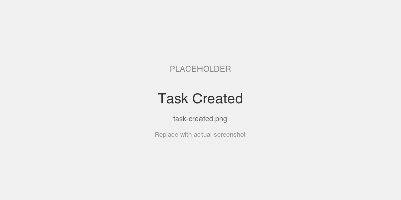
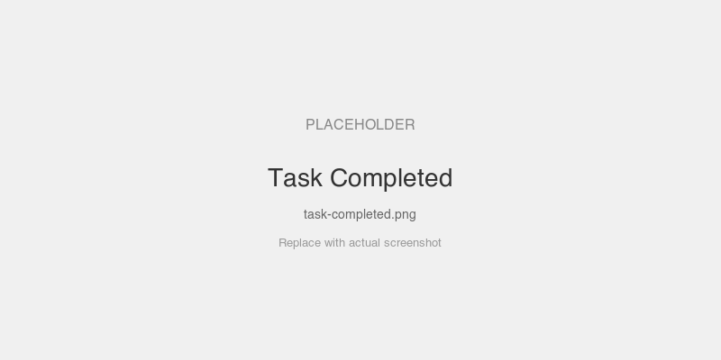
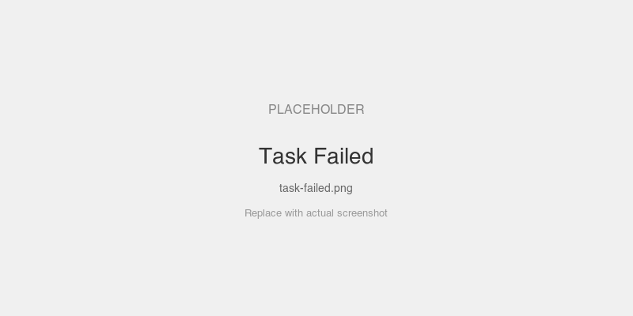

# Tasks Example Server

Demonstrates MCP Tasks (spec 2025-11-25) — async tool execution with lifecycle tracking.

## MCPKit Features Used

| Category | Feature |
|----------|---------|
| Core | `core.ToolDef.Execution`, `core.TaskSupportOptional`, `core.TaskSupportRequired` |
| Experimental | `experimental/ext/tasks` — `tasks.Register`, `tasks.Config` |
| MCP methods | `tasks/get`, `tasks/result`, `tasks/cancel`, `tasks/list` |

## Setup

```bash
cd examples/tasks
go run . -addr :8080
```

## Connect a Host

MCPJam, VS Code, or any MCP client: `http://localhost:8080/mcp`

## Tools

| Tool | Task Support | Behavior |
|------|-------------|----------|
| `greet` | forbidden (absent) | Sync-only. Returns greeting immediately. |
| `slow_compute` | optional | Sleeps N seconds. Sync without hint, async with hint. |
| `failing_job` | required | Always fails after 1s. Must be called as a task. |

## Important: Host Support Required

MCP Tasks is an experimental protocol extension (spec 2025-11-25). **Most MCP hosts don't support it yet** — they will call tools synchronously and ignore the task hints.

- **Without task support**: `slow_compute` blocks for the full duration (may timeout). `failing_job` returns an error saying it requires task invocation.
- **With task support**: The host sends a `"task": {}` hint, gets a task ID back immediately, and can poll/cancel/list tasks.

Until your host supports tasks, use the [curl walkthrough](#curl-walkthrough) below to exercise the async path.

## Exercises (task-capable hosts)

These prompts work if your host supports the MCP tasks protocol.

### 1. Sync tool call

```
Greet World
```

Returns immediately: `Hello, World!`

### 2. Async computation

```
Run a slow computation for 5 seconds labeled "pi"
```

Returns a task ID immediately. The computation runs in the background.

### 3. Check on a running task

```
What's the status of my computation?
```

The host polls `tasks/get` — status transitions from `working` to `completed`.

### 4. Failing job

```
Run the failing job
```

This tool *requires* task invocation. The job starts, then fails after 1 second — status transitions to `failed`.

### 5. Cancel a running task

```
Run a slow computation for 30 seconds, then cancel it
```

Start a long computation, then cancel before it finishes. Status transitions to `cancelled`.

### 6. List all tasks

```
List all tasks
```

Shows all tasks with their current status.

## Curl Walkthrough

For hosts that don't support tasks yet, you can exercise the full async lifecycle with curl.

### Initialize a session

```bash
curl -s -D- http://localhost:8080/mcp \
  -H "Content-Type: application/json" \
  -d '{"jsonrpc":"2.0","id":1,"method":"initialize","params":{"protocolVersion":"2025-03-26","capabilities":{},"clientInfo":{"name":"test","version":"1.0"}}}'
```

Note the `Mcp-Session-Id` header — use it in all subsequent requests.

### Start an async computation

```bash
curl -s http://localhost:8080/mcp \
  -H "Mcp-Session-Id: <session-id>" \
  -H "Content-Type: application/json" \
  -d '{"jsonrpc":"2.0","id":2,"method":"tools/call","params":{"name":"slow_compute","arguments":{"seconds":10,"label":"pi"},"task":{}}}'
```

Returns immediately with a `taskId`:

```json
{"result":{"task":{"taskId":"task-...","status":"working","ttl":300000,"pollInterval":1000}}}
```

### Poll task status

```bash
curl -s http://localhost:8080/mcp \
  -H "Mcp-Session-Id: <session-id>" \
  -H "Content-Type: application/json" \
  -d '{"jsonrpc":"2.0","id":3,"method":"tasks/get","params":{"taskId":"<task-id>"}}'
```

Returns `"status":"working"` while running, `"status":"completed"` when done.

### Get the result (blocks until done)

```bash
curl -s http://localhost:8080/mcp \
  -H "Mcp-Session-Id: <session-id>" \
  -H "Content-Type: application/json" \
  -d '{"jsonrpc":"2.0","id":4,"method":"tasks/result","params":{"taskId":"<task-id>"}}'
```

### Cancel a running task

```bash
curl -s http://localhost:8080/mcp \
  -H "Mcp-Session-Id: <session-id>" \
  -H "Content-Type: application/json" \
  -d '{"jsonrpc":"2.0","id":5,"method":"tasks/cancel","params":{"taskId":"<task-id>"}}'
```

### List all tasks

```bash
curl -s http://localhost:8080/mcp \
  -H "Mcp-Session-Id: <session-id>" \
  -H "Content-Type: application/json" \
  -d '{"jsonrpc":"2.0","id":6,"method":"tasks/list","params":{}}'
```

## Screenshots

### Async tool returns a task ID immediately



### Polling tasks/get — status transitions to completed



### failing_job — task transitions to failed after 1 second



## Key Files

| File | What |
|------|------|
| `main.go` | Server setup, 3 tools, tasks registration |
