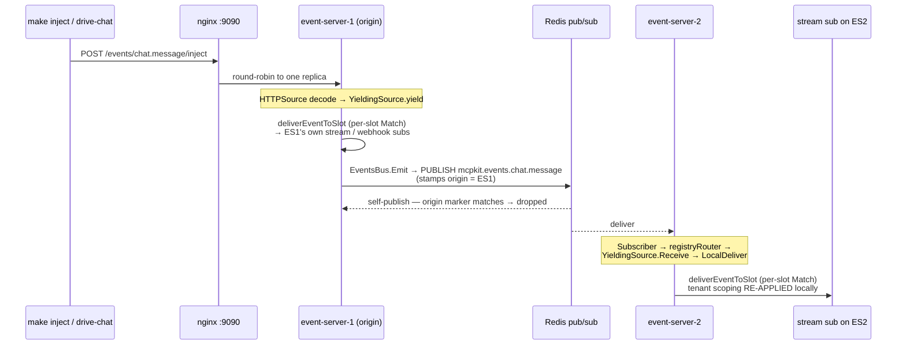

# whole-enchilada — production-shape MCP Events demo

Multi-tier reference deployment for the [MCP Events extension](https://github.com/modelcontextprotocol/experimental-ext-triggers-events) built on mcpkit. Stages plug onto the same compose graph; this leaf currently ships **stage 1**.

```
Host  ──[MCP / SSE]──>  Nginx  ──>  Event-server  <──[HTTP /events/<name>/inject]──  Push-server
                                          │
                                          └──[webhook POST]──>  Your receivers  (host-run `make webhook`)
```

## What stage 1 ships

- **Compose graph** (`docker-compose.yaml`) with nginx + N event-server replicas. Webhook and stream subscribers run as host processes (`make webhook` / `make streamer`), not compose services.
- **Templated** — `make gen-compose N=<n>` regenerates the compose YAML and nginx config for arbitrary replica counts.
- **DNS naming convention** — every service answers a `*.whole-enchilada` hostname both inside the compose network and (with `make hosts-install`) from the host shell / browser. See "Hostname routing" below.
- **All three delivery modes** work end-to-end: poll, push (SSE), webhook.
- **In-memory stores** — restart wipes state. Stage 3 plugs in Postgres + Redis.

## What stage 2 adds

- **Keycloak as the OAuth AS**, pinned to `quay.io/keycloak/keycloak:26.0`. Three realms pre-imported on first start: `asgard`, `babylon`, `camelot`. Admin UI at <http://localhost:8180/admin/> (`admin` / `admin`).
- **Multi-realm introspection on the event-server.** The new `MultiRealmIntrospectionValidator` fans every bearer token out to all three realms' `/introspect` endpoints and accepts the token if any realm says active. Tenant comes from whichever realm validated, encoded as `<realm>/<sub>` into `core.Claims.Subject` (PR 692).
- **Per-event tenant tagging.** `ChatMessageData` / `PresenceChangedData` now carry a `Tenant` field; the push-server rotates events across tenants by default. The event-server's `tenantMatchFunc` only delivers events to subscribers whose `Claims.Tenant` matches — cross-tenant isolation is enforced at delivery time.
- **Demo-only client secrets**, pre-baked in the committed realm JSONs at `keycloak/realms/`. See `keycloak/README.md` for the bring-your-own-client recipe.
- **Three tenants**, not two, so isolation is visually obvious: with one terminal per tenant the demo can show events for one tenant *not* showing up on the other two.

Subsequent stages still in flight: stage-3 wires the GORM stores from PR 685 (multi-replica state survives restart); stage-4 polishes push survival, the WG-announcement artifact, and revocation walkthrough docs.

## Quickstart

One-time setup — install the `oneauth` CLI:

```bash
go install github.com/panyam/oneauth/cmd/oneauth@v0.1.19
```

Bring up the stack:

```bash
make up           # docker compose up -d with N=1, M=1 (+ Keycloak in stage 2). Add BUILD=true to force a fresh docker rebuild.
make demo              # interactive walkthrough (TUI) — pure narrative; press Enter between Steps
make test         # non-interactive walkthrough (CI / scripting)
make down         # tear down
```

Scale replicas:

```bash
make up N=3   # 3 event-server replicas (synthetic producers are operator-run via `make drive-chat` / `make drive-presence`)
```

Local in-process tests (no Docker):

```bash
make unittest          # event-server e2e tests — includes 8 tenant-isolation cases
```

The `unittest` suite verifies (1) tagged events deliver only to matching tenants, (2) untagged events still deliver to all, (3) interleaved cross-tenant events don't leak — using an in-process fake `token-as-tenant` validator. `make test` (the walkthrough run against the live Docker stack) adds the Keycloak interop layer on top.

## Stage-2 4-terminal interactive demo

Once `make up` is running, open multiple terminals to see per-tenant isolation in action. Each terminal authenticates as a single tenant via Keycloak and prints what it sees.

**Acquire all six tokens upfront in your shell** — the per-window `make poller` / `make webhook` invocations consume them as env vars:

```bash
export TOKEN_POLLER_TENANT_A=$(make newtoken TENANT=A)
export TOKEN_POLLER_TENANT_B=$(make newtoken TENANT=B)
export TOKEN_POLLER_TENANT_C=$(make newtoken TENANT=C)
export TOKEN_WEBHOOK_TENANT_A=$(make newtoken TENANT=A)
export TOKEN_WEBHOOK_TENANT_B=$(make newtoken TENANT=B)
export TOKEN_WEBHOOK_TENANT_C=$(make newtoken TENANT=C)
```

Each `make newtoken` opens a browser to the realm's login page. Use the seeded test users: `alice` / `bob` / `carol` (passwords match usernames). The realms also ship with `user{a,b,c}{1..5}` for parameterized testing.

For scripted/CI use: `make newtoken-ci TENANT=A USER=usera1 PASSWORD=usera1` (ROPC; deprecated by OAuth 2.1 but supported).

Once exported, open six terminals:

```bash
# T1 — keep this running
make up

# T2 — Asgard poller. Browser opens for login as alice@asgard (alice/alice).
TA=$(make newtoken TENANT=A)
make poller TENANT=A TOKEN=$TA

# T3 — Babylon poller (different terminal). Login as bob@babylon.
TB=$(make newtoken TENANT=B)
make poller TENANT=B TOKEN=$TB

# T4 — Asgard webhook receiver.
make webhook TENANT=A TOKEN=$TA

# T5 — Babylon webhook receiver.
make webhook TENANT=B TOKEN=$TB

# T6 — Inject events from the host. Only the matching tenant's terminals print.
make inject TENANT=A EVENT=chat.message TEXT="hi from A"
make inject TENANT=B EVENT=chat.message TEXT="hi from B"
make inject TENANT=C EVENT=presence.changed USER=carol STATE=online
```

`make up` brings the stack up silent — no events flow until you run `make drive-chat` (and / or `make drive-presence`) in sibling windows. The drivers rotate tenant tags round-robin across A/B/C; leave the pollers running and watch each tenant's window light up in turn. Tune the cadence with `EVERY=200ms` (high-volume mode) or restrict to one tenant with `TENANTS=asgard`.

### Revocation walkthrough (the load-bearing demo step)

The introspection-based auth has *synchronously revocable* tokens — the demo's key claim that JWT can't make. From your browser:

1. Open <http://localhost:8180/admin/master/console/#/asgard/users>, login as `admin` / `admin`.
2. Click user `alice` → **Sessions** tab → **Sign out**.
3. Within `OAUTH_CACHE_TTL` seconds (default 5s), Asgard's poller + webhook terminals die with `-32012 Forbidden`.
4. Babylon + Camelot terminals stay alive — revocation is per-realm, isolation holds.

This is the operator-facing flow a real production admin would use; nothing in the demo "fakes" the revocation. Re-acquire a token (`make newtoken TENANT=A`) and the subscribers reconnect.

## Observability (traces in Grafana)

Both the event-server and push-server emit OTel traces via SEP-414. Bring up the shared LGTM observability stack alongside the demo and the spans land in Grafana automatically:

```bash
# T1 — observability stack (Tempo + Loki + Mimir + Grafana + OTel Collector)
make -C ../../../docker up           # ports: Grafana :3000, OTLP :4317

# T2 — whole-enchilada demo (auto-attaches to the shared `mcpkit` docker
# network when the collector is reachable)
make up
```

The compose template sets `EXPORTER=auto`, which means **best-effort OTLP with silent Noop fallback**. Translation: `make up` works whether the observability stack is up or not. When it IS up, traces land at `http://localhost:3000` → Explore → Tempo → search by service name `whole-enchilada-event-server` or `whole-enchilada-push-server`.

To force OTLP and fail loudly when the collector is missing, override:

```bash
EXPORTER=otlp make up
```

The shared docker network is named `mcpkit` and is created by whichever stack starts first; both composes declare it with the same literal name.

## Bring your own client

Two paths, depending on whether you want to use the demo's Keycloak or your own IdP:

### Use the demo's Keycloak (introspection mode)

1. <http://localhost:8180/admin/> (admin / admin) → realm `asgard` → **Clients** → **Create**.
2. Type **OpenID Connect**, give it a client ID, enable Service Accounts / Standard Flow / Direct Access Grants as you need.
3. **Save**, then **Credentials** tab → copy the generated secret.
4. From your client, acquire a token against `http://localhost:8180/realms/asgard/protocol/openid-connect/token` using whichever OAuth flow fits your client (client_credentials, auth code, etc.).
5. Send `Authorization: Bearer <token>` when calling `http://localhost:9090/mcp`. The event-server's `MultiRealmIntrospectionValidator` already accepts any token issued by any of the three realms — no further server-side configuration.

### Bring your own IdP (JWT mode)

For "I have my own Auth0 / Okta / Keycloak", flip the event-server from introspection to JWT-mode validation:

```bash
# in your shell before make up
export OAUTH_INTROSPECTION_URLS=    # explicitly clear
export OAUTH_ISSUER=https://your-idp.example.com/realms/your-realm
make up
```

The event-server's `tryEnableAuth()` picks up `OAUTH_ISSUER` and fetches JWKS from `<issuer>/protocol/openid-connect/certs`. Tokens signed by your IdP are validated locally; no callback to your AS per request. **Trade-off:** revocation is no longer synchronously visible — tokens stay valid until they expire (the JWT-vs-introspection trade-off; see `ext/auth/introspection_validator.go` doc for context).

## What stage 2 adds

## Architecture

### Tiers

| Tier | What it owns | Why a separate process |
|---|---|---|
| **nginx** | Frontdoor reverse proxy. Routes by `Host` header to per-service backends. | Single entry point; client-facing TLS termination point in production. |
| **event-server** (N replicas) | MCP Events extension (events/list, events/poll, events/subscribe, events/stream), webhook delivery, push fanout. | Scales with MCP client count + delivery throughput. |
| **push-server** (reference) | Source-side concerns — upstream integration (real-world: Discord WebSocket, Telegram bot, OAuth refresh; this demo: synthetic chat + presence feeders, run as host drivers under `drivers/synth/`). Pushes events into the event-server via `events.HTTPSource` over HTTP. | Scales with upstream-integration count, not with MCP client count. Credentials for upstreams live here, never in the event-server. |

Webhook and stream **subscribers** are not a compose tier. The demo runs them as host processes (`make webhook` / `make streamer`) that reach the stack through `host.docker.internal` — exactly how your own apps would consume events in production.

### How events flow

1. A producer (host driver via `make inject` / `make drive-chat`, or in production the `push-server` via `eventsclient.Pusher.PushNamed("chat.message", data)`) POSTs to `http://event-server.whole-enchilada/events/chat.message/inject`.
2. `event-server`'s `events.HTTPSource[ChatMessageData]` handler decodes and yields into the library's `YieldingSource`.
3. The library fans out: stream subscribers receive the event via SSE on `events/stream`, webhook subscribers get an HTTP POST with a Standard Webhooks signature, poll subscribers see it on their next `events/poll`.
4. Each host-run subscriber (`make webhook` / `make streamer`) verifies the signature and logs the payload.

### Cross-replica delivery (why N>1 works)

With N event-server replicas behind nginx, an inject lands on whichever replica nginx round-robins to, but a subscriber's stream or webhook may be bound to a **different** replica. A Redis pub/sub bus bridges them. The load-bearing invariant: **per-subscriber `Match` (tenant scoping) is re-applied on every replica** — both the origin's local fan-out and the cross-replica relay. An early "broadcast everything on receive" shortcut skipped that re-check and leaked events across tenants; `LocalDeliver` re-running `Match` is what fixes it.



- The **origin replica** matches + delivers to its own subscribers, then publishes the event to Redis with an origin marker.
- The origin's own subscriber sees that marker and **drops the self-publish** — no double delivery.
- **Other replicas** route the relayed event through `YieldingSource.Receive → LocalDeliver`, which re-runs per-slot `Match`, so tenant scoping holds locally.

Full design (capability- vs subscription-shaped routing, the relay/bus seams, the origin-marker dedup): [`docs/MULTI_REPLICA.md`](../../../docs/MULTI_REPLICA.md).

### Why HTTPSource (the third source pattern)

`experimental/ext/events/` ships three source patterns:

| Pattern | Source-side code | Used in |
|---|---|---|
| `YieldingSource` | `yield(data)` in-process | `discord/`, `telegram/` |
| `TypedSource` | `Poll(cursor, limit)` in-process | DB-backed demos |
| **`HTTPSource`** | Remote process POSTs to `{base}/events/{name}/inject` | this demo |

`HTTPSource` is what makes the push-server / event-server split tractable: the SDK provides both sides (`HTTPSource[Data]` on the event-server, `eventsclient.Pusher` on the push-server). See [`experimental/ext/events/HTTP_SOURCE.md`](../../../experimental/ext/events/HTTP_SOURCE.md).

## Hostname routing

Every service answers a `<role>.whole-enchilada` hostname via Docker network aliases (inside the compose network) and nginx server-name routing (from the host).

| Hostname | Resolves to |
|---|---|
| `nginx.whole-enchilada` | nginx frontdoor (port 80) |
| `event-server.whole-enchilada` | Round-robins across all N event-server replicas |
| `event-server-1.whole-enchilada`, `event-server-2.whole-enchilada`, … | Specific replica (regex-routed by nginx) |

**From the host shell**, install the `/etc/hosts` entries once:

```bash
make hosts-install        # appends 127.0.0.1 nginx.whole-enchilada ... (needs sudo)
make hosts-uninstall      # removes them
```

After that:

```bash
curl http://event-server.whole-enchilada/mcp                    # any replica
curl http://event-server-2.whole-enchilada/healthz              # specifically replica 2
curl http://pusher.whole-enchilada/status                       # any push-server's admin
```

**From inside a container**, the same names just work — Docker's embedded DNS resolves the network aliases.

## Future stages (planned, not in this PR)

| Stage | What it adds | Issue |
|---|---|---|
| 2 | Keycloak realm + tenant-scoped subscribe + multi-tenant routing on nginx. | #637 |
| 3 | Postgres-backed Cursor/Webhook/Quota stores. Redis EventBus. Cross-replica fanout (verified by killing a replica mid-stream). | #639 |
| 4 | Admin frontend. M push-servers driven by admin-configured source bindings. OTel collector + Jaeger + Grafana + Loki + Mimir. Push survival walkthrough. | #638 |

The directory layout and the `*.whole-enchilada` naming convention are forward-compatible — later stages add services without restructuring.

## Layout

```
whole-enchilada/
├── docker-compose.yaml     # GENERATED (committed default: N=3)
├── nginx/nginx.conf        # GENERATED
├── tools/gen-compose/      # Template + Go renderer
├── event-server/           # MCP Events server, HTTPSource consumer
├── push-server/            # Synthetic feeders + Pusher client (reference; demo uses host drivers)
├── webhook/, streamer/, poller/, inject/, drivers/  # host-run subscribers + producers
├── walkthrough/            # demokit walkthrough binary
├── Makefile                # demo-up / test / demo-down / gen-compose
├── README.md               # this file
└── WALKTHROUGH.md          # GENERATED by `make readme`
```

## Where each thing is documented

- [`examples/events/CONVENTIONS.md`](../CONVENTIONS.md) — the events-demo family conventions.
- [`experimental/ext/events/HTTP_SOURCE.md`](../../../experimental/ext/events/HTTP_SOURCE.md) — the `HTTPSource` pattern + `Pusher` client.
- [`experimental/ext/events/README.md`](../../../experimental/ext/events/README.md) — the events library overall.
- [`experimental/ext/events/DEPLOYMENT.md`](../../../experimental/ext/events/DEPLOYMENT.md) — production deployment guidance (WAF, SSRF guards, retry semantics).
