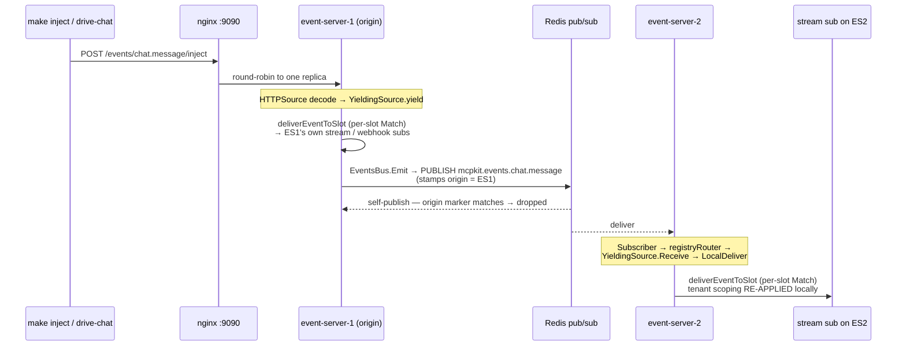

# whole-enchilada — production-shape MCP Events demo

Multi-tier reference deployment for the [MCP Events extension](https://github.com/modelcontextprotocol/experimental-ext-triggers-events) built on mcpkit. It runs nginx + N event-server replicas + Keycloak + Postgres + Redis on one compose graph.

```
Host ─[MCP]→ Nginx ─→ Event-server (N replicas) ←[HTTP /events/<name>/inject]─ producers
   │                       │  ├─ streaming push (events/stream, response-as-SSE)
   │←── streaming push ────┘  ├─ webhook POST (Standard Webhooks signature)
   │←── webhook POST ─────────┘  └─ poll (events/poll — ad-hoc)
                                Postgres (buffer + webhook store)   Redis (pub/sub fan-out + global caps)
```

## What the demo spotlights

Two **push delivery surfaces** are the headline; polling is available for ad-hoc/operator use but is not the narrative.

- **Streaming push** — `make streamer`: a long-running `events/stream` subscriber over the **SEP-2575 stateless wire**. The open POST response carries `notifications/events/event` frames as SSE (response-as-SSE, issue 753), so nginx round-robins freely across replicas and no per-session push channel is needed.
- **Webhook** — `make webhook`: HTTP POST delivery with a Standard Webhooks signature, plus the full lifecycle (client `ttlMs` suggestion clamped to the server envelope, `refreshBefore`, 410-abandon / 500-retry-then-suspend, and failure-based GC of no-expiry subs).
- **Poll** — `make poller`: an `events/poll` subscriber, kept for ad-hoc operator use and to show cursor durability (any replica reads the same Postgres buffer, with bounded TTL replay).
- **Per-tenant isolation** via Keycloak introspection: three realms (`asgard`, `babylon`, `camelot`), a `MultiRealmIntrospectionValidator` that accepts a token if any realm says active, and per-event tenant tags so delivery is scoped to `Claims.Tenant`. One terminal per tenant makes the isolation visible — an event for one tenant does not show up on the other two.
- **Synchronously revocable tokens** — signing a user out in Keycloak kills that tenant's live subscribers within `OAUTH_CACHE_TTL`; the demo's headline win over plain JWT.
- **Cross-replica delivery** (N=3 by default) — a Redis pub/sub bus fans every yielded event to every replica's local delivery loop, so killing a replica mid-stream doesn't drop delivery on the survivors; subscription caps are enforced globally (Redis Lua-atomic INCR-with-check).
- **Durable stores** — Postgres-backed event buffer + `WebhookStore` and Redis bus. State survives a rolling restart of the event-server tier (both finite-TTL and no-expiry webhook subs persist).
- **Operator-controlled source topology** — `evctl sources add/rm` attaches a real upstream source (Discord) to specific replicas at runtime; a `events.topology` meta-source stream unifies the per-replica view.

The `keycloak/realms/` JSONs ship demo-only client secrets; see `keycloak/README.md` for the bring-your-own-client recipe.

## Quickstart

One-time setup — install the `oneauth` CLI:

```bash
go install github.com/panyam/oneauth/cmd/oneauth@v0.1.19
```

Bring up the stack:

```bash
make up           # docker compose up -d with N=3 event-server replicas + Keycloak + Postgres + Redis. Add BUILD=true to force a fresh docker rebuild.
make demo         # interactive walkthrough (TUI) — pure narrative; press Enter between Steps
make test         # non-interactive walkthrough (CI / scripting)
make down         # tear down
```

Override the replica count (default N=3):

```bash
make up N=5   # 5 event-server replicas (synthetic producers are operator-run via `make drive-chat` / `make drive-presence`)
```

Local in-process tests (no Docker):

```bash
make unittest          # event-server e2e tests — includes 8 tenant-isolation cases
```

The `unittest` suite verifies (1) tagged events deliver only to matching tenants, (2) untagged events still deliver to all, (3) interleaved cross-tenant events don't leak — using an in-process fake `token-as-tenant` validator. `make test` (the walkthrough run against the live Docker stack) adds the Keycloak interop layer on top.

## Interactive multi-terminal demo

Once `make up` is running, open a terminal per tenant to see per-tenant isolation in action. The headline is the **two push surfaces** — three streaming subscribers and three webhook receivers, one tenant each. Each `make streamer` / `make webhook` logs in on demand (`USERNAME=<user>` opens a browser to that realm's login page), so no upfront token juggling. Seeded users: `alice` (asgard/A), `bob` (babylon/B), `carol` (camelot/C) — passwords match usernames; the realms also ship `user{a,b,c}{1..5}`.

```bash
# T1 — keep this running
make up

# T2/T3/T4 — one streaming push subscriber per tenant (events/stream, response-as-SSE)
make streamer TENANT=A USERNAME=alice
make streamer TENANT=B USERNAME=bob
make streamer TENANT=C USERNAME=carol

# T5/T6/T7 — one webhook receiver per tenant
make webhook TENANT=A USERNAME=alice
make webhook TENANT=B USERNAME=bob
make webhook TENANT=C USERNAME=carol

# T8 — inject one event per tenant; only the matching tenant's two windows print
make inject TENANT=A EVENT=chat.message TEXT="hi from A"
make inject TENANT=B EVENT=chat.message TEXT="hi from B"
make inject TENANT=C EVENT=presence.changed USER=carol STATE=online
```

`make up` brings the stack up silent — no events flow until you inject (single deliberate events, above) or run the synthetic drivers `make drive-chat` / `make drive-presence` in sibling windows. The drivers rotate tenant tags round-robin across A/B/C; leave the subscribers running and watch each tenant's windows light up in turn. Tune with `EVERY=200ms` (high-volume) or restrict to one tenant with `TENANTS=asgard`.

For scripted/CI use, swap the browser login for ROPC: `make newtoken-ci TENANT=A USER=usera1 PASSWORD=usera1` (ROPC; deprecated by OAuth 2.1 but supported), then pass `TOKEN=<bearer>`.

**Poll mode (ad-hoc).** `make poller TENANT=A USERNAME=alice` runs an `events/poll` subscriber. It's not part of the headline narrative — the push surfaces are — but it's handy for operator spot-checks and for showing cursor durability: `START_CURSOR=<N>` resumes from the shared Postgres buffer (bounded by its TTL), so any replica serves the same replay.

### Revocation walkthrough (the load-bearing demo step)

The introspection-based auth has *synchronously revocable* tokens — the demo's key claim that JWT can't make. From your browser:

1. Open <http://localhost:8180/admin/master/console/#/asgard/users>, login as `admin` / `admin`.
2. Click user `alice` → **Sessions** tab → **Sign out**.
3. Within `OAUTH_CACHE_TTL` seconds (default 5s), Asgard's streaming + webhook terminals die with `-32012 Forbidden` — revocation fires across both push surfaces uniformly.
4. Babylon + Camelot terminals stay alive — revocation is per-realm, isolation holds.

This is the operator-facing flow a real production admin would use; nothing in the demo "fakes" the revocation. Log back in (`make streamer TENANT=A USERNAME=alice`) and the subscriber reconnects.

## Observability (traces in Grafana)

Both the event-server and push-server emit OTel traces via SEP-414. Bring up the shared LGTM observability stack alongside the demo and the spans land in Grafana automatically:

```bash
# T1 — observability stack (Tempo + Loki + Mimir + Grafana + OTel Collector)
make -C ../../../docker up           # ports: Grafana :3000, OTLP :4317

# T2 — whole-enchilada demo (auto-attaches to the shared `mcpkit` docker
# network when the collector is reachable)
make up
```

The compose template sets `EXPORTER=auto`, which means **best-effort OTLP with silent Noop fallback**. Translation: `make up` works whether the observability stack is up or not. When it IS up, traces land at `http://localhost:3000` → Explore → Tempo → search by service name `whole-enchilada-event-server` or `whole-enchilada-push-server`.

To force OTLP and fail loudly when the collector is missing, override:

```bash
EXPORTER=otlp make up
```

The shared docker network is named `mcpkit` and is created by whichever stack starts first; both composes declare it with the same literal name.

## Bring your own client

Two paths, depending on whether you want to use the demo's Keycloak or your own IdP:

### Use the demo's Keycloak (introspection mode)

1. <http://localhost:8180/admin/> (admin / admin) → realm `asgard` → **Clients** → **Create**.
2. Type **OpenID Connect**, give it a client ID, enable Service Accounts / Standard Flow / Direct Access Grants as you need.
3. **Save**, then **Credentials** tab → copy the generated secret.
4. From your client, acquire a token against `http://localhost:8180/realms/asgard/protocol/openid-connect/token` using whichever OAuth flow fits your client (client_credentials, auth code, etc.).
5. Send `Authorization: Bearer <token>` when calling `http://localhost:9090/mcp`. The event-server's `MultiRealmIntrospectionValidator` already accepts any token issued by any of the three realms — no further server-side configuration.

### Bring your own IdP (JWT mode)

For "I have my own Auth0 / Okta / Keycloak", flip the event-server from introspection to JWT-mode validation:

```bash
# in your shell before make up
export OAUTH_INTROSPECTION_URLS=    # explicitly clear
export OAUTH_ISSUER=https://your-idp.example.com/realms/your-realm
make up
```

The event-server's `tryEnableAuth()` picks up `OAUTH_ISSUER` and fetches JWKS from `<issuer>/protocol/openid-connect/certs`. Tokens signed by your IdP are validated locally; no callback to your AS per request. **Trade-off:** revocation is no longer synchronously visible — tokens stay valid until they expire (the JWT-vs-introspection trade-off; see `ext/auth/introspection_validator.go` doc for context).

## Architecture

### Tiers

| Tier | What it owns | Why a separate process |
|---|---|---|
| **nginx** | Frontdoor reverse proxy. Routes by `Host` header to per-service backends. | Single entry point; client-facing TLS termination point in production. |
| **event-server** (N replicas) | MCP Events extension (events/list, events/poll, events/subscribe, events/stream), webhook delivery, push fanout. | Scales with MCP client count + delivery throughput. |
| **push-server** (reference) | Source-side concerns — upstream integration (real-world: Discord WebSocket, Telegram bot, OAuth refresh; this demo: synthetic chat + presence feeders, run as host drivers under `drivers/synth/`). Pushes events into the event-server via `events.HTTPSource` over HTTP. | Scales with upstream-integration count, not with MCP client count. Credentials for upstreams live here, never in the event-server. |

Webhook and stream **subscribers** are not a compose tier. The demo runs them as host processes (`make webhook` / `make streamer`) that reach the stack through `host.docker.internal` — exactly how your own apps would consume events in production.

### How events flow

1. A producer (host driver via `make inject` / `make drive-chat`, or in production the `push-server` via `eventsclient.Pusher.PushNamed("chat.message", data)`) POSTs to `http://event-server.whole-enchilada/events/chat.message/inject`.
2. `event-server`'s `events.HTTPSource[ChatMessageData]` handler decodes and yields into the library's `YieldingSource`.
3. The library fans out: streaming subscribers receive the event as an SSE frame on their open `events/stream` response, webhook subscribers get an HTTP POST with a Standard Webhooks signature; an ad-hoc poll subscriber would see it on its next `events/poll`.
4. Each host-run subscriber (`make webhook` / `make streamer`) verifies the signature and logs the payload.

### Cross-replica delivery (why N>1 works)

With N event-server replicas behind nginx, an inject lands on whichever replica nginx round-robins to, but a subscriber's stream or webhook may be bound to a **different** replica. A Redis pub/sub bus bridges them. The load-bearing invariant: **per-subscriber `Match` (tenant scoping) is re-applied on every replica** — both the origin's local fan-out and the cross-replica relay. An early "broadcast everything on receive" shortcut skipped that re-check and leaked events across tenants; `LocalDeliver` re-running `Match` is what fixes it.



- The **origin replica** matches + delivers to its own subscribers, then publishes the event to Redis with an origin marker.
- The origin's own subscriber sees that marker and **drops the self-publish** — no double delivery.
- **Other replicas** route the relayed event through `YieldingSource.Receive → LocalDeliver`, which re-runs per-slot `Match`, so tenant scoping holds locally.

Full design (capability- vs subscription-shaped routing, the relay/bus seams, the origin-marker dedup): [`docs/MULTI_REPLICA.md`](../../../docs/MULTI_REPLICA.md).

### Why HTTPSource (the third source pattern)

`experimental/ext/events/` ships three source patterns:

| Pattern | Source-side code | Used in |
|---|---|---|
| `YieldingSource` | `yield(data)` in-process | `discord/`, `telegram/` |
| `TypedSource` | `Poll(cursor, limit)` in-process | DB-backed demos |
| **`HTTPSource`** | Remote process POSTs to `{base}/events/{name}/inject` | this demo |

`HTTPSource` is what makes the push-server / event-server split tractable: the SDK provides both sides (`HTTPSource[Data]` on the event-server, `eventsclient.Pusher` on the push-server). See [`experimental/ext/events/HTTP_SOURCE.md`](../../../experimental/ext/events/HTTP_SOURCE.md).

## Hostname routing

Every service answers a `<role>.whole-enchilada` hostname via Docker network aliases (inside the compose network) and nginx server-name routing (from the host).

| Hostname | Resolves to |
|---|---|
| `nginx.whole-enchilada` | nginx frontdoor (port 80) |
| `event-server.whole-enchilada` | Round-robins across all N event-server replicas |
| `event-server-1.whole-enchilada`, `event-server-2.whole-enchilada`, … | Specific replica (regex-routed by nginx) |

**From the host shell**, install the `/etc/hosts` entries once:

```bash
make hosts-install        # appends 127.0.0.1 nginx.whole-enchilada ... (needs sudo)
make hosts-uninstall      # removes them
```

After that:

```bash
curl http://event-server.whole-enchilada/mcp                    # any replica
curl http://event-server-2.whole-enchilada/healthz              # specifically replica 2
curl http://pusher.whole-enchilada/status                       # any push-server's admin
```

**From inside a container**, the same names just work — Docker's embedded DNS resolves the network aliases.

## Build history

The demo grew in stages, all now shipped: Keycloak realms + tenant-scoped delivery (issue 637), Postgres-backed buffer/webhook/quota stores + Redis bus + cross-replica fanout (issue 639), and the admin source-topology + observability + push-survival layer (issue 638). The `*.whole-enchilada` naming convention and directory layout stayed forward-compatible throughout — new services slotted in without restructuring.

## Layout

```
whole-enchilada/
├── docker-compose.yaml     # GENERATED (committed default: N=3)
├── nginx/nginx.conf        # GENERATED
├── tools/gen-compose/      # Template + Go renderer
├── event-server/           # MCP Events server, HTTPSource consumer, source-topology admin
├── push-server/            # Synthetic feeders + Pusher client (reference; demo uses host drivers)
├── streamer/, webhook/     # host-run PUSH subscribers (the headline surfaces)
├── poller/                 # host-run poll subscriber (ad-hoc / cursor-durability)
├── evctl/                  # operator CLI — runtime source topology (evctl sources add/rm)
├── inject/, drivers/       # host-run producers
├── walkthrough/            # demokit walkthrough binary
├── Makefile                # up / test / down / gen-compose
├── README.md               # this file
└── WALKTHROUGH.md          # GENERATED by `make readme`
```

## Where each thing is documented

- [`examples/events/CONVENTIONS.md`](../CONVENTIONS.md) — the events-demo family conventions.
- [`experimental/ext/events/HTTP_SOURCE.md`](../../../experimental/ext/events/HTTP_SOURCE.md) — the `HTTPSource` pattern + `Pusher` client.
- [`experimental/ext/events/README.md`](../../../experimental/ext/events/README.md) — the events library overall.
- [`experimental/ext/events/DEPLOYMENT.md`](../../../experimental/ext/events/DEPLOYMENT.md) — production deployment guidance (WAF, SSRF guards, retry semantics).
