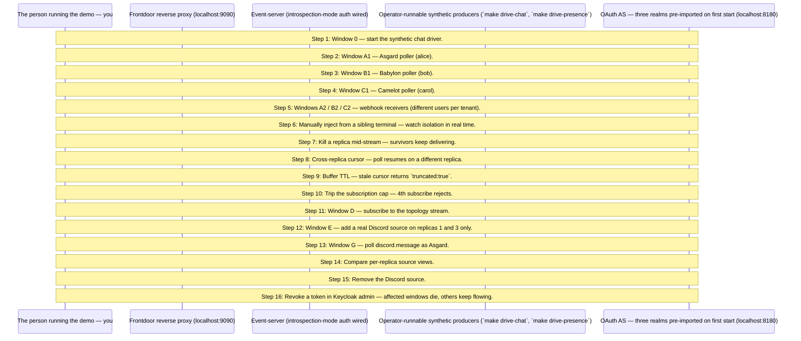

# MCP Events — whole-enchilada stage 2 walkthrough

Production-shape multi-tier reference. nginx fronts the event-server tier; Keycloak provides three pre-configured OAuth realms (asgard, babylon, camelot). The stack comes up silent — operator-runnable synthetic drivers (`make drive-chat`, `make drive-presence`) start producing events from sibling terminals. This walkthrough guides you through a multi-terminal demo where each tenant gets its own poller and webhook receiver — per-tenant isolation is the headline.

## What you'll learn

- **Window 0 — start the synthetic chat driver.** — Stack came up silent. This is what makes events start flowing.
- **Window A1 — Asgard poller (alice).** — Binary does its own ROPC login under USERNAME — PASSWORD defaults to USERNAME since realm seeds align. Sees only `asgard` events.
- **Window B1 — Babylon poller (bob).** — Realm in the bearer is what scopes delivery.
- **Window C1 — Camelot poller (carol).** — Three terminals, three tenants — clean isolation on the wire.
- **Windows A2 / B2 / C2 — webhook receivers (different users per tenant).** — Second delivery mode, same tenant scoping. An event for `asgard` lights up A1 and A2 only. Distinct users per role keep Keycloak's session table clean and avoid bumping into the subscription cap step later.
- **Manually inject from a sibling terminal — watch isolation in real time.** — A's inject lights up A1 + A2 only; B's lights up B1 + B2 only.
- **Kill a replica mid-stream — survivors keep delivering.** — Stack defaults to N=3. Kill replica 1; nginx round-robins to 2 + 3; Redis fan-out keeps every subscriber fed.
- **Cross-replica cursor — poll resumes on a different replica.** — Restart the poller with the last cursor; events resume gap-free even when nginx routes it elsewhere.
- **Buffer TTL — stale cursor returns `truncated:true`.** — Wait past `POSTGRES_BUFFER_TTL=10m`, restart with the old cursor — poller resyncs from `latest`.
- **Trip the subscription cap — 4th subscribe rejects.** — Three webhook subscriptions for the same user succeed; the 4th gets `-32013 ResourceExhausted`. Use aarti (a clean Asgard user not used elsewhere) so the existing alice/anand subscriptions don't interfere with the count.
- **Window D — subscribe to the topology stream.** — Silent until a source is added / removed. Tenant doesn't gate this stream (topology events carry no tenant tag).
- **Window E — add a real Discord source on replicas 1 and 3 only.** — Requires `DISCORD_BOT_TOKEN` + `DISCORD_CHANNEL_IDS` exported. Window D prints `source.added`; replicas 1 + 3 open Discord WebSocket sessions. Replica 2 is deliberately skipped to make the per-replica divergence demo-able.
- **Window G — poll discord.message as Asgard.** — Sees real Discord traffic tagged for asgard. Subscribers on replica 2 (where Discord is NOT registered) ALSO see them — Redis pubsub fans cross-replica.
- **Compare per-replica source views.** — Replicas 1 + 3 list `discord.message`; replica 2 does not. Adapter configs are per-replica state — the topology stream is what unifies them.
- **Remove the Discord source.** — Window D prints `source.removed`; the discord.message poller terminates with NotFound on its next cycle.
- **Revoke a token in Keycloak admin — affected windows die, others keep flowing.** — Open `http://localhost:8180/admin/master/console/#/asgard/users` (admin / admin), click `alice` → **Sessions** → **Sign out**. Within ~5s A1 (poller) exits with `token invalidated`; A2 (webhook) gets a `{type:terminated}` envelope via BCL. B and C are untouched.

## Flow



## Steps

### Architecture in one diagram

```
Operator's terminals (poller, webhook, inject, drive-chat, drive-presence)
           │
           ▼
     localhost:9090
           │
        Nginx ──────────────┐
           │                │
           ▼                ▼
      Event-server     Keycloak
                       (localhost:8180)
```

The walkthrough binary you're reading does **not** make MCP calls. The flow below has you run `make poller` / `make webhook` / `make inject` / `make drive-chat` / `make drive-presence` in sibling windows — those are the actual MCP clients + producers. This binary is the guide.

### Step 1: Window 0 — start the synthetic chat driver.

Stack came up silent. This is what makes events start flowing.

```
make drive-chat
```

### Step 2: Window A1 — Asgard poller (alice).

Binary does its own ROPC login under USERNAME — PASSWORD defaults to USERNAME since realm seeds align. Sees only `asgard` events.

```
make poller TENANT=A USERNAME=alice
```

### Step 3: Window B1 — Babylon poller (bob).

Realm in the bearer is what scopes delivery.

```
make poller TENANT=B USERNAME=bob
```

### Step 4: Window C1 — Camelot poller (carol).

Three terminals, three tenants — clean isolation on the wire.

```
make poller TENANT=C USERNAME=carol
```

### Step 5: Windows A2 / B2 / C2 — webhook receivers (different users per tenant).

Second delivery mode, same tenant scoping. An event for `asgard` lights up A1 and A2 only. Distinct users per role keep Keycloak's session table clean and avoid bumping into the subscription cap step later.

```
make webhook TENANT=A USERNAME=anand
make webhook TENANT=B USERNAME=bhavna
make webhook TENANT=C USERNAME=chandan
```

### Step 6: Manually inject from a sibling terminal — watch isolation in real time.

A's inject lights up A1 + A2 only; B's lights up B1 + B2 only.

```
make inject TENANT=A EVENT=chat.message TEXT='hi from A'
make inject TENANT=B EVENT=chat.message TEXT='hi from B'
make inject TENANT=C EVENT=presence.changed USER=carol STATE=online
```

### Step 7: Kill a replica mid-stream — survivors keep delivering.

Stack defaults to N=3. Kill replica 1; nginx round-robins to 2 + 3; Redis fan-out keeps every subscriber fed.

```
docker exec -it mcpkit-redis redis-cli MONITOR | grep mcpkit.events    # in a sibling window
docker compose kill event-server-1
docker compose start event-server-1                                      # bring it back when done
```

### Step 8: Cross-replica cursor — poll resumes on a different replica.

Restart the poller with the last cursor; events resume gap-free even when nginx routes it elsewhere.

```
make poller TENANT=A USERNAME=alice
# Ctrl+C, note the last cursor printed
make poller TENANT=A USERNAME=alice -- --start-cursor=<N>
```

### Step 9: Buffer TTL — stale cursor returns `truncated:true`.

Wait past `POSTGRES_BUFFER_TTL=10m`, restart with the old cursor — poller resyncs from `latest`.

```
docker exec mcpkit-postgres psql -U postgres -d events \
  -c "SELECT source_name, min(cursor), count(*) FROM event_buffer GROUP BY source_name;"
```

### Step 10: Trip the subscription cap — 4th subscribe rejects.

Three webhook subscriptions for the same user succeed; the 4th gets `-32013 ResourceExhausted`. Use aarti (a clean Asgard user not used elsewhere) so the existing alice/anand subscriptions don't interfere with the count.

```
make webhook TENANT=A USERNAME=aarti   # x3 in sibling windows; 4th rejects
```

### Step 11: Window D — subscribe to the topology stream.

Silent until a source is added / removed. Tenant doesn't gate this stream (topology events carry no tenant tag).

```
make poller EVENT=events.topology TENANT=A USERNAME=alex
```

### Step 12: Window E — add a real Discord source on replicas 1 and 3 only.

Requires `DISCORD_BOT_TOKEN` + `DISCORD_CHANNEL_IDS` exported. Window D prints `source.added`; replicas 1 + 3 open Discord WebSocket sessions. Replica 2 is deliberately skipped to make the per-replica divergence demo-able.

```
make add-discord TOKEN=$DISCORD_BOT_TOKEN CHANNELS=$DISCORD_CHANNEL_IDS REPLICAS=1,3 TENANTS=asgard,camelot
```

### Step 13: Window G — poll discord.message as Asgard.

Sees real Discord traffic tagged for asgard. Subscribers on replica 2 (where Discord is NOT registered) ALSO see them — Redis pubsub fans cross-replica.

```
make poller EVENT=discord.message TENANT=A USERNAME=alice
```

### Step 14: Compare per-replica source views.

Replicas 1 + 3 list `discord.message`; replica 2 does not. Adapter configs are per-replica state — the topology stream is what unifies them.

```
make list-sources REPLICAS=1
make list-sources REPLICAS=2
make list-sources REPLICAS=3
```

### Step 15: Remove the Discord source.

Window D prints `source.removed`; the discord.message poller terminates with NotFound on its next cycle.

```
make rm-source SOURCE=discord.message REPLICAS=1,3
```

### Step 16: Revoke a token in Keycloak admin — affected windows die, others keep flowing.

Open `http://localhost:8180/admin/master/console/#/asgard/users` (admin / admin), click `alice` → **Sessions** → **Sign out**. Within ~5s A1 (poller) exits with `token invalidated`; A2 (webhook) gets a `{type:terminated}` envelope via BCL. B and C are untouched.

```
docker compose logs -f event-server-1 | grep BCL    # see the back-channel logout fire
```

### What stage 2 adds

- Keycloak realm with multi-tenant subscriptions (every events/* method requires a real bearer token).
- Tenant identifier flows from token claims (`core.Claims.Tenant`) into `OnSubscribe` scoping + the canonical webhook key.
- Anonymous principal escape removed for the auth-wired path.
- Per-tenant quota with the canonical `-32013 ResourceExhausted` wire shape pinned by kitchen-sink ({limit:"subscriptions", max:N}; see experimental/ext/events/errors.go's ResourceExhaustedData godoc).

### What stage 3 adds

- Postgres-backed cursor / webhook / quota stores. Restart-survival for the demo.
- Redis EventBus for cross-replica fanout. event-server scaled to N=3 replicas via `docker compose --scale event-server=3`.
- nginx routes round-robin; subscribers reconnect to any replica without losing delivery.

### What stage 4 adds

- M push-server replicas with admin-frontend-driven source bindings.
- Admin web UI for per-tenant caps + rate limits + webhook config.
- Push survival walkthrough: kill an event-server replica during the live step; nginx routes new connections to a sibling; resumed cursor replays the missed window.

## Run it

```bash
go run ./examples/events/whole-enchilada/
```

Pass `--non-interactive` to skip pauses:

```bash
go run ./examples/events/whole-enchilada/ --non-interactive
```
