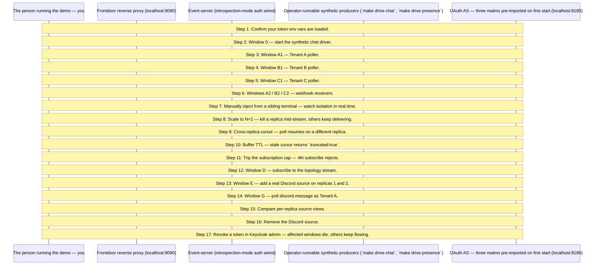

# MCP Events — whole-enchilada stage 2 walkthrough

Production-shape multi-tier reference. nginx fronts the event-server tier; Keycloak provides three pre-configured OAuth realms (tenant-a, tenant-b, tenant-c). The stack comes up silent — operator-runnable synthetic drivers (`make drive-chat`, `make drive-presence`) start producing events from sibling terminals. This walkthrough guides you through a multi-terminal demo where each tenant gets its own poller and webhook receiver — per-tenant isolation is the headline.

## What you'll learn

- **Confirm your token env vars are loaded.** — **Missing token env vars** — the 4-terminal demo below needs all six. Open six terminals now and acquire tokens, then re-export them into THIS shell before continuing:
- **Window 0 — start the synthetic chat driver.** — Stack came up silent. This is what makes events start flowing.
- **Window A1 — Tenant A poller.** — Sees only `tenant-a` events; B and C never reach it.
- **Window B1 — Tenant B poller.** — Realm in the bearer is what scopes delivery.
- **Window C1 — Tenant C poller.** — Three terminals, three tenants — clean isolation on the wire.
- **Windows A2 / B2 / C2 — webhook receivers.** — Second delivery mode, same tenant scoping. An event for `tenant-a` lights up A1 and A2 only.
- **Manually inject from a sibling terminal — watch isolation in real time.** — A's inject lights up A1 + A2 only; B's lights up B1 + B2 only.
- **Scale to N=2 — kill a replica mid-stream, others keep delivering.** — Watch the Redis MONITOR in a sibling window — events keep PUBLISHing through the survivor.
- **Cross-replica cursor — poll resumes on a different replica.** — Restart the poller with the last cursor; events resume gap-free even when nginx routes it elsewhere.
- **Buffer TTL — stale cursor returns `truncated:true`.** — Wait past `POSTGRES_BUFFER_TTL=10m`, restart with the old cursor — poller resyncs from `latest`.
- **Trip the subscription cap — 4th subscribe rejects.** — Three webhook subscriptions for the same user succeed; the 4th gets `-32013 ResourceExhausted`.
- **Window D — subscribe to the topology stream.** — Silent until a source is added / removed.
- **Window E — add a real Discord source on replicas 1 and 2.** — Requires `DISCORD_BOT_TOKEN` + `DISCORD_CHANNEL_IDS` exported. Window D prints `source.added`; replicas 1 + 2 open Discord WebSocket sessions.
- **Window G — poll discord.message as Tenant A.** — Sees real Discord traffic tagged for tenant-a. Subscribers on replicas 3 / 4 ALSO see them (Redis pubsub fans cross-replica).
- **Compare per-replica source views.** — Replica 1 lists `discord.message`; replica 3 does not. Adapter configs are per-replica state — the topology stream is what unifies them.
- **Remove the Discord source.** — Window D prints `source.removed`; the discord.message poller terminates with NotFound on its next cycle.
- **Revoke a token in Keycloak admin — affected windows die, others keep flowing.** — Open `http://localhost:8180/admin/master/console/#/tenant-a/users` (admin / admin), click `alice` → **Sessions** → **Sign out**. Within ~5s A1 (poller) exits with `token invalidated`; A2 (webhook) gets a `{type:terminated}` envelope via BCL. B and C are untouched.

## Flow



## Steps

### Architecture in one diagram

```
Operator's terminals (poller, webhook, inject, drive-chat, drive-presence)
           │
           ▼
     localhost:9090
           │
        Nginx ──────────────┐
           │                │
           ▼                ▼
      Event-server     Keycloak
                       (localhost:8180)
```

The walkthrough binary you're reading does **not** make MCP calls. The flow below has you run `make poller` / `make webhook` / `make inject` / `make drive-chat` / `make drive-presence` in sibling windows — those are the actual MCP clients + producers. This binary is the guide.

### Step 1: Confirm your token env vars are loaded.

**Missing token env vars** — the 4-terminal demo below needs all six. Open six terminals now and acquire tokens, then re-export them into THIS shell before continuing:

```
export TOKEN_POLLER_TENANT_A=$(make newtoken TENANT=A)
export TOKEN_POLLER_TENANT_B=$(make newtoken TENANT=B)
export TOKEN_POLLER_TENANT_C=$(make newtoken TENANT=C)
export TOKEN_WEBHOOK_TENANT_A=$(make newtoken TENANT=A)
export TOKEN_WEBHOOK_TENANT_B=$(make newtoken TENANT=B)
export TOKEN_WEBHOOK_TENANT_C=$(make newtoken TENANT=C)
```

Each `make newtoken` opens a browser for the realm's login page; log in as `alice@tenant-a` / `bob@tenant-b` / `carol@tenant-c` (passwords match the usernames in the demo realm JSONs).

If you're scripting (CI / unattended), use the ROPC variant — same envs, no browser:

```
export TOKEN_POLLER_TENANT_A=$(make newtoken-ci TENANT=A USER=alice PASSWORD=alice)
export TOKEN_POLLER_TENANT_B=$(make newtoken-ci TENANT=B USER=bob PASSWORD=bob)
export TOKEN_POLLER_TENANT_C=$(make newtoken-ci TENANT=C USER=carol PASSWORD=carol)
export TOKEN_WEBHOOK_TENANT_A=$(make newtoken-ci TENANT=A USER=alice PASSWORD=alice)
export TOKEN_WEBHOOK_TENANT_B=$(make newtoken-ci TENANT=B USER=bob PASSWORD=bob)
export TOKEN_WEBHOOK_TENANT_C=$(make newtoken-ci TENANT=C USER=carol PASSWORD=carol)
```

Press Enter once all six are exported — the walkthrough does NOT make MCP calls itself, so it will continue past this Step regardless; the subsequent Steps assume the envs exist when you copy/paste them into your terminals.

### Step 2: Window 0 — start the synthetic chat driver.

Stack came up silent. This is what makes events start flowing.

```
make drive-chat
```

### Step 3: Window A1 — Tenant A poller.

Sees only `tenant-a` events; B and C never reach it.

```
make poller TENANT=A TOKEN=$TOKEN_POLLER_TENANT_A
```

### Step 4: Window B1 — Tenant B poller.

Realm in the bearer is what scopes delivery.

```
make poller TENANT=B TOKEN=$TOKEN_POLLER_TENANT_B
```

### Step 5: Window C1 — Tenant C poller.

Three terminals, three tenants — clean isolation on the wire.

```
make poller TENANT=C TOKEN=$TOKEN_POLLER_TENANT_C
```

### Step 6: Windows A2 / B2 / C2 — webhook receivers.

Second delivery mode, same tenant scoping. An event for `tenant-a` lights up A1 and A2 only.

```
make webhook TENANT=A TOKEN=$TOKEN_WEBHOOK_TENANT_A
make webhook TENANT=B TOKEN=$TOKEN_WEBHOOK_TENANT_B
make webhook TENANT=C TOKEN=$TOKEN_WEBHOOK_TENANT_C
```

### Step 7: Manually inject from a sibling terminal — watch isolation in real time.

A's inject lights up A1 + A2 only; B's lights up B1 + B2 only.

```
make inject TENANT=A EVENT=chat.message TEXT='hi from A'
make inject TENANT=B EVENT=chat.message TEXT='hi from B'
make inject TENANT=C EVENT=presence.changed USER=carol STATE=online
```

### Step 8: Scale to N=2 — kill a replica mid-stream, others keep delivering.

Watch the Redis MONITOR in a sibling window — events keep PUBLISHing through the survivor.

```
make up N=2 BUILD=true
docker exec -it mcpkit-redis redis-cli MONITOR | grep mcpkit.events
docker compose kill event-server-1
make up
```

### Step 9: Cross-replica cursor — poll resumes on a different replica.

Restart the poller with the last cursor; events resume gap-free even when nginx routes it elsewhere.

```
make poller TENANT=A USERNAME=usera1 PASSWORD=usera1
# Ctrl+C, note the last cursor printed
make poller TENANT=A USERNAME=usera1 PASSWORD=usera1 -- --start-cursor=<N>
```

### Step 10: Buffer TTL — stale cursor returns `truncated:true`.

Wait past `POSTGRES_BUFFER_TTL=10m`, restart with the old cursor — poller resyncs from `latest`.

```
docker exec mcpkit-postgres psql -U postgres -d events \
  -c "SELECT source_name, min(cursor), count(*) FROM event_buffer GROUP BY source_name;"
```

### Step 11: Trip the subscription cap — 4th subscribe rejects.

Three webhook subscriptions for the same user succeed; the 4th gets `-32013 ResourceExhausted`.

```
make webhook TENANT=A USERNAME=usera1 PASSWORD=usera1   # x3 in sibling windows; 4th rejects
```

### Step 12: Window D — subscribe to the topology stream.

Silent until a source is added / removed.

```
make poller EVENT=events.topology TENANT=A TOKEN=$TOKEN_POLLER_TENANT_A
```

### Step 13: Window E — add a real Discord source on replicas 1 and 2.

Requires `DISCORD_BOT_TOKEN` + `DISCORD_CHANNEL_IDS` exported. Window D prints `source.added`; replicas 1 + 2 open Discord WebSocket sessions.

```
make add-discord TOKEN=$DISCORD_BOT_TOKEN CHANNELS=$DISCORD_CHANNEL_IDS REPLICAS=1,2 TENANTS=tenant-a,tenant-c
```

### Step 14: Window G — poll discord.message as Tenant A.

Sees real Discord traffic tagged for tenant-a. Subscribers on replicas 3 / 4 ALSO see them (Redis pubsub fans cross-replica).

```
make poller EVENT=discord.message TENANT=A TOKEN=$TOKEN_POLLER_TENANT_A
```

### Step 15: Compare per-replica source views.

Replica 1 lists `discord.message`; replica 3 does not. Adapter configs are per-replica state — the topology stream is what unifies them.

```
make list-sources REPLICAS=1
make list-sources REPLICAS=3
```

### Step 16: Remove the Discord source.

Window D prints `source.removed`; the discord.message poller terminates with NotFound on its next cycle.

```
make rm-source SOURCE=discord.message REPLICAS=1,2
```

### Step 17: Revoke a token in Keycloak admin — affected windows die, others keep flowing.

Open `http://localhost:8180/admin/master/console/#/tenant-a/users` (admin / admin), click `alice` → **Sessions** → **Sign out**. Within ~5s A1 (poller) exits with `token invalidated`; A2 (webhook) gets a `{type:terminated}` envelope via BCL. B and C are untouched.

```
docker compose logs -f event-server-1 | grep BCL    # see the back-channel logout fire
```

### What stage 2 adds

- Keycloak realm with multi-tenant subscriptions (every events/* method requires a real bearer token).
- Tenant identifier flows from token claims (`core.Claims.Tenant`) into `OnSubscribe` scoping + the canonical webhook key.
- Anonymous principal escape removed for the auth-wired path.
- Per-tenant quota with the canonical `-32013 ResourceExhausted` wire shape pinned by kitchen-sink ({limit:"subscriptions", max:N}; see experimental/ext/events/errors.go's ResourceExhaustedData godoc).

### What stage 3 adds

- Postgres-backed cursor / webhook / quota stores. Restart-survival for the demo.
- Redis EventBus for cross-replica fanout. event-server scaled to N=3 replicas via `docker compose --scale event-server=3`.
- nginx routes round-robin; subscribers reconnect to any replica without losing delivery.

### What stage 4 adds

- M push-server replicas with admin-frontend-driven source bindings.
- Admin web UI for per-tenant caps + rate limits + webhook config.
- Push survival walkthrough: kill an event-server replica during the live step; nginx routes new connections to a sibling; resumed cursor replays the missed window.

## Run it

```bash
go run ./examples/events/whole-enchilada/
```

Pass `--non-interactive` to skip pauses:

```bash
go run ./examples/events/whole-enchilada/ --non-interactive
```
