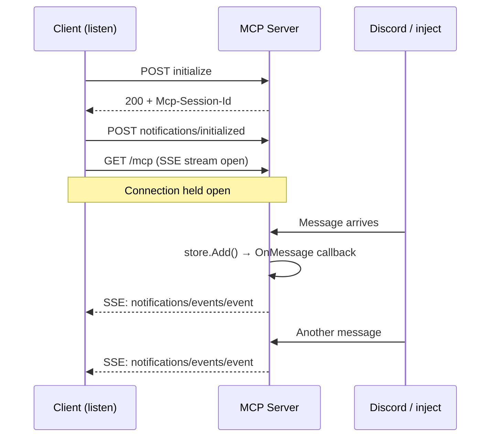
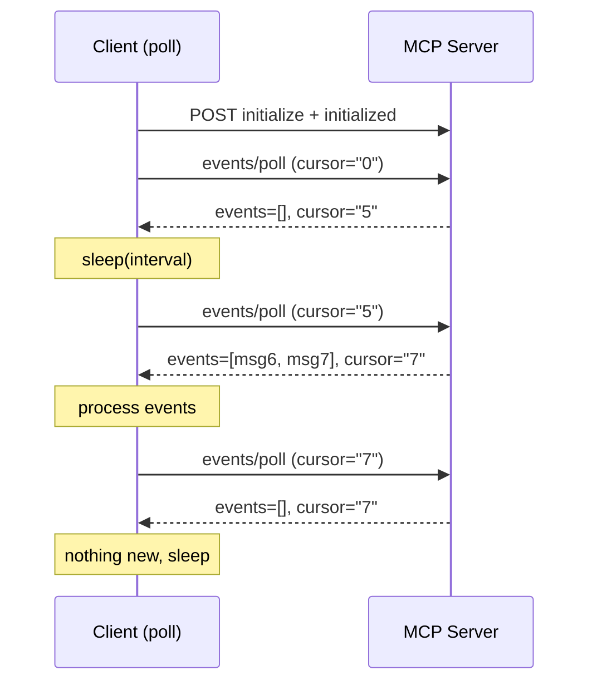
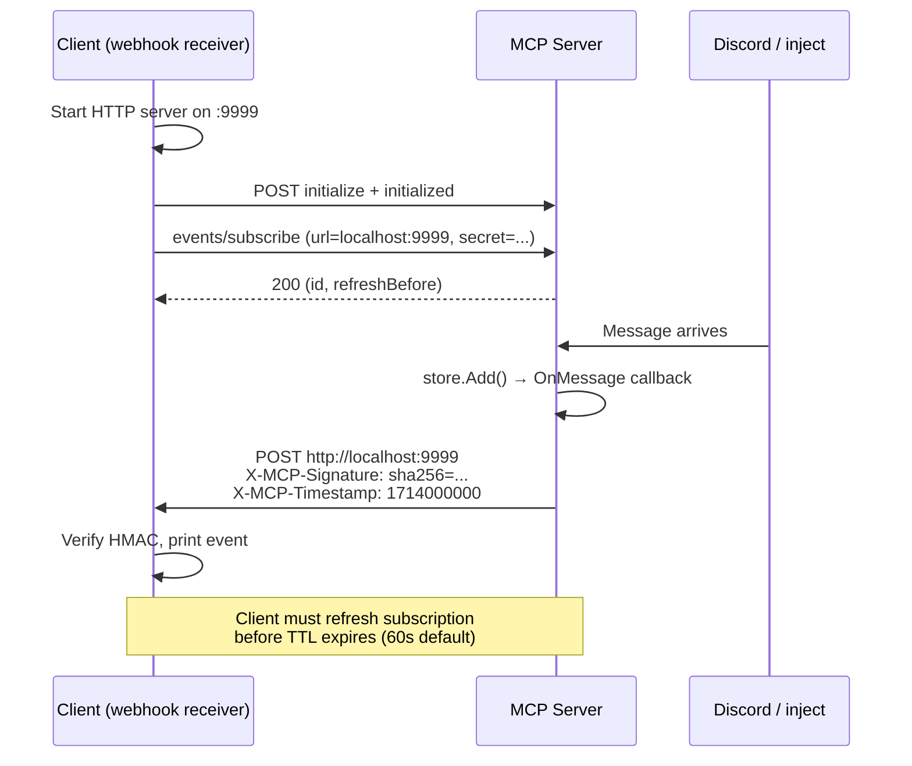

# Discord Events Example

Reference server demonstrating the [MCP Events spec](https://github.com/modelcontextprotocol/experimental-ext-triggers-events/pull/1) with Discord as the event source. Built on the [`experimental/ext/events`](../ext/events/) library.

Companion to the [Telegram example](../telegram-events/) — shows the events library handles structurally different payloads (Discord has nested author objects, embeds, threads, mentions vs Telegram's flat text model).

## Quick Start

```bash
# Terminal 1: start server in test mode (no Discord needed)
make run

# Terminal 2: start SSE listener
make listen

# Terminal 3: inject a message
make inject TEXT="hello world"
# → event appears instantly in Terminal 2
```

With a real Discord bot:
```bash
DISCORD_BOT_TOKEN=your-token make run
```

### Getting a Discord Bot Token

1. Go to https://discord.com/developers/applications
2. Click **New Application**, name it (e.g., "MCPKit Events")
3. Go to **Bot** tab → click **Reset Token** → copy the token
4. Under **Privileged Gateway Intents**, enable **Message Content Intent**
5. Go to **OAuth2** → **URL Generator**:
   - Scopes: `bot`
   - Bot Permissions: `Send Messages`, `Read Message History`
6. Copy the generated URL and open it to invite the bot to your server

## Three Delivery Modes

All three modes work simultaneously from the same server.

### Push — `make listen`

Client opens a long-lived SSE connection. Server broadcasts events in real time.



### Poll — `make poll`

Client calls `events/poll` on an interval. Cursor-based — never misses events.



### Webhook — `make webhook`

Client registers a callback URL. Server POSTs HMAC-signed events to it.



## Event Payload Shape

Discord events have a richer structure than Telegram — nested author, optional threads, embeds, and mentions. The `payloadSchema` in `events/list` is auto-derived from the Go struct:

```json
{
  "guild_id": "123456",
  "channel_id": "789012",
  "message_id": "evt_1",
  "author": { "id": "111", "username": "alice", "bot": false },
  "content": "hello world",
  "type": "default",
  "thread": { "id": "999", "name": "discussion", "parent_id": "789012" },
  "embeds": [{ "title": "Link Preview", "url": "https://..." }],
  "mentions": ["bob", "carol"],
  "ts": "2026-04-16T12:00:00Z"
}
```

## Architecture

```
Discord Bot (WebSocket)  ──or──  POST /inject
                │                       │
                ▼                       ▼
          MessageStore (in-memory ring buffer, 1000 max)
                │
                │  OnMessage callback
                │
                ├──► events.Emit()              → Push (SSE broadcast)
                ├──► srv.NotifyResourceUpdated() → Resource subscribers
                └──► events.EmitToWebhooks()     → Webhook (HMAC POST)
                                                   ▲
                                              events/poll reads
                                              from store on demand
```

## Make Targets

| Target | Description |
|--------|-------------|
| `make run` | Start server (with bot if `DISCORD_BOT_TOKEN` set) |
| `make test` | Go tests |
| `make inject TEXT="..."` | Inject a message (optional: `SENDER=`, `CHANNEL=`, `GUILD=`) |
| `make list` | Show server capabilities: tools, resources, events, sample poll |
| `make listen` | SSE push listener — print events in real time |
| `make webhook` | Webhook receiver — subscribe + receive HMAC-signed POSTs |
| `make poll` | Polling loop (default 5s interval, override: `INTERVAL=10`) |

All client commands use the shared [`events_client.py`](../ext/events/events_client.py).
