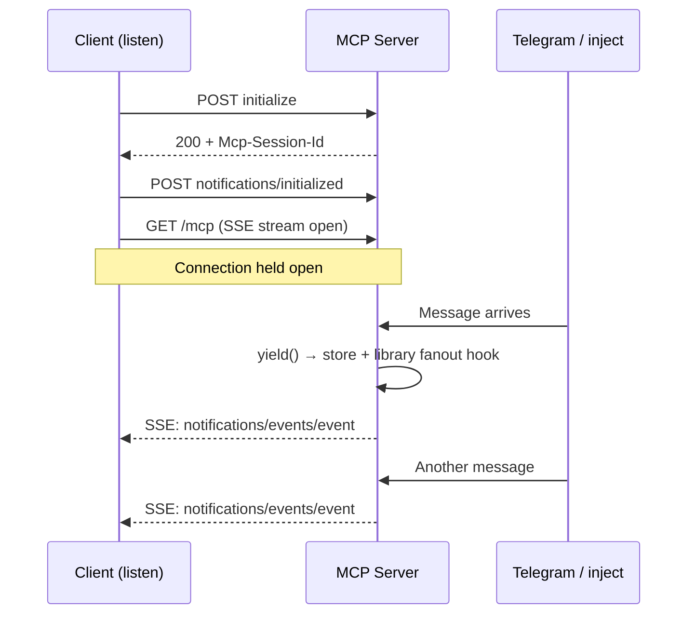
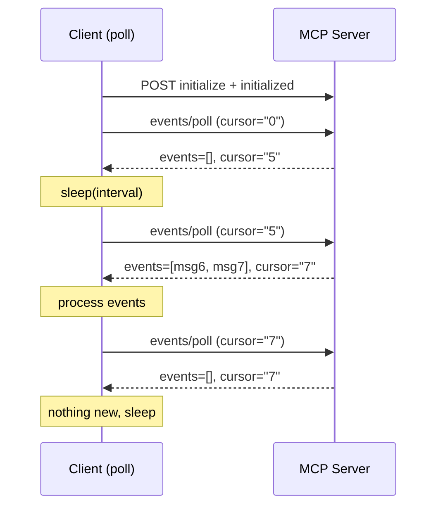
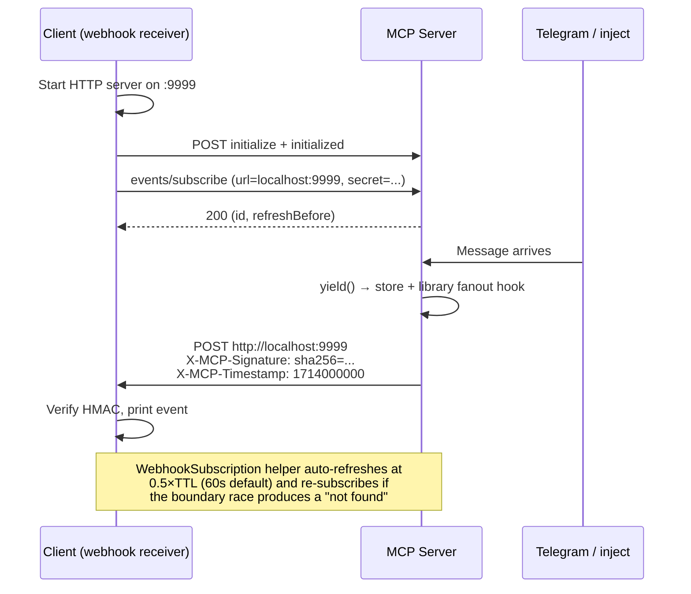

# Telegram Events Example

Reference server demonstrating the [MCP Events spec](https://github.com/modelcontextprotocol/experimental-ext-triggers-events/pull/1) with Telegram as the event source. Built on the [`experimental/ext/events`](../ext/events/) library.

Companion to [Clare Liguori's TypeScript implementation](https://github.com/modelcontextprotocol/experimental-ext-triggers-events/tree/main/telegram-reference-server).

## Quick Start

```bash
# Terminal 1: start server in test mode (no Telegram needed)
make run

# Terminal 2: start SSE listener
make listen

# Terminal 3: inject a message
make inject TEXT="hello world"
# → event appears instantly in Terminal 2
```

With a real Telegram bot:
```bash
TELEGRAM_BOT_TOKEN=your-token make run
```

Get a bot token from [@BotFather](https://t.me/BotFather) (`/newbot`).

## Three Delivery Modes

All three modes work simultaneously from the same server.

### Push — `make listen`

Client opens a long-lived SSE connection. Server broadcasts events in real time.



### Poll — `make poll`

Client calls `events/poll` on an interval. Cursor-based — never misses events.



### Webhook — `make webhook`

Client registers a callback URL. Server POSTs HMAC-signed events to it.



## Architecture

```
Telegram Bot (long-poll)  ──or──  POST /inject
                │                       │
                ▼                       ▼
                yield(TelegramEventData{...})    ← user code: one call
                │
                │  YieldingSource (library):
                │    - assigns cursor + event ID
                │    - stores in bounded ring (1000 max)
                │    - calls library-installed fanout hook
                ▼
                ├──► events.Emit()              → Push (SSE broadcast)
                └──► events.EmitToWebhooks()     → Webhook (HMAC POST)
                                                   ▲
                                              events/poll reads from
                                              the same source's buffer

  Resource handlers read typed payloads via:
    source.Recent(50)         → []TelegramEventData
    source.ByCursor("42")     → (TelegramEventData, true)
```

## Make Targets

| Target | Description |
|--------|-------------|
| `make run` | Start server (with bot if `TELEGRAM_BOT_TOKEN` set) |
| `make test` | Go tests |
| `make inject TEXT="..."` | Inject a message (optional: `SENDER=`, `CHAT_ID=`) |
| `make list` | Show server capabilities: tools, resources, events, sample poll |
| `make listen` | SSE push listener — print events in real time |
| `make webhook` | Webhook receiver — subscribe + auto-refresh, receive HMAC-signed POSTs |
| `make poll` | Polling loop (default 5s interval, override: `INTERVAL=10`) |

All client commands use the shared [`events_client.py`](../ext/events/events_client.py).
