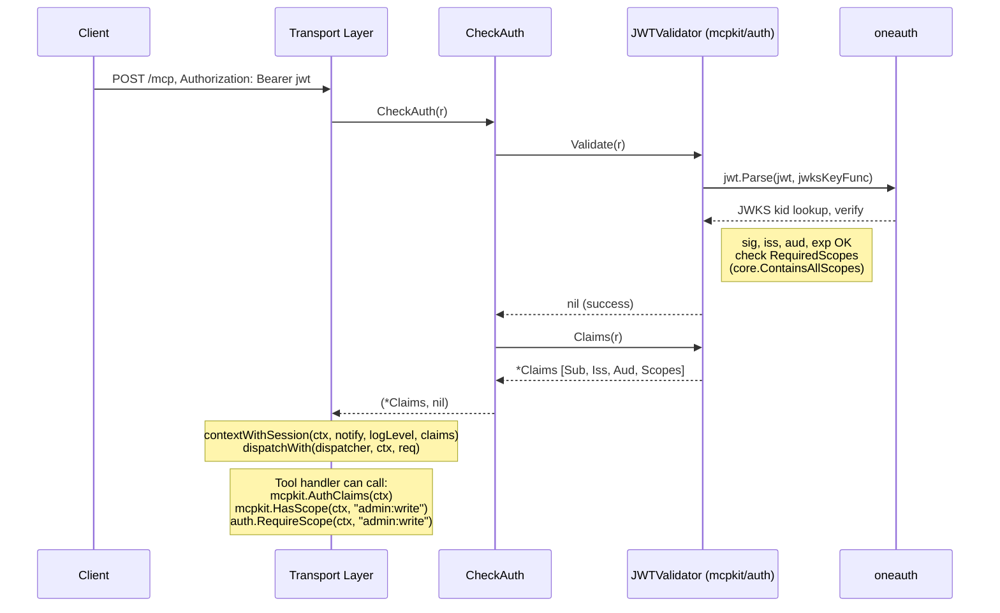
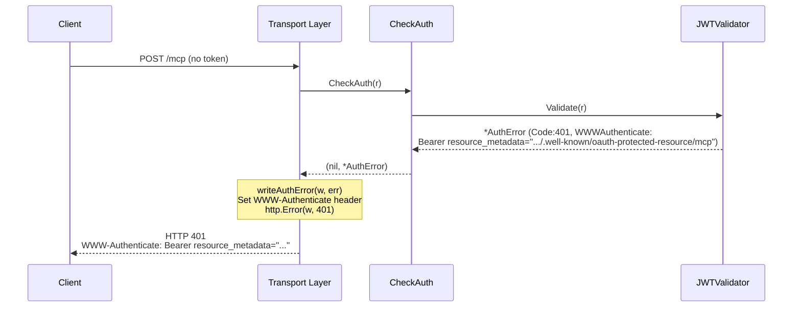
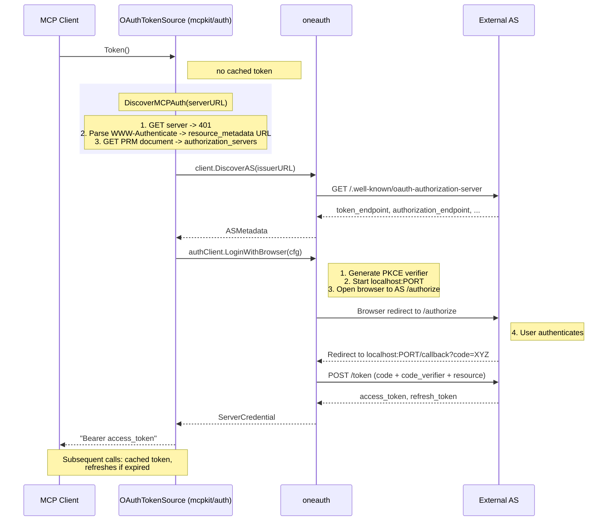
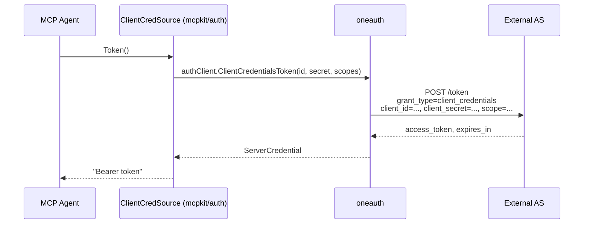
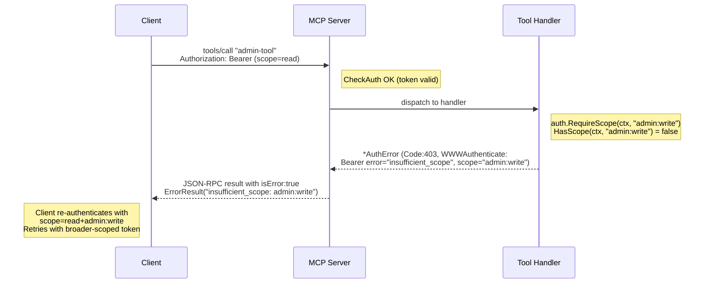

# MCP Auth + Experimental Features — Design

## Overview

MCPKit implements the MCP Authorization specification (draft, based on OAuth 2.1 + RFC 9728) for enterprise deployment. This document covers the architecture, protocol flows, and extension/experimental marking system.

## Design Principles

1. **Core module stays zero-auth-deps** — static bearer token validation works out of the box. JWT/OIDC/OAuth lives in `mcpkit/auth`, a separate Go sub-module that imports oneauth.
2. **Additive extensions** — auth is opt-in. Servers without auth config work exactly as before.
3. **Interface in core, implementation in sub-module** — the core defines contracts (`AuthValidator`, `ClaimsProvider`, `TokenSource`, `ExtensionProvider`); the auth sub-module provides concrete implementations.
4. **Thin adapter over oneauth** — `mcpkit/auth` wraps oneauth's generic OAuth/JWT/OIDC primitives rather than reimplementing them. Only MCP-specific protocol logic (WWW-Authenticate format, PRM orchestration) is implemented from scratch.

## Architecture

```
┌─────────────────────────────────────────────────────────────────┐
│  mcpkit (core module, zero auth deps)                           │
│                                                                 │
│  INTERFACES:                     TYPES:                         │
│  ├─ AuthValidator                ├─ Claims                      │
│  ├─ ClaimsProvider               ├─ AuthError                   │
│  ├─ TokenSource                  ├─ Extension                   │
│  └─ ExtensionProvider            └─ Stability (enum)            │
│                                                                 │
│  CONCRETE (zero-dep):                                           │
│  └─ bearerTokenValidator         (existing, unchanged)          │
├─────────────────────────────────────────────────────────────────┤
│  mcpkit/auth (sub-module, depends on oneauth)                   │
│                                                                 │
│  IMPLEMENTATIONS:                                               │
│  ├─ JWTValidator        → implements AuthValidator+ClaimsProvider│
│  ├─ OAuthTokenSource    → implements TokenSource                │
│  ├─ ClientCredSource    → alias for client.ClientCredentialsSource│
│  └─ AuthExtension       → implements ExtensionProvider          │
│                                                                 │
│  ADAPTERS (wraps oneauth):                                      │
│  ├─ MountAuth()         → oneauth ProtectedResourceHandler      │
│  ├─ DiscoverMCPAuth()   → oneauth client.DiscoverAS             │
│  ├─ RequireScope()      → oneauth core.ContainsScope            │
│  ├─ RegisterClient      → re-export of client.RegisterClient    │
│  └─ ValidatePKCES256()  → MCP-specific PKCE S256 check          │
│                                                                 │
│  MCP-SPECIFIC (not in oneauth):                                 │
│  ├─ WWWAuth401/403()    → MCP resource_metadata parameter       │
│  ├─ ParseWWWAuth()      → client-side header parsing            │
│  └─ DefaultClientReg()  → MCP-specific DCR defaults             │
├─────────────────────────────────────────────────────────────────┤
│  oneauth (external module)                                      │
│  apiauth.APIAuth, keys.JWKSKeyStore, client.DiscoverAS,         │
│  client.LoginWithBrowser, client.ClientCredentialsToken,        │
│  client.RegisterClient, client.ValidateHTTPS, client.ValidateCIMDURL,│
│  client.ClientCredentialsSource, core.UnionScopes,              │
│  core.ContainsScope, apiauth.ProtectedResourceHandler, etc.     │
└─────────────────────────────────────────────────────────────────┘
```

### Why Claims/ClaimsProvider live in mcpkit core

They're the contract between the transport layer and tool handlers. oneauth has its own scattered identity model (`userID`, `scopes`, `customClaims` in separate context keys). `mcpkit.Claims` is a unified struct that adapters map into. If it lived in oneauth, mcpkit core would depend on oneauth, violating the zero-deps principle.

### Authorization vs WWW-Authenticate

- `Authorization: Bearer <token>` — **client → server** header: "here's my credential"
- `WWW-Authenticate: Bearer resource_metadata="...", scope="..."` — **server → client** header on 401/403: "you need auth, here's how to get it"

Standard `WWW-Authenticate: Bearer` is defined in RFC 6750. MCP adds a non-standard `resource_metadata=` parameter pointing to the Protected Resource Metadata endpoint — this is MCP protocol vocabulary. The builders in `mcpkit/auth` emit this MCP-specific format; the parser is also MCP-specific (extracts `resource_metadata`).

## Protocol Flows

### Flow A: Server-side JWT validation (every authenticated request)



### Flow B: Auth failure with WWW-Authenticate (401)



### Flow C: Client-side OAuth (OAuthTokenSource, interactive)



### Flow D: Client Credentials (ClientCredentialsSource, machine-to-machine)



### Flow E: Scope step-up (403 → re-auth with broader scopes)



## Extension and Experimental Marking

MCPKit uses a dual-layer system for marking feature maturity:

### Extension-level (in initialize response)

Extensions declare their spec version and stability:

```go
type Extension struct {
    ID          string         `json:"id"`          // e.g. "io.mcpkit/auth"
    SpecVersion string         `json:"specVersion"` // e.g. "2025-06-18-draft"
    Stability   Stability      `json:"stability"`   // experimental, stable, deprecated
    Config      map[string]any `json:"config,omitempty"`
}
```

Advertised in `initialize` response:
```json
{
  "capabilities": {
    "tools": {},
    "extensions": {
      "io.mcpkit/auth": {
        "specVersion": "2025-06-18-draft",
        "stability": "experimental"
      }
    }
  }
}
```

The `ExtensionProvider` interface allows sub-modules to declare their extension without the core module knowing about them:

```go
type ExtensionProvider interface {
    Extension() Extension
}
```

### Tool-level (in tools/list, resources/list, prompts/list)

Individual tools, resources, and prompts can be annotated:

```go
type ToolDef struct {
    Name        string         `json:"name"`
    Description string         `json:"description"`
    InputSchema any            `json:"inputSchema"`
    Annotations map[string]any `json:"annotations,omitempty"`
}
```

Convention: `{"experimental": true}` marks an individual item.

### Sub-module advantage

`mcpkit/auth` is a separate Go module. It implements `ExtensionProvider` and declares its own stability. Users who `go get mcpkit/auth` explicitly opt into experimental auth. The extension metadata tells clients the spec version and stability level.

## Core Types

### Interfaces (in mcpkit core)

```go
// AuthValidator validates an HTTP request (existing, unchanged).
type AuthValidator interface {
    Validate(r *http.Request) error
}

// ClaimsProvider is optionally implemented by AuthValidators that extract identity.
type ClaimsProvider interface {
    Claims(r *http.Request) *Claims
}

// TokenSource provides access tokens for the MCP client.
type TokenSource interface {
    Token() (string, error)
}

// ExtensionProvider declares a protocol extension with maturity metadata.
type ExtensionProvider interface {
    Extension() Extension
}
```

### Types (in mcpkit core)

```go
type Claims struct {
    Subject  string         `json:"sub"`
    Issuer   string         `json:"iss"`
    Audience []string       `json:"aud"`
    Scopes   []string       `json:"scope"`
    Extra    map[string]any `json:"extra,omitempty"`
}

type AuthError struct {
    Code            int
    Message         string
    WWWAuthenticate string // optional WWW-Authenticate header value
}
```

### Implementations (in mcpkit/auth)

| Type | Implements | Wraps (oneauth) |
|------|-----------|----------------|
| `JWTValidator` | `AuthValidator` + `ClaimsProvider` | `jwt.Parse` with JWKS keyfunc (`JWKSKeyStore.GetKeyByKid`) |
| `OAuthTokenSource` | `TokenSource` | `client.LoginWithBrowser` + `client.DiscoverAS` |
| `ClientCredentialsSource` | `TokenSource` | `client.ClientCredentialsToken` |
| `AuthExtension` | `ExtensionProvider` | (none — declares MCP auth extension metadata) |

## Server Usage

```go
import (
    "github.com/panyam/mcpkit"
    "github.com/panyam/mcpkit/auth"
)

// Create JWT validator
validator := auth.NewJWTValidator(
    "https://auth.example.com/.well-known/jwks.json",  // JWKS URL
    "https://auth.example.com",                         // expected issuer
    "https://mcp.example.com",                          // expected audience (RFC 8707)
    "https://mcp.example.com/.well-known/oauth-protected-resource/mcp",
)

// Create server with auth
srv := mcpkit.NewServer(
    mcpkit.ServerInfo{Name: "my-mcp", Version: "1.0"},
    mcpkit.WithAuth(validator),
    mcpkit.WithExtension(auth.AuthExtension{}),
)

// Mount MCP handler + auth endpoints
mux := http.NewServeMux()
mux.Handle("/mcp", srv.Handler(mcpkit.WithStreamableHTTP(true)))
auth.MountAuth(mux, auth.AuthConfig{
    ResourceURI:          "https://mcp.example.com",
    AuthorizationServers: []string{"https://auth.example.com"},
    ScopesSupported:      []string{"tools:read", "tools:call", "admin:write"},
    MCPPath:              "/mcp",
})
```

## Client Usage

```go
// Static bearer token (simple)
client := mcpkit.NewClient(serverURL, info,
    mcpkit.WithClientBearerToken("my-token"),
)

// OAuth interactive (browser-based)
client := mcpkit.NewClient(serverURL, info,
    mcpkit.WithTokenSource(auth.NewOAuthTokenSource(auth.OAuthConfig{
        ServerURL: serverURL,
        ClientID:  "my-client",
        Scopes:    []string{"tools:call"},
    })),
)

// Machine-to-machine (client credentials)
client := mcpkit.NewClient(serverURL, info,
    mcpkit.WithTokenSource(auth.NewClientCredentialsSource(auth.ClientCredConfig{
        TokenEndpoint: "https://auth.example.com/token",
        ClientID:      "service-account",
        ClientSecret:  "secret",
        Scopes:        []string{"tools:call"},
    })),
)
```

## Spec Compliance Checklist (MCP 2025-11-25)

Source: https://modelcontextprotocol.io/specification/2025-11-25/basic/authorization

### Server-side (MCP server as OAuth resource server)

| # | Requirement | Status | Notes |
|---|-------------|--------|-------|
| S1 | Implement OAuth 2.0 Protected Resource Metadata (RFC 9728) | Phase 2 | `MountAuth` via oneauth `NewProtectedResourceHandler` |
| S2 | PRM document MUST include `authorization_servers` field | Phase 2 | Via `AuthConfig.AuthorizationServers` |
| S3 | Implement at least one PRM discovery: WWW-Authenticate header OR well-known URI | Phase 2 | Both: `JWTValidator` returns WWW-Authenticate, `MountAuth` serves well-known |
| S4 | SHOULD include `scope` in WWW-Authenticate header | Phase 2 | `WWWAuth401(url, scopes...)` |
| S5 | Validate access tokens per OAuth 2.1 Section 5.2 | Done | `JWTValidator` uses `jwt.Parse` with JWKS keyfunc for kid-based key lookup |
| S6 | MUST validate tokens were issued specifically for this server (audience per RFC 8707) | Phase 2 | oneauth `JWTAudience` field + `matchesAudience` (array-aware) |
| S7 | Invalid/expired tokens → HTTP 401 | Done | `CheckAuth` + `writeAuthError` |
| S8 | MUST NOT accept or transit tokens from other issuers | Phase 2 | Issuer check in `JWTValidator` |
| S9 | MUST NOT pass through client tokens to upstream services | N/A | Application responsibility |
| S10 | Insufficient scope → HTTP 403 with `error="insufficient_scope"` | Phase 2 | `RequireScope` returns `AuthError{Code:403, WWWAuthenticate: WWWAuth403(...)}` |
| S11 | 403 SHOULD include `scope`, `resource_metadata`, `error_description` | Phase 2 | `WWWAuth403` builder |
| S12 | MUST use `Authorization: Bearer` header (not query string) | Done | `bearerTokenValidator` + `JWTValidator` read header only |
| S13 | Auth MUST be included in every HTTP request (even same session) | Done | Both transports call `CheckAuth` on every request |

### Client-side (MCP client as OAuth client)

| # | Requirement | Status | Notes |
|---|-------------|--------|-------|
| C1 | MUST support PRM discovery via both WWW-Authenticate header and well-known URI | Done | `DiscoverMCPAuth` — probes server, parses header, falls back to well-known |
| C2 | MUST use resource_metadata from WWW-Authenticate when present, fallback to well-known | Done | `DiscoverMCPAuth` step 2-3 |
| C3 | Well-known fallback: try path-based first, then root | Done | `DiscoverMCPAuth` — `/.well-known/oauth-protected-resource/<path>` then root |
| C4 | MUST support both OAuth AS metadata (RFC 8414) and OIDC discovery | Done | oneauth `client.DiscoverAS` with full fallback chain |
| C5 | AS metadata fallback chain (3 URLs for path, 2 for no-path) | Done | oneauth `client.DiscoverAS` |
| C6 | Client registration priority: pre-registered > CIMD > DCR > prompt user | Done | `OAuthTokenSource.resolveClientID()` |
| C7 | SHOULD support Client ID Metadata Documents | Done | `OAuthTokenSource.ClientMetadataURL` + `client.ValidateCIMDURL` (oneauth) |
| C8 | CIMD: client_id URL MUST use https, contain path, match document URL | Done | `client.ValidateCIMDURL` (oneauth/client/validation.go) |
| C9 | MAY support Dynamic Client Registration (RFC 7591) | Done | `client.RegisterClient` (oneauth) + `OAuthTokenSource.EnableDCR` |
| C10 | MUST implement PKCE with S256 | Done | oneauth `LoginWithBrowser` uses S256 PKCE |
| C11 | MUST verify PKCE support in AS metadata (`code_challenge_methods_supported`) | Done | `ValidatePKCES256` in `token_source.go` |
| C12 | If `code_challenge_methods_supported` absent → MUST refuse to proceed | Done | `ValidatePKCES256` returns error |
| C13 | MUST include `resource` parameter in both auth and token requests (RFC 8707) | Done | `BrowserLoginConfig.Resource = ServerURL` |
| C14 | MUST send `resource` parameter regardless of AS support | Done | Always set in `OAuthTokenSource.Token()` |
| C15 | MUST use `Authorization: Bearer` header (not query string) | Done | `setAuthHeader` in client transports |
| C16 | Auth MUST be included in every HTTP request | Done | Both client transports inject on every call/notify |
| C17 | MUST NOT send tokens to servers other than the intended audience | Done | Token bound to specific `OAuthTokenSource.ServerURL` |
| C18 | Scope selection: use WWW-Authenticate scope > scopes_supported > omit | Done | `DiscoverMCPAuth` scope priority logic |
| C19 | SHOULD implement step-up auth (re-auth on 403 insufficient_scope) | Done | `doWithAuthRetry` + `ScopeAwareTokenSource.TokenForScopes` in client transport |
| C20 | SHOULD implement retry limits for scope step-up | Done | Max 1 retry per status code (401 + 403) in `doWithAuthRetry` |
| C21 | SHOULD use and verify state parameters | Done | oneauth `LoginWithBrowser` generates random state |
| C22 | MUST have redirect URIs registered with AS | Done | Via CIMD or DCR |
| C23 | Secure token storage | Done | oneauth `CredentialStore` |

### Security requirements

| # | Requirement | Status | Notes |
|---|-------------|--------|-------|
| X1 | All AS endpoints MUST be HTTPS | Done | `client.ValidateHTTPS` (oneauth/client/validation.go, localhost exempt) |
| X2 | Redirect URIs MUST be localhost or HTTPS | Done | oneauth `LoginWithBrowser` uses localhost |
| X3 | Refresh token rotation for public clients | Done | AS responsibility, client stores new tokens via `CredentialStore` |
| X4 | Short-lived access tokens | N/A | AS configuration |
| X5 | Secure token storage | Done | oneauth `CredentialStore` (filesystem) |

## oneauth Integration Map

| mcpkit/auth component | oneauth function | oneauth file |
|---|---|---|
| JWTValidator.Validate | `jwt.Parse` + `keys.JWKSKeyStore.GetKeyByKid` | `keys/jwks_keystore.go` |
| JWTValidator (keys) | `keys.NewJWKSKeyStore` | `keys/jwks_keystore.go` |
| MountAuth (PRM) | `apiauth.NewProtectedResourceHandler` | `apiauth/protected_resource.go` |
| MountAuth (AS metadata) | `apiauth.NewASMetadataHandler` | `apiauth/as_metadata.go` |
| RequireScope | `core.ContainsScope` | `core/scopes.go` |
| OAuthTokenSource (discovery) | `client.DiscoverAS` | `client/discovery.go` |
| OAuthTokenSource (auth) | `client.AuthClient.LoginWithBrowser` | `client/browser_login.go` |
| ClientCredentialsSource | `client.AuthClient.ClientCredentialsToken` | `client/client.go` |
| JWT minting (tests) | `apiauth.CreateAccessToken` | `apiauth/auth.go` |
| Introspection (optional) | `apiauth.IntrospectionValidator` | `apiauth/introspection_client.go` |

## File Layout

```
mcpkit/
  auth.go                   # Claims, ClaimsProvider, TokenSource, Extension, Stability, ExtensionProvider
  server.go                 # AuthError (evolved), CheckAuth (evolved), writeAuthError, WithExtension
  logging.go                # sessionCtx.claims, contextWithSession (evolved)
  transport.go              # Auth check on SSE GET (gap fix)
  streamable_transport.go   # Auth check on DELETE (gap fix)
  dispatch.go               # Extensions in handleInitialize
  tool.go                   # Annotations on ToolDef
  resource.go               # Annotations on ResourceDef, ResourceTemplate
  prompt.go                 # Annotations on PromptDef
  client.go                 # TokenSource, WithClientBearerToken, WithTokenSource, header injection
  auth/
    go.mod                  # github.com/panyam/mcpkit/auth
    extension.go            # AuthExtension (ExtensionProvider)
    jwt_validator.go        # JWTValidator (AuthValidator + ClaimsProvider)
    server_auth.go          # MountAuth, AuthConfig
    www_authenticate.go     # WWWAuth401, WWWAuth403, ParseWWWAuthenticate
    scopes.go               # RequireScope
    token_source.go         # OAuthTokenSource, ClientCredentialsSource
    discovery.go            # DiscoverMCPAuth, MCPAuthInfo
  tests/
    e2e/                    # E2E auth tests (separate Go module)
      testenv_test.go       # TestEnv: oneauth TestAuthServer + mcpkit MCP server
      jwt_validation_test.go # 8 tests: valid, expired, wrong iss/aud, tampered
      transport_auth_test.go # 5 tests: Streamable + SSE auth enforcement
      scope_test.go         # 4 tests: RequireScope allowed/denied
      prm_test.go           # 3 tests: PRM well-known endpoints
      www_authenticate_test.go # 3 tests: 401/403 header format
    keycloak/               # Keycloak interop tests (separate Go module)
      realm.json            # mcpkit-test realm (RS256, 2 clients, test user)
      interop_test.go       # 7 tests: Keycloak JWT → mcpkit JWTValidator
```

## Testing

Auth is tested at three levels:

1. **Unit tests** (`auth_test.go`, `auth/www_authenticate_test.go`) — mock validators, claims propagation, header format
2. **E2E tests** (`tests/e2e/`) — real oneauth AS (in-process via `testutil.TestAuthServer`) + real mcpkit MCP server with JWTValidator. RS256 JWTs validated through JWKS. 22 tests covering JWT validation, transport auth, scopes, PRM, WWW-Authenticate.
3. **Keycloak interop** (`tests/keycloak/`) — real Keycloak instance (Docker) issuing tokens validated by mcpkit. 7 tests. Skips gracefully without Docker.

### Scope format compatibility

JWTValidator reads scopes from both formats:
- `"scopes": ["read", "write"]` — oneauth array format
- `"scope": "read write"` — Keycloak/RFC 6749 space-delimited string

This was discovered during Keycloak interop testing (oneauth#68).

### JWT algorithm performance

MCPKit's JWTValidator supports any algorithm the JWKS key store provides (RS256, ES256, EdDSA, etc.). For new deployments, **ES256 (ECDSA P-256) is recommended** over RS256 (RSA-2048) for three reasons:

1. **Verification speed**: ES256 verification is roughly 10x faster than RS256 on modern hardware (~0.01ms vs ~0.1ms per verify). In MCP agent loops with rapid sequential tool calls, this compounds — at 1000 RPS with 10 tool calls per agent turn, RS256 burns ~100ms/s of CPU on signature verification vs ~10ms/s for ES256.

2. **Key size**: ES256 public keys are 64 bytes vs 256 bytes for RSA-2048. Smaller JWKS responses, faster key rotation.

3. **Token size**: ES256 signatures are 64 bytes vs 256 bytes for RS256. Smaller JWTs mean smaller `Authorization` headers on every request.

The validated-token cache (`JWTValidator.CacheTTL`) mitigates verification cost for repeated tokens in steady-state. But cold starts, cache misses, and high-cardinality token scenarios (many distinct users) still hit the verification path, where ES256 has a clear advantage.

**Caveat**: RS256 remains the default signing algorithm in most identity providers (including Keycloak, as configured in our test realm). Switching to ES256 requires explicit authorization server configuration. Consult your IdP documentation for key generation and algorithm settings.
