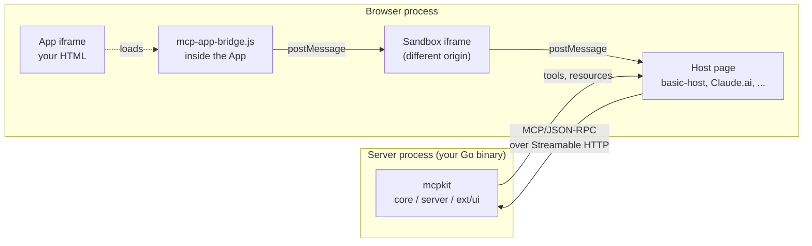
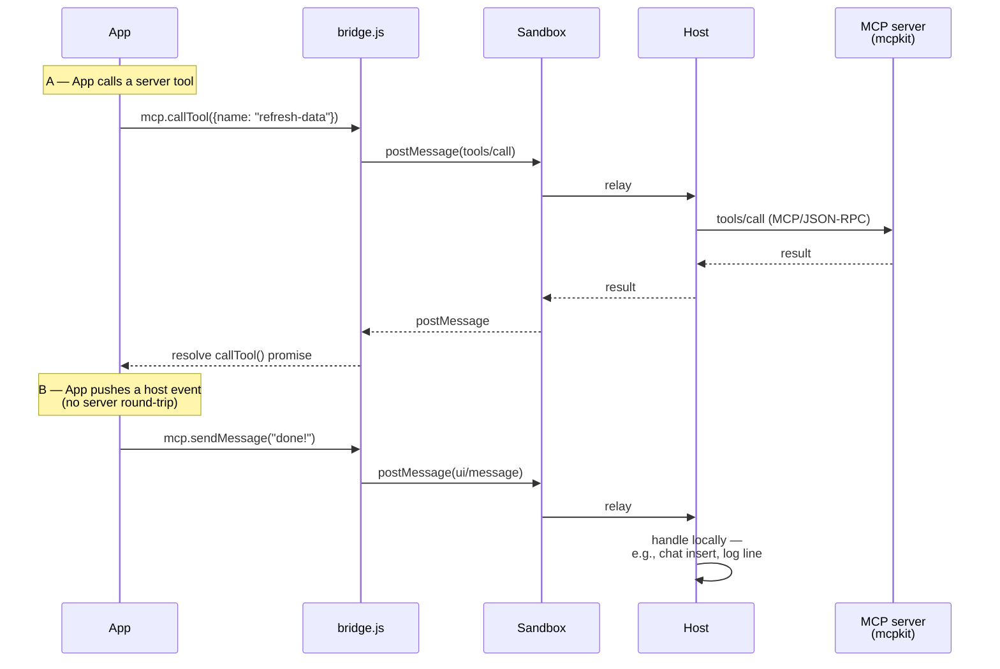

# ext/ui — MCP Apps server support for mcpkit

Go server-side support for the MCP Apps extension (`io.modelcontextprotocol/ui`). Lets you write MCP servers whose tools expose interactive HTML UIs that hosts (basic-host, Claude.ai, ChatGPT, etc.) render in sandboxed iframes.

Separate Go module (`github.com/panyam/mcpkit/ext/ui`) so the core mcpkit module stays zero-deps. Import this package only when you want to advertise MCP Apps support.

> **Looking for the architecture overview?** Read [`examples/apps/FLOW.md`](../../examples/apps/FLOW.md) — explains how basic-host, the sandbox iframe, the App, the bridge JS, and the MCP server fit together.

## Why the bridge exists

The App is a regular HTML/JS bundle running inside a sandboxed iframe in the host's browser. The MCP server is a separate process speaking JSON-RPC. Three problems immediately:

1. **The App can't speak MCP/JSON-RPC directly.** It's in a sandboxed iframe with no network access to the server (sandbox attribute + CSP enforce this).
2. **The App needs to talk to the *host*, not just the server.** Things like "push a message into the chat", "trigger a file download", "request fullscreen" — those aren't MCP tool calls; they're host capabilities the App needs to invoke.
3. **The host and the App live in different iframe origins** (basic-host on `:8080`, sandbox iframe on `:8081`, App iframe nested inside the sandbox). Cross-origin communication has to go through `postMessage`.

The bridge is what lets the App act on all three needs without seeing the MCP protocol directly:



The App calls `mcp.callTool(...)` / `mcp.sendMessage(...)` / etc. Those calls become `postMessage` to the parent (sandbox), which relays to the host. The host then either:

- handles the call locally (it's a host-capability like `sendMessage`, `openLink`, `requestDisplayMode`), or
- forwards it to the MCP server as a JSON-RPC call (it's a `callTool` / `readResource`).

Two example flows make the distinction visible:



This is why mcpkit ships **both** server-side Go code (`core/`, `server/`, `ext/ui/`) **and** a bridge JS library (`ext/ui/assets/mcp-app-bridge.ts` → compiled JS). You need both to write an App from scratch — server-side for the MCP surface, browser-side for the App's interactive behavior.

In the apps-compat flow we test against (`examples/apps/compat/`), the App HTML comes from upstream verbatim and embeds upstream's bridge, so our Go fixtures only need the server side. But when *you* write a new App, mcpkit's bridge JS is what goes in your App HTML.

## What this package provides

### Server-side Go API

| Symbol | Purpose |
|---|---|
| `UIExtension{}` | Extension marker — pass to `server.WithExtension(...)` to advertise MCP Apps support in `initialize` |
| `RegisterAppTool(reg, AppToolConfig)` | Register a tool + its UI resource in one call. Most tools use this. |
| `RegisterTypedAppTool(reg, TypedAppToolConfig[In, Out])` | Typed wrapper — auto-derives `InputSchema` from `In` and `OutputSchema` from `Out` via reflection, wraps the handler. The common path for new code. |
| `AppToolConfig` / `TypedAppToolConfig[In, Out]` | Config structs — fields like `Title`, `Description`, `ResourceURI`, `Execution`, `Visibility`, `CSP`, `Permissions`, `PrefersBorder`, `Domain`, `SupportedDisplayModes`, `TemplateHandler`, `InputSchemaOverride` |
| `ElicitWithApp` / `SampleWithApp` | Helpers that attach `_meta.ui` to server→client elicitation / sampling requests so the host can render rich App UI for the prompt |
| `RefValidator` | Validates at startup that every tool referencing `ui://` resources has a matching resource registered — catches typos early |
| `NotifyResourcesChanged(ctx)` | From inside a tool handler, signal the client that resource lists changed (e.g., after generating a new dynamic resource) |

### Bridge JS (for App authors)

| Asset | Purpose |
|---|---|
| `assets/mcp-app-bridge.ts` → compiled JS + `.d.ts` | TypeScript source for mcpkit's bridge — the JS library that runs inside your App iframe and exposes `mcp.callTool`, `mcp.readResource`, `mcp.sendMessage`, `mcp.sendLog`, `mcp.openLink`, `mcp.updateModelContext`, `mcp.requestDisplayMode`, `mcp.downloadFile`, `mcp.selectFile`/`selectFiles`. Spec-compatible with upstream's bridge. |
| `BridgeTemplateDef()` + `BridgeData` | Go `html/template` integration — drop `{{ template "mcp-app-bridge" . }}` into your App HTML template to inject the bridge inline |
| `ServeBridge()` (HTTP handler) | Serves the bridge JS at `/_mcpkit/mcp-app-bridge.js` for external `<script src>` loading |
| `InjectAppBridge(html)` / `AppShellHTML(title, body)` | Convenience helpers for ad-hoc inline injection |

### Host-side helpers (for harness / agent-runner builders)

| Symbol | Purpose |
|---|---|
| `AppHost` | A Go-side embeddable "host" you can drive programmatically — connects to MCP servers, hands their tools back, runs the bridge protocol. For headless agent harnesses or testing. |
| `ServerRegistry` | Manage multiple MCP server connections in one host process |
| `InProcessBridge` | Drives the bridge protocol without a real iframe — for unit testing App logic against a mcpkit server |

## Quick start (server side)

```go
package main

import (
    "github.com/panyam/mcpkit/core"
    "github.com/panyam/mcpkit/ext/ui"
    "github.com/panyam/mcpkit/server"
)

type weatherInput struct {
    City string `json:"city" jsonschema:"required"`
}

type weatherOutput struct {
    TempC float64 `json:"tempC"`
    Conditions string `json:"conditions"`
}

func main() {
    srv := server.NewServer(
        core.ServerInfo{Name: "weather-app", Version: "1.0"},
        server.WithExtension(&ui.UIExtension{}),
    )

    ui.RegisterTypedAppTool(srv, ui.TypedAppToolConfig[weatherInput, weatherOutput]{
        Name:        "get-weather",
        Title:       "Get Weather",
        Description: "Returns current weather for a city.",
        Execution:   &core.ToolExecution{TaskSupport: core.TaskSupportForbidden},
        Handler: func(ctx core.ToolContext, in weatherInput) (weatherOutput, error) {
            return weatherOutput{TempC: 22.5, Conditions: "sunny"}, nil
        },
        ResourceURI: "ui://weather/mcp-app.html",
        ResourceHandler: func(ctx core.ResourceContext, req core.ResourceRequest) (core.ResourceResult, error) {
            return core.ResourceResult{Contents: []core.ResourceReadContent{{
                URI: req.URI, MimeType: core.AppMIMEType, Text: weatherHTML,
            }}}, nil
        },
    })

    srv.Run(":3101")
}
```

`weatherHTML` would be your App's HTML bundle. For a real one, embed mcpkit's bridge via the `BridgeTemplateDef()` helper and write your UI in whatever framework you like.

## What lives in `_meta.ui` (the MCP Apps spec)

`RegisterAppTool` builds a `core.ToolMeta` that ships under `_meta` on the tool definition:

```json
{
  "name": "get-weather",
  "title": "Get Weather",
  "description": "...",
  "inputSchema": { ... },
  "outputSchema": { ... },
  "execution": { "taskSupport": "forbidden" },
  "_meta": {
    "ui": {
      "resourceUri": "ui://weather/mcp-app.html",
      "visibility": ["model", "app"],
      "csp": { ... },
      "permissions": [ ... ],
      "supportedDisplayModes": ["inline", "fullscreen"]
    },
    "ui/resourceUri": "ui://weather/mcp-app.html"
  }
}
```

The flat `ui/resourceUri` key alongside the nested `ui.resourceUri` is a backward-compat fallback for older clients — mcpkit's `core.ToolMeta` emits both via custom `MarshalJSON` (added in PR 538, mirrors upstream's ext-apps SDK behavior). Unmarshaling accepts either form.

## Escape hatches

`RegisterTypedAppTool` derives schemas via reflection (invopop/jsonschema). When reflection isn't expressive enough:

- **`InputSchemaOverride`** field on `TypedAppToolConfig` — pass a raw `map[string]any` or `json.RawMessage` to bypass reflection entirely. Use when defaults / descriptions contain commas (invopop's struct-tag parser truncates at commas), when you need JSON Schema 2020-12 features (`if`/`then`/`else`, `$anchor`), or when you need byte-for-byte parity with an external reference schema. See PR 545 / issue 542.
- **Drop down to `core.TypedTool` + `srv.RegisterTool`** for tools that don't have their own UI resource (app-only tools that share an iframe). `RegisterTypedAppTool` always pairs a tool with a resource; for the no-resource case use the lower-level API. See examples in `examples/apps/compat/system-monitor/main.go` and `debug-server/main.go`. (Tracked as a gap in issue 548.)

## Related docs

- [`examples/apps/FLOW.md`](../../examples/apps/FLOW.md) — architecture overview (host, sandbox, App, bridge, server)
- [`docs/APPS_DESIGN.md`](../../docs/APPS_DESIGN.md) — design rationale + spec details
- [`docs/APPS_HOST.md`](../../docs/APPS_HOST.md) — the host-side `AppHost` / `ServerRegistry` API
- [`docs/APPS_ONBOARDING.md`](../../docs/APPS_ONBOARDING.md) — onboarding guide for new mcpkit Apps developers
- [`examples/apps/compat/README.md`](../../examples/apps/compat/README.md) — the upstream-parity testing harness
- `CAPABILITIES.md` entries `mcp-apps-*` — feature-by-feature changelog

## Sub-module status

- Separate `go.mod` (see [Sub-Modules in the root `CLAUDE.md`](../../CLAUDE.md#sub-modules)) — `make test` at the repo root does NOT cover this package. Use `make test-ui` or `cd ext/ui && go test ./...`.
- Run `make tidy-all` after touching `core/` imports.
- The bridge JS source (`assets/mcp-app-bridge.ts`) builds via `make build-bridge` (delegates to `assets/`'s pnpm setup).

## Gotchas

- **Tool without a UI resource**: `RegisterTypedAppTool` requires a `ResourceURI` + `ResourceHandler` pair. For tools that don't have their own UI (app-only helpers sharing an iframe), use `core.TypedTool` + `srv.RegisterTool` directly with manual `ToolDef.Meta.UI` construction. Improvement tracked in issue 548.
- **Comma-bearing defaults/descriptions in struct tags**: invopop's tag parser splits on commas; values containing commas get silently truncated. Use `InputSchemaOverride` to bypass. See issue 542 (closed by PR 545).
- **`interface{}` / `any` field in input struct**: produces a schema the MCP SDK client-side zod validator rejects. Use `InputSchemaOverride` with an explicit empty-shape map (`{}` for the `any` field). Tracked in issue 548.
- **Background goroutines** that outlive the tool handler: use `core.DetachForBackground(ctx)` (not `context.WithoutCancel`) — preserves the session-level push channel.
