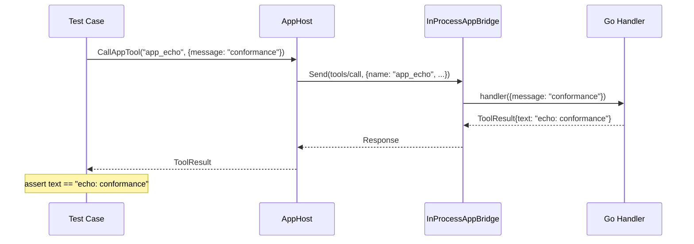
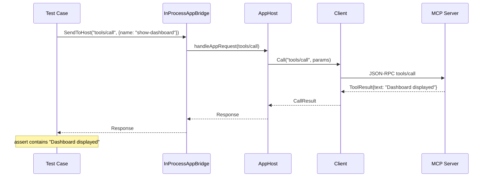
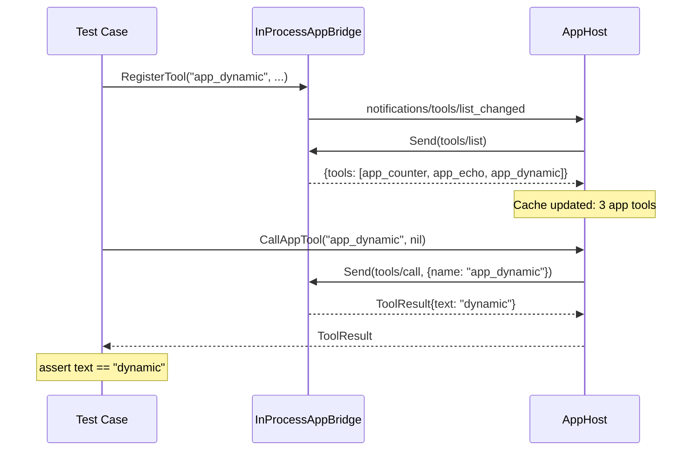
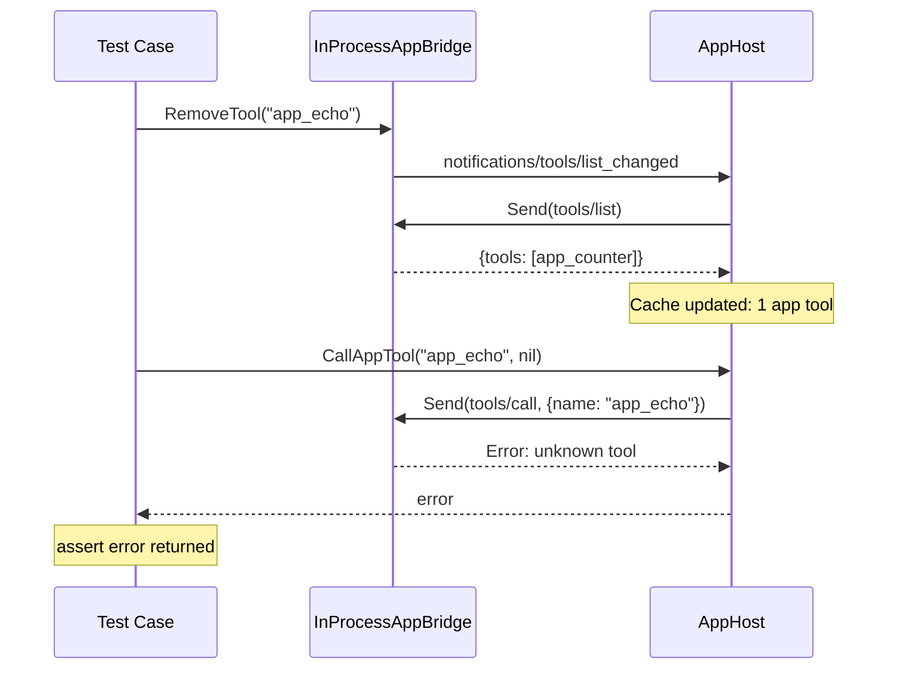

# MCP Apps E2E Tests

End-to-end conformance tests for the MCP Apps extension (`io.modelcontextprotocol/ui`). Each test creates a real MCP server with UI tools/resources, connects a client over Streamable HTTP (via `httptest`), and validates protocol behavior.

## Running

```bash
# From project root
make test-e2e

# Directly
cd tests/e2e && go test ./apps/ -v
```

## Test Categories

### Extension Negotiation (`extension_test.go`)

Verifies that the server advertises the `io.modelcontextprotocol/ui` extension in the initialize response and that the client detects it via `ServerSupportsUI()`.

### Tool Metadata (`meta_test.go`, `tools_test.go`)

Validates `_meta.ui` on tool definitions: `resourceUri`, `visibility`, `csp`, `permissions`, `prefersBorder`, `supportedDisplayModes`. Ensures metadata round-trips correctly through `tools/list`.

### Visibility Filtering (`visibility_test.go`)

Tests `ListToolsForModel()` filtering — tools with `visibility: ["app"]` are excluded from the model-facing list, while tools with `visibility: ["model", "app"]` or no visibility are included.

### Resource Serving (`resources_test.go`)

Validates `ui://` resource serving: correct MIME type (`text/html;profile=mcp-app`), per-content `_meta.ui` on `ResourceReadContent`, template URI parameter substitution, and plain resources without UI metadata.

### Text Fallback (`fallback_test.go`)

Ensures that tools with UI metadata still return text content for non-UI clients.

### Resource Notifications (`tools_test.go`)

Verifies that `mutate-dashboard` triggers `notifications/resources/updated` after calling `NotifyResourcesChanged()`.

### AppHost Conformance (`app_host_test.go`)

Tests the host-side `AppHost` + `InProcessAppBridge` integration with a real MCP server. Covers both request directions and dynamic tool lifecycle.

## Architecture

```
┌──────────────┐    httptest    ┌──────────────┐
│  MCP Server  │◄───────────────│    Client     │
│  (Go, real)  │                │  (Go, real)   │
│              │                │               │
│ show-dashboard│               │ WithUIExt()   │
│ plain-tool   │                └──────┬────────┘
│ ui:// res    │                       │
└──────────────┘                       │
                                ┌──────┴────────┐
                                │   AppHost      │
                                │  (mediator)    │
                                └──────┬────────┘
                                       │
                                ┌──────┴────────┐
                                │ InProcessApp  │
                                │   Bridge      │
                                │               │
                                │ app_counter   │
                                │ app_echo      │
                                └───────────────┘
```

## AppHost Request Flows

### Host calls app-provided tool

The host (or LLM) discovers app tools via `ListAppTools()` and invokes them. The bridge dispatches to the registered Go handler.



### App calls server-side tool

The app calls a server tool through the bridge. AppHost forwards to the MCP server via Client.



### Dynamic tool registration

Registering a tool at runtime fires `notifications/tools/list_changed`, which AppHost handles by refreshing its cached tool list.



### Tool removal

Removing a tool fires `list_changed` and the tool disappears from the cache.



## Test Matrix

| Test | Direction | What it verifies |
|------|-----------|-----------------|
| `TestAppHost_ListAppTools` | host→app | `tools/list` returns registered app tools |
| `TestAppHost_CallAppTool` | host→app | `tools/call` dispatches to correct handler |
| `TestAppHost_AppCallsServerTool` | app→host→server | App request forwarded to MCP server |
| `TestAppHost_ListAllTools` | both | Server + app tools aggregated |
| `TestAppHost_DynamicToolRegistration` | host→app | `list_changed` triggers cache refresh |
| `TestAppHost_ToolRemoval` | host→app | Removed tool disappears from cache |
