# Walkthrough graph (auto-generated)

Run `make graph` to regenerate. Source of truth: each page's `**Prerequisites:**` header.
Nodes are clickable — they link to the page on GitHub (planned pages 404 by design).

```mermaid
graph TD
    apps["apps<br/>(root)"]
    click apps "https://github.com/panyam/mcpkit/blob/main/tutorials/walkthrough/apps.md"
    auth["auth<br/>(root)"]
    click auth "https://github.com/panyam/mcpkit/blob/main/tutorials/walkthrough/auth.md"
    bringup["bringup<br/>(root)"]
    click bringup "https://github.com/panyam/mcpkit/blob/main/tutorials/walkthrough/bringup.md"
    cancellation["cancellation<br/>(leaf)"]
    click cancellation "https://github.com/panyam/mcpkit/blob/main/tutorials/walkthrough/cancellation.md"
    elicitation["elicitation<br/>(leaf)"]
    click elicitation "https://github.com/panyam/mcpkit/blob/main/tutorials/walkthrough/elicitation.md"
    events-hmac["events-hmac<br/>(leaf)"]
    click events-hmac "https://github.com/panyam/mcpkit/blob/main/tutorials/walkthrough/events-hmac.md"
    events-identity["events-identity<br/>(leaf)"]
    click events-identity "https://github.com/panyam/mcpkit/blob/main/tutorials/walkthrough/events-identity.md"
    events-ssrf["events-ssrf<br/>(leaf)"]
    click events-ssrf "https://github.com/panyam/mcpkit/blob/main/tutorials/walkthrough/events-ssrf.md"
    events["events<br/>(root)"]
    click events "https://github.com/panyam/mcpkit/blob/main/tutorials/walkthrough/events.md"
    extension-mechanisms["extension-mechanisms<br/>(root)"]
    click extension-mechanisms "https://github.com/panyam/mcpkit/blob/main/tutorials/walkthrough/extension-mechanisms.md"
    initialize["initialize<br/>(leaf)"]
    click initialize "https://github.com/panyam/mcpkit/blob/main/tutorials/walkthrough/initialize.md"
    list-ttl["list-ttl<br/>(leaf)"]
    click list-ttl "https://github.com/panyam/mcpkit/blob/main/tutorials/walkthrough/list-ttl.md"
    middleware["middleware<br/>(branch *(of [request-anatomy](./request-anatomy.md))*)"]
    click middleware "https://github.com/panyam/mcpkit/blob/main/tutorials/walkthrough/middleware.md"
    mrtr["mrtr<br/>(branch *(of [request-anatomy](./request-anatomy.md))*)"]
    click mrtr "https://github.com/panyam/mcpkit/blob/main/tutorials/walkthrough/mrtr.md"
    notifications["notifications<br/>(root)"]
    click notifications "https://github.com/panyam/mcpkit/blob/main/tutorials/walkthrough/notifications.md"
    request-anatomy["request-anatomy<br/>(root)"]
    click request-anatomy "https://github.com/panyam/mcpkit/blob/main/tutorials/walkthrough/request-anatomy.md"
    reverse-call["reverse-call<br/>(root)"]
    click reverse-call "https://github.com/panyam/mcpkit/blob/main/tutorials/walkthrough/reverse-call.md"
    roots-list["roots-list<br/>(leaf)"]
    click roots-list "https://github.com/panyam/mcpkit/blob/main/tutorials/walkthrough/roots-list.md"
    sampling["sampling<br/>(leaf)"]
    click sampling "https://github.com/panyam/mcpkit/blob/main/tutorials/walkthrough/sampling.md"
    session-resumption["session-resumption<br/>(leaf)"]
    click session-resumption "https://github.com/panyam/mcpkit/blob/main/tutorials/walkthrough/session-resumption.md"
    sse-resumption["sse-resumption<br/>(leaf)"]
    click sse-resumption "https://github.com/panyam/mcpkit/blob/main/tutorials/walkthrough/sse-resumption.md"
    tasks["tasks<br/>(root)"]
    click tasks "https://github.com/panyam/mcpkit/blob/main/tutorials/walkthrough/tasks.md"
    transport-mechanics["transport-mechanics<br/>(root)"]
    click transport-mechanics "https://github.com/panyam/mcpkit/blob/main/tutorials/walkthrough/transport-mechanics.md"

    bringup --> apps
    transport-mechanics --> apps
    extension-mechanisms --> apps
    bringup --> auth
    extension-mechanisms --> auth
    notifications --> cancellation
    reverse-call --> elicitation
    events --> events-hmac
    events --> events-identity
    events --> events-ssrf
    bringup --> events
    transport-mechanics --> events
    notifications --> events
    request-anatomy --> events
    extension-mechanisms --> events
    bringup --> extension-mechanisms
    transport-mechanics --> extension-mechanisms
    notifications --> extension-mechanisms
    request-anatomy --> extension-mechanisms
    bringup --> initialize
    notifications --> list-ttl
    extension-mechanisms --> list-ttl
    request-anatomy --> middleware
    request-anatomy --> middleware
    request-anatomy --> mrtr
    request-anatomy --> mrtr
    extension-mechanisms --> mrtr
    bringup --> request-anatomy
    transport-mechanics --> request-anatomy
    notifications --> request-anatomy
    bringup --> reverse-call
    transport-mechanics --> reverse-call
    request-anatomy --> reverse-call
    reverse-call --> roots-list
    reverse-call --> sampling
    bringup --> session-resumption
    transport-mechanics --> sse-resumption
    request-anatomy --> tasks
    notifications --> tasks
    extension-mechanisms --> tasks

    classDef written fill:#e8f5e9,stroke:#2e7d32,color:#000;
    classDef stub fill:#fff3e0,stroke:#e65100,color:#000;
    class bringup,events,extension-mechanisms,notifications,request-anatomy,transport-mechanics written;
    class apps,auth,cancellation,elicitation,events-hmac,events-identity,events-ssrf,initialize,list-ttl,middleware,mrtr,reverse-call,roots-list,sampling,session-resumption,sse-resumption,tasks stub;
```

