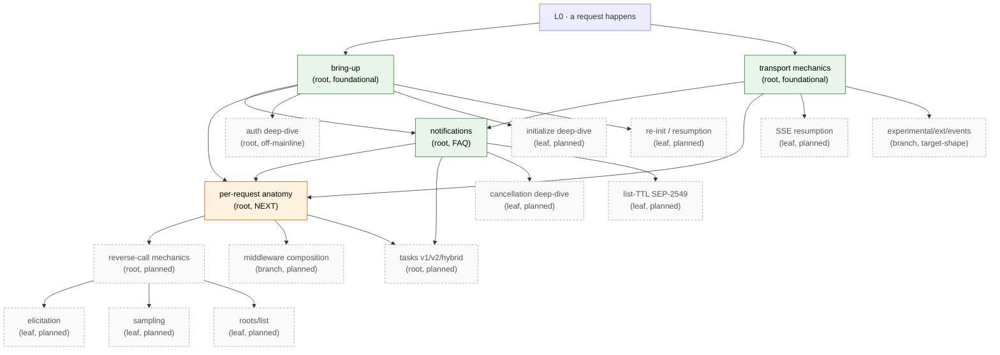

# Walkthrough Index

Single-page projection of the entire walkthrough graph. Per-page headers in the individual files are the source of truth; this file is an aggregated view.

Use this to:

- Draw the full graph without parsing every page header
- Spot orphans (pages no other page leads to / no other page references)
- Check the precondition closure when adding a new root
- See all mid-journey branch points in one place

> [!NOTE]
> When you add or change a page, also update its row here. If this file falls out of sync with the per-page headers, the per-page headers win.

## Nodes

| Page | Kind | Preconditions | End-state (summary) | Leads to |
|------|------|---------------|---------------------|----------|
| [README](./README.md) | meta | — | reader knows where to start and where to find conventions / graph | — |
| [STRUCTURE](./STRUCTURE.md) | meta | — | author/reader knows the DAG model, root contract, note-block roles, branch-point convention, target-shape tracking | — |
| [bring-up](./bringup.md) | root | none (foundational) | session live; transport chosen; auth resolved; protocol version + capabilities locked; `initialized` sent | transport-mechanics; (forthcoming) notifications; (forthcoming) per-request anatomy; (forthcoming) auth deep-dive; (forthcoming) re-init / resumption (leaf) |
| [transport-mechanics](./transport-mechanics.md) | root | none (foundational) | host/session/HTTP-request/SSE-event/JSON-RPC-message arity distinct; wire format known per transport; layering (MCP/JSON-RPC/framing/bytes); POST vs GET roles (POST = client→server one-shot; GET = standing server→client back-channel, may idle); `Mcp-Session-Id` server-issued, mandatory on subsequent requests, **routing key on server (not client filter)**; sessions isolated; JSON-RPC correlation + per-direction ID spaces; reverse-call origination gated by handler context, recorded for cancellation propagation | notifications; (forthcoming) per-request anatomy; (forthcoming) reverse-call; SSE resumption (leaf); experimental events ext (branch) |
| [notifications](./notifications.md) | root *(FAQ-style)* | bring-up, transport-mechanics | six notification families with direction + capability gates; gates fixed at bring-up; list_changed is a hint not a diff; `notifications/cancelled` carries `requestId`, best-effort, `initialize` not cancellable; progress is opt-in per-request via `_meta.progressToken` (not capability-gated); unknown / un-gated notifications dropped silently — asymmetry vs. unknown requests enables forward-compatibility | (forthcoming) per-request anatomy; (forthcoming) tasks; cancellation deep-dive (leaf); list-TTL (leaf, SEP-2549) |

## Mid-journey branch points

Inline `> [!NOTE] **Branch →**` callouts within journeys, aggregated:

| In page | At step | Branches to |
|---------|---------|-------------|
| transport-mechanics | "GET: long-lived server→client back-channel" / `Last-Event-ID` | (forthcoming) SSE resumption |
| transport-mechanics | "GET: long-lived server→client back-channel" / events as first-class | [`experimental/ext/events/`](../../experimental/ext/events/README.md) |
| transport-mechanics | "Reverse-call origination" | (forthcoming) reverse-call mechanics |
| notifications | Q2 / list-changed worked example | (forthcoming) list-TTL (SEP-2549, leaf) |
| notifications | Q3 / cancellation race | (forthcoming) cancellation deep-dive (leaf) |

## Forthcoming nodes (referenced but not yet written)

These are mentioned as "Leads to" or "Branch →" targets on existing pages. Written as the conversation reaches them.

| Planned page | Kind | Will assume | Will establish |
|--------------|------|-------------|----------------|
| **per-request anatomy** *(NEXT)* | root | bring-up, transport-mechanics, notifications | dispatch model, middleware chains, handler context, typed binding, response correlation |
| reverse-call mechanics | root | bring-up, transport-mechanics, per-request anatomy | parent-handler-context constraint operating live; mrtr-on-both-sides symmetry |
| tasks (v1 / v2 / hybrid) | root | per-request anatomy, notifications | long-running operations, detach/resume, task store; the v1→v2 migration shape |
| auth deep-dive | root *(off-mainline)* | bring-up | full OAuth dance, PRM, JWT validation, fine-grained-auth per tool, retry semantics |
| cancellation deep-dive | leaf | notifications | race scenarios, partial-state handling, timeout-vs-cancel distinction, mcpkit's `ctx.Done()` propagation paths |
| list-TTL (SEP-2549) | leaf | notifications | three-state cache-lifetime hint orthogonal to list_changed; for when notifications aren't reliable |
| SSE resumption | leaf | transport-mechanics | replay semantics; `event_ids.go` mechanics |
| middleware composition | branch | per-request anatomy | request-side vs. sending-side; ext/auth and ext/ui interception points |
| initialize deep-dive | leaf | bring-up | full capability flag enumeration; version negotiation edge cases |
| re-init / session resumption | leaf | bring-up | what happens when the underlying transport drops mid-session |
| elicitation, sampling, roots/list | leaves *(each)* | reverse-call mechanics | per-call-type specifics (elicitation form vs. URL mode, sampling model hints, roots security model) |

## Full graph

Solid green = written. Solid orange = next up. Dashed grey = planned but not yet written.

## Orphan / coverage check

- **Pages with no inbound edges** (other than the README/L0): none currently — both written roots are foundational.
- **Pages with no outbound edges**: none currently.
- **Roots whose end-state nothing depends on yet**: bring-up and transport-mechanics each have planned dependents, but until those are written, the dependency is implicit.
