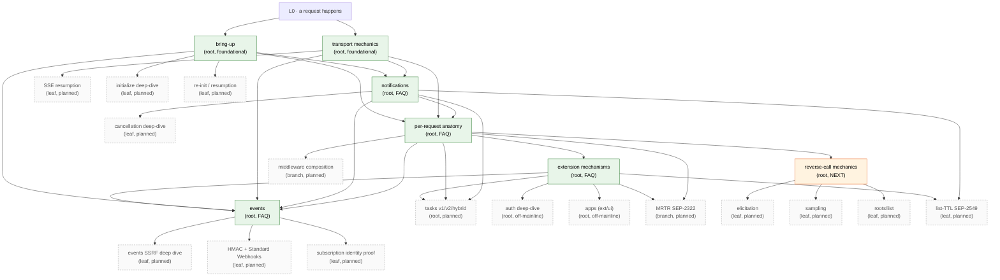

# Walkthrough Index

Single-page projection of the entire walkthrough graph. Per-page headers in the individual files are the source of truth; this file is an aggregated view.

Use this to:

- Draw the full graph without parsing every page header
- Spot orphans (pages no other page leads to / no other page references)
- Check the precondition closure when adding a new root
- See all mid-journey branch points in one place

> [!NOTE]
> When you add or change a page, also update its row here. If this file falls out of sync with the per-page headers, the per-page headers win.

## Nodes

| Page | Kind | Prerequisites | End-state (summary) | Next to read |
|------|------|---------------|---------------------|--------------|
| [README](./README.md) | meta | — | reader knows where to start and where to find conventions / graph | — |
| [STRUCTURE](./STRUCTURE.md) | meta | — | author/reader knows the DAG model, root contract, note-block roles, branch-point convention, target-shape tracking | — |
| [bring-up](./bringup.md) | root | none (foundational) | session live; transport chosen; auth resolved; protocol version + capabilities locked; `initialized` sent | [transport-mechanics](./transport-mechanics.md); [notifications](./notifications.md); [per-request anatomy](./request-anatomy.md) *(planned)*; [auth deep-dive](./auth.md) *(planned)*; [session-resumption](./session-resumption.md) *(planned, leaf)* |
| [transport-mechanics](./transport-mechanics.md) | root | none (foundational) | host/session/HTTP-request/SSE-event/JSON-RPC-message arity distinct; wire format known per transport; layering (MCP/JSON-RPC/framing/bytes); POST vs GET roles (POST = client→server one-shot; GET = standing server→client back-channel, may idle); `Mcp-Session-Id` server-issued, mandatory on subsequent requests, **routing key on server (not client filter)**; sessions isolated; JSON-RPC correlation + per-direction ID spaces; reverse-call origination gated by handler context, recorded for cancellation propagation | [notifications](./notifications.md); [per-request anatomy](./request-anatomy.md); [reverse-call](./reverse-call.md) *(planned)*; [SSE resumption](./sse-resumption.md) *(planned, leaf)*; [events](./events.md) |
| [notifications](./notifications.md) | root *(FAQ-style)* | bring-up, transport-mechanics | six notification families with direction + capability gates; gates fixed at bring-up; list_changed is a hint not a diff; **multi-client fan-out is per-session, not broadcast** — server walks its session map and emits once per qualifying session (audience depends on kind); call-targeted notifs (cancel, progress) go to exactly the one originating session; `notifications/cancelled` carries `requestId`, best-effort, `initialize` not cancellable; progress is opt-in per-request via `_meta.progressToken` (not capability-gated); unknown / un-gated notifications dropped silently — asymmetry vs. unknown requests enables forward-compatibility | [request-anatomy](./request-anatomy.md); [extension-mechanisms](./extension-mechanisms.md); [tasks](./tasks.md) *(planned)*; [cancellation](./cancellation.md) *(planned, leaf)*; [list-ttl](./list-ttl.md) *(planned, leaf, SEP-2549)* |
| [request-anatomy](./request-anatomy.md) | root *(FAQ-style)* | bring-up, transport-mechanics, notifications | end-to-end journey of a request through 13 steps (origination → send-mw → wire → recv-mw → dispatch → handler-context → typed binding → handler → response-encoding → return); handler context contents (id, ctx, session, request/notify hooks, progress emitter, typed params) and lifetime (dies with request unless `DetachForBackground`); four conceptual middleware stacks (client × {send, recv}, server × {send, recv}); typed binding generates schema at registration time, decode + validate at request time; notifications skip pending-id step; reverse calls reuse the same path originated from handler context | [extension-mechanisms](./extension-mechanisms.md); [reverse-call](./reverse-call.md) *(planned)*; [tasks](./tasks.md) *(planned)*; [middleware](./middleware.md) *(planned, branch)*; [mrtr](./mrtr.md) *(planned, branch)* |
| [extension-mechanisms](./extension-mechanisms.md) | root *(FAQ-style)* | bring-up, transport-mechanics, notifications, request-anatomy | four extension surfaces (method namespace · capability flags · notifications · `_meta`); five styles (method-namespace, capability-only, `_meta`-only, bring-up, library-architecture); SEP process + `experimental.<name>` sandbox + graduation; mcpkit's three-tier organization (`core/` → `ext/` → `experimental/ext/`); extension points (registries, middleware, MRTR, custom transports, capability advertisement); case-study table mapping tasks/auth/apps/events/list-TTL/MRTR/elicitation to surfaces; boundary protocol-extension-vs-host/client-policy | [tasks](./tasks.md) *(planned)*; [auth](./auth.md) *(planned)*; [apps](./apps.md) *(planned)*; [reverse-call](./reverse-call.md) *(planned)*; [events](./events.md); [list-ttl](./list-ttl.md) *(planned, leaf)*; [mrtr](./mrtr.md) *(planned, branch)* |
| [events](./events.md) | root *(FAQ-style)* | bring-up, transport-mechanics, notifications, request-anatomy, extension-mechanisms | events dial all four extension knobs (method namespace `events/*` · capability `experimental.events` · 5 push notifications + 2 webhook control envelopes · `_meta` on `Event`/`EventDef`); events vs notifications (domain-defined + replayable vs session-state + idempotent-on-refetch); three delivery modes (poll · push · webhook), all method-namespace extensions, NOT mutually exclusive per source; canonical-tuple subscription identity `(principal, delivery.url, name, params)` → server-derived `sub_<base64>` id, non-load-bearing; three rules (no client id, auth required, client-supplied `whsec_` secret); `YieldingSource` (library-owned buffer, one `yield()` reaches push + webhook) vs `TypedSource` (caller-owned store); cursored vs cursorless; push wire (`events/stream` POST → SSE with `active`/`event`/`heartbeat`/`error`/`terminated` + typed empty `StreamEventsResult`); webhook wire (Standard Webhooks HMAC + dial-time SSRF guard TOCTOU-safe under DNS rebinding, no-redirects, 256 KiB body cap REJECT-not-TRUNCATE, 413 non-retryable, suspend-after-N-in-window, auto-PostTerminated on suspend transition); `deliveryStatus` with categorical `lastError` (spec forbids raw receiver content); refresh reactivates suspended; source health signals first-class (`YieldError` transient stream-stays vs `YieldTerminated` terminal one-shot stream-closes) | [events-ssrf](./events-ssrf.md) *(planned, leaf)*; [events-hmac](./events-hmac.md) *(planned, leaf)*; [events-identity](./events-identity.md) *(planned, leaf)*; [tasks](./tasks.md) *(planned)*; [reverse-call](./reverse-call.md) *(planned)* |

## Mid-journey branch points

Inline `> [!NOTE] **Branch →**` callouts within journeys, aggregated:

| In page | At step | Branches to |
|---------|---------|-------------|
| transport-mechanics | "GET: long-lived server→client back-channel" / `Last-Event-ID` | [SSE resumption](./sse-resumption.md) *(planned)* |
| transport-mechanics | "GET: long-lived server→client back-channel" / events as first-class | [events](./events.md) |
| events | Q3 / subscription-identity tuple worked example | [events-identity](./events-identity.md) *(planned, leaf)* |
| events | Q6 / hardened delivery loop (SSRF guard) | [events-ssrf](./events-ssrf.md) *(planned, leaf)* |
| events | Q6 / hardened delivery loop (HMAC + Standard Webhooks) | [events-hmac](./events-hmac.md) *(planned, leaf)* |
| transport-mechanics | "Reverse-call origination" | [Reverse-call mechanics](./reverse-call.md) *(planned)* |
| notifications | Q2 / list-changed worked example | [List-TTL (SEP-2549)](./list-ttl.md) *(planned, leaf)* |
| notifications | Q3 / cancellation race | [Cancellation deep-dive](./cancellation.md) *(planned, leaf)* |
| extension-mechanisms | Q4 / extension points | [Per-request anatomy](./request-anatomy.md) *(planned)* |

## Forthcoming nodes (referenced but not yet written)

These are mentioned as "Next to read" or "Branch →" targets on existing pages. Each link 404s today; the link is the reminder that the page is real-but-unwritten. The filename column is canonical — written pages will land at exactly that path.

| Planned page | Filename | Kind | Will assume | Will establish |
|--------------|----------|------|-------------|----------------|
| **reverse-call mechanics** *(NEXT)* | [reverse-call.md](./reverse-call.md) | root | bring-up, transport-mechanics, request-anatomy | parent-handler-context constraint operating live; mrtr-on-both-sides symmetry; concretizes elicitation/sampling/roots as method-namespace extensions |
| tasks (v1 / v2 / hybrid) | [tasks.md](./tasks.md) | root | request-anatomy, notifications, extension-mechanisms | long-running operations, detach/resume, task store; the v1→v2 migration shape; `RegisterTasksHybrid` dispatch-by-capability |
| auth deep-dive | [auth.md](./auth.md) | root *(off-mainline)* | bring-up, extension-mechanisms | full OAuth dance, PRM, JWT validation, fine-grained-auth per tool, retry semantics; the canonical "bring-up extension" |
| apps (`ext/ui/`) | [apps.md](./apps.md) | root *(off-mainline)* | bring-up, transport-mechanics, extension-mechanisms | AppHost lifecycle, Bridge JS runtime, ServerRegistry; thin protocol surface, mostly host-architecture |
| MRTR (SEP-2322) | [mrtr.md](./mrtr.md) | branch | per-request anatomy, extension-mechanisms | message-routing-through-middleware in detail; both-sides symmetry |
| cancellation deep-dive | [cancellation.md](./cancellation.md) | leaf | notifications | race scenarios, partial-state handling, timeout-vs-cancel distinction, mcpkit's `ctx.Done()` propagation paths |
| list-TTL (SEP-2549) | [list-ttl.md](./list-ttl.md) | leaf | notifications, extension-mechanisms | three-state cache-lifetime hint orthogonal to list_changed; the canonical `_meta`-only extension |
| SSE resumption | [sse-resumption.md](./sse-resumption.md) | leaf | transport-mechanics | replay semantics; `event_ids.go` mechanics |
| middleware composition | [middleware.md](./middleware.md) | branch | per-request anatomy | request-side vs. sending-side; ext/auth and ext/ui interception points |
| initialize deep-dive | [initialize.md](./initialize.md) | leaf | bring-up | full capability flag enumeration; version negotiation edge cases |
| session resumption | [session-resumption.md](./session-resumption.md) | leaf | bring-up | what happens when the underlying transport drops mid-session |
| elicitation | [elicitation.md](./elicitation.md) | leaf | reverse-call mechanics | form mode vs. URL mode; security implications |
| sampling | [sampling.md](./sampling.md) | leaf | reverse-call mechanics | model selection hints; cost / latency / capability fields |
| roots/list | [roots-list.md](./roots-list.md) | leaf | reverse-call mechanics | filesystem roots security model; client→server reverse |
| events SSRF deep dive | [events-ssrf.md](./events-ssrf.md) | leaf | events | full IP blocklist matrix with worked CIDR examples; dial-time vs subscribe-time decomposition; DNS rebinding attack walkthrough |
| HMAC + Standard Webhooks deep dive | [events-hmac.md](./events-hmac.md) | leaf | events | `webhook-id` semantics across event/control deliveries; multi-signature secret-rotation grace window; `MCPHeaders` opt-in mode; receiver verification in Go and Python |
| subscription identity tuple proof | [events-identity.md](./events-identity.md) | leaf | events | formal walk-through of why the four-tuple is necessary and sufficient: cross-tenant isolation; secret rotation; principal-mapping edge cases |

## Full graph

Solid green = written. Solid orange = next up. Dashed grey = planned but not yet written.

## Orphan / coverage check

- **Pages with no inbound edges** (other than the README/L0): none currently — bring-up and transport-mechanics are foundational; the rest are reached via the prerequisite chain.
- **Pages with no outbound edges**: none currently.
- **Roots whose end-state nothing depends on yet**: every written root is now load-bearing for at least one other written root (events depends on all four prior).
