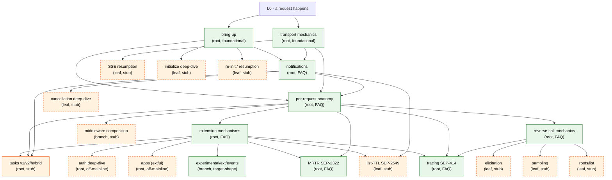

# Walkthrough Index

Single-page projection of the entire walkthrough graph. Per-page headers in the individual files are the source of truth; this file is an aggregated view.

Use this to:

- Draw the full graph without parsing every page header
- Spot orphans (pages no other page leads to / no other page references)
- Check the precondition closure when adding a new root
- See all mid-journey branch points in one place

> [!NOTE]
> When you add or change a page, also update its row here. If this file falls out of sync with the per-page headers, the per-page headers win.

## Nodes

| Page | Kind | Prerequisites | End-state (summary) | Next to read |
|------|------|---------------|---------------------|--------------|
| [README](./README.md) | meta | — | reader knows where to start and where to find conventions / graph | — |
| [STRUCTURE](./STRUCTURE.md) | meta | — | author/reader knows the DAG model, root contract, note-block roles, branch-point convention, target-shape tracking | — |
| [bring-up](./bringup.md) | root | none (foundational) | session live; transport chosen; auth resolved; protocol version + capabilities locked; `initialized` sent | [transport-mechanics](./transport-mechanics.md); [notifications](./notifications.md); [per-request anatomy](./request-anatomy.md) *(stub)*; [auth deep-dive](./auth.md) *(stub)*; [session-resumption](./session-resumption.md) *(stub, leaf)* |
| [transport-mechanics](./transport-mechanics.md) | root | none (foundational) | host/session/HTTP-request/SSE-event/JSON-RPC-message arity distinct; wire format known per transport; layering (MCP/JSON-RPC/framing/bytes); POST vs GET roles (POST = client→server one-shot; GET = standing server→client back-channel, may idle); `Mcp-Session-Id` server-issued, mandatory on subsequent requests, **routing key on server (not client filter)**; sessions isolated; JSON-RPC correlation + per-direction ID spaces; reverse-call origination gated by handler context, recorded for cancellation propagation | [notifications](./notifications.md); [per-request anatomy](./request-anatomy.md) *(stub)*; [reverse-call](./reverse-call.md); [SSE resumption](./sse-resumption.md) *(stub, leaf)*; [experimental events](../../experimental/ext/events/README.md) *(branch)* |
| [notifications](./notifications.md) | root *(FAQ-style)* | bring-up, transport-mechanics | six notification families with direction + capability gates; gates fixed at bring-up; list_changed is a hint not a diff; **multi-client fan-out is per-session, not broadcast** — server walks its session map and emits once per qualifying session (audience depends on kind); call-targeted notifs (cancel, progress) go to exactly the one originating session; `notifications/cancelled` carries `requestId`, best-effort, `initialize` not cancellable; progress is opt-in per-request via `_meta.progressToken` (not capability-gated); unknown / un-gated notifications dropped silently — asymmetry vs. unknown requests enables forward-compatibility | [request-anatomy](./request-anatomy.md); [extension-mechanisms](./extension-mechanisms.md); [tasks](./tasks.md) *(stub)*; [cancellation](./cancellation.md) *(stub, leaf)*; [list-ttl](./list-ttl.md) *(stub, leaf, SEP-2549)* |
| [request-anatomy](./request-anatomy.md) | root *(FAQ-style)* | bring-up, transport-mechanics, notifications | end-to-end journey of a request through 13 steps (origination → send-mw → wire → recv-mw → dispatch → handler-context → typed binding → handler → response-encoding → return); handler context contents (id, ctx, session, request/notify hooks, progress emitter, typed params) and lifetime (dies with request unless `DetachForBackground`); four conceptual middleware stacks (client × {send, recv}, server × {send, recv}); typed binding generates schema at registration time, decode + validate at request time; notifications skip pending-id step; reverse calls reuse the same path originated from handler context | [extension-mechanisms](./extension-mechanisms.md); [mrtr](./mrtr.md); [reverse-call](./reverse-call.md); [tasks](./tasks.md) *(stub)*; [middleware](./middleware.md) *(stub, branch)* |
| [extension-mechanisms](./extension-mechanisms.md) | root *(FAQ-style)* | bring-up, transport-mechanics, notifications, request-anatomy | four extension surfaces (method namespace · capability flags · notifications · `_meta`); five styles (method-namespace, capability-only, `_meta`-only, bring-up, library-architecture); SEP process + `experimental.<name>` sandbox + graduation; mcpkit's three-tier organization (`core/` → `ext/` → `experimental/ext/`); extension points (registries, middleware, custom transports, capability advertisement); case-study table mapping tasks/auth/apps/events/list-TTL/MRTR/elicitation to surfaces; boundary protocol-extension-vs-host/client-policy | [tasks](./tasks.md) *(stub)*; [auth](./auth.md) *(stub)*; [apps](./apps.md) *(stub)*; [reverse-call](./reverse-call.md); [mrtr](./mrtr.md); [experimental events](../../experimental/ext/events/README.md) *(branch)*; [list-ttl](./list-ttl.md) *(stub, leaf)* |
| [mrtr](./mrtr.md) | root *(FAQ-style)* | request-anatomy, extension-mechanisms | `InputRequiredResult` envelope (resultType:"input_required", inputRequests, requestState); retry shape (same tools/call + inputResponses + echoed token); server keeps no state between rounds; `ctx.RequestInput()` handler primitive; dispatch reshape via IsInputRequired sentinel; `CallToolWithInputs` client loop (default 16-round cap, `ErrMRTRMaxRounds`); `DefaultInputHandler` bridges via `dispatchMRTRInputRequest` to same dispatcher real reverse calls use — host's existing sampling/elicitation/roots handlers serve MRTR for free; signed mode (HMAC-SHA256, TTL-bounded, tool-name-pinned) vs plaintext (dev-only); `WithRequestStateSigning` configures both ephemeral MRTR and SEP-2663 tasks; tasks v2 reuses same envelope shape | [tasks](./tasks.md) *(stub)*; [reverse-call](./reverse-call.md); [cancellation](./cancellation.md) *(stub, leaf)* |
| [reverse-call](./reverse-call.md) | root *(FAQ-style)* | request-anatomy, transport-mechanics | three reverse-call methods (sampling/createMessage, elicitation/create, roots/list) with capability gates; spec's "in association with originating call" rule enforced via handler-context-only access to `sessionCtx.request`; bc.Sample / bc.Elicit do capability gate + optional schema reshape (SEP-2356 file-input strip) + origination via `sc.request` hook; `makeRequestFunc(pushFunc)` wires the hook at session setup; client dispatches via `Client.HandleServerRequestWithContext` switch (samplingHandler / elicitationHandler / rootsHandler); MRTR's `dispatchMRTRInputRequest` reuses the same dispatcher; **roots is infrastructure-managed** (cache populated by background fetch on `notifications/roots/list_changed`, read synchronously via `bc.AllowedRoots()`); handler context dies with forward request — `core.DetachForBackground(ctx)` swaps in session-level push via `ReplaceSessionRequestFunc` (not equivalent to `context.WithoutCancel`) | [elicitation](./elicitation.md) *(stub, leaf)*; [sampling](./sampling.md) *(stub, leaf)*; [roots-list](./roots-list.md) *(stub, leaf)*; [mrtr](./mrtr.md); [cancellation](./cancellation.md) *(stub, leaf)*; [otel](./otel.md) |
| [otel](./otel.md) | root *(FAQ-style)* | request-anatomy, extension-mechanisms, reverse-call | tracing off by default (Noop, zero-alloc, base module dep-free; OTel SDK isolated in `ext/otel` own go.mod); install gated on a non-Noop `core.TracerProvider` via `server.WithTracerProvider` / `client.WithTracerProvider`; W3C Trace Context as the cross-SDK wire standard, carried in-band on `_meta.traceparent` / `_meta.tracestate` (bare W3C names, not `io.modelcontextprotocol/`-namespaced) with the SEP-2028 HTTP-header → `_meta` bridge (in-band wins); structure validated, IDs opaque; malformed traceparent drops to zero per W3C MUST-NOT-forward; OTel TracerProvider (heavyweight, per-process, you `Shutdown()`) vs Tracer (cached once in the adapter); trace middleware OUTERMOST both directions (user mw inside the span for latency; outbound `_meta` injection outside user interceptors so they see the final wire); server inbound flow extract→`WithTraceContext`→`StartSpan`→handler→inject→`End`+outcome; child-trace-context rewrite lives in the `ext/otel` adapter (Noop correlates coarsely); client/server symmetry + two asymmetries (no outbound HTTP header, no SpanKind) | [reverse-call](./reverse-call.md); [extension-mechanisms](./extension-mechanisms.md); [`experimental/ext/events/`](../../experimental/ext/events/README.md) *(branch — cross-replica EventBus is a third propagation surface)* |

## Mid-journey branch points

Inline `> [!NOTE] **Branch →**` callouts within journeys, aggregated:

| In page | At step | Branches to |
|---------|---------|-------------|
| transport-mechanics | "GET: long-lived server→client back-channel" / `Last-Event-ID` | [SSE resumption](./sse-resumption.md) *(stub)* |
| transport-mechanics | "GET: long-lived server→client back-channel" / events as first-class | [`experimental/ext/events/`](../../experimental/ext/events/README.md) |
| transport-mechanics | "Reverse-call origination" | [Reverse-call mechanics](./reverse-call.md) |
| notifications | Q2 / list-changed worked example | [List-TTL (SEP-2549)](./list-ttl.md) *(stub, leaf)* |
| notifications | Q3 / cancellation race | [Cancellation deep-dive](./cancellation.md) *(stub, leaf)* |
| extension-mechanisms | Q4 / extension points | [Per-request anatomy](./request-anatomy.md) *(stub)* |

## Stub pages (referenced; header filled out, body TBD)

Each entry below has a real file on disk with a complete page header (Kind, Prerequisites, Reachable from, Branches into, Spec, Code) and an outline of what the eventual full page will cover. Clicking the filename takes you to the stub. The "Will assume" / "Will establish" columns are aspirational — they describe what the *full* page will deliver once written, summarised here so a reader can skim the whole graph from one place.

| Planned page | Filename | Kind | Will assume | Will establish |
|--------------|----------|------|-------------|----------------|
| **tasks (v2)** *(NEXT)* | [tasks.md](./tasks.md) | root | request-anatomy, notifications, extension-mechanisms, mrtr | long-running operations (SEP-2663), task lifecycle, store, queue, session; detach / attach / resume; reuses MRTR's `InputRequiredResult` shape for `input_required` state; `tasks.Register` in `ext/tasks/` (canonical) alongside `server.RegisterTasksV1` (frozen) for v1→v2 transition |
| auth deep-dive | [auth.md](./auth.md) | root *(off-mainline)* | bring-up, extension-mechanisms | full OAuth dance, PRM, JWT validation, fine-grained-auth per tool, retry semantics; the canonical "bring-up extension" |
| apps (`ext/ui/`) | [apps.md](./apps.md) | root *(off-mainline)* | bring-up, transport-mechanics, extension-mechanisms | AppHost lifecycle, Bridge JS runtime, ServerRegistry; thin protocol surface, mostly host-architecture |
| cancellation deep-dive | [cancellation.md](./cancellation.md) | leaf | notifications | race scenarios, partial-state handling, timeout-vs-cancel distinction, mcpkit's `ctx.Done()` propagation paths |
| list-TTL (SEP-2549) | [list-ttl.md](./list-ttl.md) | leaf | notifications, extension-mechanisms | three-state cache-lifetime hint orthogonal to list_changed; the canonical `_meta`-only extension |
| SSE resumption | [sse-resumption.md](./sse-resumption.md) | leaf | transport-mechanics | replay semantics; `event_ids.go` mechanics |
| middleware composition | [middleware.md](./middleware.md) | branch | per-request anatomy | request-side vs. sending-side; ext/auth and ext/ui interception points |
| initialize deep-dive | [initialize.md](./initialize.md) | leaf | bring-up | full capability flag enumeration; version negotiation edge cases |
| session resumption | [session-resumption.md](./session-resumption.md) | leaf | bring-up | what happens when the underlying transport drops mid-session |
| elicitation | [elicitation.md](./elicitation.md) | leaf | reverse-call mechanics | form mode vs. URL mode; security implications |
| sampling | [sampling.md](./sampling.md) | leaf | reverse-call mechanics | model selection hints; cost / latency / capability fields |
| roots/list | [roots-list.md](./roots-list.md) | leaf | reverse-call mechanics | filesystem roots security model; client→server reverse |

## Full graph

Solid green = written. Amber = stub (header only). Solid orange = next up.

## Orphan / coverage check

- **Pages with no inbound edges** (other than the README/L0): none currently — bring-up and transport-mechanics are foundational.
- **Pages with no outbound edges**: none currently.
- **Roots whose end-state nothing depends on yet**: bring-up and transport-mechanics each have planned dependents, but until those are written, the dependency is implicit.
