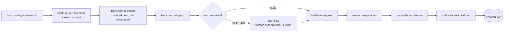

# Bring-up: from host to live session

What happens between *"the host has a config entry mentioning this server"* and *"the host can issue useful requests."*

> **Kind:** root · **Assumes:** nothing (foundational)
> **Reachable from:** [README](./README.md) · **Branches into:** [transport mechanics](./transport-mechanics.md), (forthcoming) per-request anatomy
> **Spec:** [Lifecycle](https://modelcontextprotocol.io/specification/2025-06-18) · **Code:** `core/protocol.go`, `core/auth.go`, `core/www_authenticate.go`, `server/stdio_transport.go`, `server/streamable_transport.go`, `client/command_transport.go`, `ext/auth/`

## Preconditions

**None — this is a foundational root.** A reader needs only general familiarity with client/server concepts, JSON, and HTTP. No other roots required.

## The four phases

Before any "useful" request can flow, four phases happen in order. Some are host-territory (the protocol says nothing about them); others are protocol-territory (the spec is normative).



### 1 — Server selection (host territory, not protocol)

MCP is point-to-point: one client speaks to exactly one server. **The host** (Claude Desktop, an IDE, an agent runtime) is the only thing aware of multiple servers. Selection means: the host reads a config — typically an `mcp.json`-style file — listing entries like

```json
{ "name": "fs",     "command": "mcp-fs", "args": ["--root", "~/work"], "env": {...} }
{ "name": "github", "url": "https://mcp.example.com/", "auth": {...} }
```

…and decides per entry whether to bring up a client now (eager) or on first use (lazy). The protocol says nothing about this — it's host policy plus user consent. From MCP's point of view, "selection" = "the host instantiated a client wired to one server."

> [!WARNING]
> **Target-shape gap (extension):** the [Dec-2025 transport WG post](https://blog.modelcontextprotocol.io/posts/2025-12-19-mcp-transport-future/) introduces **Server Cards** at `/.well-known/mcp.json`, letting a host inspect capabilities *before* opening a session. Today, you must initialize to learn anything.

### 2 — Transport selection (config-driven, not negotiated)

**Transport is never negotiated by MCP.** It's whatever the config entry says it is. The two live transports are:

- **stdio** — host spawns the server as a subprocess; client writes JSON-RPC to its stdin, reads from stdout, treats stderr as opaque host logs.
- **streamable HTTP** — client POSTs JSON-RPC to a URL; the server may answer inline or upgrade to SSE for streaming. Session identified by an `Mcp-Session-Id` header.

(Plus mcpkit's in-memory and command transports, useful for tests and embedding but not specced.)

This is the first place transport choice ripples into the rest of the journey: the *bring-up* mechanics differ wildly, even though everything above the transport line stays identical. → [transport mechanics](./transport-mechanics.md) for what the wire looks like.

### 3 — Connection establishment (transport-specific, possibly auth)

**stdio**: fork/exec the configured command, hook stdin/stdout/stderr. Done. No handshake, no auth. The trust boundary is "the host trusts the binary it spawned" — a process-isolation + user-consent-at-config-time model.
*Code:* `server/stdio_transport.go`, `client/command_transport.go`.

**streamable HTTP**: open the URL. If the server requires auth, the first POST returns `401` with a `WWW-Authenticate` header advertising the auth scheme (typically OAuth 2.x with PKCE for public clients). The client runs the auth dance, then retries with a bearer token. Only after auth resolves does the *protocol-level* handshake start.
*Code:* `core/www_authenticate.go`, `core/auth.go`, `ext/auth/`.

This is a conditional sub-DAG: stdio skips it; HTTP traverses it; future transports may add their own (mTLS preflight, etc.).

> [!NOTE]
> **Auth is a sibling of transport-bring-up, not a child of it.** Auth currently only matters for HTTP, but modeling it as a peer means future transports can plug in differently without duplicating the node.

### 4 — Initialize handshake (transport-agnostic, protocol-level)

Once bytes can flow, the protocol takes over. This is the *only* part of bring-up that's identical across transports.

```mermaid
sequenceDiagram
    participant C as Client
    participant S as Server
    C->>S: initialize { protocolVersion, capabilities, clientInfo }
    Note over C,S: client offers a version it supports
    S->>S: pick negotiated version<br/>(highest mutually supported, or error)
    S-->>C: result { protocolVersion, capabilities, serverInfo, instructions? }
    C->>C: verify negotiated version is acceptable<br/>else close transport
    C->>S: notifications/initialized
    Note over C,S: session live; capability flags now gate all subsequent calls
```

Three things to internalize:

1. **Version negotiation is one-shot, not a range exchange.** Client offers; server picks (its own supported version, ≤ the client's offer); client accepts or hangs up. There's no "let's discuss." See `core/protocol.go`.

2. **Capabilities are the gate.** Whether the client may receive `sampling/createMessage`, the server may issue `roots/list`, either side may send `notifications/.../listChanged`, etc. — all of it is decided here and *cannot* be expanded mid-session. A new capability requires a new session.

   > [!IMPORTANT]
   > Capability flags are not just feature toggles — they are *contracts*. If the client didn't advertise `sampling`, the server must not send `sampling/createMessage`. Implementations that send anyway are buggy; receivers may reject.

3. **`notifications/initialized` is a notification, not a request.** No response. The server must accept incoming traffic *before* it arrives — there's a brief window where the server has answered `initialize` and the client hasn't yet sent `initialized`. The spec resolves this by allowing immediate use after the `initialize` response; `initialized` is more of a barrier signal than a gate.

## End-state (what downstream pages can assume)

After reading this root, the following are true and downstream pages may assume them without re-deriving:

- A **session exists** between exactly one client and one server.
- A **transport is chosen** (stdio | streamable HTTP | …) and bytes can flow in both directions.
- **Auth is resolved** if the transport required it. Subsequent traffic carries credentials transparently.
- A **protocol version is agreed** between client and server (one-shot, never re-negotiated for this session).
- **Capabilities are fixed** for the lifetime of the session — the set of allowed methods and notifications, in each direction, is locked.
- The client has sent `notifications/initialized`, so the session is past the "barrier" point and either side may originate traffic.

What is **not** yet established (and lives in downstream pages):

- The per-request flow itself — dispatch, middleware, handler context, typed binding (forthcoming: per-request anatomy).
- The wire format and correlation model — covered by [transport mechanics](./transport-mechanics.md), itself a peer root.
- Reverse calls, notifications, tasks, resumption — all build on those two roots.

## Leads to

Roots that build on this end-state:

- **[Transport mechanics](./transport-mechanics.md)** — drills into the wire format chosen during bring-up phase 2.
- **(forthcoming) Per-request anatomy** — the per-call flow that runs *inside* an established session. Assumes this root + transport mechanics.
- **(forthcoming) Re-initialization / session resumption** — what happens if the underlying transport drops. Assumes this root.

## Findings (about the DAG itself)

This phase is structurally distinct from per-request flow, and walking it surfaced three structural decisions:

1. **Two L1 anatomies, not one.** L1-bringup (this root) and L1-call (forthcoming). The `session resolution` step in L1-call either resolves to an existing session **or triggers L1-bringup**. Mirrors the spec's lifecycle/operation split.

2. **"Transport" is three concerns at different levels.**
   - At bring-up: transport *establishment* (fork+pipe vs. URL+session-id vs. …)
   - At per-request time: transport *framing* (newline-delimited JSON vs. HTTP body vs. …)
   - For server-initiated traffic: transport *back-channel* (read-side of the same pipe vs. SSE stream vs. …)

   These should be three child nodes under a `transport` parent, not one fused node, because different journeys touch different subsets.

3. **Auth is a sibling of transport, not a child.** Currently only HTTP uses it, but the abstraction allows new transports to plug in without duplicating content.
