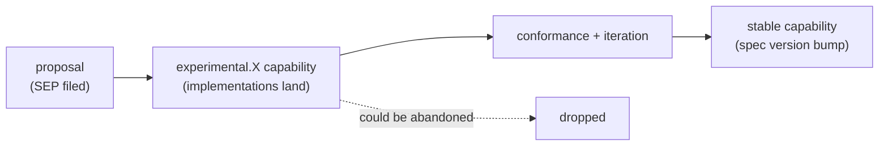

# Extension mechanisms

How MCP grows. What counts as an extension, how new things get into the protocol, how mcpkit organizes them, and how you write your own without forking core. Six questions.

> **Kind:** root *(FAQ-style)* · **Assumes:** [bring-up](./bringup.md), [transport-mechanics](./transport-mechanics.md), [notifications](./notifications.md)
> **Reachable from:** [README](./README.md), [bring-up](./bringup.md) Leads-to, [notifications](./notifications.md) Leads-to
> **Branches into:** [tasks](./tasks.md) *(planned)*, [auth deep-dive](./auth.md) *(planned)*, [apps](./apps.md) *(planned)*, [experimental events](../../experimental/ext/events/README.md)
> **Spec:** [Lifecycle / capabilities](https://modelcontextprotocol.io/specification/2025-06-18) · SEP-2663 (tasks v2) · SEP-2549 (list-TTL) · SEP-2322 (MRTR) · **Code:** `core/protocol.go`, `core/typed_tool.go`, `server/registration.go`, `server/middleware.go`, `server/dispatch.go`, `server/mrtr.go`, `ext/auth/`, `ext/ui/`, `experimental/ext/`

## Prerequisites

- You understand what a capability is and that capabilities are negotiated at bring-up. → If not, read [bring-up](./bringup.md).
- You can read JSON-RPC messages and know that methods are named strings. → If not, read [transport mechanics](./transport-mechanics.md).
- You know how notifications are gated by capability. → If not, read [notifications](./notifications.md).

## Context

MCP grows by extension. Tasks, auth, apps, events, list-TTL, MRTR — everything beyond the core protocol — works through a small set of shared mechanisms (capability flags, method namespaces, `_meta`, notifications) plus mcpkit's code-level extension points (registries, middleware, sub-modules). Naming the mechanisms once gives you the vocabulary to read "this extension uses SEP-X" or "this is a `_meta`-only extension" and immediately know what's going on.

## Q1 — What counts as an "extension" in MCP?

The protocol has **four extension surfaces**. Any extension uses one or more of them.

| Surface | What it lets you add | Gated by | Example |
|---------|---------------------|----------|---------|
| **Method namespace** | new JSON-RPC methods, typically under a prefix (`tasks/*`, `elicitation/*`) | a capability declared at bring-up | `tasks/create` (SEP-2663), `elicitation/create` |
| **Capability flags** | new keys under each side's `capabilities` object — stable or `experimental.<name>` | spec assigns the name; experimental is a sandbox | `tools.listChanged`, `experimental.events` |
| **Notification methods** | new fire-and-forget messages, capability-gated | usually a `<area>.listChanged`-style flag declared by the emitter | `notifications/resources/updated` |
| **`_meta` fields** | opt-in metadata on existing requests/responses; doesn't change the method's semantics | per-call opt-in by the requester | `_meta.progressToken` (progress), `_meta` cache-TTL hint (SEP-2549) |

Most extensions combine multiple surfaces. Useful **styles** to recognize:

| Style | Combines | Examples |
|-------|----------|----------|
| **Method-namespace extension** | new prefix + new capability + (often) new notifications | tasks (SEP-2663), elicitation, sampling |
| **Capability-only extension** | new capability flag + reuses an existing notification method | logging (`logging` cap + `notifications/message`) |
| **`_meta`-only extension** | one or more `_meta` fields, no new methods or capabilities | list-TTL (SEP-2549) |
| **Bring-up extension** | extends the connection-establishment phase, not the message exchange | auth — WWW-Authenticate / OAuth dance lives at the HTTP layer, before `initialize` |
| **Library-architecture extension** | mostly *around* the protocol; thin protocol surface | apps (`ext/ui/`) — host-side AppHost / Bridge / Registry; the protocol part is small |

Worth internalizing: **the four surfaces are knobs, not categories.** A new feature picks which knobs to turn. Tasks turns three (methods + capability + notifications); list-TTL turns one (`_meta`); auth turns none of the four because it extends the layer below MCP.

## Q2 — How does a new capability get into the protocol?

Through **SEPs (Standard Enhancement Proposals)** — MCP's RFC-style process. Roughly:

1. **Proposal** — someone files a SEP in the `modelcontextprotocol/specification` repo. Numbered (e.g. SEP-2663). Specifies the new methods / capabilities / notifications / `_meta` fields.
2. **Experimental landing** — the SEP can be implemented behind an `experimental.<name>` capability. Both sides advertise it; receivers MUST ignore experimentals they don't recognize. This is the protocol's sandbox.
3. **Conformance work** — implementations like mcpkit run conformance suites against the SEP (mcpkit: `make testconf`, plus per-SEP suites — `testconf-tasks-v2` for SEP-2663, `testconf-list-ttl` for SEP-2549, `testconf-mrtr` for SEP-2322).
4. **Graduation** — when the design stabilizes, the SEP merges into a stable spec version. The `experimental.` prefix drops; the capability gets a stable name.



> [!IMPORTANT]
> The `experimental` namespace is **not** a free-for-all. Receivers MUST ignore unrecognized experimentals — that's what lets emitters advertise them safely. But emitters MUST NOT depend on experimentals being supported; if the negotiated capabilities don't include yours, you don't use it. This is what makes SEPs land without breaking older clients.

**Concrete examples in mcpkit** (each in its own root or leaf):

- **SEP-2663 — [tasks v2](./tasks.md)** *(planned)*. Long-running operations as a first-class concept. Adds `tasks/*` methods + a `tasks` capability. mcpkit has v1 (frozen), v2 (canonical), and `RegisterTasksHybrid` for both — a transition pattern worth its own root.
- **SEP-2549 — [list-TTL](./list-ttl.md)** *(planned)*. Three-state cache-lifetime hint on list responses (`nil` / `&0` / `&N>0`). Pure `_meta` extension — no new methods or capabilities.
- **SEP-2322 — [MRTR](./mrtr.md)** *(planned)*. Middleware request/transport routing. Mostly mcpkit-architecture; thin spec surface (an ephemeral capability flag).

## Q3 — What does an extension look like in mcpkit's code organization?

mcpkit's package layout maps directly to the extension lifecycle:

```
core/                         ← protocol types; everything depends on this
server/                       ← server impl (dispatch, middleware, transports, tasks)
client/                       ← client impl (transports, reconnect, auth retry)

ext/auth/                     ← stable extension, separate go.mod
ext/ui/                       ← stable extension (Apps), separate go.mod

experimental/ext/protogen/    ← in-flux: proto → MCP codegen
experimental/ext/events/      ← in-flux: events as first-class
```

Three tiers, by stability:

| Location | Stability | go.mod | Promotion path |
|----------|-----------|--------|----------------|
| `core/` | stable, foundational, breaks rarely | shared with root | (would only move if relocating something) |
| `ext/<name>/` | stable enough for production | **separate** | could fold into core if a hard dependency, otherwise stays here |
| `experimental/ext/<name>/` | in flux, may break, may not become standard | separate | promote to `ext/` when the API stabilizes; drop if abandoned |

**Why separate `go.mod` for ext / experimental.** Three reasons:

1. **No forced dependencies** — a consumer using only the core MCP server doesn't pull in OAuth machinery, Apps Bridge JS dependencies, or experimental codegen. Smaller binary, fewer CVEs to track.
2. **Independent versioning** — `ext/auth` can iterate without forcing a root version bump.
3. **Smaller blast radius** — a breaking change in `experimental/ext/events` doesn't touch consumers of `core/` or `server/`.

> [!NOTE]
> The cost is module discipline. Adding a new `core/` import that an extension needs requires `make tidy-all` to update sub-module `go.sum` files. CLAUDE.md flags this as a recurring gotcha.

## Q4 — How do you write a server-side feature without forking core?

mcpkit's extension points, roughly in order of how often you'll reach for them:

| Extension point | What you plug in | Where |
|-----------------|------------------|-------|
| **Tool / prompt / resource registries** | a function or struct that handles one named item | `RegisterTool`, `RegisterPrompt`, `RegisterResource` in `server/registration.go` |
| **Typed binding** | Go structs with tags; mcpkit handles JSON↔Go marshal + schema validation | `core/typed_tool.go` |
| **Middleware** | wrap any method or all methods on either receive-side or send-side | `server/middleware.go`, `client/middleware.go` |
| **MRTR (SEP-2322)** | message-routing pipeline, generalizes middleware across sides | `server/mrtr.go`, `client/mrtr.go` |
| **Custom transports** | implement the transport interface | `server/transport.go` (interfaces); existing examples in `stdio_transport.go`, `streamable_transport.go`, `memory_transport.go` |
| **Capability advertisement** | declare your custom capabilities in `initialize` response (server) or request (client) | `core/protocol.go` |
| **Method handlers** | bypass typed binding for raw JSON-RPC handling | `server/method_handler.go` |
| **Tasks (`RegisterTasks` / hybrid)** | register long-running operation handlers | `server/tasks_v2.go`, `server/tasks_hybrid.go` |

The general shape: you add **registrations** at server start (or client side), the runtime picks them up via dispatch, and middleware wraps the call path. You never need to modify `core/` or `server/` to add functionality.

> [!NOTE]
> **Branch →** [Per-request anatomy](./request-anatomy.md) *(planned)*. The dispatch + middleware + handler-context internals that make these extension points work. Important if you're writing custom middleware or doing anything past simple `RegisterTool`.

## Q5 — Case studies: how tasks, auth, apps, events, list-TTL, MRTR, elicitation each map to the mechanisms above

Brief — each gets its own full root or leaf.

| Extension | Style | Surfaces used | Where |
|-----------|-------|---------------|-------|
| **Tasks** (SEP-2663) | method-namespace | `tasks/*` methods + `tasks` capability + reuses progress notifications + has its own task store concept | `server/tasks_v2.go`, `server/task_store.go` · v1/v2/hybrid coexistence is mcpkit-specific |
| **Auth** | bring-up extension | none of the four MCP surfaces — extends the HTTP layer below: `WWW-Authenticate` + OAuth + bearer token per request | `core/auth.go`, `core/www_authenticate.go`, `ext/auth/` (separate `go.mod`) |
| **Apps** | library-architecture | thin protocol surface; bulk is host-architecture (AppHost lifecycle, Bridge JS runtime, ServerRegistry tracking live servers) | `ext/ui/` (separate `go.mod`) · docs in `docs/APPS_DESIGN.md`, `docs/APPS_HOST.md`, `docs/APPS_ONBOARDING.md` |
| **Events** | experimental, target-shape | `experimental.events` capability; explores events as first-class beyond raw SSE event-id replay | `experimental/ext/events/` |
| **List-TTL** (SEP-2549) | `_meta`-only | a `*int` field with explicit-zero semantics on list responses; no new methods or capabilities | hooked into existing list responses; conformance via `make testconf-list-ttl` |
| **MRTR** (SEP-2322) | library-architecture w/ thin protocol surface | message-routing-through-middleware on both sides; ephemeral capability flag | `server/mrtr.go`, `client/mrtr.go` |
| **Elicitation** | method-namespace | `elicitation/create` method + `elicitation` capability declared by client; Form mode + URL mode | `core/elicitation.go` · server-originates, client receives |

Reading this table is the fastest way to see the *shape* of MCP's extension landscape. Each extension turns one or more of the four knobs from Q1.

## Q6 — Where's the boundary between protocol extension and host/client policy?

Easy to conflate. Things that are **not** extensions, even though they look like new behavior:

- **Multi-server orchestration** — a host config has Jira + Slack + Glean; the host decides which session a tool call goes to. The protocol is point-to-point (one client ↔ one server); routing across servers is host-side.
- **Tool selection by the model** — the model picks `jira_search` from the tool list it was given. The pick happens above MCP entirely.
- **Caching policies** — the client may cache tools/prompts/resources catalogs; the server may cache its own state. The protocol gives hints (list_changed, list-TTL) but doesn't dictate cache shape.
- **UI surface** — how the host shows progress to the user, how it lays out elicitation forms, how it displays log notifications. All policy.
- **Auth UX** — *who* the user is and *how* the OAuth dance is presented to them is host policy. Auth itself (WWW-Authenticate / token issuance / refresh) *is* protocol-relevant — that's the bring-up extension. The line is "what's on the wire vs. what the user sees."
- **Server discovery and lifecycle** — eager-vs-lazy connect, when to terminate a session, host config files. All policy.
- **Logging back-end** — server emits `notifications/message`; what the host does with the messages (display, ship to a logging service, drop) is policy.

The rule of thumb: **if it can be observed on the wire between client and server, it's protocol; if it only manifests in the host's behavior, it's policy.** Extensions live on the protocol side. Many seemingly-new features turn out to be policy in disguise — useful to spot early so you don't try to spec them.

## End-state (what downstream pages can assume)

After reading this root, downstream pages can assume:

- You know the **four extension surfaces** (method namespace, capability flags, notifications, `_meta`) and the common **styles** that combine them.
- You know the **SEP process** and the role of `experimental.<name>` capabilities as a sandbox; you can read "this extension uses SEP-XXXX" and have a sense of where it sits in the maturity curve.
- You know mcpkit's **three-tier organization** (`core/` → `ext/` → `experimental/ext/`) and why some extensions get their own `go.mod`.
- You know the **mcpkit extension points** — registries, middleware, MRTR, custom transports, capability advertisement — and that you don't need to fork core to add a server-side feature.
- You can read the **case-study table** and tell at a glance which surfaces each extension uses.
- You can distinguish **protocol extension from host/client policy** — both are "new behavior," but only the former is an extension in the technical sense.

## Next to read

- **[Per-request anatomy](./request-anatomy.md)** *(planned, root, NEXT)* — dispatch internals that make registries + middleware + MRTR actually run.
- **[Tasks v1/v2/hybrid](./tasks.md)** *(planned, root)* — the deep walk on the largest method-namespace extension, including the v1→v2 migration and `RegisterTasksHybrid` dispatch-by-capability pattern.
- **[Auth deep-dive](./auth.md)** *(planned, root, off-mainline)* — the bring-up extension; full OAuth/PRM/JWT/fine-grained-auth.
- **[Apps](./apps.md)** *(planned, root)* — the library-architecture extension; AppHost/Bridge JS/ServerRegistry. Mostly mcpkit-side, thin protocol surface.
- **[Reverse-call mechanics](./reverse-call.md)** *(planned, root)* — concretizes elicitation, sampling, roots/list as the same method-namespace pattern.
- **[MRTR deep-dive](./mrtr.md)** *(planned, branch off per-request anatomy)* — SEP-2322 in detail.
- **[List-TTL (SEP-2549)](./list-ttl.md)** *(planned, leaf off notifications)* — the canonical `_meta`-only extension; orthogonal to list_changed.
- **[`experimental/ext/events/`](../../experimental/ext/events/README.md)** *(branch, target-shape)* — events as first-class.
