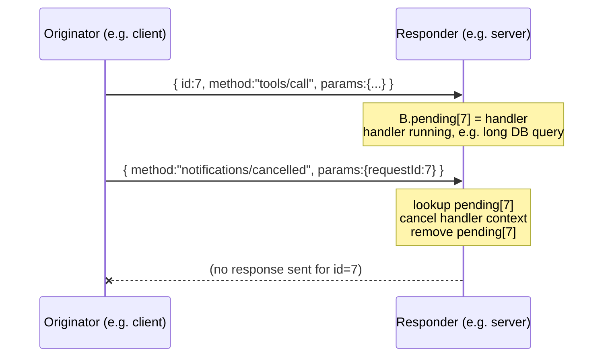

# Notifications

The session's state-change channel. Seven common questions answered end-to-end.

> **Kind:** root · **Assumes:** [bring-up](./bringup.md), [transport-mechanics](./transport-mechanics.md)
> **Reachable from:** [README](./README.md), [bring-up](./bringup.md) Leads-to, [transport-mechanics](./transport-mechanics.md) Leads-to
> **Branches into:** [per-request anatomy](./request-anatomy.md) *(stub)*, [tasks](./tasks.md) *(stub)*, [cancellation deep-dive](./cancellation.md) *(stub, leaf)*
> **Spec:** [Base protocol — notifications](https://modelcontextprotocol.io/specification/2025-06-18) · [Cancellation](https://modelcontextprotocol.io/specification/2025-06-18) · [Progress](https://modelcontextprotocol.io/specification/2025-06-18) · [Logging](https://modelcontextprotocol.io/specification/2025-06-18) · **Code:** `core/jsonrpc.go`, `core/progress.go`, `core/logging.go`, `core/resource_notify.go`, `server/dispatch.go`

## Prerequisites

- You have a live MCP session — capabilities are negotiated, the transport is chosen, `initialized` has been sent. → If not, read [bring-up](./bringup.md).
- You can read a JSON-RPC message off the wire and know that a notification has no `id`, gets no response, and uses the same channels as requests. → If not, read [transport mechanics](./transport-mechanics.md).

## Context

Notifications are the **state-change channel of a session**. They're capability-gated by what was negotiated at bring-up, coupled to session-local namespaces (`progressToken`, request id), and the way most cross-cutting MCP features — cancellation, progress, list invalidation, resource updates, logging — actually move information through the system.

## Q1 — What kinds of notifications exist, and who can send what?

Seven families — six from core MCP and one added by the tasks extension. Each has a direction, a capability gate (or none), and a coupling to other session state.

| Family | Method | Direction | Capability gate | Coupled to |
|--------|--------|-----------|-----------------|------------|
| **Lifecycle** | `notifications/initialized` | client → server | none (part of bring-up itself) | session bring-up barrier |
| **Cancellation** | `notifications/cancelled` | either | none (always allowed) | targets a pending request id (params: `requestId`, `reason`) |
| **Progress** | `notifications/progress` | either | none (always allowed); receiver opts in per-request | `progressToken` carried in originating request's `_meta` |
| **List-changed** *(catalogs)* | `notifications/tools/list_changed`<br/>`notifications/prompts/list_changed`<br/>`notifications/resources/list_changed` | server → client | `<area>.listChanged` declared by server | invalidates client's cached catalog for that area |
| **List-changed** *(roots)* | `notifications/roots/list_changed` | client → server | `roots.listChanged` declared by client | invalidates server's cached roots |
| **Resource updates** | `notifications/resources/updated` | server → client | `resources.subscribe` + an active subscription | one specific subscribed resource (params: `uri`) |
| **Logging** | `notifications/message` | server → client | `logging` declared by server (level optionally set via `logging/setLevel` request) | log entry; host surfaces to user |
| **Task status** *(extension)* | `notifications/tasks/status` | server → client | tasks extension declared at session **or** per-request (SEP-2575) | task lifecycle transition; carries `DetailedTask` + `requestState` ([Q7](#q7--how-do-tasks-fit-in-notificationstaskstatus-vs-subscriptionlisten-patterns)) |

Three categories on the gate column:

- **None** — base protocol; both sides should always handle. Lifecycle, cancellation, progress.
- **Capability declared by emitter** — emitter says "I will send these"; receiver may choose how to react. List-changed family, logging.
- **Per-call opt-in** — receiver says "I want updates for this specific call" via the request itself. Progress's `progressToken`, resource subscribe's `resources/subscribe`, SEP-2575's per-request `_meta.io.modelcontextprotocol/clientCapabilities` ([Q6](#q6--per-request-capability-declaration-sep-2575-and-stateless-servers)).

> [!IMPORTANT]
> **Session-level** capability gating is set at bring-up and does not change mid-session. If the server didn't declare `tools.listChanged` at `initialize`, it cannot emit `notifications/tools/list_changed` at any point in this session — that gate is locked.
>
> **There is a second layer.** [SEP-2575](#q6--per-request-capability-declaration-sep-2575-and-stateless-servers) (landed) lets a client declare capabilities **per-request** via `_meta.io.modelcontextprotocol/clientCapabilities`. The override is *additive* (it cannot revoke a session-level declaration) and only applies for the duration of that one request. It's the mechanism that makes stateless servers and capability-shim deployments work. Per-request overrides affect **request-bound** notifications (progress, task status) — they do **not** affect unsolicited server-initiated notifications like `list_changed`. See [Q6](#q6--per-request-capability-declaration-sep-2575-and-stateless-servers) for the full story.

## Q2 — How does the server tell the client its tools list changed?

The worked example. Anchors the list-changed family in real wire bytes.

**Setup assumed:** session `abc123` is live; bring-up negotiated `capabilities.tools.listChanged: true` on the server side; the standing GET (HTTP request #4 from the [bringup walkthrough](./bringup.md)) is open and idle.

**Step 1 — server-side state changes.** A tool plugin loads, an admin toggles a permission, whatever. The server's tool catalog is now different from what the client last saw via `tools/list`.

**Step 2 — server emits the notification on the standing GET.** No payload beyond the method name — the notification is a hint, not a diff:

```http
                                                   ← still HTTP request #4 (the standing GET)
id: 17                                             ← SSE event id, the GET stream's own counter
data: {"jsonrpc":"2.0","method":"notifications/tools/list_changed"}
```

That's it. No `id` (notifications don't get one), no params (the spec doesn't pass a diff — the contract is "refetch when you care").

**Step 3 — client invalidates its cached catalog.** The MCP client's notification dispatcher routes `notifications/tools/list_changed` to its handler. Handler marks the cached tools catalog stale. mcpkit example: the client's per-area cache flips a "needs refetch" flag.

**Step 4 — next use triggers a refetch.** Sometime later (could be milliseconds, could be never if no tool is needed), the host wants to know what tools are available. Cache is stale, so the client refetches:

```http
POST /mcp HTTP/1.1                                 ← HTTP request #N (a fresh POST)
Mcp-Session-Id: abc123
Accept: application/json, text/event-stream

{"jsonrpc":"2.0","id":11,"method":"tools/list"}
```

**Step 5 — server returns the new list:**

```http
HTTP/1.1 200 OK
Content-Type: application/json
Mcp-Session-Id: abc123

{"jsonrpc":"2.0","id":11,"result":{"tools":[...new catalog...]}}
```

Catalog is fresh again. Client's cache is repopulated.

**Things to notice:**

- **No diff is transmitted.** The notification carries only "something changed in this area." Refetch is the protocol. Saves bandwidth, simplifies semantics, no schema for diffs to maintain.
- **Refetch is lazy on the client.** Spec doesn't mandate immediate refetch. Most clients invalidate cache + refetch on next access. mcpkit's pattern matches this.
- **Receiver-side action is up to the client.** A client that doesn't cache catalogs may simply ignore list_changed. The notification is informational, not commanded.
- **Same pattern applies to prompts/resources.** `notifications/prompts/list_changed` and `notifications/resources/list_changed` are identical mechanically — different area, same flow.
- **The notification could equally arrive on a per-call SSE upgrade.** If the server happens to be in the middle of streaming a tool-call response when the catalog changes, the same notification can ride that POST's SSE stream. The standing GET is the channel for *unsolicited* pushes; per-call SSE is for *call-tied* pushes; either can carry list_changed because list_changed isn't tied to a specific call.

### Multi-client fan-out

The example above showed one client. If a server has 5 clients connected, each has its own session id (`abc123`, `def456`, …) and its own standing GET — and the protocol has **no broadcast primitive**. The server emits the notification *once per session*, walking its session map.

For `notifications/tools/list_changed` specifically, the loop is:

1. Iterate over live sessions.
2. For each, check whether that session negotiated `tools.listChanged` at bring-up.
3. For sessions that did, write the notification onto that session's GET stream.

So a 5-client scenario can have anywhere from 0 to 5 actual emissions depending on per-session capability negotiation. Wire-level, each emission is an independent SSE write:

```http
                                                   ← session abc123's GET, sse id 17
data: {"jsonrpc":"2.0","method":"notifications/tools/list_changed"}
```
```http
                                                   ← session def456's GET, sse id 9 (independent counter)
data: {"jsonrpc":"2.0","method":"notifications/tools/list_changed"}
```

Same JSON-RPC body, different streams, independent SSE-id counters per stream. (See [transport-mechanics → Mcp-Session-Id](./transport-mechanics.md#mcp-session-id) — sessions are isolated and the server can only push to sessions it has state for.)

The **fan-out audience** depends on the notification kind:

| Notification | Goes to which sessions |
|--------------|------------------------|
| `notifications/<area>/list_changed` (server-emitted) | every session that negotiated `<area>.listChanged` at bring-up |
| `notifications/resources/updated` | only sessions that called `resources/subscribe` for that specific URI |
| `notifications/message` (logging) | every session that negotiated `logging` (subject to per-session log level set via `logging/setLevel`) |
| `notifications/cancelled` | the **specific session** whose request is being cancelled — not fan-out |
| `notifications/progress` | the **specific session** whose request opted in via `progressToken` — not fan-out |

In short: **server-state-change** notifications fan out per-session; **call-targeted** notifications go to exactly the one session that originated that call. Two distinct routing patterns, one wire format.

> [!NOTE]
> The lack of a broadcast primitive is deliberate. Each session has its own capability set, its own auth context, its own subscription state. Treating every client as an independent conversation keeps these isolated; the cost is more iterations on the server when state changes, which is cheap compared to the simplicity gain.

mcpkit's runtime maintains the session map and dispatches accordingly. Servers built from scratch on top of `core/` need to do the same bookkeeping.

> [!NOTE]
> **Branch →** [List-TTL (SEP-2549)](./list-ttl.md) *(stub)* — mcpkit's `core/list_ttl_test.go` exercises a three-state TTL hint (`nil` / `&0` / `&N>0`) the server can attach to list responses to let clients cache more aggressively when notifications can't be relied on. Out-of-scope here; relevant if you care about cache lifetime semantics beyond list_changed.

## Q3 — How does cancellation work given the request being cancelled has its own id?

`notifications/cancelled` carries the **request id** of the call to cancel. The receiver looks the id up in its pending table and triggers cancellation locally.

**Wire shape:**

```json
{
  "jsonrpc": "2.0",
  "method": "notifications/cancelled",
  "params": {
    "requestId": 7,
    "reason": "User aborted"
  }
}
```

The `requestId` is *the id from the original request* — i.e., from the **sender's** id-space (the side that originated the request being cancelled). Either side may cancel a request it sent.

**What the receiver does:**



If `pending[7]` exists when the cancel arrives → trigger handler cancellation (in mcpkit: the handler's `ctx.Done()` fires) and drop the entry. The handler may have already started writing partial output (progress notifications, etc.); those that already shipped have shipped, the rest are abandoned.

If `pending[7]` doesn't exist → the request already completed. The cancellation is a silent no-op.

**The race is real and unavoidable:**

- A cancels id=7. B has *already* finished and put the response on the wire.
- A receives the response after sending the cancel. A's pending table still has the entry (or doesn't — depends on whether A removed it on send-cancel; mcpkit removes it).
- A processes the late response normally. The local caller may already have moved on (timeout, abort) — that's a layer above the protocol.

> [!IMPORTANT]
> Both sides MUST handle the race gracefully. The spec is explicit: cancellation is **best-effort**. A response that crosses a cancellation in flight is not an error.

**Cancellation propagation through reverse calls.** If the cancelled request was a forward call whose handler had outstanding reverse calls (e.g., the handler was awaiting an `elicitation/create` response), the handler context's cleanup must cancel those too. This is exactly the back-pointer machinery from the [reverse-call origination section of transport-mechanics](./transport-mechanics.md#reverse-call-origination): `pending[42] → originated-by → 7` lets the runtime find and cancel the reverse calls when 7 is cancelled.

**One specific prohibition:** the spec forbids cancelling the `initialize` request. It's the bring-up barrier; cancelling it would leave the session in an undefined state.

> [!NOTE]
> **Branch →** [Cancellation deep-dive](./cancellation.md) *(stub, leaf)* — race scenarios, partial-state handling, timeout-vs-cancel distinction, mcpkit's `ctx.Done()` propagation paths.

## Q4 — How does the client tie a progress notification back to the right in-flight call?

Via a **`progressToken`** the requester puts in the request's `_meta` field. The handler, when emitting `notifications/progress`, includes the same token. The requester maps token → original call.

**Request — opting in:**

```json
{
  "jsonrpc": "2.0",
  "id": 7,
  "method": "tools/call",
  "params": {
    "name": "long_running_search",
    "arguments": {...},
    "_meta": {"progressToken": "search-job-42"}
  }
}
```

**Progress notification — paired by token:**

```json
{
  "jsonrpc": "2.0",
  "method": "notifications/progress",
  "params": {
    "progressToken": "search-job-42",
    "progress": 0.3,
    "total": 1.0,
    "message": "scanning Q3 backlog"
  }
}
```

**Crucially, progress is opt-in by the requester, not capability-gated.** If the request didn't include `_meta.progressToken`, the responder MUST NOT emit progress for it — there's no token to address. mcpkit's handler API surfaces this: the handler context exposes a "progress emitter" only when the originating request opted in; otherwise emitting is a no-op.

**Token format.** Spec allows string or integer. The requester picks the value; uniqueness requirements are local — the requester just needs to map it back. mcpkit conventionally uses strings.

**Where the progress notifications travel.** Same answer as for any notification tied to an in-flight call:

- If the call's POST upgraded to SSE, progress flows on **that POST's SSE stream** (per-call SSE).
- If it didn't upgrade (rare for long-running calls, but possible), progress flows on the **standing GET** back-channel.
- For stdio, "everything on the same pipe" — no choice to make.

The receiver doesn't care which channel it arrived on; the dispatch is by `progressToken`.

**Three fields, semantics-wise:**

- `progress` — current value. Spec just says it must be increasing.
- `total` *(optional)* — the maximum value. If absent, the receiver shows indeterminate progress.
- `message` *(optional)* — human-readable status string. Hosts surface it in the UI.

### Progress is the precursor pattern to SEP-2575

Long before per-request capability declaration existed, progress used the same `_meta` channel to carry a **per-request opt-in** (`progressToken`). The shape — "a request-scoped knob in `_meta` that toggles a behavior for the duration of this one request" — is exactly the shape [SEP-2575](#q6--per-request-capability-declaration-sep-2575-and-stateless-servers) later generalized to full capability declarations. Different payload (an opt-in token vs. a `ClientCapabilities` blob); same delivery mechanism.

So if you understand `_meta.progressToken`, you understand SEP-2575's `_meta.io.modelcontextprotocol/clientCapabilities`. Both ride per-request `_meta`; both are additive (the request can introduce them, the absence of them is the no-op default).

The deeper integration story — how tasks layer their own `notifications/tasks/status` channel *on top of* progress — is in [Q7](#q7--how-do-tasks-fit-in-notificationstaskstatus-vs-subscriptionlisten-patterns).

## Q5 — What happens if a server emits a notification the client never advertised support for?

Two sub-cases.

**Case A: the notification is in a capability-gated family but the gate wasn't negotiated.** Example: server emits `notifications/tools/list_changed` even though it didn't declare `tools.listChanged` at bring-up. This is a spec violation by the server. Client behavior:

- **Drop** the notification (it has no contract to handle it).
- **Optionally log** at warning level for debugging.
- **Do not respond** — notifications never get responses, so there's no error reply.

**Case B: the notification's method is unknown to the receiver.** Future spec versions will add new notification methods; older clients won't know them. JSON-RPC convention is **silent ignore for unknown notifications** — exactly to enable forward-compatibility:

- Drop silently.
- Optionally log at debug level.
- Do not respond.

mcpkit's notification dispatcher (in `server/dispatch.go` and the symmetric client side) is registry-based: only registered methods get handlers. Unregistered methods are dropped with a debug log. No errors propagate.

**Why this works.** Notifications are fire-and-forget by design — the sender has no way to know whether the receiver acted, and the spec doesn't promise anything stronger. So an unrecognized notification is functionally equivalent to one that arrived after the receiver had already taken its action; in both cases nothing observable happens. New notifications can be added to the protocol without breaking older clients.

**The contrast with requests** is sharp:

- Unknown **request** method → must respond with JSON-RPC error `-32601` ("Method not found"). The sender finds out.
- Unknown **notification** method → drop silently. The sender doesn't find out, and that's intentional.

> [!NOTE]
> A server that emits notifications it didn't gate-on is a bug, but it's the server's bug — the client doesn't pay for it. This asymmetry is what lets the protocol evolve without coordinated upgrades.

## Q6 — Per-request capability declaration (SEP-2575) and stateless servers

Session-level capabilities ([Q1](#q1--what-kinds-of-notifications-exist-and-who-can-send-what)) are negotiated once at `initialize` and locked for the session. **SEP-2575** (landed) adds a second layer: a client can declare capabilities **per-request** by attaching a `ClientCapabilities`-shaped blob to `_meta.io.modelcontextprotocol/clientCapabilities`.

**Wire shape — request with per-request capability override:**

```json
{
  "jsonrpc": "2.0",
  "id": 7,
  "method": "tools/call",
  "params": {
    "name": "do_work",
    "arguments": {...},
    "_meta": {
      "io.modelcontextprotocol/clientCapabilities": {
        "extensions": {
          "io.modelcontextprotocol/tasks": {}
        }
      }
    }
  }
}
```

The server merges this additively with the session-level capabilities for the duration of this request. mcpkit's API surface ([`core/session.go`](https://github.com/panyam/mcpkit/blob/main/core/session.go)):

- `core.PerRequestClientCapsKey` — the `_meta` key (`io.modelcontextprotocol/clientCapabilities`)
- `core.PerRequestClientCaps(raw)` — decodes the blob, returns `*ClientCapabilities` or nil
- `core.ClientSupportsExtensionForRequest(ctx, extensionID, requestCapsRaw)` — checks session-level OR per-request

**Additive, not subtractive.** A per-request declaration cannot revoke a session-level capability. If the client declared `extensions["io.modelcontextprotocol/tasks"]` at `initialize`, every subsequent request acts as if the client supports tasks regardless of what's in `_meta`. The per-request override is for *opting in*, not for opting out.

### Why this matters: stateless servers

A "stateless" MCP server (enabled in mcpkit via [`WithStateless(true)`](https://github.com/panyam/mcpkit/blob/main/server/server.go)) doesn't track sessions at all — every HTTP request gets a fresh dispatcher, no `Mcp-Session-Id`, no per-session state on the server. The initialize handshake is auto-performed per request.

For such a server, **the session-level capability declaration doesn't survive between requests** — each request looks fresh. Per-request `_meta` caps are the only way for the client to say "for this request, treat me as if I support extension X." Without SEP-2575, a stateless deployment couldn't gate any extension on client support.

Use cases: serverless edge servers, single-tool API wrappers, CLI servers that spin up per invocation, brand-neutral conformance fixtures.

### Where it applies to notifications

SEP-2575 directly affects **request-bound notifications** — notifications emitted *during* the lifecycle of a specific request the client just sent:

- **Progress notifications** during the request's handler — the per-request opt-in via `progressToken` was already the precursor pattern (see [Q4](#progress-is-the-precursor-pattern-to-sep-2575)); SEP-2575 generalises it to full capability declarations.
- **Task status notifications** for a task created during the request — tasks v2 middleware gates task creation on `ClientSupportsExtensionForRequest`, so tasks (and their status notifications) work even on a stateless server when the client declares the extension per-request.
- **Reverse-call-emitted notifications** as side effects of a server→client request inside a handler — the originating forward request's `_meta` is the gate.

### Where it does NOT apply

**Unsolicited server-initiated notifications** are not affected:

- `notifications/<area>/list_changed` — emitted when the server's catalog changes. There's no triggering client request, so no `_meta` to consult. Only session-level capabilities gate it.
- `notifications/resources/updated` — same; requires `resources.subscribe` declared at the session level.
- `notifications/message` (logging) — same; requires `logging` declared at the session level.

For unsolicited notifications, the session-level rule from [Q1](#q1--what-kinds-of-notifications-exist-and-who-can-send-what) stands: **the gate is locked at bring-up**. SEP-2575 doesn't open a per-request escape hatch here because there's no request to attach the override to.

> [!IMPORTANT]
> **Mental model: per-request `_meta` caps are for client→server opt-ins on request-bound features.** They have nothing to do with unsolicited server→client notifications. When authoring a SEP that introduces a new server-emitted notification, decide up front whether it's session-bound (gate via core capability + `capabilities.extensions` — see [extension-mechanisms Q2](./extension-mechanisms.md#q2--how-does-a-new-capability-get-declared-and-negotiated)) or request-bound (gate via `ClientSupportsExtensionForRequest` checking the request's `_meta`).

### Pattern for SEP authors

mcpkit's tasks v2 ([`server/tasks_v2.go`](https://github.com/panyam/mcpkit/blob/main/server/tasks_v2.go)) is the template for any SEP introducing a request-bound capability. The middleware checks `ClientSupportsExtensionForRequest(ctx, TasksExtensionID, requestCaps)` before creating a task. If the client either declared the extension at `initialize` OR included it in `_meta.io.modelcontextprotocol/clientCapabilities` for this request, task creation proceeds.

For SEPs introducing unsolicited notification types, per-request override doesn't apply — the gate stays session-level via `capabilities.extensions`.

## Q7 — How do tasks fit in? `notifications/tasks/status` vs subscription/listen patterns

Tasks ([SEP-2663](./extension-mechanisms.md#worked-example-tasks-moved-from-core-to-extension)) introduce a new notification method: **`notifications/tasks/status`**. It carries the full `DetailedTask` payload (TaskInfoV2 + result/error + `requestState`) on every status transition (`running`, `completed`, `failed`, `cancelled`, `input_required`). This is the "tell the client what the task is doing" channel.

**Wire shape — task status notification:**

```json
{
  "jsonrpc": "2.0",
  "method": "notifications/tasks/status",
  "params": {
    "taskId": "abc123",
    "status": "completed",
    "createdAt": "...",
    "completedAt": "...",
    "ttlMs": 30000,
    "pollIntervalMs": 1000,
    "result": { "resultType": "complete", "content": [...] },
    "requestState": "<signed-token>"
  }
}
```

Two things make this notification special:

- **It carries `requestState`** ([SEP-2322](./mrtr.md)) — the same token the next `tasks/get` would mint. Clients update their tracked `requestState` directly from the notification and pick the conversation back up *without* an extra `tasks/get` round-trip. This is what makes stateless deployments practical for tasks: even when no session storage exists on the server, the client can chain task updates via the token.
- **It carries the inlined `result` / `error`** — the client doesn't need a follow-up `tasks/get` to read the final value. SEP-2663 designed this notification to be the one-shot delivery mechanism for both progress *and* completion.

### Routing: session-level GET vs. hold-open `tasks/get`

Where does `notifications/tasks/status` flow on the wire? Two designs are in tension:

**Current mcpkit behavior** (what the v2-18 conformance suite allows): notifications fan out on the **session-level GET SSE** — the standing back-channel from [transport-mechanics § GET](./transport-mechanics.md#get-long-lived-serverclient-back-channel). The implementation uses [`core.DetachForBackground`](https://github.com/panyam/mcpkit/blob/main/core/background.go) to swap the dying POST-scoped `notifyFunc` for the session-level one, so notifications fire after the original `tools/call` POST has returned. Pros: simple; the client listens on its already-open GET, no per-task subscription bookkeeping. Cons: not strictly what the post-2026-04-30 spec language requires.

**Stricter spec reading**: *"MUST send it on an SSE stream associated with a `tasks/get` request."* This would require holding the `tasks/get` POST SSE open per task, with a per-task SSE-stream registry on the server. Pros: matches the spec literally; gives the client an explicit per-task delivery channel. Cons: substantial transport change, per-task connection bookkeeping, doesn't compose cleanly with stateless servers (no long-lived stream to hold on a per-request transport).

> [!WARNING]
> **Target-shape gap (under discussion).** Tracked as mcpkit issue #346. Current behavior is sufficient for the v2-18 conformance suite the upstream fork ships; the strict-spec hold-open semantics is the open design question. If the spec lands hold-open requirements as binding, mcpkit will need a per-task SSE-stream registry — a real transport change.

### The contrast: notifications vs. explicit subscriptions

Tasks use the **notification pattern** for status updates: server emits unsolicited, client listens on the shared session-level channel, no per-task subscribe step. The [events extension](./events.md) takes a different approach — explicit **subscriptions** (`events/subscribe`, `events/stream`) with per-subscription delivery channels.

| | Notification pattern (tasks) | Subscription pattern (events) |
|---|---|---|
| **Setup** | implicit — task creation triggers status emission | explicit — `events/subscribe` or `events/stream` |
| **Channel** | session-level (shared with everything else) | per-subscription (dedicated stream or webhook URL) |
| **Filtering** | client filters by `taskId` on every notification | server filters by subscription identity at emit time |
| **Multi-subscriber** | every session listening sees every task's status | each subscription is its own `(principal, url, name, params)` tuple |
| **Lifecycle** | tied to the originating request (task created, eventually settled) | explicit subscribe / unsubscribe, can long outlive any request |
| **When to pick** | a few long-running ops, each tied to a specific request | many sources, multiple subscribers per source, explicit lifecycle |

Tasks chose notifications because the relationship to in-flight work is **intrinsic** — every task was created by a request the client just made. There's no need to subscribe; the existence of the task implies interest. Events chose subscriptions because sources are **independent of any specific request**, can have many subscribers, and need explicit lifecycle management.

If you find yourself wanting "subscribe to all tasks created by this principal" semantics, you're outside the current task design — that's a subscription-pattern feature, and the natural home would be a domain-specific event source, not the task surface.

### Progress *within* a task: layered, not replaced

Tasks don't replace progress. A long-running task can still emit `notifications/progress` (Q4) during execution — fine-grained "I'm 30% through" updates. The `progressToken` pairing carries through: the task-handler's progress emission reuses the same `_meta.progressToken` mechanism the client opted into on the original `tools/call`.

So a single task can produce **two notification streams**:

- **`notifications/progress`** — fine-grained, per-`progressToken`, emitted from inside the handler (Q4 mechanics).
- **`notifications/tasks/status`** — coarse-grained, per-`taskId`, emitted on status transitions (this Q).

Both flow on the same session-level SSE channel. The client demuxes by `progressToken` (for progress) and by `taskId` (for status). They're complementary, not alternatives — a UI typically shows progress as the bar within a row whose status is the task's lifecycle marker.

> [!NOTE]
> **Branch →** [tasks](./tasks.md) *(stub)* — full v1↔v2 wire detail, the task store, detach/resume, hybrid coexistence, the `RegisterTasks` / `RegisterTasksHybrid` migration patterns. This Q only previews the notification side; tasks.md will own the deep walk.

## End-state (what downstream pages can assume)

After reading this page, downstream pages can assume:

- You know the **seven notification families** (lifecycle, cancellation, progress, list-changed, resource updates, logging, task status), their **direction**, and what **capability gate** (if any) controls each.
- You know **session-level** gates are fixed at bring-up; **SEP-2575** adds an additive **per-request** capability override via `_meta.io.modelcontextprotocol/clientCapabilities`, scoped to one request, and `core.ClientSupportsExtensionForRequest` is the canonical check.
- You know SEP-2575 affects **request-bound** notifications (progress, task status, side-effect emissions from a handler) but **not** unsolicited server-initiated ones (list_changed, resource updates, logging) — those stay session-level.
- You know **list_changed is a hint, not a diff** — the client refetches when it cares.
- You know **server-state-change notifications fan out per-session** (no protocol-level broadcast); the audience depends on the kind (capability for list_changed, subscription for resources/updated, capability + level for logging); **call-targeted notifications** (cancel, progress, task status) go to exactly the one originating session.
- You know `notifications/cancelled` carries the **request id of the call to cancel**, looked up in the receiver's pending table; cancellation is **best-effort** with a real race; the `initialize` request is the one prohibition.
- You know progress is **opt-in per request via `_meta.progressToken`** (not capability-gated), and that the responder must not emit progress when no token was provided. You know `progressToken` was the **precursor pattern** to SEP-2575's per-request `_meta` caps — same shape, different payload.
- You know **`notifications/tasks/status`** is the task-update channel — carries the full `DetailedTask` (TaskInfoV2 + result/error + `requestState`); flows on the session-level GET SSE in current mcpkit (issue #346 tracks the strict-spec hold-open-`tasks/get` question); and is the **notification pattern** for long-running progress, contrasted with the **subscription pattern** the events extension uses.
- You know progress and task status are **layered, not alternatives** — one task can emit both, demuxed by `progressToken` (per call) and `taskId` (per task).
- You know **unknown / un-gated notifications get dropped silently** by the receiver — the asymmetry vs. unknown requests is what enables forward-compatibility.
- You know progress notifications flow on whichever channel makes sense (per-call SSE if the request's POST upgraded, standing GET otherwise) and dispatch is by `progressToken`, not by channel.

## Next to read

- **[Per-request anatomy](./request-anatomy.md)** *(root)* — folds notification dispatch into the broader picture: notifications travel through receiving middleware, hit a notification-specific dispatcher, and (unlike requests) never enter the pending-id table on the receive side.
- **[Extension mechanisms](./extension-mechanisms.md)** *(root)* — pins the vocabulary for "what counts as an extension." Some notification additions (e.g. `notifications/resources/updated`, `notifications/tasks/status`) are themselves extensions; that page explains the `capabilities.extensions` map and how new gates land. See specifically [Q2 → "tasks moved from core to extension"](./extension-mechanisms.md#worked-example-tasks-moved-from-core-to-extension) for how the tasks notification family arrived as an extension.
- **[MRTR](./mrtr.md)** *(root)* — Multi Round-Trip Requests; explains `requestState`, the same token that `notifications/tasks/status` carries so stateless deployments can chain task updates without an extra `tasks/get`.
- **[Tasks v1/v2/hybrid](./tasks.md)** *(stub, root)* — long-running operations as a first-class concept. Heavy user of progress notifications and `notifications/tasks/status`; introduces detach/resume semantics that flat notifications don't cover. Q7 here previews the notification side; tasks.md will own the deep walk.
- **[Cancellation deep-dive](./cancellation.md)** *(stub, leaf)* — race scenarios, partial-state handling, timeout-vs-cancel distinction, mcpkit's `ctx.Done()` propagation paths.
- **[List-TTL (SEP-2549)](./list-ttl.md)** *(stub, leaf)* — three-state cache-lifetime hint orthogonal to list_changed; relevant when notifications aren't reliable.
- **[Events](./events.md)** *(root)* — the **subscription pattern** for long-running pushes; contrast point in Q7 for "when do you use notifications vs. explicit subscriptions for status updates?"
