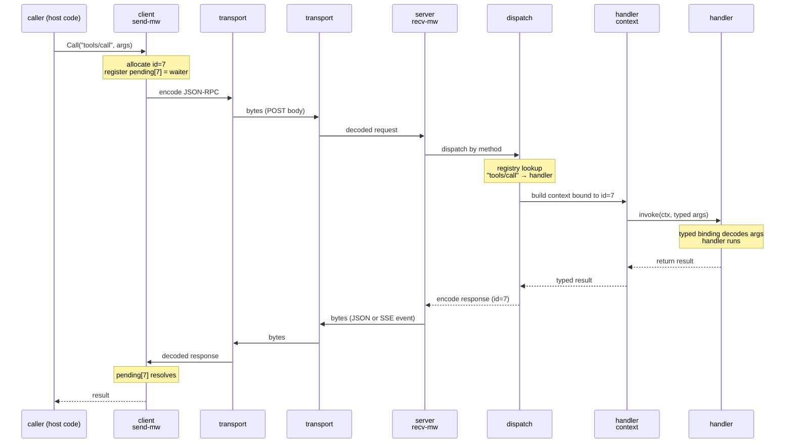
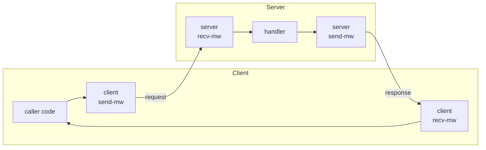

# Per-request anatomy

How a single MCP request travels from the caller through middleware, dispatch, handler context, the handler itself, and back. Five questions.

> **Kind:** root *(FAQ-style)* · **Prerequisites:** [bring-up](./bringup.md), [transport-mechanics](./transport-mechanics.md), [notifications](./notifications.md)
> **Reachable from:** [README](./README.md), [bring-up](./bringup.md) Next-to-read, [transport-mechanics](./transport-mechanics.md) Next-to-read, [notifications](./notifications.md) Next-to-read, [extension-mechanisms](./extension-mechanisms.md) Next-to-read
> **Branches into:** [reverse-call](./reverse-call.md) *(planned)*, [tasks](./tasks.md) *(planned)*, [mrtr](./mrtr.md) *(planned)*, [middleware](./middleware.md) *(planned)*
> **Spec:** [Base protocol](https://modelcontextprotocol.io/specification/2025-06-18) · **Code:** `core/jsonrpc.go`, `core/handler_context.go`, `core/typed_tool.go`, `core/protocol.go`, `server/dispatch.go`, `server/registration.go`, `server/middleware.go`, `server/method_handler.go`, `server/mrtr.go`, `client/middleware.go`, `client/mrtr.go`

## Prerequisites

- You have a session that's past the [bring-up](./bringup.md) barrier — capabilities are negotiated, transport is chosen.
- You can read JSON-RPC messages off the wire and know how the [pending-id table](./transport-mechanics.md#per-direction-id-space) correlates responses to requests.
- You know how [notifications](./notifications.md) flow on the same channels but without a response.

## Context

Bring-up gives you a session. Transport-mechanics gives you the wire. Notifications give you state-change channels. **This root explains what happens *between* a caller invoking `client.Call(...)` on one side and the handler running on the other side** — the dispatcher that finds the right handler, the handler context that gives the handler its environment, the middleware stacks that wrap each direction, the typed-binding layer that turns JSON into Go and back, and the response path that returns through all of it.

Almost every other planned root drills into a piece of this — reverse-call mechanics, tasks, middleware composition, MRTR. Pin this down once and they all open with *"assumes per-request anatomy"* and skip straight to specifics.

## Q1 — Walk me through `tools/call` end-to-end

Concrete journey: client app calls `client.Call("tools/call", ...)` for a typed tool registered on the server with `RegisterTool`. Session is live, `tools.listChanged` capability negotiated, transport is streamable HTTP.



**Step by step:**

1. **Origination.** `client.Call(method, params)` allocates a fresh id from the client's id-space, registers a waiter in `client.pending[id]`, and hands the request to the client's send-side middleware.
2. **Client send-middleware.** Wraps the outbound request. Common uses: auth header injection, logging, retry, tracing. The chain ends by encoding the message and writing it to the transport.
3. **Wire.** Already covered in [transport-mechanics](./transport-mechanics.md). One POST for streamable HTTP; one `\n`-framed line for stdio.
4. **Server recv-middleware.** First thing on the server side. Symmetric to client send-mw: auth verification, logging, tracing, deserialization checks. Eventually hands the decoded request to dispatch.
5. **Dispatch.** Looks up the method name in the server's registry. mcpkit registries: `RegisterTool`, `RegisterPrompt`, `RegisterResource`, plus raw `MethodHandler` for non-typed escape hatches. Lookup miss → JSON-RPC error `-32601` ("Method not found"). Lookup hit → proceed.
6. **Handler context construction.** Dispatch builds a per-request `HandlerContext` — covered in detail in [Q2](#q2--whats-in-the-handler-context). Carries the originating id, session reference, capabilities, request/notify hooks for reverse traffic, a cancel `ctx.Context`, and the typed params after binding.
7. **Handler execution.** The user's registered function runs. It may:
   - Read the typed params, do its work, return a typed result.
   - Emit progress notifications via the handler context (see [notifications Q4](./notifications.md#q4--how-does-the-client-tie-a-progress-notification-back-to-the-right-in-flight-call)).
   - Originate reverse calls (`sampling/createMessage`, `elicitation/create`, `roots/list`) via the handler context's request hook.
   - Cancel itself if `ctx.Done()` fires (forward request was cancelled by the client).
   - Return an error → becomes a JSON-RPC error response.
8. **Response encoding.** Handler returns; result is marshaled to JSON-RPC response shape with the same id.
9. **Server send-middleware.** Wraps the outbound response. Same idea as client send-mw on the symmetric side — logging, tracing, transport-level concerns.
10. **Wire (return path).** Same channel that brought the request. For HTTP-with-SSE-upgrade this is an SSE event on the same POST stream; for HTTP-without-upgrade it's the JSON body of the response; for stdio it's a `\n`-framed line on stdout.
11. **Client recv-middleware.** Decodes the response, looks at the id.
12. **Correlation.** `client.pending[id]` is found and resolved. The waiter (the goroutine blocked in `Call`) wakes up.
13. **Caller resumption.** `Call` returns the typed result (or error) to the calling code.

Concurrency: many calls can be in flight at once. Each gets its own goroutine on the server side and its own handler context. Middleware must be safe for concurrent invocation. The pending-id table makes correlation work despite arbitrary response ordering.

## Q2 — What's in the handler context?

The handler context is the **runtime environment of one in-flight request on the server side**. mcpkit defines it in `core/handler_context.go`. Conceptually it carries everything a handler needs that isn't in the typed params.

| Field | Purpose |
|-------|---------|
| **Originating request id** | the JSON-RPC `id` of the forward request being handled. Used for reverse-call attribution (the spec's "in association with an originating client request" rule). |
| **`context.Context`** | Go cancellation context. `ctx.Done()` fires if the forward call is cancelled by the client (`notifications/cancelled`), the session ends, or a deadline expires. |
| **Session reference** | the negotiated capabilities of *this* session, the session id, the transport. Lets the handler decide whether to emit notifications, originate reverse calls, etc. — capability gating per session. |
| **Request hook** | a function for **originating reverse calls** to the client — `sampling/createMessage`, `elicitation/create`, `roots/list`. Internally allocates a new id from the *server's* id-space and records the back-pointer to the originating forward id (for cancellation propagation; see [transport-mechanics → reverse-call origination](./transport-mechanics.md#reverse-call-origination)). |
| **Notify hook** | a function for emitting fire-and-forget notifications back to the client — typically progress, but anything the negotiated capabilities allow. |
| **Progress emitter** | a typed wrapper around the notify hook that's only non-nil when the originating request opted in via `_meta.progressToken`. Calling it when no token was provided is a no-op. |
| **Typed params** | the decoded, validated, typed-Go-struct version of `params`. See [Q4](#q4--how-does-typed-binding-turn-json-into-go-and-back). |

> [!IMPORTANT]
> The handler context **dies when the forward request completes** (response sent or error). Background goroutines that need to keep working after the handler returns must escape via `core.DetachForBackground(ctx)` — this binds them to the **session-level persistent push** (the standing GET back-channel) rather than the dying POST scope. Trying to call the request/notify hooks from a goroutine that has outlived its handler context will fail or no-op. (CLAUDE.md flags this as one of the recurring gotchas.)

The handler context is what makes the spec's bidirectional-but-tied-to-a-forward-call rule enforceable in code: the only way to originate a reverse call is through a handler context, and the only way to get one is to be inside a forward-call handler.

## Q3 — How do the four middleware stacks compose?

Conceptually there are **four points where middleware can intercept a message**: the cross-product of {client, server} × {send, receive}.



| Stack | Sees | Common uses |
|-------|------|-------------|
| **client send-mw** | outgoing requests/notifications from app code | auth header injection (bearer token), tracing context propagation, retry policy, logging |
| **client recv-mw** | incoming responses + server-initiated requests + notifications | response decoding checks, server-request dispatch to client-side handlers (e.g., sampling delegate), log surfacing |
| **server recv-mw** | incoming requests + notifications + responses-to-server-originated-requests | auth verification (token → session principal), logging, tracing entry, schema pre-validation |
| **server send-mw** | outgoing responses + server-initiated requests + notifications | response shaping, log emission, tracing exit, transport hints (e.g., per-call SSE upgrade decision) |

Two things to keep distinct:

- **Request handling** — server recv-mw + handler + server send-mw forms the standard request → response chain.
- **Reverse calls** — when a handler originates a reverse call, the call goes through **server send-mw** (outgoing) and the response comes back through **server recv-mw** (incoming) — the same stacks, used in their other direction. Middleware that's strictly for "incoming forward requests" should check direction; mcpkit middleware values typically know which direction they're seeing.

Each stack is a **pipeline** — middleware composes by wrapping the next handler in the chain. mcpkit's middleware shape: a function that takes the next handler and returns a wrapped handler. Standard onion model.

> [!NOTE]
> **Branch →** [Middleware composition](./middleware.md) *(planned)* — request-side vs. sending-side in detail, ordering rules, the `ext/auth` and `ext/ui` interception points, how middleware integrates with MRTR.

> [!NOTE]
> **Branch →** [MRTR (SEP-2322)](./mrtr.md) *(planned)* — mcpkit unifies the four conceptual stacks under MRTR (Message Routing Through Middleware), which knows direction (in/out) and side (client/server) as parameters. The four stacks are still distinct conceptually; MRTR is how mcpkit implements them.

## Q4 — How does typed binding turn JSON into Go and back?

mcpkit's value-add over raw JSON-RPC is **typed handlers**. You define a Go struct with json tags; mcpkit handles the marshalling, schema generation, validation, and binding into the handler.

The pattern (`core/typed_tool.go`):

```go
type SearchArgs struct {
    Query string   `json:"query"`
    Limit int      `json:"limit,omitempty"`
    Tags  []string `json:"tags,omitempty"`
}

type SearchResult struct {
    Hits []Hit `json:"hits"`
}

server.RegisterTool("jira_search", func(hc *HandlerContext, args SearchArgs) (SearchResult, error) {
    // args is already decoded and validated
    // hc carries id, session, ctx, request/notify hooks, progress emitter
    // return value gets marshaled to result
})
```

What happens at request time:

1. **Schema generation (registration time)** — when `RegisterTool` is called, mcpkit generates a JSON Schema from the `SearchArgs` struct via reflection on json tags. The schema becomes part of the `tools/list` response, so clients see `inputSchema` and can validate user input or hand it to a model.
2. **Decoding (request time)** — when a `tools/call` arrives with `params.arguments`, dispatch routes to the registered tool. The raw JSON arguments get unmarshaled into a fresh `SearchArgs`.
3. **Validation** — the unmarshaled value is validated against the generated schema before the handler is invoked. Fail fast: schema violations become JSON-RPC errors, the handler never sees malformed input.
4. **Handler invocation** — handler is called with the typed args + handler context. Returns a typed result (or error).
5. **Encoding** — the typed result is marshaled to JSON, wrapped in the JSON-RPC response shape.

The same pattern applies to prompts (`RegisterPrompt`), resources (`RegisterResource`), tasks (`RegisterTasks`), and so on — typed registries with auto-schema.

If you need to bypass typed binding (custom JSON shape, dynamic schema, raw access), use `MethodHandler` directly via `server/method_handler.go`. You give up the schema auto-generation and have to handle JSON yourself.

> [!NOTE]
> Schema validation is one place where capability negotiation interacts with extensions. SEPs that introduce new `_meta` fields on existing requests need to extend the schemas so validators don't reject them. mcpkit's typed-binding generator is aware of `_meta` as a reserved field; SEP-driven additions go in there.

## Q5 — How does this same machinery handle notifications and reverse calls?

Notifications and reverse calls reuse most of the per-request anatomy. Two specific differences each.

### Notifications (no id, no response)

Coming **into** a server (from the client):

1. Bytes arrive, decode, server recv-mw runs (same as for requests).
2. Dispatch routes to a **notification handler** (a different registry from method handlers, since the dispatch shape is different — no return value, no error becomes a response).
3. **No pending-id entry**: the receiver doesn't track notifications in its pending table because there's no response coming back to correlate.
4. Handler runs. Any error is logged, not returned to the sender (the spec is fire-and-forget; there's nowhere to send an error).
5. **No response, no resumption.** Done.

Coming **out of** a server handler (e.g., progress emission):

1. Handler calls the notify hook on its handler context.
2. Notify hook constructs a JSON-RPC notification (no id, just method + params).
3. Goes through server send-mw onto the wire. Done.

Symmetric on the client side.

### Reverse calls (server originates a request to client)

The forward path:

1. Server handler is running, has its handler context.
2. Handler calls `hc.Sample(...)` or `hc.Elicit(...)` or similar — internally the request hook.
3. Request hook allocates a new id from the **server's** id-space, registers `server.pending[newId] = handler-resume continuation`, records the back-pointer `(newId → originated-by → forwardId)` in handler context state.
4. Goes through server send-mw, onto the wire (over the same channel — typically the same SSE stream that's carrying the forward call's response).
5. Client receives, **client recv-mw** runs, dispatches to a client-side handler for that reverse method (e.g., the host's sampling delegate).
6. Client-side handler runs, returns a result.
7. Client send-mw, onto the wire.
8. Server recv-mw, looks up `server.pending[newId]`, resolves the continuation, the handler resumes.

Two things to internalize:

- **Reverse calls reuse the four middleware stacks**, in their reverse-direction roles (server send-mw on origination, server recv-mw on response).
- **The pending-id table is per-direction**: the server's pending table tracks reverse calls it originated; the client's tracks forward calls it originated. They're independent. (See [transport-mechanics → reverse-call origination](./transport-mechanics.md#reverse-call-origination) for the diagram.)

> [!NOTE]
> **Branch →** [Reverse-call mechanics](./reverse-call.md) *(planned)* — concretizes this with a `tools/call → elicitation/create` walkthrough, including cancellation propagation through the forward-id back-pointer.

## End-state (what downstream pages can assume)

- You can trace a request from `client.Call` through middleware, transport, dispatch, handler context, handler, and back. You know the **13 steps** and which layer each lives at.
- You know what's in the **handler context** — id, ctx, session, request hook, notify hook, progress emitter, typed params — and that it dies with the request unless escaped via `DetachForBackground`.
- You know there are **four conceptual middleware stacks** (client × {send, recv}, server × {send, recv}); reverse calls reuse the same four in their other direction; mcpkit unifies the implementation under MRTR.
- You know **typed binding** turns Go structs into JSON Schema + decoder + validator at registration time, so handlers see typed params and return typed results; raw `MethodHandler` is the escape hatch.
- You know **notifications skip the pending-id step** (no id, no correlation, no resumption). **Reverse calls reuse the entire path** but originate from a handler context instead of a wire receive.

## Next to read

- **[Reverse-call mechanics](./reverse-call.md)** *(planned, root)* — drills into the reverse-call subset of this anatomy with a concrete `tools/call → elicitation/create` walkthrough; covers the parent-id back-pointer for cancellation.
- **[Tasks v1/v2/hybrid](./tasks.md)** *(planned, root)* — uses the handler context heavily, plus a separate task store; introduces detach/resume semantics that the per-request anatomy doesn't cover (a task can outlive the originating request).
- **[Middleware composition](./middleware.md)** *(planned, branch)* — request-side vs. sending-side in detail, ordering, ext/auth and ext/ui interception points.
- **[MRTR (SEP-2322)](./mrtr.md)** *(planned, branch)* — mcpkit's unified routing layer over the four conceptual stacks; both-sides symmetry; the ephemeral capability flag.
- **[Elicitation](./elicitation.md)** · **[Sampling](./sampling.md)** · **[Roots/list](./roots-list.md)** *(planned, leaves)* — concrete reverse-call types as applications of the patterns from this root + reverse-call mechanics.
