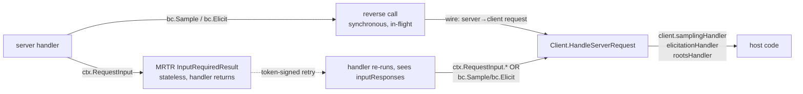

# Reverse-call mechanics

How a server handler synchronously asks the client for something — sampling, elicitation, or roots — and what dies when. Six questions.

> **Kind:** root *(FAQ-style)* · **Prerequisites:** [request-anatomy](./request-anatomy.md), [transport-mechanics](./transport-mechanics.md)
> **Reachable from:** [README](./README.md), [request-anatomy](./request-anatomy.md) Next-to-read, [transport-mechanics](./transport-mechanics.md) Next-to-read, [mrtr](./mrtr.md) Next-to-read, [extension-mechanisms](./extension-mechanisms.md) Next-to-read
> **Branches into:** [elicitation](./elicitation.md) *(stub, leaf)*, [sampling](./sampling.md) *(stub, leaf)*, [roots-list](./roots-list.md) *(stub, leaf)*
> **Spec:** [Client features (sampling, elicitation, roots)](https://modelcontextprotocol.io/specification/2025-06-18) · **Code:** [`core/handler_context.go`](https://github.com/panyam/mcpkit/blob/main/core/handler_context.go) *(`BaseContext.Sample`, `BaseContext.Elicit`, `BaseContext.AllowedRoots`)* · [`core/session.go`](https://github.com/panyam/mcpkit/blob/main/core/session.go) *(`sessionCtx.request`)* · [`core/request.go`](https://github.com/panyam/mcpkit/blob/main/core/request.go) *(`RequestFunc`, `ErrNoRequestFunc`)* · [`core/sampling.go`](https://github.com/panyam/mcpkit/blob/main/core/sampling.go) · [`core/elicitation.go`](https://github.com/panyam/mcpkit/blob/main/core/elicitation.go) · [`core/roots_allowed.go`](https://github.com/panyam/mcpkit/blob/main/core/roots_allowed.go) · [`core/background.go`](https://github.com/panyam/mcpkit/blob/main/core/background.go) *(`DetachForBackground`, `ReplaceSessionRequestFunc`)* · [`client/client.go`](https://github.com/panyam/mcpkit/blob/main/client/client.go) *(`HandleServerRequest`, `HandleServerRequestWithContext`)* · [`server/session_wiring.go`](https://github.com/panyam/mcpkit/blob/main/server/session_wiring.go) *(`makeRequestFunc`, push wiring)* · [`server/roots.go`](https://github.com/panyam/mcpkit/blob/main/server/roots.go)

## Prerequisites

- You know how a `tools/call` dispatches and what the handler context provides. → If not, read [request-anatomy](./request-anatomy.md).
- You know the per-direction pending-id table and the spec's "server-initiated requests must be in association with a forward request" rule. → If not, read [transport mechanics](./transport-mechanics.md#reverse-call-origination).
- *(Useful contrast)* You know MRTR's stateless-round-trip alternative. → See [mrtr](./mrtr.md).

## Context

A tool handler often needs information *from the client* mid-execution: the user's confirmation, an LLM completion, the host's filesystem roots. MCP defines three client-features that surface this — **sampling** (`sampling/createMessage`), **elicitation** (`elicitation/create`), and **roots** (`roots/list`). When the server originates one of these *during* a handler, it's a **reverse call**: server→client request, gated by handler context, parked on the server's pending-id table until the client responds.

This page walks the mechanics: how a handler originates one ([Q3](#q3--server-side-bcsample--bcelicit-and-the-sessioncontextrequest-hook)), how the client receives and dispatches it ([Q4](#q4--client-side-handleserverrequest-as-the-canonical-dispatcher)), how capability gating prevents misuse, why the three reverse-call types aren't all alike on the inside ([Q5](#q5--the-three-reverse-call-types-sampling-elicitation-rootslist)), and the lifetime trap that makes handlers care about `DetachForBackground` ([Q6](#q6--lifetime-when-the-forward-request-dies-and-detachforbackground-as-an-escape)).

## Q1 — What is a reverse call and why does it exist?

The protocol is point-to-point and bidirectional. Either side may originate JSON-RPC requests; the other must respond. Forward calls flow client→server (every `tools/call`, `prompts/get`, `resources/read`); **reverse calls** flow server→client. The three reverse-call methods MCP defines today are all *during-tool-execution* hooks:

| Method | What the server is asking for | Capability the *client* must declare |
|---|---|---|
| `sampling/createMessage` | "Run an LLM completion for me" | `capabilities.sampling` |
| `elicitation/create` | "Ask the user for structured input" | `capabilities.elicitation` |
| `roots/list` | "What filesystem roots am I allowed to see?" | `capabilities.roots` |

Why originate from the server at all (vs. asking the host to bake all this info into the original `tools/call` arguments)? Three reasons, in order of force:

1. **The server doesn't know up front what it'll need.** A "summarize this PR" tool might decide mid-execution that it needs the user to disambiguate between two PR numbers. Pre-baking every conceivable input into the call would explode the schema.
2. **Privacy and policy.** The host (not the server) should mediate sensitive interactions — model invocations cost money; user input flows through host-controlled UI; filesystem roots define the security boundary. Reverse calls put the host in control of *each instance*, not just the initial setup.
3. **Composition.** A handler that wants to compose a model call with user confirmation can do both inline, in code that reads top-to-bottom. The alternative ([MRTR](./mrtr.md)) makes composition explicit and stateless but adds round-trips.

> [!IMPORTANT]
> The spec requires **server-initiated requests to be in association with an originating client request** — see [transport-mechanics → reverse-call origination](./transport-mechanics.md#reverse-call-origination). The server can't push a `sampling/createMessage` out of the blue; only during a forward-request handler. mcpkit enforces this structurally: the only way to originate a reverse call is through the handler's `BaseContext`, which only exists *inside* a forward-request dispatch.

## Q2 — Worked example: a handler invokes elicitation/create

A `confirm_destructive_action` tool wants the user to confirm before proceeding. One round-trip during the handler.

**1. Forward call arrives.** Client POSTs `tools/call`:

```http
→ tools/call
{
  "jsonrpc": "2.0",
  "id": 7,
  "method": "tools/call",
  "params": {
    "name": "confirm_destructive_action",
    "arguments": { "what": "drop database" }
  }
}
```

Server dispatches to the registered handler. The handler runs.

**2. Handler originates a reverse call.** Inside the handler:

```go
result, err := ctx.Elicit(core.ElicitationRequest{
    Message: "Confirm: drop the production database?",
    RequestedSchema: confirmSchema,
})
```

mcpkit's [`BaseContext.Elicit`](https://github.com/panyam/mcpkit/blob/main/core/handler_context.go) checks `clientCaps.Elicitation != nil`, then calls `sc.request(ctx, "elicitation/create", req)`. That request hook (installed by [`session_wiring.go`'s `makeRequestFunc`](https://github.com/panyam/mcpkit/blob/main/server/session_wiring.go) at session setup) does three things:

- Allocates a fresh server-side JSON-RPC id (server's id-space, independent of the client's).
- Registers a pending-response slot keyed by that id.
- Writes the JSON-RPC request through `pushFunc` onto whatever channel the transport gives it (the SSE response stream of the in-flight POST for streamable HTTP, the stdio pipe for stdio).

On the wire (interleaved with the in-flight `tools/call`'s SSE stream, if HTTP):

```http
← server-initiated request (on POST #7's SSE stream)
{
  "jsonrpc": "2.0",
  "id": 42,
  "method": "elicitation/create",
  "params": {
    "message": "Confirm: drop the production database?",
    "requestedSchema": {...}
  }
}
```

**3. Client dispatches.** mcpkit's [`Client.HandleServerRequest`](https://github.com/panyam/mcpkit/blob/main/client/client.go) sees `method: "elicitation/create"`, finds the host's registered `elicitationHandler`, calls it. The host shows the form, the user types "yes", the handler returns:

```http
→ client response (back on the same channel)
{
  "jsonrpc": "2.0",
  "id": 42,
  "result": {
    "action": "accept",
    "content": { "confirmed": true }
  }
}
```

**4. Server resolves the pending entry.** Server's mrtr (in the per-direction-id-table sense — see [transport-mechanics § Per-direction ID space](./transport-mechanics.md#per-direction-id-space)) looks up `pending[42]`, hands the result to the goroutine parked in `sc.request(...)`. `BaseContext.Elicit` returns the unmarshaled `ElicitationResult` to the handler. Handler proceeds.

**5. Forward response goes out.**

```http
← tools/call response
{
  "jsonrpc": "2.0",
  "id": 7,
  "result": {
    "resultType": "complete",
    "content": [{ "type": "text", "text": "Database dropped." }]
  }
}
```

**Two ids on the wire, one logical operation.** id=7 is the forward `tools/call`; id=42 is the reverse `elicitation/create`. They share no namespace; they share no pending-table entry. The *only* link between them is in handler-context state on the server — see [transport-mechanics → reverse-call origination](./transport-mechanics.md#reverse-call-origination) for the back-pointer machinery that propagates cancellation.

## Q3 — Server-side: bc.Sample / bc.Elicit and the sessionCtx.request hook

mcpkit packages reverse-call origination as ordinary Go method calls on the handler context. The relevant API surface ([`core/handler_context.go`](https://github.com/panyam/mcpkit/blob/main/core/handler_context.go)):

```go
func (bc BaseContext) Sample(req CreateMessageRequest) (CreateMessageResult, error)
func (bc BaseContext) Elicit(req ElicitationRequest) (ElicitationResult, error)
```

Each does three things in order:

1. **Capability gate.** `bc.Sample` returns `ErrSamplingNotSupported` if `clientCaps.Sampling == nil`. `bc.Elicit` returns `ErrElicitationNotSupported` if `clientCaps.Elicitation == nil`. The capability is what the *client* declared during bring-up; if the client never said it'd handle the method, the server can't originate it. (Handlers are expected to fall back gracefully — typically by returning a result that asks the user to provide the input through the original tool arguments.)
2. **Optional schema reshaping.** `bc.Elicit` strips the `x-mcp-file` JSON-Schema keyword if the client didn't declare `capabilities.fileInputs` (per [SEP-2356](https://modelcontextprotocol.io/specification/2025-06-18)). The server is responsible for not sending the client schema features it can't render.
3. **Origination via the request hook.** Calls `bc.sc.request(bc.Context, "<method>", req)`. The hook is a [`RequestFunc`](https://github.com/panyam/mcpkit/blob/main/core/request.go) installed during session wiring; it returns `json.RawMessage` (or error) which `bc.Sample`/`bc.Elicit` unmarshal into the typed result.

**The request hook is the choke point.** [`sessionCtx.request`](https://github.com/panyam/mcpkit/blob/main/core/session.go) is set by [`makeRequestFunc(pushFunc)`](https://github.com/panyam/mcpkit/blob/main/server/session_wiring.go) during dispatch setup. It encapsulates id allocation, pending-table registration, JSON-RPC encoding, and the wire-write through `pushFunc` (which writes to the SSE stream / stdio pipe / wherever).

If `sc.request == nil` (e.g., a transport that doesn't support server-to-client requests, or a session past the request boundary) the call returns `ErrNoRequestFunc`. Handlers should treat this as "reverse calls aren't available right now" rather than as a programming error.

> [!IMPORTANT]
> **Only handler context has access to `sc.request`.** That's how the spec's "in association with an originating client request" constraint is enforced in mcpkit. A goroutine that wants to keep originating reverse calls *after* the forward handler returns has to escape via [`DetachForBackground`](https://github.com/panyam/mcpkit/blob/main/core/background.go) — see [Q6](#q6--lifetime-when-the-forward-request-dies-and-detachforbackground-as-an-escape).

## Q4 — Client-side: HandleServerRequest as the canonical dispatcher

mcpkit's client receives reverse calls through whatever transport it's bound to (stdio pipe, streamable HTTP standing GET, in-process). Each transport calls a single dispatcher function: [`Client.HandleServerRequestWithContext`](https://github.com/panyam/mcpkit/blob/main/client/client.go).

```go
func (c *Client) HandleServerRequestWithContext(ctx context.Context, req *core.Request) *core.Response {
    switch req.Method {
    case "sampling/createMessage":
        if c.samplingHandler == nil {
            return core.NewErrorResponse(req.ID, core.ErrCodeMethodNotFound, "sampling not supported")
        }
        // unmarshal params, call samplingHandler, marshal result, return response
    case "elicitation/create":
        // ditto with elicitationHandler
    case "roots/list":
        // ditto with rootsHandler
    default:
        return core.NewErrorResponse(req.ID, core.ErrCodeMethodNotFound, ...)
    }
}
```

Three things to internalize:

- **One dispatcher, one switch.** The client doesn't have a per-method registry the way the server does (there's a small fixed set of reverse-call methods MCP defines). Adding a new reverse-call method means extending the switch, not registering a handler.
- **Host code plugs in handlers, not transports.** When you build a host (Claude Desktop, an IDE, a CLI agent), you set `samplingHandler`, `elicitationHandler`, `rootsHandler` on the Client at construction. The transport doesn't see them; the dispatcher routes to them by method name.
- **MRTR reuses this exact dispatcher.** [`dispatchMRTRInputRequest`](https://github.com/panyam/mcpkit/blob/main/client/mrtr.go) (see [mrtr Q4](./mrtr.md#q4--client-side-calltoolwithinputs-and-defaultinputhandler)) synthesizes a fake `core.Request` from each MRTR `InputRequest` and routes it through `HandleServerRequestWithContext`. So a host that handles real reverse calls handles MRTR's inputs for free — same code, same UI, same authorization.

## Q5 — The three reverse-call types: sampling, elicitation, roots/list

Mechanically the three look the same on the wire — server-initiated request, client-side dispatch, response back. But on the *server's* side, only sampling and elicitation are originated by handlers. Roots is different.

| Method | Handler API | Originated by | Cached on server? |
|---|---|---|---|
| `sampling/createMessage` | `bc.Sample(req)` | Per-handler call | No — each handler call is its own reverse call |
| `elicitation/create` | `bc.Elicit(req)` | Per-handler call | No — each handler call is its own reverse call |
| `roots/list` | `bc.AllowedRoots()` | Server infrastructure (background) | **Yes** — fetched once, refreshed on `notifications/roots/list_changed` |

**Roots is infrastructure-managed.** The server doesn't originate `roots/list` from inside a handler. Instead ([`server/roots.go`](https://github.com/panyam/mcpkit/blob/main/server/roots.go)):

1. After bring-up, the server eagerly issues a single `roots/list` reverse call to populate its cached `allowedRoots`.
2. When the client sends `notifications/roots/list_changed`, the server re-issues `roots/list` to refresh the cache.
3. Handlers read from the cache via [`bc.AllowedRoots()`](https://github.com/panyam/mcpkit/blob/main/core/handler_context.go), which is a synchronous lookup — no reverse call, no parked goroutine.

Why the asymmetry? **Roots are session-scoped policy state**, not per-handler-call data. Every handler in the session shares the same allowed-roots view; making it a synchronous read off a session-level cache is faster, simpler, and matches how filesystem boundaries actually work. Sampling and elicitation are *per-call asks* — different message each time, no useful cache.

This means: **when reading mcpkit code, "reverse call" usually means sampling or elicitation.** Roots-related code lives in `server/roots.go` and is largely invisible to tool handlers.

> [!NOTE]
> **Capability declarations.** The client declares `sampling`, `elicitation`, `roots`, and (for SEP-2356) `fileInputs` capabilities at bring-up. The server gates origination on these — `bc.Sample` returns `ErrSamplingNotSupported` if `clientCaps.Sampling == nil`, etc. The host implementor is responsible for advertising only the capabilities they actually handle; the server is responsible for failing soft when a capability is missing.

## Q6 — Lifetime: when the forward request dies, and DetachForBackground as an escape

The hard part of reverse calls isn't the wire shape; it's the lifetime. The handler context is bound to a **specific in-flight forward request**. When the forward request finishes (response sent, error returned, client disconnects), the request hook the handler was holding becomes invalid:

- The transport-scoped `pushFunc` writes to the SSE stream of *that specific POST*. After the POST completes, the stream is closed; writes are no-ops or panics.
- Pending-table entries for any reverse calls outstanding when the forward request dies will never resolve — the handler is gone, there's no goroutine to deliver the response to.
- The forward request id (the back-pointer for cancellation propagation) is unregistered.

This is why **handlers shouldn't spawn goroutines that try to keep originating reverse calls after returning.** The pattern doesn't work; the request hook in the captured `ctx` is dead.

**The escape: [`DetachForBackground(ctx)`](https://github.com/panyam/mcpkit/blob/main/core/background.go).** This is mcpkit's supported way to keep doing server-to-client work after the forward request returns. It produces a new `context.Context` whose attached `sessionCtx.request` is the **session-level persistent-push** function — bound to the session's standing GET back-channel, not the dying POST.

Mechanism ([`core/background.go`](https://github.com/panyam/mcpkit/blob/main/core/background.go)):

1. The dispatch layer registers a `DetachStrategy` on the request context via [`SetDetachStrategy`](https://github.com/panyam/mcpkit/blob/main/core/background.go) at handler setup. The strategy knows how to swap the POST-scoped functions for session-scoped ones.
2. When a handler calls `core.DetachForBackground(ctx)`, the strategy fires: it produces a new context with `sessionCtx.request` replaced via [`ReplaceSessionRequestFunc`](https://github.com/panyam/mcpkit/blob/main/core/background.go) (and `sessionCtx.notify` similarly via [`ReplaceSessionNotifyFunc`](https://github.com/panyam/mcpkit/blob/main/core/background.go)).
3. Goroutines started with the detached context can still call `bc.Sample` / `bc.Elicit` / `bc.EmitLog` — they go through the session-level push, which lives as long as the session does.
4. If no detach strategy is registered (e.g. stdio, in-process transports without session-level push), `DetachForBackground` falls back to `context.WithoutCancel` — preserves values but doesn't fix the dead push functions. Calls will still fail.

> [!IMPORTANT]
> **Always use `core.DetachForBackground(ctx)` instead of `context.WithoutCancel(ctx)`** when spawning goroutines that need to send server-to-client requests. CLAUDE.md flags this as one of the recurring gotchas. `context.WithoutCancel` only handles cancellation; `DetachForBackground` handles the dispatch hooks too.

> [!CAUTION]
> **The spec's "in association with an originating client request" rule** technically still applies to detached goroutines — they're descendants of an originating call, even after that call returned. mcpkit's runtime trusts the user code on this; a malicious or buggy handler could `DetachForBackground` and originate reverse calls indefinitely against a session it has no ongoing forward call for. Hosts that care about strict enforcement should layer policy in the client-side dispatcher.

## Q7 — Reverse calls vs MRTR: when to use which

Both deliver "server gets data from client mid-call." Different tradeoffs. (Full table in [mrtr Q1](./mrtr.md#q1--what-problem-does-mrtr-solve-that-reverse-calls-dont).)

**Reverse calls** are simpler: one synchronous Go call inside the handler, the result comes back, the handler proceeds. The server holds in-flight state (parked goroutine, open transport channel) for the duration. Fast inputs are great. Long waits or transport drops are bad.

**MRTR** (`tools/call → InputRequiredResult → retry with inputResponses`) is more complex on the wire but stateless on the server. The handler returns; the next round is a fresh dispatch. Multi-round-trip; survives disconnects via the signed `requestState` token. The right shape for long waits, detachable workloads, and idempotent retries.

**The composition trick:** mcpkit's MRTR `DefaultInputHandler` *bridges* MRTR input requests through `HandleServerRequestWithContext` — the same dispatcher reverse calls use. So a host wired up for sampling/elicitation/roots handles MRTR's inputs too, automatically. You don't have to choose between supporting reverse calls *or* MRTR; supporting reverse calls is enough infrastructure to do both.



Use reverse calls when latency matters and the wait is short. Use MRTR when the wait might be long, the workload is detachable, or you want the call to survive disconnects.

## End-state (what downstream pages can assume)

After reading this page, downstream pages can assume:

- You know **what a reverse call is**: server→client request originated during a forward-request handler, gated by handler context, parked on the server's pending-id table until the client responds.
- You know the **three reverse-call methods** (`sampling/createMessage`, `elicitation/create`, `roots/list`) and that **roots is special** — infrastructure-managed cache, not per-handler origination, exposed via synchronous `bc.AllowedRoots()`.
- You know how to **originate from a handler** (`bc.Sample`, `bc.Elicit`) and what gates them (client-declared capability + the `sessionCtx.request` hook installed at session wiring).
- You know how the **client dispatches** incoming reverse calls through `HandleServerRequestWithContext` and that **MRTR shares the same dispatcher** — host code wired for reverse calls handles MRTR for free.
- You know the **lifetime trap** (handler context dies with the forward request) and the **escape** (`core.DetachForBackground` swaps in session-level push functions; `context.WithoutCancel` is *not* enough).
- You know the **MRTR contrast**: sync-but-fragile vs. stateless-but-multi-round; `DefaultInputHandler` bridges them in the host.

## Next to read

- **[Elicitation](./elicitation.md)** *(stub, leaf)* — Form mode vs. URL mode, security implications, host-approval flows.
- **[Sampling](./sampling.md)** *(stub, leaf)* — Model selection hints, context inclusion modes, host-approval loop.
- **[Roots/list](./roots-list.md)** *(stub, leaf)* — Filesystem roots security model, the `notifications/roots/list_changed` refresh path, why this one is infrastructure-managed.
- **[MRTR](./mrtr.md)** — The stateless-server alternative; full comparison table in Q1.
- **[Cancellation deep-dive](./cancellation.md)** *(stub, leaf)* — How cancellation propagates from a forward call into outstanding reverse calls via the handler-context back-pointer.
