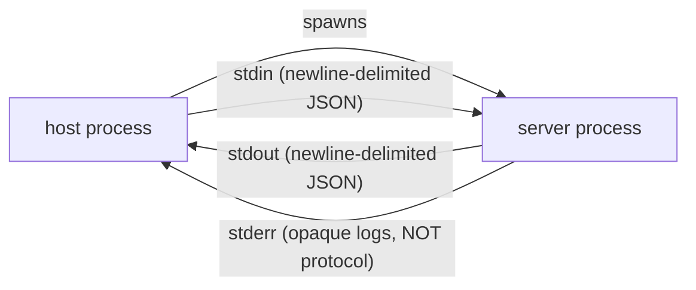

# Transport mechanics: stdio vs. streamable HTTP

What the wire actually looks like, how server→client traffic flows on each transport, and how messages get correlated.

> **Kind:** root · **Assumes:** nothing (foundational)
> **Reachable from:** [bring-up](./bringup.md) phase 2–3, [README](./README.md)
> **Branches into:** (forthcoming) reverse-call, SSE resumption, batching
> **Spec:** [Base protocol](https://modelcontextprotocol.io/specification/2025-06-18) · [Transports](https://modelcontextprotocol.io/specification/2025-06-18) · **Code:** `core/jsonrpc.go`, `server/stdio_transport.go`, `server/streamable_transport.go`, `client/mrtr.go`, `server/event_ids.go`

## What both transports share

JSON-RPC 2.0. Three message shapes — request, response, notification — covered in the [Correlation](#correlation-json-rpc-20-transport-agnostic) section below. Transports differ only on **framing** and on **how server→client traffic gets back to the client**. The message model is identical.

## stdio



- **Bring-up:** fork/exec the configured command. Hook stdin/stdout/stderr. Done.
- **Framing:** newline-delimited JSON. Each message is one line, terminated by `\n`. Both sides treat every newline as a frame boundary.
- **Direction:** full-duplex from t=0. No upgrade, no negotiation, no headers, no session id.
- **Server→client traffic:** just appears on stdout, interleaved with responses. Notifications, reverse requests, responses — all the same channel.
- **stderr:** for the server's host-side logs. Not protocol traffic. The host may surface it to the user or drop it.

> [!NOTE]
> "Connection up" on stdio = "process running." There's no handshake at the transport level. The protocol-level [`initialize`](./bringup.md#4--initialize-handshake-transport-agnostic-protocol-level) handshake is the only handshake.

## Streamable HTTP

A single endpoint URL, three HTTP methods used together to simulate full-duplex:

- **POST** — client→server messages (and, optionally, the response stream tied to that POST)
- **GET** — long-lived server→client back-channel for unsolicited server-initiated traffic
- **DELETE** — explicit session termination (optional)

### POST: client→server (with optional streaming response)

```
POST /mcp HTTP/1.1
Host: example.com
Content-Type: application/json
Accept: application/json, text/event-stream
Mcp-Session-Id: abc123                    (after first response, if server uses sessions)
Authorization: Bearer eyJ...              (if auth required)

{"jsonrpc":"2.0","id":1,"method":"tools/call","params":{...}}
```

> [!IMPORTANT]
> `Accept: application/json, text/event-stream` is required — **both** types must be listed. This is the client telling the server "I can take either type of response." Servers may reject POSTs that omit one.

Server response options:

- **Body has only responses/notifications (no requests inside):** `202 Accepted`, no body.
- **Body has at least one request:** server picks one of two response styles —
  - `Content-Type: application/json` + JSON-RPC response in the body. Connection closes. Used when no streaming is needed.
  - `Content-Type: text/event-stream` + SSE event stream — the "upgrade." Used when the server wants to interleave notifications, progress, or server-initiated requests with the eventual response.

> [!NOTE]
> The "upgrade" is **not** a WebSocket-style handshake. It's just *which Content-Type the server picks on the response*. Same endpoint, same POST, server decides per-request.

When the server picks SSE for a POST, the stream stays open until the server has nothing more to send for *this request*. During that window the server may emit:

- Notifications related to this call (e.g., `notifications/progress`)
- Server-initiated requests originated by the handler (e.g., `sampling/createMessage`, `elicitation/create`)
- The final JSON-RPC response

Then the stream closes.

### GET: long-lived server→client back-channel

For server-initiated messages **not** tied to a specific client request, the client opens a long-lived GET:

```
GET /mcp HTTP/1.1
Accept: text/event-stream
Mcp-Session-Id: abc123
Last-Event-ID: 42                         (for resumption after reconnect)
```

Server returns `Content-Type: text/event-stream` and keeps it open. Each SSE event has an `id:` line so the client can resume with `Last-Event-ID` after a network blip. mcpkit: `server/event_ids.go`.

> [!NOTE]
> So there are really **two SSE patterns** on streamable HTTP:
> 1. **Per-call SSE** — a POST's response upgrades to SSE for that one request's lifetime.
> 2. **Standing GET SSE** — long-lived back-channel for unsolicited server-initiated traffic.
>
> Same wire format, different lifecycles. Different journeys touch different ones.

### `Mcp-Session-Id`

The first successful response from the server includes `Mcp-Session-Id: <id>`. The client echoes it on every subsequent POST/GET/DELETE. Servers MAY operate stateless (no session id at all) — many won't.

> [!CAUTION]
> **Target-incompatible (replacement):** the [Dec-2025 transport WG post](https://blog.modelcontextprotocol.io/posts/2025-12-19-mcp-transport-future/) moves toward a stateless transport with sessions elevated to the data layer. Transport-level `Mcp-Session-Id` is on the chopping block. Code that pins behavior to the header will need to migrate.

### Why HTTP needs all this scaffolding and stdio doesn't

HTTP is request/response by nature; full-duplex isn't free. Three pieces — POST, GET, `Mcp-Session-Id` — work together to recover what stdio gets for free from a bidirectional pipe.

## Correlation: JSON-RPC 2.0 (transport-agnostic)

Three wire shapes:

| Shape | Has `id`? | Has `method`? | Has `result`/`error`? | Meaning |
|-------|-----------|---------------|-----------------------|---------|
| Request | yes | yes | no | I expect a response with the same `id` |
| Response | yes | no | yes (exactly one of) | Reply to a request with that `id` |
| Notification | no | yes | no | Fire-and-forget |

(Plus batches — a JSON array of any of the above. mcpkit handles them.)

### Per-direction ID space

Each side allocates IDs **independently**. Client's `id=5` and server's `id=5` are different things — they belong to different pending-request tables.

When a message arrives, the receiver dispatches by shape:

- Has `id` + `result`/`error` → response to a request *I* sent → look up my pending table by `id`, resolve the waiting caller.
- Has `id` + `method` → request *from the peer* → dispatch to a handler, eventually send a response with the same `id`.
- No `id` + `method` → notification → dispatch to a handler, no response.

mcpkit: type definitions in `core/jsonrpc.go`; correlation tables in `client/mrtr.go` and `server/mrtr.go`.

### Reverse-call origination

When a server originates a request to a client (e.g., `sampling/createMessage`), the request uses a **new id from the server's id space** — not a child or extension of the client's forward-request id.

> [!IMPORTANT]
> The spec requires server-initiated requests to be *"in association with an originating client request"* — but this association is **not on the wire.** There is no `parent` field in JSON-RPC. The constraint is enforced at the handler level: the server is allowed to originate a reverse call only while it is processing a forward call.
>
> mcpkit enforces this via `core/handler_context.go`, which carries the forward-call's identity into the handler's runtime context. A reverse-call attempt outside that scope is a programming error (and a spec violation if it ever escapes onto the wire).

The forthcoming reverse-call page will make this concrete with a `tools/call → elicitation/create` walkthrough.

### Order of arrival ≠ order of sending

On a full-duplex transport (stdio, or SSE-streamed HTTP), either side may have many concurrent outstanding requests. Responses can arrive in any order. The pending-id table is what makes correlation work; FIFO assumptions will bite.

## End-state (what downstream pages can assume)

After reading this root, downstream pages can assume:

- You can read a JSON-RPC message off the wire for either transport and tell whether it's a request, response, or notification.
- You know how server→client messages reach the client on each transport: always-open pipe (stdio), per-call SSE upgrade (HTTP POST), or standing GET SSE (HTTP back-channel).
- You know IDs are per-direction and that the pending-request table is what makes correlation work.
- You know reverse-call origination is gated by handler context — *not* by anything on the wire.

Pages that build on this end-state: (forthcoming) per-request anatomy, reverse-call mechanics, SSE resumption, tasks subsystem.
