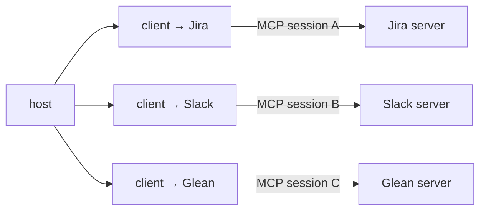
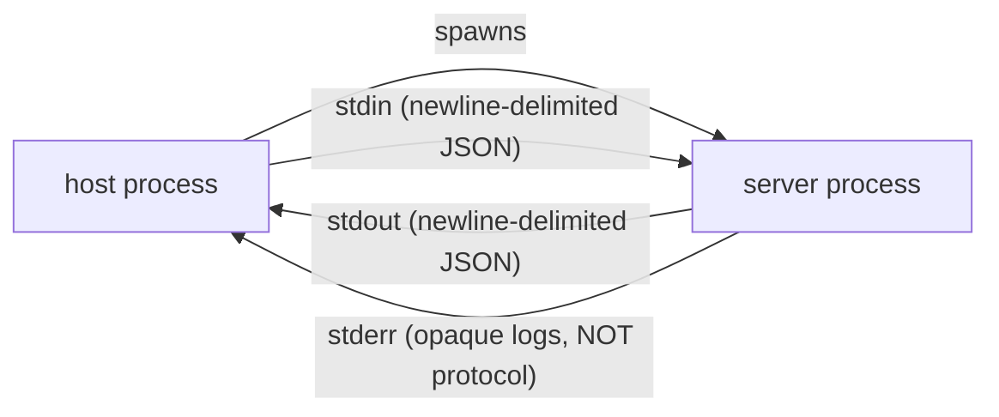
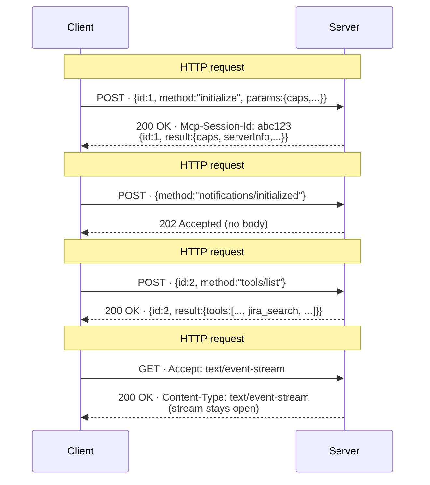
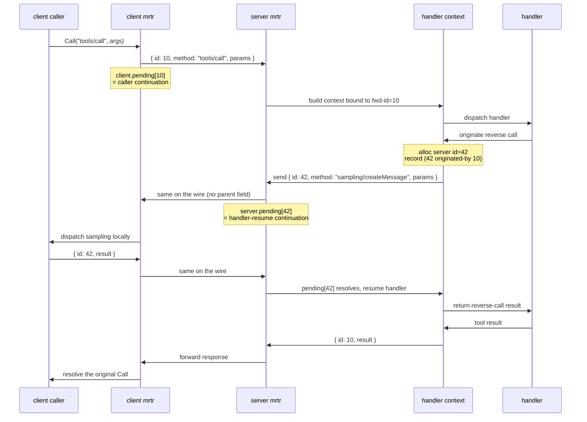

# Transport mechanics: stdio vs. streamable HTTP

What the wire actually looks like, how server→client traffic flows on each transport, and how messages get correlated.

> **Kind:** root · **Assumes:** nothing (foundational)
> **Reachable from:** [bring-up](./bringup.md) phase 2–3, [README](./README.md)
> **Branches into:** (forthcoming) reverse-call, SSE resumption, batching
> **Spec:** [Base protocol](https://modelcontextprotocol.io/specification/2025-06-18) · [Transports](https://modelcontextprotocol.io/specification/2025-06-18) · **Code:** `core/jsonrpc.go`, `server/stdio_transport.go`, `server/streamable_transport.go`, `client/mrtr.go`, `server/event_ids.go`

## Preconditions

**None — this is a foundational root.** A reader needs general familiarity with HTTP, SSE, and JSON-RPC at a vocabulary level. No other roots required.

## What both transports share

JSON-RPC 2.0. Three message shapes — request, response, notification — covered in the [Correlation](#correlation-json-rpc-20-transport-agnostic) section below. Transports differ only on **framing** and on **how server→client traffic gets back to the client**. The message model is identical.

## Sessions, connections, and tool calls

Before getting into wire details, three layers worth keeping distinct:

| Concept | Scope | Lifetime owner |
|---------|-------|----------------|
| **Host process** | the user's chat session, possibly hours | host (e.g. Claude Desktop, an agent runtime) |
| **MCP session** | one client ↔ one server, established by `initialize` | host's MCP client + server |
| **Transport transaction** | a single TCP/HTTP exchange — one POST, one GET, … | transport library, mostly invisible |

An MCP session is **not per-tool-call.** It's per-server-per-host, kept alive as long as the host wants it. A typical chat:

1. Host reads its server config — say Jira, Slack, Glean.
2. Host opens **one MCP client per server.** Each runs [`initialize`](./bringup.md) and discovers tools via `tools/list`. Three concurrent sessions, possibly over different transports.
3. Host advertises a **flat namespace of tools** (`jira_search`, `slack_post`, `glean_lookup`, …) to the model, knowing per tool which session owns it.
4. When the model calls `jira_search`, the host routes that one call to the Jira session as a single POST (HTTP) or one message on the pipe (stdio). The session is reused for every subsequent call.



Sessions over hours are normal — the protocol is built for them. Host policy choices the spec doesn't mandate: eager-vs-lazy connect, pooling, when to tear down. mcpkit (and most hosts) default to "open on first use, keep alive for chat duration."

> [!NOTE]
> Even though every tool call is its own POST, an HTTP MCP "session" isn't a stateless request/response API. The `Mcp-Session-Id` ties many POSTs and the standing-GET back-channel together as one logical conversation. The bring-up cost (auth, `initialize`, `tools/list`) is paid once.

## stdio



- **Bring-up:** fork/exec the configured command. Hook stdin/stdout/stderr. Done.
- **Framing:** newline-delimited JSON. Each message is one line, terminated by `\n`. Both sides treat every newline as a frame boundary.
- **Direction:** full-duplex from t=0. No upgrade, no negotiation, no headers, no session id.
- **Server→client traffic:** just appears on stdout, interleaved with responses. Notifications, reverse requests, responses — all the same channel.
- **stderr:** for the server's host-side logs. Not protocol traffic. The host may surface it to the user or drop it.

> [!NOTE]
> "Connection up" on stdio = "process running." There's no handshake at the transport level. The protocol-level [`initialize`](./bringup.md#4--initialize-handshake-transport-agnostic-protocol-level) handshake is the only handshake.

## Streamable HTTP

A single endpoint URL, three HTTP methods used together to simulate full-duplex:

| Method | Direction | Lifetime | Carries |
|--------|-----------|----------|---------|
| **POST** | client → server | short — one operation, then closes (or stays open as SSE for that operation's response stream) | client-initiated messages: tool calls, prompts, etc. Plus the response (and any messages tied to that operation) on the way back. |
| **GET** | server → client (one-way) | long — opened once after `initialize`, stays up for the session | unsolicited server→client messages: notifications, server-initiated requests not tied to a pending POST. |
| **DELETE** | client → server | one-shot | explicit session termination (optional — connection close also works). |

The two information directions HTTP-MCP cares about therefore have *different* mechanisms:

- **Client → server**: always a fresh POST, one per operation.
- **Server → client**: arrives **either** on the SSE stream of an in-flight POST (response, plus messages tied to that operation), **or** on the standing GET (unsolicited / out-of-band).

### Vocabulary: what counts as one of what

Streamable HTTP layers four concepts that are easy to conflate. Worth getting distinct before reading the rest of this section:

| Concept | Identifier | Multiplicity |
|---------|------------|--------------|
| **MCP session** | `Mcp-Session-Id` (HTTP header) | exactly 1 between this client and this server, lasts hours |
| **HTTP request** | the HTTP transaction itself (one POST / GET / DELETE) | many per session |
| **SSE event** | SSE `id:` line in the event-stream body | many per stream (used for `Last-Event-ID` replay) |
| **JSON-RPC message** | JSON-RPC `id` field (on requests and responses; notifications have none) | many per session |

How they nest:

- One **session** spans many **HTTP requests** over its lifetime — POSTs for client→server traffic, GETs for the back-channel, an optional terminating DELETE.
- One **HTTP request** carries either a single JSON body (one message, or a batch — an array of messages) **or** a long-lived **SSE event stream** of many events (when a POST response upgrades to SSE, or for the standing GET).
- One **SSE event** carries exactly one **JSON-RPC message** in MCP's framing.
- One **JSON-RPC message** is one request, response, or notification — the unit JSON-RPC actually defines.

> [!IMPORTANT]
> When the rest of this page says "the server sends a message," that's a **JSON-RPC message** (a request, response, or notification) — *not* an HTTP request. The server doesn't initiate HTTP requests; it sends JSON-RPC messages over channels the client opened. The `Mcp-Session-Id` lives at the **HTTP-request layer** (one per HTTP request, identifying the session); it does **not** appear inside individual messages. If a server emits N messages over a single SSE stream, they all share the one session id on the HTTP request that opened that stream.

### Worked example: a tool call with progress, plus an unrelated push

Concrete scenario to anchor every layer at once.

**Setup — what brought the session to this moment.** Earlier in the chat (could have been seconds or hours ago):



Three POSTs and one GET so far. The session is live, the tools catalog is cached on the host, and the standing GET (HTTP request #4) is open and mostly idle — listening, with occasional pushes as things change on the server. Time passes. The user types something; the model decides to call `jira_search`.

**The live moment — HTTP request #5 starts.** Client → Server, one HTTP request (POST), one JSON-RPC message in the body:

```http
POST /mcp HTTP/1.1                                ← HTTP request #5 (POST tools/call)
Mcp-Session-Id: abc123                            ← session layer
Accept: application/json, text/event-stream

{                                                  ← JSON-RPC message (request, client's id space)
  "jsonrpc": "2.0",
  "id": 7,
  "method": "tools/call",
  "params": {"name": "jira_search", "arguments": {...}}
}
```

**Server → Client, on the same HTTP request** — response upgrades to SSE; the handler emits two progress notifications, then the final response:

```http
HTTP/1.1 200 OK                                   ← still HTTP request #5, response side
Content-Type: text/event-stream
Mcp-Session-Id: abc123

id: 1                                              ← SSE event #1 (this stream's counter)
data: {"jsonrpc":"2.0","method":"notifications/progress","params":{...}}

id: 2                                              ← SSE event #2
data: {"jsonrpc":"2.0","method":"notifications/progress","params":{...}}

id: 3                                              ← SSE event #3
data: {"jsonrpc":"2.0","id":7,"result":{...}}     ← JSON-RPC response, id 7 matches request
```

Stream closes after event 3. HTTP request #5 is now complete.

**Meanwhile, on the standing GET (HTTP request #4, still open from bring-up).** The server pushes an unrelated notification because some resource changed on its end:

```http
                                                   ← HTTP request #4 (the GET, still open)
id: 42                                             ← SSE event id on this stream's own counter
data: {"jsonrpc":"2.0","method":"notifications/resources/list_changed","params":{}}
```

The GET keeps running; the next push will be event 43.

**Reading the layers off this scenario:**

| Layer | Count (session so far) | Identifiers |
|-------|------------------------|-------------|
| MCP session | 1 | `abc123` (on every HTTP request header from #2 onward; #1 is the request that *issues* it) |
| HTTP request | 5 total · 2 active in the live moment | #1 initialize POST (closed) · #2 initialized POST (closed) · #3 tools/list POST (closed) · #4 standing GET (open) · #5 tool-call POST (open until SSE closes) |
| SSE event | 4 in the live moment | POST #5 stream: 1, 2, 3 · GET #4 stream: 42 — independent counters per stream |
| JSON-RPC message | 10 since session start, 5 in the live moment | Setup: initialize req+resp `id=1`, initialized notif, tools/list req+resp `id=2`. Live: tool-call req `id=7`, 2 progress notifs, tool-call resp `id=7`, list_changed notif. |

Things to notice:

- **`Mcp-Session-Id: abc123`** appears on each HTTP request header exactly once, on #2 onward — #1 is the request that *issues* it. Never inside a JSON-RPC message body.
- **JSON-RPC ids restart per direction, not per HTTP request.** The client used `id=1`, `id=2` during setup, then jumped to `id=7` for the tool call (other client-originated work in the gap, or just non-monotonic allocation — the client picks; gaps are fine). Notifications carry no `id`.
- **SSE `id:` lines** are independent counters per stream. The POST #5 stream's "1, 2, 3" and the GET #4 stream's "42" don't relate. They exist solely for `Last-Event-ID` replay if the stream drops.
- **One HTTP request can carry many JSON-RPC messages.** The upgraded POST #5 carried four (the tool-call request that opened it, plus three from the server). Still one HTTP request.
- **Five HTTP requests on the same session, and counting.** A real chat might run for hours and accumulate dozens or hundreds — every tool call is its own POST, the standing GET runs through all of it, eventually a DELETE closes the session (or the host just walks away).

### POST: client→server (with optional streaming response)

```
POST /mcp HTTP/1.1
Host: example.com
Content-Type: application/json
Accept: application/json, text/event-stream
Mcp-Session-Id: abc123                    (after first response, if server uses sessions)
Authorization: Bearer eyJ...              (if auth required)

{"jsonrpc":"2.0","id":1,"method":"tools/call","params":{...}}
```

> [!IMPORTANT]
> `Accept: application/json, text/event-stream` is required — **both** types must be listed. This is the client telling the server "I can take either type of response." Servers may reject POSTs that omit one.

**One POST per client-initiated operation.** A tool call is one POST containing one JSON-RPC request. Same for `prompts/get`, `resources/read`, etc. — one logical operation, one POST, one request body. JSON-RPC batches (an array of messages in one body) are allowed by the spec but uncommon in practice; a typical mcpkit client/server doesn't use them. The session is reused across many such POSTs over its lifetime, but each POST is its own HTTP transaction.

Server response options:

- **Body has only responses/notifications (no requests inside):** `202 Accepted`, no body.
- **Body has at least one request:** server picks one of two response styles —
  - `Content-Type: application/json` + JSON-RPC response in the body. Connection closes. Used when no streaming is needed.
  - `Content-Type: text/event-stream` + SSE event stream — the "upgrade." Used when the server wants to interleave notifications, progress, or server-initiated requests with the eventual response.

> [!NOTE]
> The "upgrade" is **not** a WebSocket-style handshake. It's just *which Content-Type the server picks on the response*. Same endpoint, same POST, server decides per-request.

When the server picks SSE for a POST, the stream stays open until the server has nothing more to send for *this request*. During that window the server may emit:

- Notifications related to this call (e.g., `notifications/progress`)
- Server-initiated requests originated by the handler (e.g., `sampling/createMessage`, `elicitation/create`)
- The final JSON-RPC response

Then the stream closes.

### GET: long-lived server→client back-channel

The client opens a long-lived GET against the same endpoint **after `initialize` has succeeded** (so the client has the session id, if any). It's opened **proactively** — the client doesn't wait for the server to "have a message ready"; the GET is just the standing channel for any unsolicited server→client traffic that may arrive at any time. **The stream may sit completely idle** (zero events) for long stretches if the server has nothing to push, and that's fine — keep-alive frames or HTTP-level pings keep the TCP alive. It only gets used when the server has something to send that isn't tied to an in-flight POST.

```
GET /mcp HTTP/1.1
Accept: text/event-stream
Mcp-Session-Id: abc123                    (mandatory if the server issued one)
Last-Event-ID: 42                         (optional, for resumption after reconnect)
```

Server returns `Content-Type: text/event-stream` and keeps it open. Each SSE event has an `id:` line so the client can resume with `Last-Event-ID` after a network blip. mcpkit: `server/event_ids.go`.

**The GET is independent of any POST.** It's typically opened once per session, right after `initialize`, and stays up regardless of what's happening on the POST side. POSTs come and go; the GET is the steady channel for unsolicited server→client traffic. *Q: if a POST upgraded to SSE for session X and that POST's stream then closes, does the GET on the same session close?* No — they are separate HTTP transactions over the same logical session. The session ends only on `DELETE`, on session-id invalidation by the server, or on host shutdown. POSTs ending is just transactions ending.

> [!NOTE]
> mcpkit's runtime models this directly. A handler's `requestFunc`/`notifyFunc` bound to a POST scope dies when that POST's response is sent. Background goroutines that need to outlive the POST must call `core.DetachForBackground(ctx)` to attach to the **session-level persistent push** — i.e., the standing GET back-channel. (See [CLAUDE.md → Gotchas → Background goroutines](../../CLAUDE.md).)

> [!NOTE]
> **Branch →** *(forthcoming)* SSE resumption. The `Last-Event-ID` mechanic, what the server has to remember for replay, and how mcpkit's event store handles in-flight responses across reconnects.

> [!NOTE]
> **Branch →** [`experimental/ext/events/`](../../experimental/ext/events/README.md) — mcpkit's MCP Events protocol exploration. Treats events as a first-class concept beyond raw SSE event-id replay. Out-of-scope here; visit if you're tracking where the protocol is heading.

> [!NOTE]
> So there are really **two SSE patterns** on streamable HTTP:
> 1. **Per-call SSE** — a POST's response upgrades to SSE for that one request's lifetime.
> 2. **Standing GET SSE** — long-lived back-channel for unsolicited server-initiated traffic.
>
> Same wire format, different lifecycles. Different journeys touch different ones.

### `Mcp-Session-Id`

**Generated by the server, not the client.** On the first response from the server (typically the response to the client's `initialize` POST), the server includes an `Mcp-Session-Id: <id>` header. The client stores it and echoes it on every subsequent POST, GET, and DELETE for the lifetime of the session. So the timeline is:

1. Client POSTs `initialize` (no `Mcp-Session-Id` yet — there isn't one).
2. Server responds; the response carries `Mcp-Session-Id: abc123`.
3. From now on, every POST/GET/DELETE from this client carries `Mcp-Session-Id: abc123`.
4. The standing GET (opened by the client after step 2) also carries it.

Servers MAY operate stateless (no session id at all) — many won't. Where there's no session id, there's no standing GET back-channel either; server-initiated traffic can only flow during a per-call SSE upgrade.

> [!IMPORTANT]
> **The session id is a routing key on the server, not a filter applied by the client.** The server holds per-session state — capabilities, pending-id tables, the open SSE streams for that session — and routes each outbound message to the right stream by session id. The server cannot "push to an arbitrary session id"; it pushes only to sessions it has established and currently has push channels open for. If a session has no open push stream (no in-flight POST in SSE mode and no standing GET), the server has nowhere to send unsolicited messages and must wait until the client opens one.
>
> **Multiple GETs on the same session?** The spec allows it but requires the server to deliver each message on **exactly one** stream — no fan-out, no duplication. Most implementations (mcpkit included) expect a single standing GET per session and treat extras as redundant.
>
> **GETs on different session ids?** Those are different sessions entirely. Each has its own push channel; messages for session X go only to session X's GET. There's no cross-session pushing — sessions are isolated conversations even on the same server process.

> [!CAUTION]
> **Target-incompatible (replacement):** the [Dec-2025 transport WG post](https://blog.modelcontextprotocol.io/posts/2025-12-19-mcp-transport-future/) moves toward a stateless transport with sessions elevated to the data layer. Transport-level `Mcp-Session-Id` is on the chopping block. Code that pins behavior to the header will need to migrate.

### Why HTTP needs all this scaffolding and stdio doesn't

HTTP is request/response by nature; full-duplex isn't free. Three pieces — POST, GET, `Mcp-Session-Id` — work together to recover what stdio gets for free from a bidirectional pipe.

## Correlation: JSON-RPC 2.0 (transport-agnostic)

### Layering

MCP layers cleanly:

```
+----------------------------+
| MCP semantics              |   tools, prompts, resources, sampling, …
+----------------------------+
| JSON-RPC 2.0 message model |   request / response / notification, id correlation
+----------------------------+
| Transport framing          |   newline-delimited JSON (stdio) | HTTP body / SSE event (HTTP)
+----------------------------+
| Transport bytes            |   pipe (stdio) | TCP+TLS (HTTP)
+----------------------------+
```

The **JSON-RPC payload format is transport-agnostic.** Both stdio and streamable HTTP carry the same JSON-RPC payloads — they only differ on framing and on how the receiver gets bytes off the channel. JSON-RPC could in principle be replaced (Connect, gRPC, MessagePack, CBOR, …) without changing the MCP semantics on top — but that would be a *spec-level* change, not a transport choice. As of the [2025-06-18 spec](https://modelcontextprotocol.io/specification/2025-06-18), JSON-RPC 2.0 is normative.

> [!NOTE]
> gRPC specifically would be an awkward fit — it has a different model (strongly-typed services, streaming as first-class, no real "notification"). Connect (Buf's HTTP/JSON-friendly cousin) maps more naturally. None are on the spec roadmap today.

### Wire shapes

Three:

| Shape | Has `id`? | Has `method`? | Has `result`/`error`? | Meaning |
|-------|-----------|---------------|-----------------------|---------|
| Request | yes | yes | no | I expect a response with the same `id` |
| Response | yes | no | yes (exactly one of) | Reply to a request with that `id` |
| Notification | no | yes | no | Fire-and-forget |

(Plus batches — a JSON array of any of the above. mcpkit handles them.)

### Per-direction ID space

Each side allocates IDs **independently**. Client's `id=5` and server's `id=5` are different things — they belong to different pending-request tables.

When a message arrives, the receiver dispatches by shape:

- Has `id` + `result`/`error` → response to a request *I* sent → look up my pending table by `id`, resolve the waiting caller.
- Has `id` + `method` → request *from the peer* → dispatch to a handler, eventually send a response with the same `id`.
- No `id` + `method` → notification → dispatch to a handler, no response.

mcpkit: type definitions in `core/jsonrpc.go`; correlation tables in `client/mrtr.go` and `server/mrtr.go`.

### Reverse-call origination

When a server originates a request to a client (e.g., `sampling/createMessage`), the request uses a **new id from the server's id space** — not a child or extension of the client's forward-request id.

The spec requires server-initiated requests to be *"in association with an originating client request"* — but **this association is not on the wire.** There is no `parent` field in JSON-RPC. The wire just sees a fresh request from the server with a new id. So how is the constraint enforced?

**Via the server's handler context, not the pending-id table.** When the server dispatches a forward request, it builds a *handler context* that knows "I am inside the handling of forward request id=N." A reverse call is only originatable through this context — and you can only get a context inside a forward call. So a reverse request that hits the wire is *necessarily* tied to a forward call by construction, even though nothing on the wire says so.



So there are **two distinct things at play**:

1. **The pending-id table** (one per direction) maps `id → continuation`. It's flat — no tree structure, no parent links visible to it. Its job is to resolve incoming responses to the right waiter.
2. **The handler context** (server-side, built per forward request) carries "what forward call am I inside of?" It's how reverse calls get originated, and it carries enough state to propagate cancellation: if forward id=10 is cancelled, the context can find and cancel its outstanding reverse calls (e.g., id=42) by the back-pointer it recorded when originating them.

mcpkit's `core/handler_context.go` is where both concerns meet — it's the handle through which user-written handlers issue reverse calls, and it's where the forward-id-to-reverse-id relationship is recorded for cancellation propagation. Nothing of this leaks onto the wire.

> [!IMPORTANT]
> A reverse call attempted *outside* a handler context — e.g., from a background goroutine that has escaped its forward-request scope — is a programming error and a spec violation if it escapes onto the wire. mcpkit's `core.DetachForBackground(ctx)` is the supported way to keep using the session-level push channel from background work; see the GET section above.

> [!NOTE]
> **Branch →** *(forthcoming)* Reverse-call mechanics. Walks `tools/call → elicitation/create` end-to-end, with code references to `core/handler_context.go` and the mrtr origination path.

### Order of arrival ≠ order of sending

On a full-duplex transport (stdio, or SSE-streamed HTTP), either side may have many concurrent outstanding requests. Responses can arrive in any order. The pending-id table is what makes correlation work; FIFO assumptions will bite.

## End-state (what downstream pages can assume)

After reading this root, downstream pages can assume:

- You distinguish **host process / MCP session / transport transaction** as three different lifetimes. A session is per-server-per-host, may live for hours, and is reused across many tool calls.
- You can read a JSON-RPC message off the wire for either transport and tell whether it's a request, response, or notification.
- You understand the **layering**: MCP semantics > JSON-RPC message model > transport framing > transport bytes. Payload format is transport-agnostic.
- You distinguish **MCP session vs. HTTP request vs. SSE event vs. JSON-RPC message** and know how they nest. "Message" means JSON-RPC message; HTTP requests are the transport units that carry them.
- You know how server→client messages reach the client on each transport: always-open pipe (stdio), per-call SSE upgrade (HTTP POST), or standing GET SSE (HTTP back-channel — independent of any POST, opened proactively after `initialize`, may sit idle).
- You know `Mcp-Session-Id` is server-issued (returned on the response to `initialize`), mandatory on all subsequent client requests if issued, and acts as a **routing key on the server** — not a filter on the client. Sessions are isolated; servers can't push to sessions they don't have state for.
- You know IDs are per-direction and that the pending-request table is what makes correlation work — flat, no parent links.
- You know reverse-call origination is gated by **handler context** (not the pending-id table, not anything on the wire). The handler context records the forward→reverse association for cancellation propagation.

## Leads to

Roots that build on this end-state:

- **(forthcoming) Per-request anatomy** — uses the wire model and correlation tables from this root to walk the dispatch journey.
- **(forthcoming) Reverse-call mechanics** — concretizes the parent-handler-context constraint with a real `tools/call → elicitation/create` example.
- **(forthcoming) Tasks subsystem (v1/v2/hybrid)** — long-running operations layered on top of correlation + notifications.
- **(forthcoming) SSE resumption** — `Last-Event-ID` replay, the server's event store, in-flight response recovery. (Leaf, not a root.)
